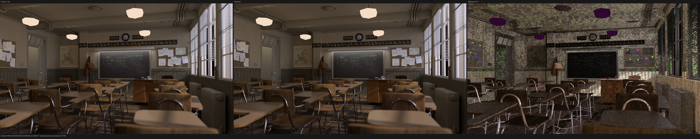
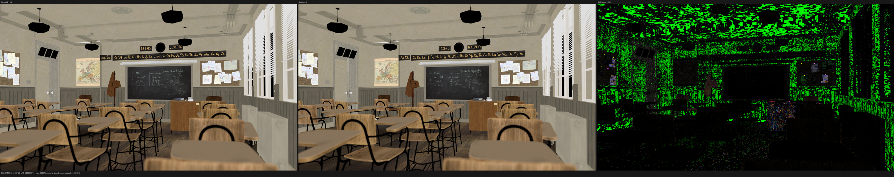
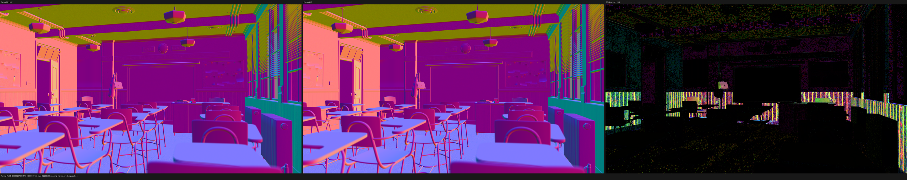
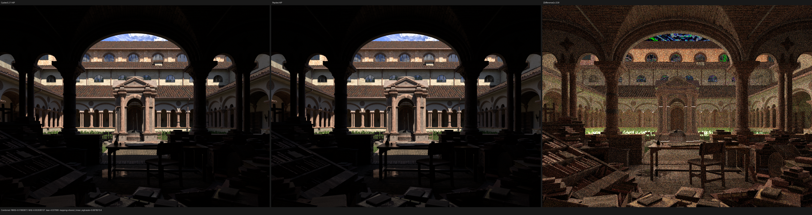
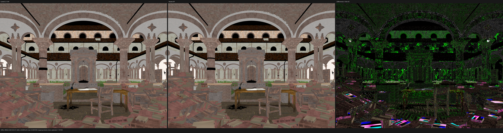
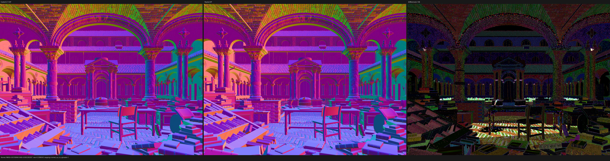
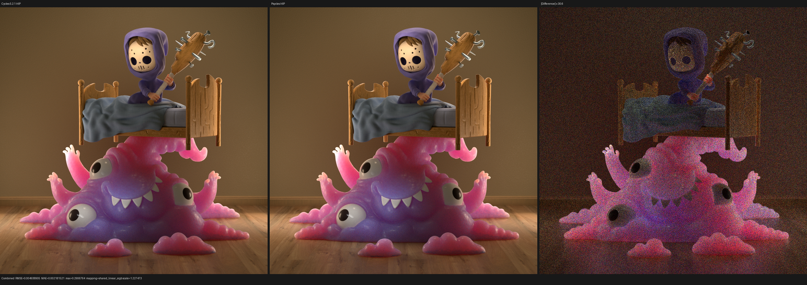
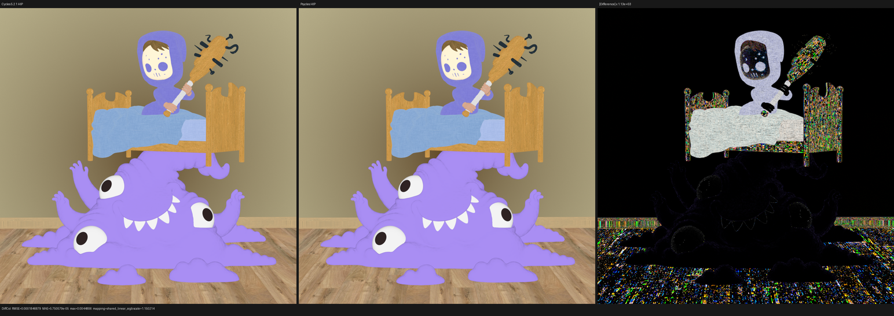
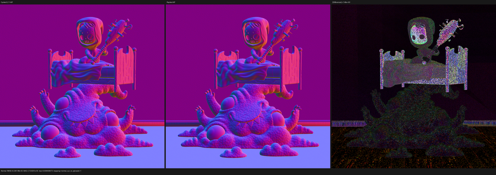

# HIP full-resolution scene gate: Classroom, Lone Monk and Monster

This checkpoint runs three independent production scenes at native output
resolution and 1024 fixed samples on the RX 9070 XT. Every Psycles scene was
freshly exported from Blender 5.2.1 commit
`9e2066aef7ef7e20c142ad7bd3303138a4304c93`; every Cycles reference was
rendered by the same installed binary. Adaptive sampling and denoising are
disabled on both sides. Materials are raw node graphs and closures, never
baked Cycles results.

This is the first multi-scene HIP batch after implementation commit `9b8cbd8`
and documentation commit `5cb3304`. It deliberately does not launch fallback
or Vulkan. Blender 4.1 Splash, the benchmark bundle, and Flat Archiviz remain
the next HIP batch.

## Result

- Classroom passes at 1920x1080/1024 spp in 126.882 s. The exact Cycles HIP
  reference takes 83.821 s, so Psycles is 1.5137x or 51.37% slower.
- Lone Monk passes at its native 1440x1080/1024 spp in 80.273 s. Cycles takes
  56.975 s, so Psycles is 1.4089x or 40.89% slower.
- Monster Under the Bed passes at its native 1024x1024/1024 spp in 76.758 s.
  Cycles takes 58.235 s, so Psycles is 1.3181x or 31.81% slower.
- All 46 channels in all three Psycles EXRs contain only finite values. The
  Cycles Classroom reference itself contains 74 invalid pixels in Diffuse
  Direct and 77 in Glossy Direct; the comparison report records and excludes
  those reference-invalid pixels rather than treating them as zero.
- Combined luminance ratios are 0.999389, 1.000749, and 1.003475. Native-scale
  inspection finds no structured transform, handedness, UV, texture,
  geometry, closure-class, or material displacement in any scene.
- Sampled stable Psycles intervals for Classroom and Lone Monk use the correct
  `gfx1201` device at 100% GPU busy: 236-238 W and about 229 W, respectively.
  A low-utilization sample at dispatch startup and the sampled Monster final
  writeback are phase transitions, not evidence of a sustained render tail.

## Controlled setup

The export and reference binary reports:

```text
Blender 5.2.1 LTS
build hash: 9e2066aef7ef
build branch: blender-v5.2-release (modified)
build type: Release
Cycles device: HIP AMD Radeon RX 9070 XT
sampling pattern: TABULATED_SOBOL
scrambling distance: 1.0
adaptive sampling: false
denoising: false
```

Each Psycles invocation uses `wavefront-staged`, one logical
`(pixel, sample)` instance, 64 samples per host dispatch, a 32,768 scheduler
batch, and 1,048,576 frames. Resolution and spp affect launch data, not shader
AST/cache identity.

| scene | frame/seed | resolution | spp | surface programs/records | stack lanes | coroutine frame |
|---|---:|---:|---:|---:|---:|---:|
| Classroom | 1 / 1 | 1920x1080 | 1024 | 118 / 1,393 | 20 | 440 B / 105 fields |
| Lone Monk | 4 / 0 | 1440x1080 | 1024 | 50 / 502 | 24 | 440 B / 105 fields |
| Monster | 1 / 0 | 1024x1024 | 1024 | 38 / 369 | 22 | 496 B / 120 fields |

Monster's runtime includes one BSSRDF tag and 8/11 preparation variants, so
this is a real subsurface/deep-path gate rather than a diffuse-only proxy.
Classroom contains 252 meshes and 838 instances; Lone Monk contains 348 meshes
and 87,534 evaluated instances. All programs report an exact evaluator/source
proof.

## Performance

Times below are render-only. Psycles JIT orchestration, scene compilation,
EXR/PFM writing, and destruction are excluded. Cycles time is the interval
reported by the golden renderer around `bpy.ops.render.render`.

| scene | Psycles HIP | Cycles 5.2.1 HIP | Psycles/Cycles | gap |
|---|---:|---:|---:|---:|
| Classroom | 126.882 s | 83.821 s | 1.5137x | +51.37% |
| Lone Monk | 80.273 s | 56.975 s | 1.4089x | +40.89% |
| Monster | 76.758 s | 58.235 s | 1.3181x | +31.81% |

Psycles JIT orchestration is 1.105 s for warm Classroom, 1.001 s for Lone Monk,
and 2.694 s for Monster. The scene-dependent performance ordering is real:
the gap cannot be summarized by the Barbershop shade-surface ratio alone.
Classroom's triangle-only traversal and broad indirect-light workload leave a
larger remaining gap than Monster's SSS workload.

## Numerical comparison

The report compares linear float passes, not color-managed screenshots.
Orientation alternatives are evaluated to rule out image registration errors.

| scene | Combined RMSE | relative RMSE | luminance ratio | reference invalid | Psycles invalid |
|---|---:|---:|---:|---:|---:|
| Classroom | 0.00287292 | 0.6687% | 0.999389 | 0 | 0 |
| Lone Monk | 0.01860872 | 1.1632% | 1.000749 | 0 | 0 |
| Monster | 0.00493890 | 3.4989% | 1.003475 | 0 | 0 |

The complete pass reports are
[Classroom](classroom/all-pass-report.json),
[Lone Monk](lone-monk/all-pass-report.json), and
[Monster](monster/all-pass-report.json).

Notable exact/near-exact AOV results:

- Classroom Diffuse Color relative RMSE is 0.5916%, Normal is 0.9866%, and
  Combined mean luminance differs by only -0.0611%. Diffuse/Glossy Direct
  metrics explicitly exclude Cycles' own invalid reference pixels.
- Lone Monk Diffuse Color relative RMSE is 0.0737% and Normal is 0.1976%.
  Combined mean luminance differs by +0.0749%.
- Monster Diffuse Color relative RMSE is 0.0525% and Normal is 0.0161%.
  Combined mean luminance differs by +0.3475%.

Indirect glossy/diffuse passes retain the larger finite-sample RMSE expected
from different path scheduling and floating accumulation order. Their spatial
support was inspected rather than dismissed from the numerical report.

## Visual inspection

All images were opened at their original generated triptych resolution. The
checked-in PNGs are 50% documentation previews.

### Classroom

The clock, doorway, lamps, blackboard, blinds, desk/cabinet surfaces, chairs,
and floor align. The previously questioned bright clock/door region no longer
shows a structural exposure or volume-light mismatch. Diffuse Color and Normal
retain only local high-frequency residuals; the Combined difference is
dominated by sampling structure and amplified lamp/direct-light differences.







### Lone Monk

The courtyard grass bands, arches, brick/stone textures, roof, statue, books,
tables, chairs, and deep interior silhouettes align. The grass does not show
the earlier structured density/transport discrepancy. Difference gain makes
small normal and indirect-light noise visible but does not reveal a topology,
UV, or material-class shift.







### Monster Under the Bed

The subsurface monster, child, bed, blanket, wooden frame/floor, eyes, teeth,
and background align. The monster remains a genuine SSS result rather than a
diffuse fallback. Diffuse Color and Normal agree especially closely; Combined
residuals are spatially stochastic around indirect and subsurface transport.







## Commands

The scene-specific width, height, seed, and source path are substituted in the
same command topology:

```sh
blender-5.2.1 scene.blend --background --python-exit-code 1 \
  --python tools/export_psycles_scene.py -- EXPORT

build/bin/psycles_render_blender_scene EXPORT psycles.exr hip \
  WIDTH HEIGHT 1024 64 - CENTER_X CENTER_Y 0 0 1024 - 1 0 \
  wavefront-staged 64 32768 32 1 1 0 4 2 auto 0 0 0 1 1048576

blender-5.2.1 scene.blend --background --python-exit-code 1 \
  --python tools/render_cycles_golden.py -- \
  cycles.exr WIDTH HEIGHT 1024 SEED \
  --cycles-device HIP --device-name 'Radeon RX 9070 XT' \
  --sampling-pattern TABULATED_SOBOL --scrambling-distance 1.0

python tools/compare_cycles.py cycles.exr all-pass-report.json \
  --triptych-dir triptychs \
  --reference-metadata cycles.json --actual-metadata EXPORT/scene.json \
  Combined=psycles.exr Normal=psycles.exr DiffCol=psycles.exr # plus all passes
```

No non-HIP backend was launched. The next gate is the heavier Splash,
benchmark-bundle, and Flat Archiviz HIP set.
