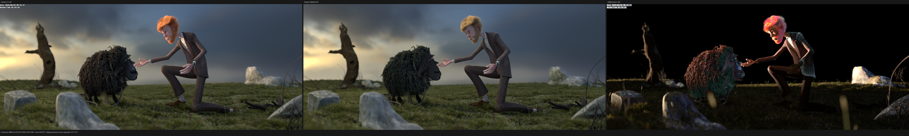
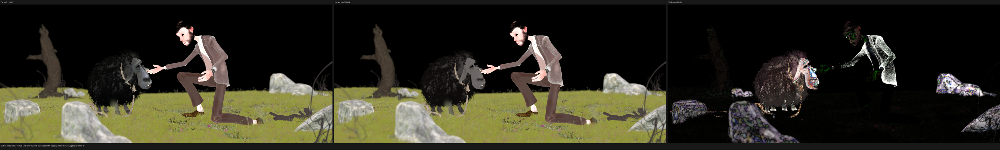
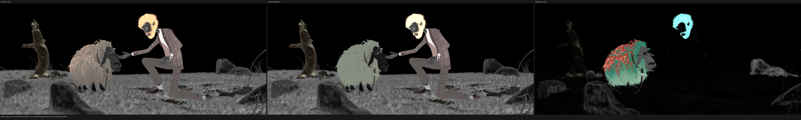
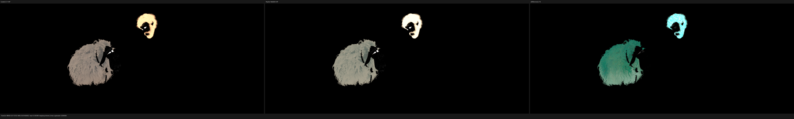

# Blender benchmark: native-resolution HIP gate

This checkpoint renders the official Blender benchmark scene at its native
2048x858 resolution and 1024 fixed samples on the AMD Radeon RX 9070 XT. The
Psycles result is commit `1d6a062`; the export and reference both use Blender
5.2.1 / Cycles commit
`9e2066aef7ef7e20c142ad7bd3303138a4304c93`. Adaptive sampling and denoising
are disabled, and the sampling pattern is `TABULATED_SOBOL`. Psycles receives
the original Blender node graphs and closures rather than baked materials.

## Result

- The complete HIP render passes at 2048x858/1024 spp with no non-finite
  Psycles pixels in any requested pass.
- Psycles render-only time is 131.694 s. The exact Cycles HIP reference takes
  119.961899 s, so Psycles is 1.0978x, or 9.78%, slower on this scene.
- Scene/TLAS construction takes 69.3652 s, warm shader orchestration takes
  1.84403 s, and process wall time is 205.94 s. Peak host RSS is 8,019,852 KiB
  with no swap.
- Measured GPU memory rises from 1,972,523,008 B to 16,300,494,848 B, a peak
  increase of 14,327,971,840 B.
- The staged path tracer has nine coroutine subroutines and a 520 B frame with
  126 fields. The scene compiles to 150 deduplicated surface SVM programs,
  2,907 records, a maximum program length of 143, and 38 stack lanes.

The `ShaderNodeNormal` correction has no measurable runtime penalty: the
previous full render took 131.834 s. The new render is 0.11% faster, which is
within run-to-run noise. It does produce a structural accuracy improvement:
Diffuse Color relative RMSE falls from 13.3360% to 6.9761%, while Combined
relative RMSE falls from 21.6333% to 21.1295%.

## Numerical comparison

All metrics compare linear multilayer EXR channels. The report verifies the
Blender build identity before comparing images and evaluates flipped
orientations to reject registration mistakes.

| pass | relative RMSE | luminance ratio | RMSE | p99 pixel RMSE |
|---|---:|---:|---:|---:|
| Combined | 21.1295% | 0.969718 | 0.0152375 | 0.0422048 |
| Diffuse Color | 6.9761% | 1.008052 | 0.0074171 | 0.0346595 |
| Diffuse Direct | 32.7676% | 0.907040 | 0.0331130 | 0.1658141 |
| Glossy Color | 23.2041% | 1.060136 | 0.0123417 | 0.0477686 |
| Glossy Direct | 53.3917% | 0.843260 | 0.0607185 | 0.2559794 |
| Transmission Color | 28.6848% | 1.298022 | 0.0113153 | 0.0284993 |
| Transmission Direct | 53.1253% | 0.663454 | 0.0105750 | 0.0216876 |
| Normal | 4.4694% | 0.999652 | 0.0139320 | 0.0680753 |
| Environment | 0.0365% | 0.999987 | 0.0000244 | 0.0000009 |

The complete metrics, including indirect and zero-valued volume/emission
passes, are in [all-pass-report.json](all-pass-report.json). Raw memory
sampling is in [vram.json](vram.json).

## Visual inspection

The full 6144x858 triptychs were opened at original resolution. The previews
below are checked in at 50% scale. Geometry, camera, environment, ground,
rocks, tree, and the authored Diffuse Color response align. The Normal-node
fix visibly removes the previous rock/tree diffuse material error.

This scene is not yet a complete quality pass. The remaining difference has
structured support on the man's hair and the sheep wool, especially in glossy
and transmission color and in direct/indirect energy allocation. These are
tracked as closure/curve transport gaps; they are not dismissed as floating
point noise or finite-sample variance.









## Commands

The Psycles invocation is the same per-(pixel, sample) staged topology used by
the other full-resolution gates:

```sh
build/bin/psycles_render_blender_scene EXPORT out.ppm hip \
  2048 858 1024 64 - 1024 429 0 0 1024 - 1 0 \
  wavefront-staged 64 32768 32 1 1 0 4 2 auto 0 0 0 1 1048576
```

The Cycles reference uses the same 2048x858 resolution, 1024 samples, seed 0,
disabled adaptive sampling, disabled denoising, and the RX 9070 XT HIP device.
No Vulkan or fallback work was launched during this checkpoint.
