# Current-head full-resolution HIP scene matrix

This checkpoint re-renders Classroom, Lone Monk, Monster Under the Bed, the
official Blender benchmark, and the Blender 4.1 Splash from fresh Blender
5.2.1 exports after the Cycles Fast GI and emission-endpoint implementation at
`debbadb`. The measured renderer head is `6096751`. Every Cycles reference
comes from commit
`9e2066aef7ef7e20c142ad7bd3303138a4304c93` on the same Radeon RX 9070 XT.
Adaptive sampling and denoising are disabled, sampling is
`TABULATED_SOBOL`, and each renderer evaluates 1024 fixed samples.

Psycles uses `wavefront-staged` with one `(pixel, sample)` instance, 64 samples
per host dispatch, 1,048,576 frames, staged surface sorting, and fast math.
The source node graphs and closures are exported directly; no Cycles material
or lighting result is baked. Vulkan and fallback are intentionally deferred
until the HIP scene gate is complete.

## Outcome

- Classroom, Lone Monk, and Monster complete at native resolution with finite
  values in every requested Psycles AOV and no structural geometry, UV,
  texture-registration, transform, or closure-class mismatch under full-size
  visual inspection.
- Monster Combined relative RMSE improves from the preceding full gate's
  3.4989% to 1.8148%; its monster remains a real BSSRDF result, not a diffuse
  replacement.
- The official benchmark is faster than the prior checkpoint but fails the
  strict quality gate. Hair and sheep wool retain structured glossy and
  transmission color differences. That is an explicit curve/closure transport
  gap, not finite-sample noise.
- Blender 4.1 Splash completes from a 7.11 GB geometry stream, including the
  section data beyond the 4 GiB boundary, without an offset failure or GPU
  OOM. Camera, object support, textures, and major closure classes align, but
  the broad indirect-light residual and glossy fireflies leave Combined at
  13.6901% relative RMSE. It therefore does not pass the strict quality gate.
- The separate Flat Archiviz Fast GI gate passes at native 1800x1100/1024 with
  Combined relative RMSE 1.9567%; see the
  [Fast GI report](../flat-archiviz-fast-gi/README.md).

## Performance

All times are render-only. Scene construction, HIPRT acceleration builds,
shader JIT, image writing, and destruction are excluded.

| scene | resolution | Psycles HIP | Cycles HIP | Psycles/Cycles | gap |
|---|---:|---:|---:|---:|---:|
| Classroom | 1920x1080 | 129.400 s | 83.890 s | 1.5425x | +54.25% |
| Lone Monk | 1440x1080 | 80.213 s | 56.786 s | 1.4125x | +41.25% |
| Monster | 1024x1024 | 79.001 s | 58.191 s | 1.3576x | +35.76% |
| Benchmark | 2048x858 | 128.532 s | 119.565 s | 1.0750x | +7.50% |
| Blender 4.1 Splash | 1920x1080 | 377.518 s | 208.763 s | 1.8084x | +80.84% |
| Flat Archiviz staged | 1800x1100 | 172.750 s | 114.927 s | 1.5031x | +50.31% |

The exact Cycles repeats are stable against the prior checkpoint: Classroom
changes by +0.08%, Lone Monk by -0.33%, Monster by -0.08%, and Benchmark by
-0.33%. Psycles is effectively unchanged on Lone Monk, 1.98% slower on
Classroom, 2.92% slower on Monster, and 2.40% faster on Benchmark. These
single-run shifts are reported as observations rather than claimed code-only
speedups.

Representative stable GPU samples reach 100% busy at 241 W for Classroom,
267 W for Benchmark, and 236--240 W for Splash. Lower transient samples occur
around queue transitions and scene setup. Kernel profiling remains necessary
to explain why full-scene gaps range from 7.5% to 80.8% despite saturation.
Splash is the new worst performance case and contains curve geometry plus a
memory-pressure fallback from HIPRT `HighQualityBuild` to `BalancedBuild` for
one geometry. That observation narrows profiling but is not yet a causal
attribution.

| scene | surface programs / records | max program | stack lanes | coroutine frame |
|---|---:|---:|---:|---:|
| Classroom | 116 / 1,390 | 71 | 20 | 440 B / 105 fields / 8 stages |
| Lone Monk | 50 / 502 | 62 | 24 | 440 B / 105 fields / 7 stages |
| Monster | 38 / 369 | 48 | 22 | 496 B / 120 fields / 9 stages |
| Benchmark | 150 / 2,907 | 143 | 38 | 520 B / 126 fields / 9 stages |
| Blender 4.1 Splash | 98 / 947 | 79 | 21 | 464 B / 111 fields / 8 stages |

## Numerical comparison

The table compares linear Combined channels. Complete per-pass metrics and
invalid-pixel accounting are linked for each scene.

| scene | relative RMSE | luminance ratio | reference invalid | Psycles invalid |
|---|---:|---:|---:|---:|
| Classroom | 0.6687% | 0.999389 | 0 | 0 |
| Lone Monk | 1.1628% | 1.000751 | 0 | 0 |
| Monster | 1.8148% | 1.002918 | 0 | 0 |
| Benchmark | 21.0322% | 0.969818 | 0 | 0 |
| Blender 4.1 Splash | 13.6901% | 0.991474 | 0 | 0 |

Reports: [Classroom](classroom/all-pass-report.json),
[Lone Monk](lone-monk/all-pass-report.json),
[Monster](monster/all-pass-report.json),
[Benchmark](benchmark/all-pass-report.json), and
[Blender 4.1 Splash](splash-4.1/all-pass-report.json).

Classroom Diffuse Color relative RMSE is 0.5916% and Normal is 0.9866%.
Cycles itself contains 74 invalid Diffuse Direct and 77 invalid Glossy Direct
pixels; the comparison excludes those reference-invalid pixels. Lone Monk
Diffuse Color is 0.0737% and Normal is 0.1978%. Monster Diffuse Color is
0.0367%, Normal is 0.0159%, and its Combined mean differs by +0.2918%.

Benchmark's larger error is not merely high-variance indirect transport:
Diffuse Color is 6.9760%, Glossy Color is 23.2036%, and Transmission Color is
28.6836%, with visible coherent support on hair and wool. Its direct and
indirect allocation also remains low. This scene is therefore retained as a
failing functional target despite a competitive render time.

Splash Diffuse Color is 0.7551% and Normal is 3.0581%, so its scene support and
first-hit material assignment are substantially aligned. Combined is not:
Diffuse Indirect is 25.4594%, Glossy Indirect is 14.9944%, and Transmission
Indirect is 35.7844% relative RMSE. Glossy Direct also contains rare extreme
samples (534.69 maximum absolute error), which inflate its RMS while its mean
energy remains within 0.81% of Cycles. The full-resolution difference panel is
broadly noisy rather than displaced, but the indirect energy allocation is
still a renderer gap and is not classified as an acceptable floating-point
residual.

## Visual inspection

All source triptychs were opened at their full generated resolution. The
checked-in images are 50% previews with Cycles, Psycles, and amplified absolute
difference panels.

### Classroom

The clock, doorway, lamps, blackboard, blinds, desks, cabinets, chairs, and
floor align. The Combined difference is dominated by amplified direct-light
and sampling residuals; Diffuse Color and Normal do not reveal a handedness,
UV, or texture shift.

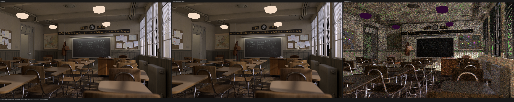

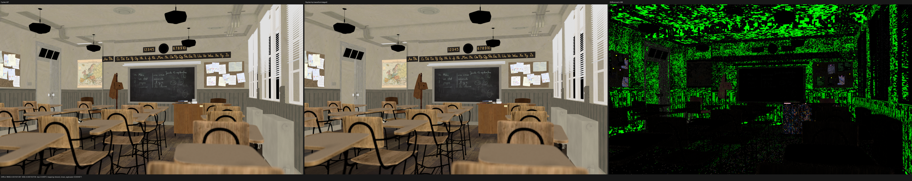

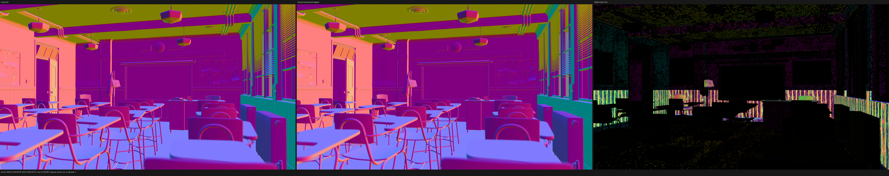

### Lone Monk

Grass bands, arches, brick and stone textures, roof, books, furniture, and
deep silhouettes align. The questioned grass discrepancy is absent.

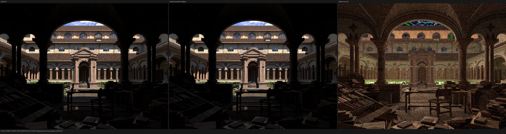

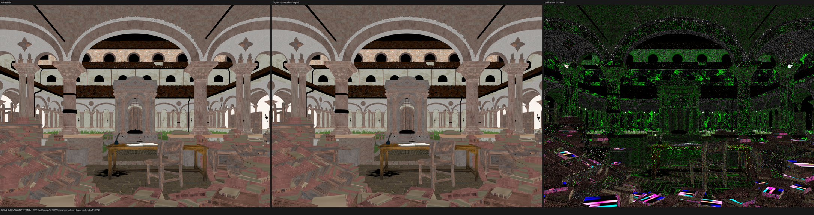

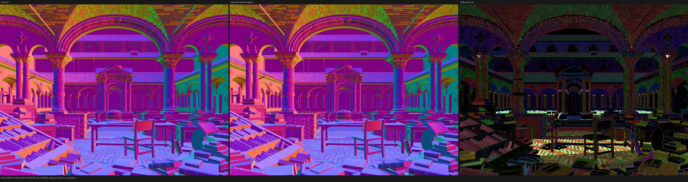

### Monster Under the Bed

The subsurface monster, child, bed, blanket, eyes, teeth, wooden frame, and
floor align. Residual Combined energy remains concentrated on the BSSRDF
monster, while first-hit color and normal are nearly exact.

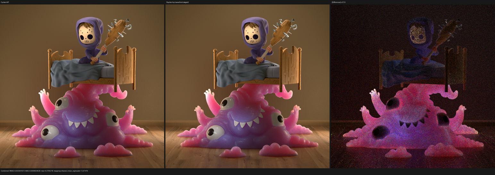

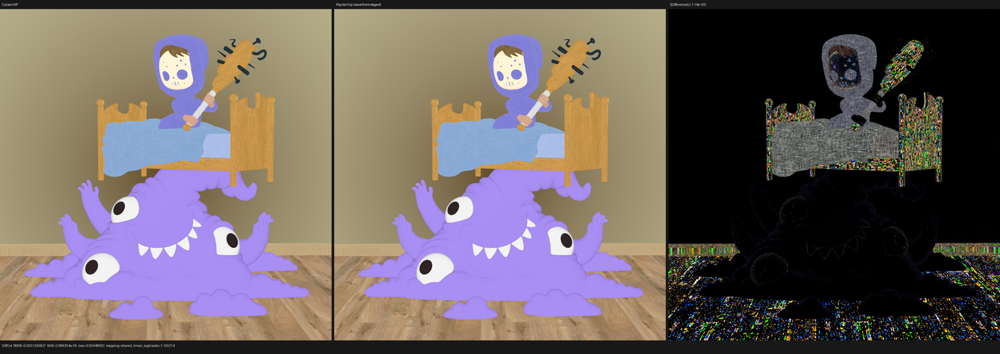

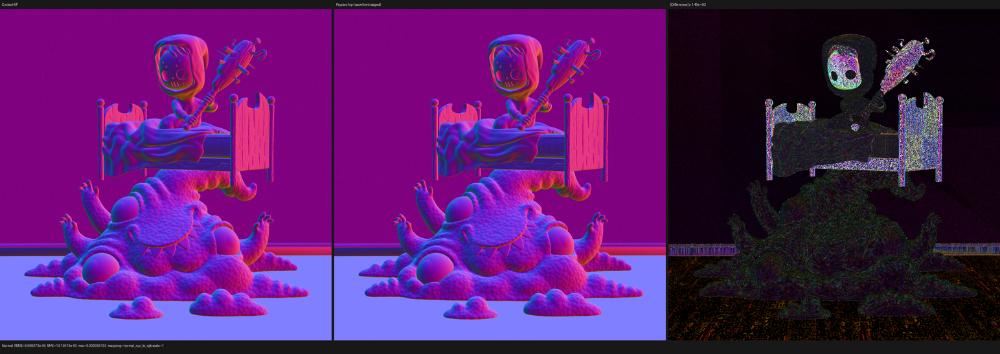

### Official benchmark

Camera, terrain, rocks, grass, characters, sheep geometry, and environment
align, but the man's hair and sheep wool do not have the same physical closure
color response. The glossy and transmission triptychs make the coherent error
unambiguous.

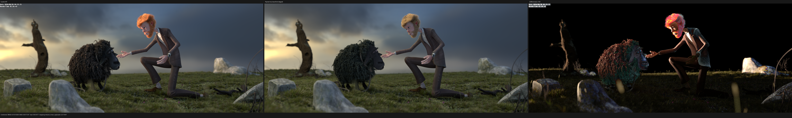

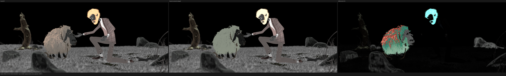

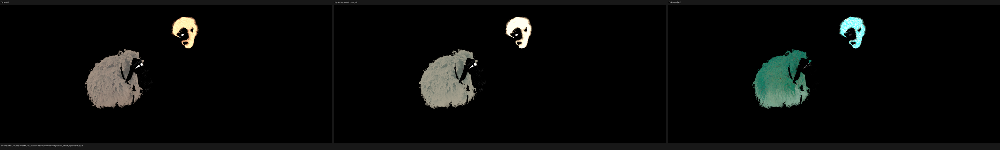

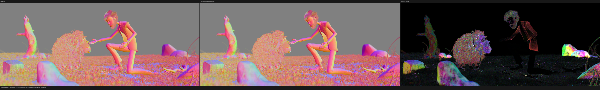

### Blender 4.1 Splash

The room shell, stair, slats, fireplace, paintings, furniture, carpet,
branches, and kitchen register in the same places. Diffuse Color and Normal do
not show a handedness, UV, or instance-transform error. The Combined and
Glossy Direct differences are spread over indirect illumination and stochastic
highlights; the carpet and upholstered foreground exhibit the largest normal
and indirect residual. Transmission Indirect preserves the same geometric
support but has an energy mismatch.

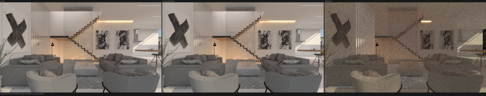

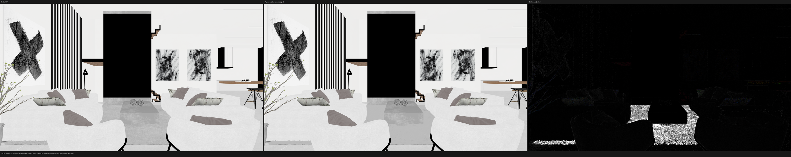

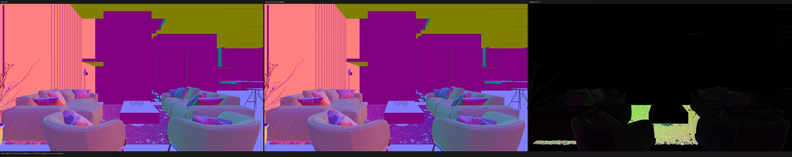

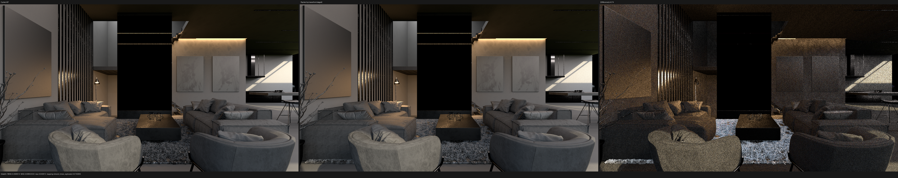

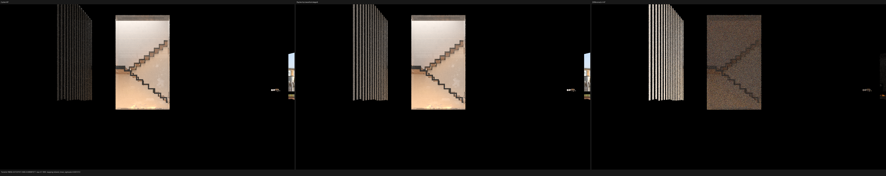

## Input caveats

The downloaded benchmark reports legacy Blender 5.2 dependency-graph warnings
for rope armature constraints, one evaluated MeshDeform vertex-count change,
and two empty image paths in both Cycles and export. Its fresh export contains
166 meshes, five curve geometries, 1,503,013 instances, 119 authored materials,
and 52 images. Psycles reports five unavailable empty image references. These
source defects are preserved in the record and are not used to excuse the
hair/wool closure mismatch.

Classroom's `dustbin_wireframe.png.001` payload is mislabeled as TIFF/MDI and
is rejected by the image loader. Both the prior and current full-size visual
comparisons still align the relevant geometry and material region; the warning
remains an explicit asset caveat.

The Splash export contains 144 meshes, two curve geometries, 233 instances,
76 authored materials, and 120 images. Its compact `geometry.bin` is
7,105,235,248 bytes. Psycles selected a lower-scratch HIPRT geometry build when
only about 5.08 GB of VRAM remained and used 86% VRAM during the steady render;
the scene nevertheless completed with no invalid output pixels. The source has
adaptive sampling and denoising enabled, but the exact Cycles golden metadata
confirms that both were disabled for this comparison.

## Command topology

```sh
python tools/run_scene_benchmark.py \
  --blender blender-5.2.1 \
  --psycles-render build/bin/psycles_render_blender_scene \
  --blend SCENE.blend --bundle FRESH_EXPORT \
  --output-dir OUTPUT --cycles-gpu-device HIP \
  --cycles-gpu-device-name 'RX 9070 XT' --skip-cycles-cpu \
  --psycles-backends hip --psycles-schedulers wavefront-staged \
  --width WIDTH --height HEIGHT --samples 1024 \
  --max-samples-per-dispatch 64
```
