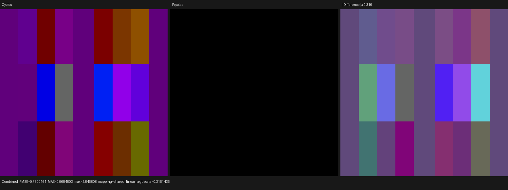
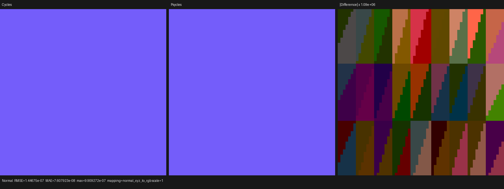
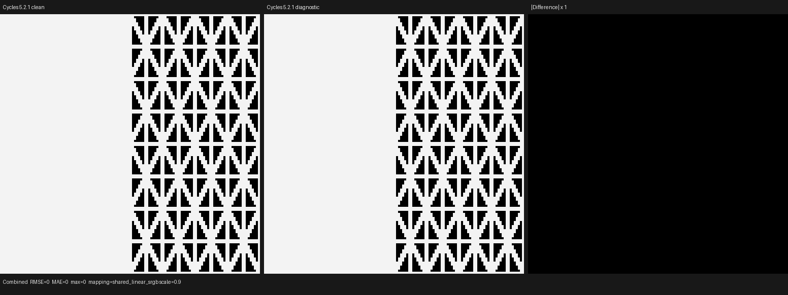
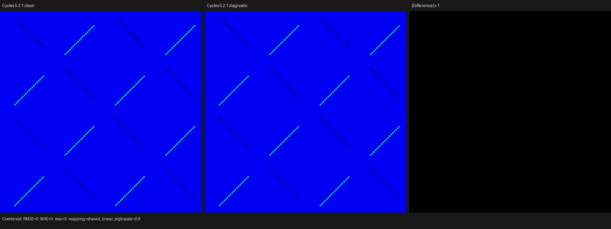
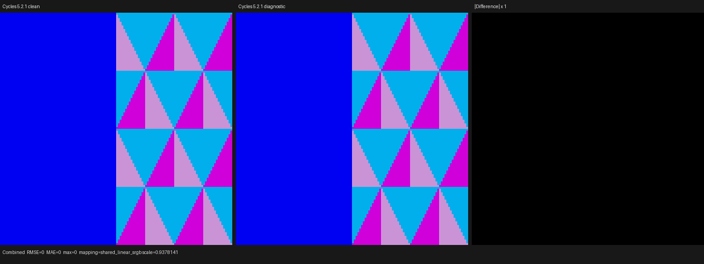
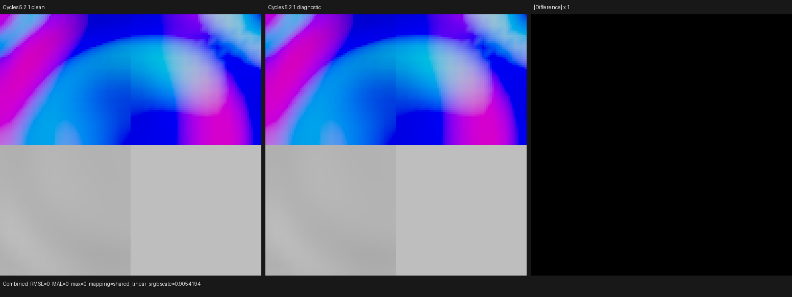

# Cycles 5.2.1 SVM isomorphic migration contract

This document is the implementation contract for replacing Psycles' previous
surface execution plan. The sole oracle is Blender/Cycles 5.2.1 commit
`9e2066aef7ef7e20c142ad7bd3303138a4304c93`. Unless the user explicitly changes
the requirement, an implementation is acceptable only when it is an
isomorphic Luisa DSL realization of that SVM. Similar output is not sufficient.
This rule is the default hard constraint for every subsequent implementation:
there is no discretion to substitute a locally designed shader VM, payload,
compiler schedule, conversion rule, or runtime transition for the Cycles one.

## Authoritative source map

| Concern | Cycles 5.2.1 source |
|---|---|
| Interpreter and dispatch order | `intern/cycles/kernel/svm/svm.h` |
| Node opcode order | `intern/cycles/kernel/svm/node_types_template.h` |
| Typed bytecode payloads | `intern/cycles/kernel/svm/node_types.h` |
| Stack/input encodings and semantic enums | `intern/cycles/kernel/svm/types.h` |
| Stack loads, stores, and typed fetch | `intern/cycles/kernel/svm/util.h` |
| Graph scheduling, stack allocation, closure traversal | `intern/cycles/scene/svm.cpp` |
| Compiler state and typed emission API | `intern/cycles/scene/svm.h` |
| Per-node compiler emission | `intern/cycles/scene/shader_nodes.cpp` |
| Closure execution | `intern/cycles/kernel/svm/closure.h` |

The checked-in ABI projection is
`include/psycles/compiler/cycles_svm_types.h`,
`cycles_svm_node_types_template.h`, and `cycles_svm_node_types.h`. The original
Apache-2.0 notices are retained. Platform-only Cycles utility spellings
`packed_float3`, `packed_float4`, and `PackedTransform` are represented as
standard-layout C++ structs with the same 12, 16, and 48-byte ABI. No SVM field,
enum value, or payload layout is changed.

## Formal machine state

For one shader invocation define the state

```
Q = (W, p, S, cw, sd, C, R, v, f, tau)
```

where:

- `W : uint32[N]` is the one global Cycles SVM word stream;
- `p` is the word program counter (`offset` in Cycles);
- `S : float[255]` is the Cycles SVM stack;
- `cw` is the current closure weight spectrum;
- `sd` is the mutable Cycles `ShaderData` projection;
- `C` is the closure allocation/population state owned by `sd`;
- `R` is the render/pass buffer state used by AOV nodes;
- `v` is `PathRayVisibility`;
- `f` is the path flag word;
- `tau` is exactly one of surface, volume, displacement, or bump.

`node_feature_mask` is a JIT specialization parameter, not mutable machine
state. It may erase the same cases as Cycles' `IF_KERNEL_NODES_FEATURE` macros;
it may not select a different runtime representation.

One interpreter step is:

1. Read `op = W[p]`, then set `p = p + 1`.
2. Enter one switch whose selector is exactly `op` in Cycles opcode order.
3. For a fixed payload type `T`, `svm_node_get<T>` denotes the bit-preserving
   view of `W[p .. p + sizeof(T)/4)`, followed by
   `p = p + sizeof(T)/4`.
4. Execute the corresponding Cycles node transition on `(S, cw, sd, C, R)`.
5. Repeat until `NODE_END`, an invalid node, or an AOV early return.

For every payload type, the preconditions are

```
alignof(T) <= alignof(uint32)
sizeof(T) mod sizeof(uint32) = 0
p + sizeof(T)/4 <= N
```

These are checked on the host image and represented directly in the Luisa AST.
There is no execution-family opcode, semantic-subtype opcode, value-program
side stream, closure-leaf side stream, or second closure decoder in this model.

## Exact control-flow transitions

- `NODE_END`: terminate the invocation.
- `NODE_SHADER_JUMP`: fetch `SVMNodeShaderJump`; replace `p` by the field
  selected solely by `tau` (`offset_surface`, `offset_volume`, or
  `offset_displacement`). An unsupported `tau` terminates.
- `NODE_JUMP_IF_ZERO`: after fetching the payload, add `jump_offset` to `p` iff
  `S[stack_offset] <= 0`.
- `NODE_JUMP_IF_ONE`: after fetching the payload, add `jump_offset` to `p` iff
  `S[stack_offset] >= 1`.
- Variable-length nodes (`RGB_RAMP`, curves, sky data, raycast attributes, and
  BSDF-specific records) advance `p` exactly where the corresponding Cycles
  handler advances its `offset`; they are not represented by side streams.
- A bump routine falls through into its surface routine exactly as Cycles does.
  Surface, volume, and displacement routines end with `NODE_END`.

The global stream starts with one four-word jump record per shader:

```
[NODE_SHADER_JUMP, surface_offset, volume_offset, displacement_offset]
```

The three offsets are absolute word indices in the aggregated scene stream.
The initial interpreter offset is `(sd.shader & SHADER_MASK) * 4`.

## Exact stack and input model

The stack domain is 255 32-bit float lanes. Offset 255 is invalid and is never
a legal lane.

- Scalar, integer, vector, color, normal, and derivative values use the same
  lane widths as `SVMCompiler::stack_size`.
- `SVMInputFloat` embeds an immediate float bit pattern, or embeds a stack
  offset as `0x7fc00000 | offset`. The runtime stack test compares the upper
  24 bits exactly as Cycles does.
- `SVMInputFloat3` embeds three immediate float bit patterns, or places the
  encoded offset in `x.bits` and zeroes `y.bits` and `z.bits`.
- `SVMInputInt` uses its immediate `value` when `offset == 255`; otherwise the
  integer is recovered by bit-casting the addressed float lane.
- Non-finite unlinked float defaults are canonicalized to zero at compile time,
  matching `SVMCompiler::input_float` and `input_float3`.

Stack allocation and scheduling are also part of the required implementation,
not an optimization freedom:

1. allocate the first contiguous free lane range;
2. track Cycles-style active users for each lane;
3. release producer outputs after their last unscheduled consumer;
4. release temporary unlinked-input loads after the consuming node;
5. schedule value DAGs with Cycles' Sethi-Ullman heuristic and node-id tie
   breaker;
6. fail the shader when no legal range exists instead of changing the machine.

## Exact closure flow

Closures are nodes in the same word stream and mutate the same `cw` and `sd`
state as Cycles.

- `NODE_CLOSURE_SET_WEIGHT`, `NODE_CLOSURE_WEIGHT`, and
  `NODE_EMISSION_WEIGHT` update `cw` directly.
- `NODE_MIX_CLOSURE` writes its two child weight stack values.
- The closure tree is emitted with Cycles' `generate_multi_closure` traversal,
  shared-dependency treatment, and zero/one jump placement.
- `NODE_CLOSURE_BSDF` is followed immediately by the exact closure-specific
  typed payload selected by `SVMNodeClosureBsdf::closure_type`.
- Emission, background, holdout, volume, volume-coefficient, and Principled
  volume nodes remain their native Cycles node types.
- Closure allocation, cutoff tests, labels, flags, normal handling, and
  Principled component construction follow `kernel/svm/closure.h` field for
  field. Psycles may project the resulting Cycles closure state into Luisa
  classes only at host/JIT construction time; the device transition cannot be
  replaced by a custom leaf format.

## Compilation equivalence obligation

Let `G` be a validated raw Blender shader graph and let `C52(G, tau)` be the
Cycles 5.2.1 compiler output for shader type `tau`. Let `P(G, tau)` be Psycles'
new compiler output after remapping only external resource identifiers such as
image and attribute table indices. The required relation is:

```
normalize_resources(P(G, tau)) = normalize_resources(C52(G, tau))
```

word for word, including node order, typed payload boundaries, jumps, embedded
immediates, and stack offsets. Runtime equivalence is then proved by induction
over interpreter steps:

- base case: both machines start at the corresponding four-word shader jump,
  with equal stack domain, zero closure weight, and equal projected ShaderData;
- induction step: equal `p` selects the same opcode and typed payload; the Luisa
  handler implements the same transition, therefore the next observable state
  remains equal;
- termination: both reach the same `NODE_END` or Cycles-defined early exit with
  equal closure/ShaderData/pass outputs.

Any node whose compiler emission or runtime transition has not been checked
against the cited Cycles function remains unsupported. It must fail validation;
it must not silently fall back to the previous Psycles execution plan.

## Regression gates

`tests/test_cycles_svm_abi.cpp` is frozen from an executable compiled directly
against the cited Cycles headers. It currently checks every SVM payload:

- all 104 `SVMNode*` types plus the six common packed/input types;
- every `sizeof`, `alignof`, standard-layout and trivially-copyable property;
- all 663 field offsets;
- all 422 SVM semantic and opcode enum constants;
- the 255-lane stack, invalid offset, and NaN input tag.

Later migration commits must add, in this order:

1. Cycles-generated golden word streams for small raw Blender graphs;
2. exact host compiler equality for each migrated node family;
3. Luisa XIR structural checks for one PC loop and one primary opcode switch;
4. HIP value/closure state comparisons against Cycles probes;
5. whole-scene visual and numerical parity before performance claims.

No old-path fallback is allowed to make these tests pass.

## First word-stream oracle checkpoint

The local Cycles 5.2.1 diagnostic build was given an environment-gated dump at
`SVMShaderManager::device_update_specific`, after per-shader streams had been
aggregated and before device upload. The dump records the final global words
and the exact `(shader id, shader name)` table; it does not alter compilation.

The canonical `diffuse_surface` Blender probe produced shader id 5,
`Diffuse Probe`, with global jump `(95, 111, 112)`. Removing only the global
jump-table relocation gives this exact local stream:

```
00000001 00000004 00000014 00000015
0000000b 00000001 00000000
00000005 3f2e147b 3e75c28f 3db851ec
00000002 00000002 000000ff
3f2e147b 3e75c28f 3db851ec 3edc28f6
00000000 00000000
00000000
00000000
```

This is now a permanent word-for-word test in
`tests/test_cycles_svm_compiler.cpp`. It proves the first complete compiler
path: local shader jump, Cycles default `Geometry::Normal` insertion, first-fit
three-lane stack assignment, closure set-weight, Diffuse BSDF header and typed
data, surface end, empty volume end, and empty displacement end. Unsupported
families reject the new image explicitly; the test also proves that they do not
select the old Psycles bytecode.

## General graph/compiler checkpoint

The one-off Diffuse lowering has now been removed. The replacement host path is
an adaptation of the following Cycles 5.2.1 implementation, preserving the
same mutable graph/compiler state and the same algorithmic order:

| Psycles projection | Cycles 5.2.1 source operation |
|---|---|
| synthetic graph output at node id 0 | `ShaderGraph::ShaderGraph()` creates `OutputNode` first |
| default Geometry/Texture Coordinate producers | `ShaderGraph::default_inputs()` |
| closure-weight graph rewrite | `ShaderGraph::transform_multi_closure()` |
| scalar/vector/closure stack widths | `SVMCompiler::stack_size()` |
| first contiguous free range | `SVMCompiler::stack_find_offset()` |
| producer last-user release | `stack_clear_users()` / `is_sole_user()` |
| temporary literal release | `stack_clear_temporary()` |
| dependency collection | `SVMCompiler::find_dependencies()` |
| DAG order and node-id tie break | `SVMCompiler::generate_svm_nodes()` |
| closure feature filtering and weight offset | `generate_closure_node()` |
| shared dependency intersection and jumps | `generate_multi_closure()` |
| surface/volume/displacement routines | `compile_type()` and `compile()` |

The graph has one stack offset on every input/output, Cycles-style output user
lists, `nodes_done`, `closure_done`, and the exact 255-lane active-user array.
The scheduler is the Cycles Sethi-Ullman implementation: producer order uses
`SU(node) - output_size(node)`, multi-consumer producers contribute only their
output size, and node id is the sole tie breaker. Unsupported node emitters
still fail the new compiler; no legacy program is consulted.

The audit also found that Psycles' generic Math schema initialized its third
input to `0.5`, while Cycles `MathNode` declares `Value3 = 0.0`. The schema now
uses exact positive zero and a bit-level regression locks it. Generic authored
Authored Math is accepted only through the subsequently ported Cycles
graph-cleaning and constant-folding stages described below; it no longer
bypasses those stages.

### Constant closure-mix oracle

The existing `transparent_mix` Blender probe (`Transparent Probe`) produced a
global jump `(95,114,115)`. Normalized to a local stream, Cycles emitted 25
words:

```
00000001 00000004 00000017 00000018
00000008 3f1eb852 000100ff
00000005 3f400000 3f666666 3f19999a
00000002 0000001e 00000000 00000000 00000000
00000005 3f828f5d 3dc49ba6 3d1374bd
00000003 00000001
00000000 00000000 00000000
```

The matching permanent regression proves that the new graph transform emits
one `NODE_MIX_CLOSURE`, assigns its two outputs to lanes 0 and 1, visits the
Transparent and Emission leaves in Cycles order, and passes the two distinct
mix offsets into those closures. Peak stack usage is two lanes.

### Linked closure-mix/jump oracle

`dynamic_mix_shader` is a new canonical Blender probe whose Geometry
`Backfacing` output drives Mix Shader's factor. It prevents constant folding
from hiding the runtime closure-tree control flow. The exact oracle command was:

```bash
blender --background --factory-startup \
  --python tools/create_cycles_shader_probe.py -- \
  /tmp/dynamic_mix.blend dynamic_mix_shader
PSYCLES_CYCLES_SVM_DUMP=/tmp/dynamic_mix.svm52 \
  blender /tmp/dynamic_mix.blend --background \
  --python tools/render_cycles_golden.py -- \
  /tmp/dynamic_mix.exr 1 1 1 0 --cycles-device CPU
```

Cycles produced global jump `(89,117,118)`. The normalized 34-word stream is
frozen in `test_linked_mix_closure_jumps_match_cycles_5_2_1` and contains, in
order:

1. `NODE_LIGHT_PATH(NODE_LP_backfacing, lane 0)`;
2. `NODE_MIX_CLOSURE(fac=lane 0, parent=invalid, children=lanes 1/2)`;
3. `NODE_JUMP_IF_ONE(jump=9, lane 0)` and the Transparent leaf using lane 1;
4. `NODE_JUMP_IF_ZERO(jump=6, lane 0)` and the Emission leaf using lane 2;
5. the three routine terminators.

Peak usage is exactly three lanes. Together with the constant-mix oracle this
checks both branches of `generate_multi_closure`, including forward-word patch
distances rather than merely decoded semantics.

### Validation

```text
cmake --build build --parallel $(nproc)                 PASS
ctest --test-dir build -R \
  '^psycles\.cycles_svm_(abi|bytecode|compiler)$'      3/3 PASS
```

This checkpoint is host compiler equivalence only. It does not claim the
production renderer has switched to the new stream: the remaining required
work is the full family-by-family compiler port and the Luisa device
interpreter with one Cycles PC loop and one opcode dispatch.

## Host node compilation boundary

The temporary centralized node-type chain has been removed. The projected
nodes now expose the same host compilation boundary as Cycles 5.2.1:
`ShaderNode::compile(SVMCompiler&)`. Diffuse, Translucent, Transparent,
Emission, Geometry, Mix Closure Weight, the closure-transform Multiply node,
and Output each own their bytecode emission. Combine-closure nodes remain
empty because `SVMCompiler::generate_multi_closure` handles them, exactly as in
Cycles. Unsupported node subclasses fail compilation and never select a
different bytecode path. The constant and linked closure-mix word oracles above
are unchanged across this refactor.

## Cycles graph finalization and Math checkpoint

The pre-SVM graph now copies this Cycles 5.2.1 sequence from
`scene/shader_graph.cpp`:

```text
ShaderGraph::expand
ShaderGraph::default_inputs
ShaderGraph::clean
  constant_fold
  simplify_settings
  deduplicate_nodes
  optimize_volume_output
  break_cycles and remove unreachable nodes
ShaderGraph::transform_multi_closure
```

The mutable link lists, bottom-up ready queue, node-id ordering, multi-output
fold boundary, dedup equality relation, relink behavior, and volume linearity
walk follow the corresponding Cycles functions. `ConstantFolder` and
`MathNode::{constant_fold,is_linear_operation,compile}` are direct adaptations
of `scene/constant_fold.cpp`, `scene/shader_nodes.cpp`, and
`kernel/svm/math_util.h`. In particular, clamp uses Cycles' ordered
`min(max(x, lo), hi)` semantics; this preserves its NaN and signed-zero behavior
instead of substituting `std::clamp`.

Three new Blender probes freeze final SVM streams from the exact diagnostic
Cycles build:

- `svm_math_dedup`: two independently authored but equal Geometry nodes feed
  one dynamic Add. Cycles emits one `NODE_LIGHT_PATH`, then one `NODE_MATH`
  whose Value1 and Value2 both address lane 0. Its local image is 23 words and
  peak stack use is 2 lanes.
- `svm_math_constant_fold`: `0.12 + 0.23` feeds Diffuse Roughness. Cycles emits
  no `NODE_MATH`; the Diffuse payload contains `0x3eb33333` directly. Its local
  image is 22 words.
- `svm_mix_closure_fold`: a zero-factor Mix selects Transparent and discards
  its Emission branch before closure transformation. The local image is 16
  words and contains neither `NODE_MIX_CLOSURE` nor
  `NODE_CLOSURE_EMISSION`.

The permanent word-for-word regressions are in
`tests/test_cycles_svm_compiler.cpp`. The oracle was generated with:

```bash
blender --background --factory-startup \
  --python tools/create_cycles_shader_probe.py -- \
  /tmp/<probe>.blend <probe>
PSYCLES_CYCLES_SVM_DUMP=/tmp/<probe>.svm52 \
  blender /tmp/<probe>.blend --background \
  --python tools/render_cycles_golden.py -- \
  /tmp/<probe>.exr 1 1 1 0 --cycles-device CPU
```

Cycles restores a folded-away displacement root with a `ColorNode` followed
by its automatic Color-to-Vector `ConvertNode`. Those two exact node compilers
are not yet migrated, so that boundary currently rejects explicitly instead
of inventing a replacement or silently dropping displacement.

## First Luisa device interpreter checkpoint

The device path now contains the first executable projection of Cycles 5.2.1
`svm_eval_nodes`. Its implementation is split by the same source families:

| Psycles implementation | Cycles 5.2.1 source |
|---|---|
| `src/luisa/cycles_svm.cpp` | `kernel/svm/svm.h` main PC loop and opcode dispatch |
| `src/luisa/cycles_svm_stack.cpp` | `kernel/svm/util.h` stack and `SVMInput*` loads |
| `src/luisa/cycles_svm_math.cpp` | `kernel/svm/math.h` and `math_util.h` |
| `src/luisa/cycles_svm_value.cpp` | `kernel/svm/value.h`, `geometry.h`, and `light_path.h` |
| `src/luisa/cycles_svm_closure.cpp` | `kernel/svm/closure.h` and `kernel/closure/emissive.h` |

The Luisa AST has one dynamic word `offset`, one 255-float local stack, one
loop, and one primary switch on the fetched Cycles opcode. Typed payload reads
advance that same offset in source field order. The only representational
projection is spelling a typed payload as sequential typed word loads because
Luisa DSL cannot dynamically reinterpret a `Buffer<uint>` reference as a C++
payload struct; there is no second stream or decoded instruction array.

The copied executable cases in this checkpoint are `NODE_END`,
`NODE_SHADER_JUMP`, `NODE_CLOSURE_BSDF` payload skipping for feature-erased
paths, `NODE_CLOSURE_EMISSION`, `NODE_CLOSURE_SET_WEIGHT`,
`NODE_CLOSURE_WEIGHT`, `NODE_EMISSION_WEIGHT`, `NODE_MIX_CLOSURE`, both closure
jumps, `NODE_GEOMETRY`, `NODE_VALUE_F`, `NODE_VALUE_V`, `NODE_MATH`, and
`NODE_LIGHT_PATH`. A BSDF that would execute rather than take Cycles' exact
feature-erased skip transition reports unsupported; it is not evaluated by the
old surface path. Geometry tangent and volume-density services likewise remain
explicitly unsupported until their corresponding Cycles families are copied.

`tests/test_luisa_cycles_svm.cpp` executes the two previously frozen Cycles
streams for dynamic Math/dedup and linked Mix Closure directly on HIP. It also
walks the generated Luisa AST and requires exactly one PC loop and one primary
opcode switch. The runtime oracle locks front/back-facing branch selection,
emission accumulation, closure weight, ShaderData flags, termination status,
and the exact final word offset (21 and 32 respectively).

Validation on AMD Radeon RX 9070 XT (`gfx1201`):

```text
cmake --build build --target psycles_luisa_cycles_svm_tests \
  --parallel 32                                           PASS
build/bin/psycles_luisa_cycles_svm_tests hip              PASS
ctest --test-dir build --output-on-failure -R \
  '^psycles\.luisa_cycles_svm_hip$'                       1/1 PASS
ctest --test-dir build --output-on-failure -R \
  '^psycles\.cycles_svm_(abi|bytecode|compiler)$'         3/3 PASS
cmake --build build --parallel 32                         PASS
```

With cache disabled, the first HIP compilation produced a 14,160-byte AMDGPU
object before linking and an 11,456-byte loaded code object. These sizes are a
checkpoint, not a performance claim. The production renderer is not yet wired
to this partial interpreter; doing so before every reachable Cycles opcode and
closure transition has been copied would violate the no-fallback contract.

## Color transformation opcode checkpoint

The next copied device and host families are exactly the Cycles 5.2.1
`InvertNode`, `GammaNode`, `BrightContrastNode`, `HSVNode`, and `ClampNode`,
mapped to `NODE_INVERT`, `NODE_GAMMA`, `NODE_BRIGHTCONTRAST`, `NODE_HSV`, and
`NODE_CLAMP`. Their compiler emission and constant-fold methods come from
`scene/shader_nodes.cpp`; their device transitions come from `kernel/svm`'s
`invert.h`, `gamma.h`, `brightness.h`, `hsv.h`, `clamp.h`, `color_util.h`, and
`util/color.h`. The component branch order, HSV hue wrapping, oversaturation
clamp, gamma-zero case, RANGE min/max reversal, and output-validity checks are
kept as written in those sources.

Two new Blender probes were executed with the exact diagnostic Cycles build:

- `svm_color_pipeline` uses Geometry Backfacing to keep all five nodes live.
  Shader 5 had global jump `(89,134,135)` and normalized to a 51-word stream.
  The permanent host regression locks every word, lane reuse, opcode order,
  and peak stack usage of seven lanes.
- `svm_color_constant_fold` chains constant Invert, Gamma, Bright/Contrast,
  and RANGE Clamp into Emission. Cycles removed all four opcodes and embedded
  closure weight bits `(3db1030e,3dc5492b,3dddd033)` in a 13-word stream. The
  permanent regression locks that graph-cleaning result.

The dynamic probe renders a two-cell 4x4 matrix whose second cell has reversed
polygon winding. Cycles CPU's linear Emission pass was constant within each
cell:

```text
front: (0.035884645, 0.071987897, 0.159804747)
back:  (0.665142953, 0.000000000, 0.707822502)
```

The HIP interpreter consumes the same frozen 51-word stream and matches both
triples within `2e-6`, along with closure weight, ShaderData flags, ended
status, and final PC 49. The oracle generation and validation commands were:

```text
blender --background --factory-startup --python \
  tools/create_cycles_shader_probe.py -- \
  /tmp/svm_color_pipeline.blend svm_color_pipeline             PASS
PSYCLES_CYCLES_SVM_DUMP=/tmp/svm_color_pipeline.svm52 \
  blender /tmp/svm_color_pipeline.blend --background --python \
  tools/render_cycles_golden.py -- \
  /tmp/svm_color_pipeline.exr 4 4 1 0 --cycles-device CPU      PASS
cmake --build build --target psycles_cycles_svm_compiler_tests \
  --parallel 32                                                PASS
build/psycles_cycles_svm_compiler_tests                        PASS
cmake --build build --target psycles_luisa_cycles_svm_tests \
  --parallel 32                                                PASS
build/bin/psycles_luisa_cycles_svm_tests hip                   PASS
```

## Combine/Separate Color opcode checkpoint

`SeparateColorNode` and `CombineColorNode` are copied from Cycles 5.2.1
`scene/shader_nodes.cpp`. Their SVM payload layout and runtime transitions map
directly to `kernel/svm/sepcomb_color.h`; RGB/HSV/HSL conversion semantics come
from `kernel/svm/color_util.h` and `util/color.h`. The host compiler and Luisa
interpreter cover every Cycles `NodeCombSepColorType` direction: RGB to
components, HSV to components, HSL to components, components to RGB,
components to HSV, and components to HSL. Socket names are projected to
Cycles' Red/Green/Blue inputs and outputs before compilation; mode values,
invalid-stack-lane guards, payload words, and switch defaults remain those of
Cycles.

The dynamic `svm_combsep_color_pipeline` probe deliberately keeps all six
paths live by connecting Geometry Backfacing through an HSL/HSV/RGB chain.
Cycles shader 5 had global jump `(89,142,143)`. Removing the two global padding
words gives an exact 59-word local stream with peak stack usage of six lanes;
the permanent compiler test freezes every word and opcode position. Cycles CPU
rendered the linear Emission pass as:

```text
front: (0.000000000, 0.180000007, 0.000000000)
back:  (0.564999998, 0.383161038, 0.000000000)
```

The constant `svm_combsep_color_constant_fold` probe traverses the same mode
sequence without a dynamic input. Cycles produced global jump `(89,96,97)` and
a 13-word local stream containing no Separate/Combine opcode. Its final
closure weight is frozen bit-for-bit as
`(0x3ed6f51a,0x3eb020c6,0x3e051eb7)`, corresponding to
`(0.419838727,0.344000041,0.129999980)`.

The HIP interpreter consumes the dynamic 59-word stream directly. It matches
both Cycles CPU triples within `2e-6`, plus closure weight, ShaderData flags,
ended status, and final PC 57. Oracle generation and focused validation were:

```text
blender --background --factory-startup --python \
  tools/create_cycles_shader_probe.py -- \
  /tmp/svm_combsep_color_pipeline.blend \
  svm_combsep_color_pipeline                                  PASS
PSYCLES_CYCLES_SVM_DUMP=/tmp/svm_combsep_color_pipeline.svm52 \
  blender /tmp/svm_combsep_color_pipeline.blend --background \
  --python tools/render_cycles_golden.py -- \
  /tmp/svm_combsep_color_pipeline.exr 4 4 1 0 \
  --cycles-device CPU                                         PASS
cmake --build build --parallel 32                             PASS
ctest --test-dir build --output-on-failure -R \
  '^psycles\.(cycles_svm_(abi|bytecode|compiler)|luisa_cycles_svm_hip)$' \
                                                               4/4 PASS
```

## Legacy MixRGB / `NODE_MIX` checkpoint

Blender's legacy `ShaderNodeMixRGB` and modern `ShaderNodeMix` are no longer
conflated. The former now projects to a dedicated host graph node that copies
Cycles 5.2.1 `MixNode`; the latter remains reserved for the separate
`MixColorNode`, `MixFloatNode`, and vector families. This distinction is
observable in both compiler state and bytecode:

- legacy Mix has Cycles inputs `Fac`, `Color1`, and `Color2` and emits
  `NODE_MIX`;
- its factor is always saturated by `svm_mix_clamped_factor` and therefore it
  has no `ClampFactor` property;
- `use_clamp` emits a second `NODE_MIX` whose type is `NODE_MIX_CLAMP`;
- modern Mix uses its own typed node opcodes and separately stored factor and
  result clamp fields.

The host implementation is a direct projection of
`scene/shader_nodes.cpp::MixNode`,
`scene/constant_fold.cpp::ConstantFolder::fold_mix`, and
`kernel/svm/color_util.h`. The Luisa transition is copied from
`kernel/svm/mix.h::svm_node_mix`: it fetches one `SVMNodeMix`, loads the exact
`SVMInputFloat`/`SVMInputFloat3` payloads, clamps the factor, dispatches the
same 19-value `NodeMix` switch, and stores three consecutive stack lanes. The
blend, add, multiply, screen, overlay, subtract, divide, difference,
exclusion, darken, lighten, dodge, burn, hue, saturation, value, color,
soft-light, linear-light, and clamp branches retain Cycles' operation and
condition order.

The dynamic `svm_legacy_mix_matrix` oracle contains one material for every
blend type. Geometry Backfacing produces factors 0.23 and 0.64 in two rows.
The ordinary modes normalize to exact 33-word local streams; clamped ADD has
the second clamp node and normalizes to 43 words. Both use five stack lanes.
The HIP interpreter consumes each frozen stream with one shared compiled
kernel and matches all 38 Cycles CPU Emission triples within `2e-6`, including
negative and greater-than-one unclamped components. It also matches closure
weight, front/back-facing ShaderData flags, termination, and final PCs 31 or
41.

The constant oracle deliberately links Blender Value and RGB nodes into every
MixRGB input. GDB confirmed that this reaches Cycles'
`MixNode::constant_fold`; leaving all three values as unconnected
Blender socket defaults instead bypasses that function and is folded by
Blender before the Cycles graph exists. The two evaluators differ by several
ULPs on some modes, so the latter is not a valid SVM oracle. With the linked
inputs, all 19 independently folded 13-word streams and the aggregate
`mix_rgb_legacy_modes` stream match Psycles word for word. The aggregate
closure bits are
`(0x3e8cedbc,0x3f1a6314,0x3f5b393e)`.

The import regression in `tests/test_blender_legacy_mix_import.cpp` locks the
raw `MIX_RGB` mapping, absence of the nonexistent `ClampFactor` property,
preservation of blend/result-clamp settings, and the final Cycles SVM fold.
Oracle and focused validation commands are:

```text
blender --background --factory-startup --python \
  tools/create_cycles_shader_probe.py -- \
  /tmp/svm_legacy_mix_matrix.blend svm_legacy_mix_matrix       PASS
PSYCLES_CYCLES_SVM_DUMP=/tmp/svm_legacy_mix_matrix.svm52 \
  blender /tmp/svm_legacy_mix_matrix.blend --background \
  --python tools/render_cycles_golden.py -- \
  /tmp/svm_legacy_mix_matrix.exr 152 16 1 0 \
  --cycles-device CPU                                          PASS
blender --background --factory-startup --python \
  tools/create_cycles_shader_probe.py -- \
  /tmp/svm_legacy_mix_constant_matrix.blend \
  svm_legacy_mix_constant_matrix                               PASS
PSYCLES_CYCLES_SVM_DUMP=/tmp/svm_legacy_mix_constant_matrix.svm52 \
  blender /tmp/svm_legacy_mix_constant_matrix.blend \
  --background --python tools/render_cycles_golden.py -- \
  /tmp/svm_legacy_mix_constant_matrix.exr 76 4 1 0 \
  --cycles-device CPU                                          PASS
cmake --build build --target \
  psycles_cycles_svm_compiler_tests \
  psycles_luisa_cycles_svm_tests \
  psycles_blender_import_tests --parallel 32                   PASS
build/psycles_cycles_svm_compiler_tests                        PASS
build/psycles_blender_import_tests                             PASS
build/bin/psycles_luisa_cycles_svm_tests hip                   PASS
cmake --build build --parallel 32                              PASS
ctest --test-dir build --output-on-failure -R \
  '^psycles\.(cycles_svm_(abi|bytecode|compiler)|blender_import|luisa_cycles_svm_hip)$' \
                                                               5/5 PASS
```

## Modern typed Mix checkpoint

Modern Blender `ShaderNodeMix` now follows the four Cycles 5.2.1 node types
without sharing the legacy `NODE_MIX` path:

- RGBA maps to `MixColorNode` and `NODE_MIX_COLOR`;
- FLOAT maps to `MixFloatNode` and `NODE_MIX_FLOAT`;
- VECTOR/UNIFORM maps to `MixVectorNode` and `NODE_MIX_VECTOR`;
- VECTOR/NON_UNIFORM maps to `MixVectorNonUniformNode` and
  `NODE_MIX_VECTOR_NON_UNIFORM`.

The host code is an isomorphic Luisa-side projection of
`intern/cycles/blender/shader.cpp`'s `ShaderNodeMix` selection and socket-name
mapping, the four compile/constant-fold/linear-operation implementations in
`intern/cycles/scene/shader_nodes.cpp`, and
`ConstantFolder::fold_mix_color`/`fold_mix_float` in
`intern/cycles/scene/constant_fold.cpp`. The device transitions preserve the
load, factor saturation, interpolation or `svm_mix`, result saturation, and
store order from `intern/cycles/kernel/svm/mix.h`.

### Dynamic, constant, and typed oracles

Three Blender probes force Cycles itself to retain or fold every modern form:

- `svm_modern_mix_color_matrix` contains all 19 `NodeMix` modes. Every
  material has an exact 33-word local image, five stack lanes, and a
  `NODE_MIX_COLOR` payload whose blend and two clamp fields vary independently.
- `svm_modern_mix_data_matrix` contains both clamp states of MixFloat,
  uniform MixVector, and non-uniform MixVector. Their local image sizes are
  respectively 28, 32, and 28 words, with peak stack use 2, 5, and 6.
- `svm_modern_mix_constant_matrix` feeds the nodes through linked Blender
  Value/RGB/CombineXYZ nodes, so the values reach Cycles' own constant folders
  rather than being pre-folded by Blender. All 25 shaders become exact
  13-word images containing no modern Mix opcode; all 75 closure-weight words
  are frozen bit for bit in `test_cycles_svm_modern_mix.cpp`.

The HIP regression evaluates all 19 color modes and all six typed data cases
with one node-mask-specialized interpreter. It compares the Cycles CPU
Emission pass within `2e-6`, as well as closure weight, front/back-facing
flags, termination, and final PCs.

### Import, conversion alias, and stack lifetime oracle

`svm_modern_mix_import_chain` connects FLOAT to uniform VECTOR, evaluates a
non-uniform VECTOR from Geometry Normal, converts both vector results to
color, and feeds them into an OVERLAY RGBA Mix. This is the same graph used by
the permanent Blender-import regression. Cycles shader 5 had global jump
`(89,138,139)` and normalizes to this 55-word shape:

```text
LIGHT_PATH -> GEOMETRY Normal -> MIX_VECTOR_NON_UNIFORM -> MIX_FLOAT
           -> MIX_VECTOR -> MIX_COLOR -> EMISSION_WEIGHT
           -> CLOSURE_EMISSION -> END
```

The image uses ten stack lanes. There is no conversion opcode between Cycles
float3 socket kinds: `ConvertNode::compile` aliases the producer stack offset
with `SVMCompiler::stack_link`. Psycles now mirrors that reference-counted
alias lifetime, rather than emitting a copy or freeing the producer lane at
the conversion node. The same oracle also locks Cycles' Geometry rule:
ordinary Normal uses `NODE_GEOMETRY`, while derivative-capable Position,
Tangent, True Normal, Incoming, and Parametric select the derivative opcode
when the graph requires derivatives.

Cycles CPU's linear Emission pass for the two front/back-facing cells was:

```text
front: (0.259999990, 0.540000021, 0.000000000)
back:  (0.635999918, 0.000000000, 0.088000007)
```

The HIP interpreter matches both values and final PC 53.

### Linked socket values and partial-fold edges

The partial-fold oracle exposed a graph-model mismatch rather than a Mix-only
bug. A Cycles `ShaderInput` retains its socket value while linked. That value
becomes observable if constant folding disconnects the link. Psycles formerly
represented a link and its fallback value as mutually exclusive, so a valid
Cycles rewrite could leave an input with no value.

The contract now preserves an authored value through `ShaderGraph::connect`,
normalization fills schema defaults even on linked inputs, and Blender import
copies each raw linked socket default before installing its link. Runtime
lowering still reads the source while it is linked. This models the two
independent Cycles fields directly and fixes the entire rewrite class rather
than special-casing Mix.

`svm_modern_mix_fold_edges` freezes three Cycles-produced cases:

- same linked dynamic color on A and B with result clamp: Cycles cannot bypass
  the clamp, disconnects the other input, sets Factor to zero, and retains a
  33-word `NODE_MIX_COLOR` image with seven stack lanes;
- zero-factor unclamped MixColor: Cycles bypasses A and emits a 23-word image
  with no MixColor opcode and four stack lanes;
- one-factor MixFloat: Cycles bypasses B and emits a 17-word image with no
  MixFloat opcode and one stack lane.

The first, second, and third Cycles CPU Emission values were respectively
`(0,0,1)`, `(0,-0.4,1.2)`, and `(0,0,0)` for the front-facing probe cells.
Permanent regressions lock the exact words, opcode absence or presence, stack
peaks, linked-default contract, and raw Blender socket defaults.

Oracle and focused validation commands:

```text
/home/mike/Projects/blender-install-psycles-trace-5.2/blender \
  --background --factory-startup \
  --python tools/create_cycles_shader_probe.py -- \
  /tmp/svm_modern_mix_import_chain.blend \
  svm_modern_mix_import_chain                                  PASS
PSYCLES_CYCLES_SVM_DUMP=/tmp/svm_modern_mix_import_chain.svm52 \
  /home/mike/Projects/blender-install-psycles-trace-5.2/blender \
  /tmp/svm_modern_mix_import_chain.blend --background \
  --python tools/render_cycles_golden.py -- \
  /tmp/svm_modern_mix_import_chain.exr 4 2 1 0 \
  --cycles-device CPU                                          PASS
/home/mike/Projects/blender-install-psycles-trace-5.2/blender \
  --background --factory-startup \
  --python tools/create_cycles_shader_probe.py -- \
  /tmp/svm_modern_mix_fold_edges.blend \
  svm_modern_mix_fold_edges                                    PASS
PSYCLES_CYCLES_SVM_DUMP=/tmp/svm_modern_mix_fold_edges.svm52 \
  /home/mike/Projects/blender-install-psycles-trace-5.2/blender \
  /tmp/svm_modern_mix_fold_edges.blend --background \
  --python tools/render_cycles_golden.py -- \
  /tmp/svm_modern_mix_fold_edges.exr 6 2 1 0 \
  --cycles-device CPU                                          PASS
cmake --build build --target \
  psycles_cycles_svm_modern_mix_tests \
  psycles_graph_material_scene_tests \
  psycles_blender_import_tests \
  psycles_luisa_cycles_svm_tests --parallel 32                 PASS
build/psycles_cycles_svm_modern_mix_tests                      PASS
build/psycles_graph_material_scene_tests                       PASS
build/psycles_blender_import_tests                             PASS
build/bin/psycles_luisa_cycles_svm_tests hip                   PASS
cmake --build build --parallel 32                              PASS
ctest --test-dir build --output-on-failure -R \
  '^psycles\.(cycles_svm_(abi|bytecode|compiler|modern_mix)|graph_material_scene|blender_import|luisa_cycles_svm_hip)$' \
                                                               7/7 PASS
ctest --test-dir build --output-on-failure -Q -E \
  '(_fallback|_vk)$'                                          160/160 PASS
```

The 160-test gate is the complete configured host/HIP suite with only the
explicit fallback and Vulkan test names excluded. Its test inventory was
checked with the identical exclusion expression before execution. The
canonical probe-list regression also covers all five modern Mix probes, and
the source-size gate covers the probe split as ordinary project code.

## Separate/Combine XYZ checkpoint

Blender `SEPXYZ` and `COMBXYZ` are not aliases of Separate/Combine Color in
Cycles 5.2.1. The previous Psycles importer conflated both families, which was
a structural graph and bytecode error even when RGB component arithmetic
happened to give the same result. This checkpoint follows these exact sources:

| Stage | Cycles 5.2.1 source |
|---|---|
| Blender node mapping | `intern/cycles/blender/shader.cpp` |
| Node schemas, folding, and emission | `intern/cycles/scene/shader_nodes.cpp::{SeparateXYZNode,CombineXYZNode}` |
| Typed payloads | `intern/cycles/kernel/svm/node_types.h::{SVMNodeSeparateVector,SVMNodeCombineVector}` |
| Plain and dual transitions | `intern/cycles/kernel/svm/sepcomb_vector.h` |
| Interpreter case order | `intern/cycles/kernel/svm/svm.h` |

The graph projection therefore keeps dedicated `separate_xyz` and
`combine_xyz` nodes. It also preserves the non-obvious Cycles schema detail
that `SeparateXYZNode::Vector` is declared with `SOCKET_IN_COLOR`, while
`CombineXYZNode::Vector` is a vector output. The necessary socket conversions
remain ordinary Cycles conversion aliases; they are not folded into the XYZ
nodes.

`CombineXYZNode::compile` emits three `NODE_COMBINE_VECTOR` records with one
shared output base and vector indices 0, 1, and 2. `SeparateXYZNode::compile`
emits three `NODE_SEPARATE_VECTOR` records with one shared input and the three
corresponding outputs. Their constant folders run only when all inputs are
constant and produce the same whole-vector or selected-component constant as
Cycles.

### Exact word-stream oracles

The dynamic probe rotates a two-cell surface, feeds Geometry Normal through
Separate XYZ, permutes `(Z, X, Y)` with Combine XYZ, and sends the result to
Emission. Cycles shader 5 had global jump `(89,124,125)`. After only global
jump relocation, its 41-word local stream is:

```text
00000001 00000004 00000027 00000028
0000000b 00000001 00000000
00000054 7fc00000 00000000 00000000 00000300
00000054 7fc00000 00000000 00000000 00000401
00000054 7fc00000 00000000 00000000 00000502
00000056 7fc00005 00000000
00000056 7fc00003 00000001
00000056 7fc00004 00000002
00000007 7fc00000 00000000 00000000 3f800000
00000003 000000ff 00000000
00000000 00000000 00000000
```

It uses six stack lanes. In particular, the stream contains opcodes `0x54`
and `0x56`, not the Separate/Combine Color opcodes.

The constant probe links Value nodes into Combine XYZ, passes the vector
through Separate XYZ, permutes the components, and emits the result. Cycles
shader 5 had global jump `(89,96,97)` and folded to this exact 13-word image:

```text
00000001 00000004 0000000b 0000000c
00000005 3fa66666 bf333333 3e800000
00000003 000000ff 00000000 00000000 00000000
```

No vector split/pack opcode survives the fold. The raw Blender import
regression independently freezes the dynamic 41-word image and verifies that
`SEPXYZ`/`COMBXYZ` remain distinct graph-node types with all links intact.

### Plain and derivative transition relation

For a plain vector at base `b`, Cycles stores its components in lanes
`S[b+0..b+2]`. Separate writes component `i` to its scalar output, and Combine
writes its scalar input to `S[out+i]`.

For a dual vector, the exact lane relation is:

```text
value = S[b+0 .. b+2]
dx    = S[b+3 .. b+5]
dy    = S[b+6 .. b+8]
```

Separate maps component `i` to the adjacent dual-scalar lanes
`(out, out+1, out+2)`. Combine is the inverse mapping and writes value, `dx`,
and `dy` at offsets `i`, `i+3`, and `i+6` from the output base. Immediate
inputs have zero derivatives. The Luisa handlers preserve this mapping and
the Cycles validity test on the output offset directly.

The ordinary transition is covered end to end by the external word stream and
HIP oracle. The derivative opcodes are implemented from the same templated
Cycles handler, but no end-to-end derivative graph is claimed yet: Cycles'
bump graph derivative propagation has not yet been migrated. That later
checkpoint must produce the derivative bytecode through the copied Cycles
graph transform; this checkpoint does not synthesize a private test-only graph
mode.

### CPU and HIP results

The authoritative clean render binary is Blender 5.2.1 hash
`9e2066aef7ef`. The dump build's custom commit has that exact commit as its
parent and does not change the Blender mapping, shader-node compiler, SVM
payloads, or SVM interpreter; its only uncommitted SVM change copies the final
global word stream to an environment-selected file before upload. A clean
render and the dump build compared exactly across every EXR subimage with
OpenImageIO `--diff` for both probes.

Cycles CPU produced these linear emission values:

```text
dynamic:  ( 0.917831361, -0.191833034, -0.347542346)
constant: ( 1.299999952, -0.699999988,  0.250000000)
```

The HIP interpreter receives the same rotated normal
`(-0.191833034,-0.347542346,0.917831361)` and matches the dynamic value within
`2e-6`, along with closure weight, front/back-facing flags, termination, and
final PC 39.

Oracle and validation commands:

```text
/home/mike/Projects/blender-install-5.2-hiprt/blender \
  --background --factory-startup \
  --python tools/create_cycles_shader_probe.py -- \
  /tmp/svm_sepcomb_vector_pipeline.blend \
  svm_sepcomb_vector_pipeline                                  PASS
PSYCLES_CYCLES_SVM_DUMP=/tmp/svm_sepcomb_vector_pipeline.svm52 \
  /home/mike/Projects/blender-install-psycles-trace-5.2/blender \
  /tmp/svm_sepcomb_vector_pipeline.blend --background \
  --python tools/render_cycles_golden.py -- \
  /tmp/svm_sepcomb_vector_pipeline-trace.exr 16 8 1 0 \
  --cycles-device CPU                                          PASS
/home/mike/Projects/blender-install-5.2-hiprt/blender \
  /tmp/svm_sepcomb_vector_pipeline.blend --background \
  --python tools/render_cycles_golden.py -- \
  /tmp/svm_sepcomb_vector_pipeline.exr 16 8 1 0 \
  --cycles-device CPU                                          PASS
oiiotool -a /tmp/svm_sepcomb_vector_pipeline.exr \
  /tmp/svm_sepcomb_vector_pipeline-trace.exr --diff            PASS

/home/mike/Projects/blender-install-5.2-hiprt/blender \
  --background --factory-startup \
  --python tools/create_cycles_shader_probe.py -- \
  /tmp/svm_sepcomb_vector_constant_fold.blend \
  svm_sepcomb_vector_constant_fold                             PASS
PSYCLES_CYCLES_SVM_DUMP=/tmp/svm_sepcomb_vector_constant_fold.svm52 \
  /home/mike/Projects/blender-install-psycles-trace-5.2/blender \
  /tmp/svm_sepcomb_vector_constant_fold.blend --background \
  --python tools/render_cycles_golden.py -- \
  /tmp/svm_sepcomb_vector_constant_fold-trace.exr 4 4 1 0 \
  --cycles-device CPU                                          PASS
/home/mike/Projects/blender-install-5.2-hiprt/blender \
  /tmp/svm_sepcomb_vector_constant_fold.blend --background \
  --python tools/render_cycles_golden.py -- \
  /tmp/svm_sepcomb_vector_constant_fold.exr 4 4 1 0 \
  --cycles-device CPU                                          PASS
oiiotool -a /tmp/svm_sepcomb_vector_constant_fold.exr \
  /tmp/svm_sepcomb_vector_constant_fold-trace.exr --diff       PASS

cmake --build build --parallel 32                              PASS
ctest --test-dir build --output-on-failure -R \
  '^psycles\.(cycles_svm_(abi|bytecode|compiler|modern_mix|vector)|graph_material_scene|blender_import|luisa_cycles_svm_hip|source_size|shader_probe_runner_contract|blender_export_render_settings)$' \
                                                               11/11 PASS
ctest --test-dir build --output-on-failure -Q -E \
  '(_fallback|_vk)$'                                          161/161 PASS
```

## Vector Rotate checkpoint

`ShaderNodeVectorRotate` is projected from these Cycles 5.2.1 sources without
an alternative Psycles evaluator:

| Stage | Cycles 5.2.1 source |
|---|---|
| Blender node mapping | `intern/cycles/blender/shader.cpp` |
| Socket schema and SVM emission | `intern/cycles/scene/shader_nodes.cpp::VectorRotateNode` |
| Typed payload | `intern/cycles/kernel/svm/node_types.h::SVMNodeVectorRotate` |
| Interpreter transition | `intern/cycles/kernel/svm/vector_rotate.h` |
| Euler transform | `intern/cycles/util/transform.h::euler_to_transform` |
| Axis-angle transform | `intern/cycles/util/math_float3.h::rotate_around_axis` |
| Interpreter case order | `intern/cycles/kernel/svm/svm.h` |

The copied schema keeps Cycles' input types and defaults: Vector is a vector,
Rotation and Center are points, Axis is a vector defaulting to `(0,0,1)`, and
Angle is a float. `Type` and `Invert` map directly to the five
`NodeVectorRotateType` values and the payload byte. Cycles defines no constant
folder for this node, so Psycles does not add one.

The compiler emits the exact `SVMNodeVectorRotate` field order: type, Vector,
Center, Axis, Rotation, Angle, Invert, result offset, and two padding bytes.
Invalid host-side type strings fail compilation instead of selecting a private
default. The Blender importer preserves the raw Vector link and the
`rotation_type` and `invert` properties before this emission step.

### Exact word-stream matrix

The external probe contains all five modes in forward and inverse form, plus
forward and inverse arbitrary-axis cases with a zero-length axis. The 12
material shaders occupy global shader IDs 5 through 16. Their surface jumps
are respectively:

```text
133 162 191 220 249 278 307 336 365 394 423 452
```

Every relocated local image is 33 words and has six live stack lanes. The
first arbitrary-axis forward image is:

```text
00000001 00000004 0000001f 00000020
0000000b 00000001 00000000 00000058
00000000 7fc00000 00000000 00000000
3e2e147b be6b851f 3e9eb852 3e947ae1
3f3ae148 bed1eb85 00000000 00000000
00000000 3f35c28f 00000300 00000007
7fc00003 00000000 00000000 3f800000
00000003 000000ff 00000000 00000000
00000000
```

The corresponding inverse image differs in the packed payload word only:
`00000301` instead of `00000300`. The permanent compiler regression freezes
all 12 complete images word for word, rather than deriving expected payloads
from Psycles structures. The raw Blender-import regression independently
freezes the first image.

### Runtime relation and external results

The Luisa transition follows the Cycles branch structure. Euler mode builds
the same nine transform entries and selects ordinary or transposed direction
application in mutually exclusive `Invert` branches. The four axis modes use
the same explicit X/Y/Z axes or loaded arbitrary axis, negate Angle when
inverted, and apply the same Rodrigues expression ordering. In the arbitrary
axis case, length zero returns the original Vector exactly; it is not
normalized or replaced by a fallback axis.

With Geometry Normal `(0,0,1)`, Center `(0.17,-0.23,0.31)`, Angle `0.71`,
arbitrary Axis `(0.29,0.73,-0.41)`, and Euler Rotation
`(0.31,-0.52,0.27)`, the clean Cycles CPU Emission pass produced:

| Case | Linear emission RGB |
|---|---|
| Axis Angle forward | `( 0.466335535, -0.188421026, 0.994365752)` |
| Axis Angle inverse | `(-0.413508177,  0.003437847, 0.713639617)` |
| X Axis forward | `( 0.000000000, -0.505342066, 0.983191490)` |
| X Axis inverse | `( 0.000000000,  0.394188523, 0.683347940)` |
| Y Axis forward | `( 0.490843773,  0.000000000, 0.944081426)` |
| Y Axis inverse | `(-0.408686817,  0.000000000, 0.722457945)` |
| Z Axis forward | `(-0.108843282, -0.166388512, 1.000000000)` |
| Z Axis inverse | `( 0.191000253,  0.055234984, 1.000000000)` |
| Euler XYZ forward | `(-0.322739720, -0.357502222, 0.856672406)` |
| Euler XYZ inverse | `( 0.423902035,  0.222487405, 0.847297728)` |
| Zero Axis forward | `( 0.000000000,  0.000000000, 1.000000000)` |
| Zero Axis inverse | `( 0.000000000,  0.000000000, 1.000000000)` |

The HIP interpreter matches all 12 values within `2e-6`, as well as closure
weight, both front/back-facing flag states, termination, and final PC 31. PC
31 is the word after the `NODE_END` opcode; the final two zero words are the
remaining padding in Cycles' four-word-aligned end block.

The authoritative renderer is the clean Blender 5.2.1 build at commit
`9e2066aef7ef`. The diagnostic binary has that commit as its source parent and
only copies the completed global SVM stream when the dump environment variable
is present. The clean and diagnostic 24x8 OpenEXR renders compare exactly over
all 17 subimages.

Oracle and validation commands:

```text
/home/mike/Projects/blender-install-5.2-hiprt/blender \
  --background --factory-startup \
  --python tools/create_cycles_shader_probe.py -- \
  /tmp/svm_vector_rotate_matrix.blend \
  svm_vector_rotate_matrix                                    PASS
PSYCLES_CYCLES_SVM_DUMP=/tmp/svm_vector_rotate_matrix.svm52 \
  /home/mike/Projects/blender-install-psycles-trace-5.2/blender \
  /tmp/svm_vector_rotate_matrix.blend --background \
  --python tools/render_cycles_golden.py -- \
  /tmp/svm_vector_rotate_matrix-trace.exr 24 8 1 0 \
  --cycles-device CPU                                          PASS
/home/mike/Projects/blender-install-5.2-hiprt/blender \
  /tmp/svm_vector_rotate_matrix.blend --background \
  --python tools/render_cycles_golden.py -- \
  /tmp/svm_vector_rotate_matrix.exr 24 8 1 0 \
  --cycles-device CPU                                          PASS
oiiotool -a /tmp/svm_vector_rotate_matrix.exr \
  /tmp/svm_vector_rotate_matrix-trace.exr --diff              PASS

cmake --build build --parallel 32                              PASS
ctest --test-dir build --output-on-failure -R \
  '^psycles\.(cycles_svm_(abi|bytecode|compiler|modern_mix|vector|vector_rotate)|graph_material_scene|blender_import|luisa_cycles_svm_hip|source_size|shader_probe_runner_contract|blender_export_render_settings)$' \
                                                               12/12 PASS
ctest --test-dir build --output-on-failure -Q -E \
  '(_fallback|_vk)$'                                          162/162 PASS
```

## Vector Transform checkpoint

`ShaderNodeVectorTransform` is projected from the following Cycles 5.2.1
sources. No operation from the previous Psycles graph evaluator participates
in either compilation or device execution.

| Stage | Cycles 5.2.1 source |
|---|---|
| Blender node mapping | `intern/cycles/blender/shader.cpp` |
| Socket schema and SVM emission | `intern/cycles/scene/shader_nodes.cpp::VectorTransformNode` |
| Typed payload | `intern/cycles/kernel/svm/node_types.h::SVMNodeVectorTransform` |
| Type and space enums | `intern/cycles/kernel/svm/types.h` |
| Interpreter transition | `intern/cycles/kernel/svm/vector_transform.h` |
| Object transform selection | `intern/cycles/kernel/geom/object.h` |
| Camera transforms | `kernel_data.cam.cameratoworld` and `worldtocamera` |

The copied schema keeps Cycles' Vector input default `(0,0,0)`, Type default
`VECTOR`, Convert From default `WORLD`, and Convert To default `OBJECT`.
Host strings map only to the three exact enum values in each domain; invalid
strings fail compilation. The compiler emits the seven payload words in the
original field order: transform type, source space, destination space, three
`SVMInputFloat` words, and the packed output offset/padding word.

### Complete transition relation

Let `C` and `C^-1` be Cycles' camera-to-world and world-to-camera transforms,
and let `O` and `O^-1` be the current shading object's object-to-world and
world-to-object transforms. Let `A(M,p)`, `D(M,v)`, and `D^T(M,n)` denote the
Cycles affine-point, direction, and transposed-direction operations. The
handler uses exactly these paths:

| From | To | Point | Vector | Normal |
|---|---|---|---|---|
| World | World | unchanged | unchanged | unchanged |
| World | Camera | `A(C^-1,p)` | `D(C^-1,v)` | `normalize(D^T(C,n))` |
| World | Object | `A(O^-1,p)` | `D(O^-1,v)` | `safe_normalize(D^T(O,n))` |
| Camera | World | `A(C,p)` | `D(C,v)` | `normalize(D^T(C^-1,n))` |
| Camera | Camera | unchanged | unchanged | unchanged |
| Camera | Object | World result, then World-to-Object | same | same |
| Object | World | `A(O,p)` | `D(O,v)` | `normalize(D^T(O^-1,n))` |
| Object | Object | unchanged | unchanged | unchanged |
| Object | Camera | Object-to-World if an object exists, then World-to-Camera | same | same |

This table is descriptive; the Luisa implementation retains the three
top-level Cycles branches and, critically, the two independent conditionals in
both the Camera and Object branches. It does not replace them with a private
space-composition table.

The object predicate is exactly `sd.object != OBJECT_NONE`. Consequently,
World-to-Object is a no-op without an object; Camera-to-Object stops after the
Camera-to-World step; Object-to-World is a no-op; and Object-to-Camera still
performs the final World-to-Camera step on the unmodified input. The two world
probes freeze all six such Type/space cases.

When `KERNEL_FEATURE_OBJECT_MOTION` is absent, the static object transform is
used exactly as in the Cycles build without `__OBJECT_MOTION__`. When the
feature is present, `SD_OBJECT_MOTION` selects `sd.ob_tfm_motion` or
`sd.ob_itfm_motion`; a static object in a scene that contains other moving
objects still selects the static transform. Permanent HIP regressions execute
all 27 type/space combinations in all three reachable states: feature absent,
feature present with a static current object, and feature present with a
moving current object.

`object_inverse_normal_transform()` is the one branch that calls Cycles'
`safe_normalize`; a separate external probe and HIP regression freeze
`NORMAL, WORLD -> OBJECT, input=(0,0,0)` as exactly `(0,0,0)`. Other normal
branches retain ordinary `normalize` and are not silently changed to the safe
variant.

### Exact bytecode oracle

The matrix probe covers the Cartesian product
`{VECTOR,POINT,NORMAL} x {WORLD,OBJECT,CAMERA} x
{WORLD,OBJECT,CAMERA}`. Each material produces this exact 22-word local image,
with only the three literal enum words varying from 0 through 2:

```text
00000001 00000004 00000014 00000015
00000059 <type> <from> <to>
3ebd70a4 be570a3d 3f2147ae 00000000
00000007 7fc00000 00000000 00000000 3f800000
00000003 000000ff 00000000 00000000 00000000
```

The opcode is `0x59`, the input is the immediate vector
`(0.37,-0.21,0.63)`, and peak stack usage is three lanes. Expected enum words
are frozen as numeric external-oracle literals rather than computed from the
Psycles enum declarations, so changing both the mapping and the local enum
cannot make the regression pass spuriously.

The zero-normal probe's material begins at global word 89 in the diagnostic
Cycles stream. Its relocated local image has the same 22-word shape, with
`type=2`, `from=0`, `to=1`, and all three immediate input words zero. Clean and
diagnostic Cycles builds produce bit-identical 17-subimage OpenEXR files.

### External Cycles values and HIP result

The matrix uses a non-rigid object transform and a rotated/translated camera,
including Blender's camera-Z convention. In the order Type, From, To, the
clean Cycles 5.2.1 CPU Emission oracle is:

```text
VECTOR:
  W->W ( 0.370000005,-0.209999993, 0.629999995)
  W->O ( 0.167525366,-0.539394736, 0.519599497)
  W->C ( 0.390730053,-0.174187228,-0.628401756)
  O->W ( 0.686934054, 0.004955605, 0.594224215)
  O->O ( 0.370000005,-0.209999993, 0.629999995)
  O->C ( 0.746782243,-0.091215044,-0.508921802)
  C->W ( 0.472389996, 0.087430008,-0.589155078)
  C->O ( 0.433682352, 0.448862910,-0.306350172)
  C->C ( 0.370000005,-0.209999993, 0.629999995)
POINT:
  W->W ( 0.370000005,-0.209999993, 0.629999995)
  W->O ( 0.381086260,-1.134079933, 0.627285063)
  W->C (-0.446587324,-0.462478846, 2.459831715)
  O->W ( 0.406934023, 0.414955586, 0.404224187)
  O->O ( 0.370000005,-0.209999993, 0.629999995)
  O->C (-0.262218326, 0.046604354, 2.846807957)
  C->W ( 0.892389953,-0.222570002, 2.580845118)
  C->O ( 0.379106045,-2.042509556, 2.246579409)
  C->C ( 0.370000005,-0.209999993, 0.629999995)
NORMAL:
  W->W ( 0.370000005,-0.209999993, 0.629999995)
  W->O ( 0.366272509,-0.335450113, 0.867938697)
  W->C ( 0.513985038,-0.229134187,-0.826629758)
  O->W ( 0.598029315,-0.228953525, 0.768076301)
  O->O ( 0.370000005,-0.209999993, 0.629999995)
  O->C ( 0.622421086,-0.236620739,-0.746058047)
  C->W ( 0.621404469, 0.115009651,-0.775002778)
  C->O ( 0.851894081, 0.250798553,-0.459757060)
  C->C ( 0.370000005,-0.209999993, 0.629999995)
```

The two `OBJECT_NONE` world probes additionally freeze the packed values
`(0.472389996,-0.222570002,-0.775002778)` for Camera-to-Object and
`(0.390730053,-0.462478846,-0.826629758)` for Object-to-Camera. The HIP SVM
interpreter matches all 27 static, 27 feature-static, 27 motion, six
`OBJECT_NONE`, and three zero-normal executions within `2e-6`, including
closure weight, emission flag, termination, and final PC 20.

### Production wiring canary and visual inspection

The production renderer still executes the previous graph evaluator at this
checkpoint; the copied Cycles SVM interpreter is not yet wired into full path
tracing. The 64x64, one-sample canonical run is therefore retained as a
negative canary, not reported as parity. Visual inspection shows all 27 Cycles
cells on the left, a completely black Psycles Combined image in the center,
and the same cell structure in the amplified difference image. Combined RMSE
is `0.7800161`, MAE is `0.5684803`, and maximum absolute error is
`2.84680796`.



The Normal pass agrees visually and numerically (RMSE `1.44675e-7`), but that
pass comes from geometric intersection state and is not evidence that Vector
Transform is wired. Its amplified difference image is included to distinguish
the working scene/camera/geometry path from the missing shader-execution path.



Oracle and validation commands:

```text
/home/mike/Projects/blender-install-5.2-hiprt/blender \
  --background --factory-startup \
  --python tools/create_cycles_shader_probe.py -- \
  /tmp/svm_vector_transform_matrix.blend \
  svm_vector_transform_matrix                                 PASS
PSYCLES_CYCLES_SVM_DUMP=/tmp/svm_vector_transform_matrix.svm52 \
  /home/mike/Projects/blender-install-psycles-trace-5.2/blender \
  /tmp/svm_vector_transform_matrix.blend --background \
  --python tools/render_cycles_golden.py -- \
  /tmp/svm_vector_transform_matrix-trace.exr 36 36 1 0 \
  --cycles-device CPU                                         PASS
/home/mike/Projects/blender-install-5.2-hiprt/blender \
  /tmp/svm_vector_transform_matrix.blend --background \
  --python tools/render_cycles_golden.py -- \
  /tmp/svm_vector_transform_matrix.exr 36 36 1 0 \
  --cycles-device CPU                                         PASS
oiiotool -a /tmp/svm_vector_transform_matrix.exr \
  /tmp/svm_vector_transform_matrix-trace.exr --diff           PASS

/home/mike/Projects/blender-install-5.2-hiprt/blender \
  --background --factory-startup \
  --python tools/create_cycles_shader_probe.py -- \
  /tmp/svm_vector_transform_zero_normal.blend \
  svm_vector_transform_zero_normal                            PASS
PSYCLES_CYCLES_SVM_DUMP=/tmp/svm_vector_transform_zero_normal.svm52 \
  /home/mike/Projects/blender-install-psycles-trace-5.2/blender \
  /tmp/svm_vector_transform_zero_normal.blend --background \
  --python tools/render_cycles_golden.py -- \
  /tmp/svm_vector_transform_zero_normal-trace.exr 8 8 1 0 \
  --cycles-device CPU                                         PASS
/home/mike/Projects/blender-install-5.2-hiprt/blender \
  /tmp/svm_vector_transform_zero_normal.blend --background \
  --python tools/render_cycles_golden.py -- \
  /tmp/svm_vector_transform_zero_normal.exr 8 8 1 0 \
  --cycles-device CPU                                         PASS
oiiotool -a /tmp/svm_vector_transform_zero_normal.exr \
  /tmp/svm_vector_transform_zero_normal-trace.exr --diff      PASS

python tools/run_cycles_shader_probes.py \
  --blender /home/mike/Projects/blender-install-5.2-hiprt/blender \
  --psycles-render build/bin/psycles_render_blender_scene \
  --output-dir /tmp/psycles-vector-transform-probe \
  --backend hip --cycles-device CPU --width 64 --height 64 \
  --samples 1 svm_vector_transform_matrix                     NEGATIVE CANARY

cmake --build build --parallel 32                             PASS
ctest --test-dir build --output-on-failure -R \
  '^psycles\.(cycles_svm_(abi|bytecode|compiler|modern_mix|vector|vector_rotate|vector_transform)|graph_material_scene|blender_import|luisa_cycles_svm_hip|source_size|shader_probe_runner_contract|blender_export_render_settings)$' \
                                                               13/13 PASS
ctest --test-dir build --output-on-failure -Q -E \
  '(_fallback|_vk)$'                                          163/163 PASS
```

The zero-normal probe remains callable through the canonical runner because
the probe registry contract requires every generated scene to be reproducible
there. Its all-zero Combined image cannot by itself establish production
support; only its external Cycles bytecode plus the nonzero HIP SVM regression
are used as evidence. The nonzero 27-cell matrix remains the production wiring
gate.

## Wireframe and Bump checkpoint

This checkpoint copies the Cycles 5.2.1 Wireframe/Bump path from commit
`9e2066aef7ef7e20c142ad7bd3303138a4304c93`. It does not define a Psycles
geometry-node model. The implementation map is:

| Stage | Cycles 5.2.1 source |
|---|---|
| Blender node projection | `source/blender/nodes/shader/nodes/node_shader_wireframe.cc` and the Cycles Blender sync |
| socket schema and SVM emission | `intern/cycles/scene/shader_nodes.cpp::{WireframeNode,BumpNode}` |
| three-sample Bump graph transform | `intern/cycles/scene/shader_graph.cpp::ShaderGraph::refine_bump_nodes` |
| typed payload ABI | `intern/cycles/kernel/svm/node_types.h::{SVMNodeWireframe,SVMNodeSetBump,SVMNodeConvert}` |
| Wireframe transition | `intern/cycles/kernel/svm/wireframe.h` |
| Bump transition | `intern/cycles/kernel/svm/displace.h::svm_node_set_bump` |
| regular and derivative conversion | `intern/cycles/kernel/svm/convert.h::svm_node_convert` |
| compact differential reconstruction | `intern/cycles/kernel/util/differential.h::differential_from_compact` |

### Graph and compiler equivalence

The projected Bump node now has Cycles' exact ordered input list:
`Height`, `SampleCenter`, `SampleX`, `SampleY`, `Normal`, `Strength`,
`Distance`, `Filter Width`. `Invert` and `UseObjectSpace` are the only Bump
properties. The old `NormalLinked` property belongs to the legacy Psycles
pipeline and is deliberately absent from the SVM projection.

Projection executes the same ordering as `ShaderGraph::simplify`:

```text
expand -> default_inputs -> clean -> refine_bump_nodes
```

For every linked Height input, dependency discovery computes its full upstream
subgraph. The original subgraph becomes `SHADER_BUMP_CENTER`; two structural
copies become `SHADER_BUMP_DX` and `SHADER_BUMP_DY`. All three receive the
authored Filter Width, their outputs connect to `SampleCenter`, `SampleX`, and
`SampleY`, and Height is disconnected. Node equality includes `bump` but not
`bump_filter_width`, matching `ShaderNode::equals` rather than inventing a new
deduplication key.

The source audit also exposed an initially missing Cycles fold: when Height is
unlinked, `BumpNode::constant_fold` bypasses the node to its Normal input. An
external `svm_bump_constant_fold` oracle freezes the resulting program body at
global words 89 through 101:

```text
0000000b 00000001 00000000
00000007 7fc00000 00000000 00000000 3f800000
00000003 000000ff
00000000 00000000 00000000
```

There is no `NODE_SET_BUMP`; the local compiler regression also requires a
three-lane peak stack. This is a bytecode-equivalence requirement, not merely
a numerical optimization.

The linked Wireframe-to-Bump oracle produces the following exact 35-word local
image and a nine-lane peak stack:

```text
00000001 00000004 00000021 00000022
0000005a 3e051eb8 3ebd70a4 00000000
0000000b 01000001 00000000
0000005a 3e051eb8 3ebd70a4 00040100
0000005a 3e051eb8 3ebd70a4 00050200
00000021 3e4ccccd 3f4ccccd 3ebd70a4 00000101 ff060504
00000007 7fc00006 00000000 00000000 3f800000
00000003 000000ff
00000000 00000000 00000000
```

The three `NODE_WIREFRAME` records are CENTER, DX, and DY. The Geometry word
`01000001` is frozen directly from the external binary oracle. Immediate and
linked World/Pixel Size matrices are also frozen word-for-word; in particular,
Pixel Size remains a packed Wireframe flag rather than a separate Psycles
variant.

### Device transition equivalence

Wireframe reconstructs `dP.dx` and `dP.dy` with Cycles'
`differential_from_compact(sd.Ng, sd.dP)`. For Pixel Size it projects each
differential into the viewing plane perpendicular to `sd.wi`, averages their
lengths, multiplies by `0.5 * size`, and squares the result. Each of the three
triangle edges then evaluates exactly:

```text
dot(cross(edge, P - vertex), cross(edge, P - vertex))
    < dot(edge, edge) * pixelwidth_squared
```

The comparison is strictly less-than. The feature-specialized primitive guard
is `prim != PRIM_NONE` without hair/point-cloud support, and additionally
requires `type & PRIMITIVE_TRIANGLE` when either feature is compiled. Static
and motion triangle fetches, `SD_OBJECT_TRANSFORM_APPLIED`, object transforms,
and DX/DY position offsets preserve the Cycles branch structure.

Bump consumes the reconstructed differential unless a valid saved bump-state
offset supplies the full differential. Its copied surface-gradient relation is:

```text
Rx = cross(dP.dy, normal_in)
Ry = cross(normal_in, dP.dx)
det = dot(dP.dx, Rx)
surfgrad = (h_x - h_c) * Rx + (h_y - h_c) * Ry
normal_out = safe_normalize(filter_width * abs(det) * normal_in
                            - scale * sign(det) * surfgrad)
```

Invert negates scale, Strength is clamped only from below, a zero normalized
result falls back to `normal_in`, and the nonzero result mixes with the input
normal before the final ordinary normalize. Object-space inverse/forward
normal and direction transforms occur in the same positions as Cycles. A
disabled Bump feature writes zero to the output exactly as the Cycles feature
guard does.

The Luisa `KernelGlobals` boundary supplies only the Cycles services consumed
by these copied handlers: static triangle vertices, motion triangle vertices,
and `film.rgb_to_y`. Its virtual calls occur while the host records the Luisa
AST; they do not create device virtual dispatch or an alternate runtime model.

The final source-to-source audit found two structural omissions that the first
numerical matrix did not expose. First, Cycles' base
`ShaderNode::get_feature()` returns `KERNEL_FEATURE_NODE_BUMP` for every node
whose cloned `bump` state is CENTER, DX, or DY; the local base had returned
zero. The host regression now inspects the projected graph directly and
requires exactly one Wireframe node in each state, each with the Bump feature
and the authored filter width. Second, Cycles' object normal helpers preserve
the input normal when `sd.object == OBJECT_NONE` on the static-transform path.
The HIP regression passes a deliberately anisotropic transform with
`OBJECT_NONE` and requires both forward and inverse normal helpers to leave the
normal bit-exactly unchanged. Both fixes follow the corresponding Cycles base
class and `kernel/geom/object.h` branches; neither is a probe-specific special
case.

While wiring the external stream into the HIP regression, a real ABI defect
was found: `NodeConvert` is a 32-bit enum and `SVMNodeConvert` occupies two
words. The old parser treated the packed offsets as part of the enum word and
advanced the PC by only one word. The fixed interpreter consumes the enum word
followed by the packed offset word, and implements all eight regular and
derivative FI/FV/CF/CI/VF/VI/IF/IV transitions from `convert.h`. Executing the
unmodified external stream is the permanent regression for both payload
decoding and subsequent PC alignment.

### External oracle and visual inspection

The clean reference executable reports Blender 5.2.1 commit `9e2066aef7ef`.
The diagnostic executable contains only the environment-gated final SVM dump
plus the previously documented observation hooks. `oiiotool -a ... --diff`
reports `PASS` for both Wireframe Matrix and Wireframe Bump clean/diagnostic
multilayer EXRs. The comparison reports record zero RMSE, zero maximum error,
identical channel means, and no invalid pixels.

The original-resolution triptychs were opened and inspected. The World/Pixel
matrix has identical triangle-edge masks in both panels; the Bump probe has
identical signed normal-color diagonals. Both difference panels are completely
black.





These triptychs establish that the bytecode instrumentation is observational.
They are not a Psycles production-render comparison: at this checkpoint the
new Cycles SVM interpreter is still exercised by its focused Luisa/HIP kernel
and is not yet connected to the full path tracer.

Oracle and validation commands:

```text
/home/mike/Projects/blender-install-5.2-hiprt/blender \
  --background --factory-startup \
  --python tools/create_cycles_shader_probe.py -- \
  /tmp/svm_wireframe_matrix.blend svm_wireframe_matrix        PASS
PSYCLES_CYCLES_SVM_DUMP=/tmp/svm_wireframe_matrix.svm52 \
  /home/mike/Projects/blender-install-psycles-trace-5.2/blender \
  /tmp/svm_wireframe_matrix.blend --background \
  --python tools/render_cycles_golden.py -- \
  /tmp/svm_wireframe_matrix-trace.exr 128 128 1 0 \
  --cycles-device CPU                                         PASS

/home/mike/Projects/blender-install-5.2-hiprt/blender \
  --background --factory-startup \
  --python tools/create_cycles_shader_probe.py -- \
  /tmp/svm_wireframe_bump.blend svm_wireframe_bump            PASS
PSYCLES_CYCLES_SVM_DUMP=/tmp/svm_wireframe_bump.svm52 \
  /home/mike/Projects/blender-install-psycles-trace-5.2/blender \
  /tmp/svm_wireframe_bump.blend --background \
  --python tools/render_cycles_golden.py -- \
  /tmp/svm_wireframe_bump-trace.exr 128 128 1 0 \
  --cycles-device CPU                                         PASS

/home/mike/Projects/blender-install-5.2-hiprt/blender \
  --background --factory-startup \
  --python tools/create_cycles_shader_probe.py -- \
  /tmp/svm_bump_constant_fold.blend svm_bump_constant_fold    PASS
PSYCLES_CYCLES_SVM_DUMP=/tmp/svm_bump_constant_fold.svm52 \
  /home/mike/Projects/blender-install-psycles-trace-5.2/blender \
  /tmp/svm_bump_constant_fold.blend --background \
  --python tools/render_cycles_golden.py -- \
  /tmp/svm_bump_constant_fold-trace.exr 32 32 1 0 \
  --cycles-device CPU                                         PASS

cmake --build build --parallel 32 --target \
  psycles_cycles_svm_wireframe_tests \
  psycles_blender_wireframe_import_tests \
  psycles_luisa_cycles_svm_tests \
  psycles_luisa_cycles_svm_wireframe_tests                    PASS
build/psycles_cycles_svm_wireframe_tests                      PASS
build/psycles_blender_wireframe_import_tests                  PASS
build/bin/psycles_luisa_cycles_svm_tests hip                  PASS
build/bin/psycles_luisa_cycles_svm_wireframe_tests hip        PASS
cmake --build build --parallel 32                             PASS
ctest --test-dir build --output-on-failure -R \
  '^psycles\.(cycles_svm_(abi|bytecode|compiler|modern_mix|vector|vector_rotate|vector_transform|wireframe)|graph_material_scene|blender_(import|wireframe_import)|luisa_cycles_svm(_wireframe)?_hip|source_size|shader_probe_runner_contract|blender_export_render_settings)$' \
                                                               16/16 PASS
ctest --test-dir build --output-on-failure -j32 -E \
  '(_fallback|_vk|_hip)$'                                      77/77 PASS
ctest --test-dir build --output-on-failure -R '_hip$' -j1     89/89 PASS
```

The first complete source-size run rejected the root `CMakeLists.txt` at 2014
lines. The fix did not weaken the limit: the seven existing Blender import-test
target registrations were moved unchanged into
`cmake/PsyclesBlenderImportTests.cmake`, with the new Wireframe registration
kept beside them. This leaves the root file at 1910 lines, and the complete
770-file source-size scan passes.

## Geometry dual values and Bump offsets

This checkpoint copies the Geometry value path from the same Cycles 5.2.1
commit. The authoritative source mapping is:

| Stage | Cycles 5.2.1 source |
|---|---|
| Geometry sockets and compiler decisions | `intern/cycles/scene/shader_nodes.cpp::GeometryNode` |
| typed payload | `intern/cycles/kernel/svm/node_types.h::SVMNodeGeometry` |
| primary/derivative opcode dispatch | `intern/cycles/kernel/svm/svm.h` |
| Geometry value transition | `intern/cycles/kernel/svm/geometry.h` |
| position and incoming dual construction | `intern/cycles/kernel/svm/util.h` |
| compact incoming differential | `intern/cycles/kernel/util/differential.h` |
| tangent service | `intern/cycles/kernel/geom/primitive.h::primitive_tangent` |

For a dual value `D = (val, dx, dy)`, the copied evaluator defines these six
cases and no alternatives:

```text
P  = (sd.P,
      sd.dPdu * sd.du.dx + sd.dPdv * sd.dv.dx,
      sd.dPdu * sd.du.dy + sd.dPdv * sd.dv.dy)
N  = (sd.N,  0, 0)
T  = primitive_tangent<dual3>(kg, sd)
I  = (sd.wi, differential_from_compact(sd.wi, sd.dI))
Ng = (sd.Ng, 0, 0)
uv = ((1 - sd.u - sd.v, sd.u, 0),
      (-sd.du.dx - sd.dv.dx, sd.du.dx, 0),
      (-sd.du.dy - sd.dv.dy, sd.du.dy, 0))
```

`NODE_GEOMETRY_DERIVATIVE` then performs exactly one optional first-order
shift: DX adds `D.dx * bump_filter_width` to `D.val`; DY adds
`D.dy * bump_filter_width`; CENTER leaves it unchanged. A nonzero
`store_derivatives` writes the nine contiguous stack lanes `val`, `dx`, and
`dy`; otherwise only `val` is written. The ordinary `NODE_GEOMETRY` path writes
the non-dual value and ignores derivative fields, as Cycles does. The
derivative opcode remains absent under the Cycles VOLUME feature guard.

The copied compiler decision is equally important. Position and Parametric
receive the current CENTER/DX/DY state. Normal always receives CENTER and the
ordinary opcode. Tangent, True Normal, and Incoming receive CENTER but select
the derivative opcode when the graph requires derivatives or belongs to a
Bump clone. Every emitted payload carries the authored `bump_filter_width` and
the exact `need_derivatives()` store bit.

The first external stream comparison exposed a graph-identity defect rather
than a numerical defect. Psycles had represented an automatically inserted
Geometry node with a private `cycles.synthetic.geometry` type, so it could not
deduplicate against an authored Geometry node. Cycles has one `GeometryNode`
type for both cases. Removing the private type makes authored and default
inputs share the same Cycles node identity and produces the exact external
stream without an extra Geometry opcode.

Blender `NEW_GEOMETRY` now preserves Tangent as a vector and Parametric as a
point. The importer regression also freezes Cycles' less obvious typing rule:
Separate XYZ declares a color input internally, so Tangent reaches it through
`vector_to_color`, while Parametric reaches it through `point_to_vector` and
then `vector_to_color`. Those conversion nodes are required Cycles semantics,
not removable adapter noise.

### External oracle, HIP execution, and visual inspection

The `svm_geometry_bump_offsets` Blender probe contains two authored graphs:
Geometry Position or Geometry Parametric is separated to X, used as Bump
Height with Strength `0.73`, Distance `0.41`, and Filter Width `0.29`, and the
resulting normal is emitted. The unmodified Cycles executable reports Blender
5.2.1 commit `9e2066aef7ef`. Its final shader-local streams are 77 words for
both materials; the permanent host regression stores both streams verbatim and
requires a nine-lane peak stack plus `NODE_GEOMETRY_DERIVATIVE`.

The diagnostic Blender differs only by environment-gated observation hooks.
`oiiotool -a ... --diff` reports `PASS` between clean and diagnostic multilayer
EXRs. The retained Combined report records RMSE `0`, maximum absolute error
`0`, channel-mean ratios `(1,1,1)`, and zero invalid pixels. At `(32,64)` the
Position material emits `(-0.281100065,0,0.959678471)`; at `(96,64)` the
Parametric material emits
`(6.36798063e-08,0.454413354,0.890790939)`.

I opened the retained 1552x582 triptych at original resolution. The clean and
diagnostic panels have identical triangle boundaries and signed normal colors
for both materials, and the entire difference panel is black.



The HIP regression executes both untouched 77-word streams through the Luisa
PC loop. It requires the external Position value above, a separately frozen
source-derived Parametric transition, `EvaluationStatus::ended`, and final PC
75; the two words after `NODE_END` are Cycles alignment padding and are not
executed. A second HIP kernel invokes the same copied handler on all P/N/T/I/Ng
and uv payloads, checks all nine dual stack lanes, and checks both DX and DY
value shifts. This is a Luisa/HIP regression, not a host reference evaluator.

`primitive_tangent<float3/dual3>` is represented at the SVM boundary as a
host/JIT `KernelGlobals` service: the virtual call constructs Luisa AST and
does not survive as device virtual dispatch. Its complete generated-coordinate
attribute implementation belongs to the forthcoming copied ATTR/primitive
family. Pointiness and Random Per Island likewise remain explicit compile
failures until that Cycles family is copied; this checkpoint does not replace
them with constants or approximations. The new SVM remains focused-test-only
and is not yet wired into the production path tracer.

Oracle and focused validation commands:

```text
/home/mike/Projects/blender-install-5.2-hiprt/blender \
  --background --factory-startup \
  --python tools/create_cycles_shader_probe.py -- \
  /tmp/psycles-geometry-dual.STBw3W/svm_geometry_bump_offsets.blend \
  svm_geometry_bump_offsets                                    PASS

/home/mike/Projects/blender-install-5.2-hiprt/blender \
  /tmp/psycles-geometry-dual.STBw3W/svm_geometry_bump_offsets.blend \
  --background --python tools/render_cycles_golden.py -- \
  /tmp/psycles-geometry-dual.STBw3W/svm_geometry_bump_offsets-clean.exr \
  128 128 1 0 --cycles-device CPU                              PASS

PSYCLES_CYCLES_SVM_DUMP=/tmp/psycles-geometry-dual.STBw3W/svm_geometry_bump_offsets.svm52 \
  /home/mike/Projects/blender-install-psycles-trace-5.2/blender \
  /tmp/psycles-geometry-dual.STBw3W/svm_geometry_bump_offsets.blend \
  --background --python tools/render_cycles_golden.py -- \
  /tmp/psycles-geometry-dual.STBw3W/svm_geometry_bump_offsets-trace.exr \
  128 128 1 0 --cycles-device CPU                              PASS

oiiotool -a \
  /tmp/psycles-geometry-dual.STBw3W/svm_geometry_bump_offsets-clean.exr \
  /tmp/psycles-geometry-dual.STBw3W/svm_geometry_bump_offsets-trace.exr \
  --diff                                                       PASS

cmake --build build --parallel 32 --target \
  psycles_cycles_svm_wireframe_tests \
  psycles_blender_import_tests \
  psycles_luisa_cycles_svm_wireframe_tests                     PASS
build/psycles_cycles_svm_wireframe_tests                       PASS
build/psycles_blender_import_tests                             PASS
build/bin/psycles_luisa_cycles_svm_wireframe_tests hip         PASS
cmake --build build --parallel 32                              PASS
ctest --test-dir build --output-on-failure -j32 -E \
  '(_fallback|_vk|_hip)$'                                      77/77 PASS
ctest --test-dir build --output-on-failure -R '_hip$' -j1      89/89 PASS
```

## Attribute transition and Geometry standard attributes

This checkpoint copies the Cycles 5.2.1 `NODE_ATTR` family before attempting
to connect attributes to the production path tracer. Its authoritative source
map is:

| Stage | Cycles 5.2.1 source |
|---|---|
| Geometry Pointiness/Random emission | `intern/cycles/scene/shader_nodes.cpp::GeometryNode::compile` |
| standard attribute identifiers | `intern/cycles/kernel/types.h::AttributeStandard` |
| element and descriptor representation | `intern/cycles/kernel/types.h::AttributeElement`, `AttributeDescriptor` |
| typed payload | `intern/cycles/kernel/svm/node_types.h::SVMNodeAttr` |
| opcode feature dispatch | `intern/cycles/kernel/svm/svm.h` |
| ATTR state transition | `intern/cycles/kernel/svm/attribute.h` |
| descriptor lookup and typed fetch boundary | `intern/cycles/kernel/geom/attribute.h` |
| volume conversion | `intern/cycles/kernel/geom/volume.h` |

`AttributeElement` and every `AttributeStandard` enumerator are copied with
their exact integral values and frozen by compile-time ABI assertions. As in
Cycles' `GeometryNode::compile`, linked Pointiness and Random Per Island emit
their standard enum values directly in `SVMNodeAttr::attr`; a volume graph
emits a zero value node instead. Surface/Bump selection, CENTER/DX/DY state,
the derivative-store bit, filter width, and output stack allocation remain the
same compiler decisions as the preceding Geometry checkpoint.

For a decoded attribute payload

```text
A = (a, o, t, b, d, w)
```

the copied transition first fixes `t` to the payload output type. If
`sd.object != OBJECT_NONE`, it looks up the signed 32-bit payload ID `a` after
the same conversion to the 64-bit attribute key used by Cycles. A failed lookup
reconstructs `attribute_not_found()` and replaces only its descriptor type by
`t`; the background path performs the same replacement without lookup.

The surface evaluator then takes the first applicable branch, in Cycles order:

1. lamp UV returns `(1-u-v, u, 0)` and the corresponding `du`/`dv` lanes;
2. missing Generated returns the shading position after the conditional inverse
   object position transform;
3. FLOAT, FLOAT2, FLOAT3, FLOAT4, and RGBA use their distinct primitive fetch
   functions;
4. FLOAT output uses the first FLOAT2 component or the average of FLOAT3/4 RGB;
5. alpha output uses FLOAT4/RGBA alpha and otherwise returns one;
6. vector output preserves two, three, or the RGB components as Cycles does.

The derivative path carries the same value, `dx`, and `dy` components through
each type conversion. DX adds `dx*w` to the value, DY adds `dy*w`, and CENTER
does not shift it. A nonzero `d` stores the complete three- or nine-lane dual;
otherwise it stores only the shifted value. The volume path reinterprets the
filter-width bits as Cycles' stochastic flag, calls the volume float4 fetch,
and applies the same RGB average, RGB, or alpha projection. No generic float4
attribute evaluator or locally invented conversion table exists.

At this checkpoint the primitive fetches and object/volume transforms were
`KernelGlobals` services. Their virtual calls ran only while the host built the
Luisa AST; there was no device-side virtual dispatch. The subsequent primitive
attribute checkpoint below removes the surface semantic services and copies
the Cycles map walk, typed arrays, and triangle interpolation directly.

### External oracle, HIP execution, and visual inspection

The `svm_geometry_attributes` Blender probe has four disconnected curved mesh
patches: Pointiness and Random Per Island as direct emission, followed by both
outputs through Bump with Strength `0.73`, Distance `0.41`, and Filter Width
`0.29`. The disconnected topology makes Random Per Island non-degenerate; the
curvature makes Pointiness spatially varying. No attribute or closure is baked.

The clean executable identifies Blender 5.2.1 commit `9e2066aef7ef`. The
environment-gated diagnostic build dumped these exact shader-local streams:

```text
Pointiness surface       21 words, ATTR id 32
Random Per Island surface 21 words, ATTR id 33
Pointiness Bump          35 words, three derivative ATTR records with id 32
Random Per Island Bump   35 words, three derivative ATTR records with id 33
```

All four streams are retained verbatim in the host and HIP tests. The host
compiler produces word-for-word equality. The HIP PC loop consumes the same
streams and reaches final PC 19 for direct graphs and PC 33 for Bump graphs.
Under a controlled attribute service it produces Pointiness `0.25`, Random Per
Island `0.75`, the source-derived Pointiness Bump normal
`(0.097966006, 0.293898017, 0.950803143)`, and unchanged Random Per Island
normal `(0,0,1)`.

Separate HIP handler tests exercise 21 surface cases, 15 derivative cases, and
four volume cases. They cover all typed fetch branches and projections,
missing descriptors, `OBJECT_NONE`, lamp UV, Generated fallback and both the
object-transform and background no-transform branches,
dual stack layout, CENTER/DX/DY behavior, the derivative-store bit, and the
volume stochastic flag. These expected values are direct consequences of the
Cycles transitions above; no host reference evaluator was introduced.

`oiiotool -a ... --diff` reports `PASS` between clean and diagnostic multilayer
EXRs. The retained Combined report has RMSE `0`, maximum absolute error `0`,
mean ratios `(1,1,1)`, and zero invalid pixels. The report deliberately marks
build identity unverified because the comparison tool requires identical
build hashes while the second executable contains the observation patch; the
clean metadata and dump source revisions are recorded separately.

I opened the retained 1552x582 triptych at original resolution. Both direct
attribute panels have identical gray fields and boundaries; both Bump panels
have identical signed normal colors and fine spatial variation. The difference
panel is entirely black. Representative clean Combined pixels are
`(-0.158013850, 0.301338583, 0.940333307)` at `(32,32)`,
`(0.479246229, 0.441723287, 0.758421779)` at `(96,32)`,
`(0.503282487, 0.503282487, 0.503282487)` at `(32,96)`, and
`(0.569062233, 0.569062233, 0.569062233)` at `(96,96)`.



This checkpoint proves compiler bytecode and the copied ATTR transition. It
does not yet claim a production render comparison: the new SVM remains a
focused Luisa/HIP path, and the production Cycles attribute map, mesh/corner/
curve interpolation, byte/normal decoding, motion interpolation, voxel fetch,
and named-attribute ID allocation still have to be copied before connecting it
to the path tracer.

Oracle and focused validation commands:

```text
/home/mike/Projects/blender-install-5.2-hiprt/blender \
  --background --factory-startup \
  --python tools/create_cycles_shader_probe.py -- \
  /tmp/psycles-svm-attr.D0XKvf/svm_geometry_attributes.blend \
  svm_geometry_attributes                                      PASS

/home/mike/Projects/blender-install-5.2-hiprt/blender \
  /tmp/psycles-svm-attr.D0XKvf/svm_geometry_attributes.blend \
  --background --python tools/render_cycles_golden.py -- \
  /tmp/psycles-svm-attr.D0XKvf/svm_geometry_attributes-clean.exr \
  128 128 1 0 --cycles-device CPU                              PASS

PSYCLES_CYCLES_SVM_DUMP=/tmp/psycles-svm-attr.D0XKvf/svm_geometry_attributes.svm52 \
  /home/mike/Projects/blender-install-psycles-trace-5.2/blender \
  /tmp/psycles-svm-attr.D0XKvf/svm_geometry_attributes.blend \
  --background --python tools/render_cycles_golden.py -- \
  /tmp/psycles-svm-attr.D0XKvf/svm_geometry_attributes-trace.exr \
  128 128 1 0 --cycles-device CPU                              PASS

oiiotool -a \
  /tmp/psycles-svm-attr.D0XKvf/svm_geometry_attributes-clean.exr \
  /tmp/psycles-svm-attr.D0XKvf/svm_geometry_attributes-trace.exr \
  --diff                                                       PASS

cmake --build build --parallel 32 --target \
  psycles_cycles_svm_abi_tests \
  psycles_cycles_svm_wireframe_tests \
  psycles_luisa_cycles_svm_tests \
  psycles_luisa_cycles_svm_wireframe_tests                     PASS
build/psycles_cycles_svm_abi_tests                             PASS
build/psycles_cycles_svm_wireframe_tests                       PASS
build/bin/psycles_luisa_cycles_svm_tests hip                   PASS
build/bin/psycles_luisa_cycles_svm_wireframe_tests hip         PASS
cmake --build build --parallel 32                              PASS
ctest --test-dir build --output-on-failure -j32 -E \
  '(_fallback|_vk|_hip)$'                                      77/77 PASS
ctest --test-dir build --output-on-failure -R '_hip$' -j1     89/89 PASS
```

## Attribute map, typed storage, and triangle primitive checkpoint

This checkpoint replaces the temporary semantic surface-attribute callbacks
with a direct Luisa DSL transcription of these Cycles 5.2.1 sources:

| Operation | Cycles 5.2.1 source |
|---|---|
| map layout and descriptor ABI | `intern/cycles/kernel/types.h` |
| map construction and object-to-geometry chaining | `intern/cycles/scene/geometry_attributes.cpp` |
| lookup and typed table fetch | `intern/cycles/kernel/geom/attribute.h` |
| triangle interpolation and derivatives | `intern/cycles/kernel/geom/triangle.h` |
| surface primitive dispatch | `intern/cycles/kernel/geom/primitive.h` |
| byte-color conversion | `intern/cycles/util/color.h`, `kernel/util/colorspace.h` |
| packed-normal decode | `intern/cycles/util/types_normal.h` |

`AttributeMap` is the native 16-byte record `(uint64 id, int offset, uint16
element, uint8 type, uint8 pad)`. `AttributeDescriptor` remains the native
12-byte record. `uchar4` and `packed_normal` remain four-byte storage records;
they are not widened or decoded by the exporter. The six device tables remain
separate `float`, `float2`, packed `float3`, `float4`, `uchar4`, and
`packed_normal` arrays.

For initial object map offset `o_0`, requested identifier `a`, and map `M`, the
copied lookup relation is exactly:

```text
o := o_0
while M[o].id != a:
  if M[o].id == ATTR_STD_NONE:
    if M[o].element == 0: return attribute_not_found()
    o := uint(M[o].offset)
  else:
    o := o + ATTR_PRIM_TYPES

d.element := M[o].element
if prim == PRIM_NONE and
   !(d.element & (MESH | VOXEL | OBJECT)):
  return attribute_not_found()
d.offset := M[o].element == NONE ? ATTR_STD_NOT_FOUND : M[o].offset
d.type := M[o].type
return d
```

The `ATTR_PRIM_TYPES == 2` stride and the terminator chain are both observable:
the HIP regression includes a valid odd sub-entry that must not be reached by
the geometry walk and an object terminator that jumps into the geometry table.
The successful path deliberately reloads `M[o]` after `find_attr_offset`, as
Cycles does; any redundant-load elimination is left to Luisa/XIR rather than
changing the source machine.

For vertex attributes the copied triangle path reads the three indices from
`tri_vindex[prim]`; for corner attributes it uses `(3*prim + 0,1,2)`. With
`w=(1-u-v,u,v)` it returns `sum(w_i*f_i)`. A dual fetch additionally returns

```text
dx = du.dx*f1 + dv.dx*f2 - (du.dx + dv.dx)*f0
dy = du.dy*f1 + dv.dy*f2 - (du.dy + dv.dy)*f0
```

Face attributes read `offset + prim`; object and mesh attributes read `offset`
directly. Float3 normal elements decode the native octahedral 2x16-bit record.
Corner-byte RGBA reads raw bytes, divides by 255, applies Cycles' piecewise sRGB
transfer to RGB only, then applies the film Rec.709-to-working-space rows; alpha
remains linear. No Blender/Cycles pre-bake or Psycles texture representation is
involved.

The permanent HIP fixture covers every copied table, vertex/corner/face/object/
mesh domains, chained and missing lookup, `PRIM_NONE`, the geometry/subdivision
stride, value and dual interpolation, raw byte color in both Rec.709 and a
non-Rec.709 working space, and packed normals. The byte-color and packed-normal
goldens were produced by small executables compiled directly against the pinned
Cycles headers, not by a Psycles CPU evaluator. The source-oracle values include:

```text
byte val = ( 0.204333156,  0.242081016,  0.119094752,  0.600392163)
byte dx  = ( 0.104333155,  0.174352452, -0.0803067014,-0.349803925)
byte dy  = (-0.194222465,  0.177606240, -0.0522118993,-0.300392151)
normal val = ( 0.500004590,  0.200004578, 0.299989343)
normal dx  = (-0.399995416,  0.100004576, 0.300004601)
normal dy  = (-0.199993894, -0.199993894, 0.400006086)
```

Focused validation on the RX 9070 XT:

```text
cmake --build build --parallel 32 --target \
  psycles_luisa_cycles_svm_primitive_attribute_tests \
  psycles_luisa_cycles_svm_wireframe_tests \
  psycles_cycles_svm_abi_tests                              PASS

ctest --test-dir build --output-on-failure -R \
  'psycles\.luisa_cycles_svm(_primitive_attribute|_wireframe)?_hip|psycles\.cycles_svm_abi'
                                                             4/4 PASS

cmake --build build --parallel 32                            PASS
ctest --test-dir build --output-on-failure -j32 -E \
  '(_fallback|_vk|_hip)$'                                    77/77 PASS
ctest --test-dir build --output-on-failure -R '_hip$' -j1    90/90 PASS
```

This checkpoint is intentionally limited to the copied triangle path. Cycles'
curve, point, and volume primitive implementations, production scene table
construction, insertion-ordered named attribute IDs, and `NODE_VERTEX_COLOR`
remain required before the attribute family is production-complete; none may
be substituted with the old semantic callback path.

## Curve and point primitive attributes

The next checkpoint copies `kernel/geom/curve.h::curve_attribute` and
`kernel/geom/point.h::point_attribute` into the same typed primitive dispatcher.
It also copies the complete `PrimitiveType` enum and native 16-byte
`KernelCurve` record from `kernel/types.h`; their values, sizes, alignment, and
field offsets are permanent ABI assertions.

For a curve-key descriptor, Cycles identifies the two values by

```text
segment = sd.type >> PRIMITIVE_NUM_BITS
k0 = curves[sd.prim].first_key + segment
k1 = k0 + 1
```

and returns `mix(f0, f1, sd.u)`. The dual path returns
`du.dx*(f1-f0)` and `du.dy*(f1-f0)`. A curve-domain descriptor reads
`offset + sd.prim` and has zero differentials. Point attributes accept only the
vertex element, read `offset + sd.prim`, and likewise construct a dual with zero
differentials. Object/mesh, triangle, curve, and point selection remains in the
same order as `kernel/geom/primitive.h`.

The HIP fixture uses a packed Curve Thick type with segment one and a
`KernelCurve.first_key` of two, so the expected float2 endpoints are table
indices three and four. It separately covers curve-domain float4 and
point-domain float3 records. This makes the segment unpack, table selection,
interpolation, and derivative rules observable; a constant semantic callback
cannot satisfy the regression.

```text
cmake --build build --parallel 32 --target \
  psycles_luisa_cycles_svm_primitive_attribute_tests \
  psycles_luisa_cycles_svm_wireframe_tests \
  psycles_luisa_cycles_svm_tests \
  psycles_cycles_svm_abi_tests                              PASS

ctest --test-dir build --output-on-failure -R \
  'psycles\.luisa_cycles_svm(_primitive_attribute|_wireframe)?_hip|psycles\.cycles_svm_abi'
                                                             4/4 PASS

cmake --build build --parallel 32                            PASS
ctest --test-dir build --output-on-failure -j32 -E \
  '(_fallback|_vk|_hip)$'                                    77/77 PASS
ctest --test-dir build --output-on-failure -R '_hip$' -j1    90/90 PASS
```

Volume grids remain the next primitive dependency. Production table
construction, insertion-ordered named attribute IDs, and
`NODE_VERTEX_COLOR` also remain open; no old evaluator is used for curve or
point fallback.
