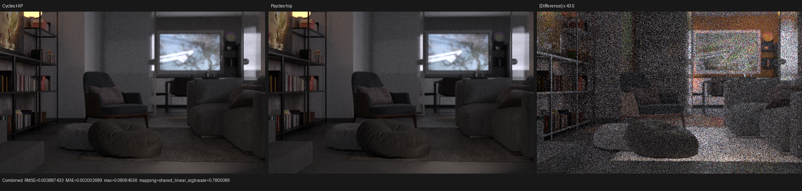
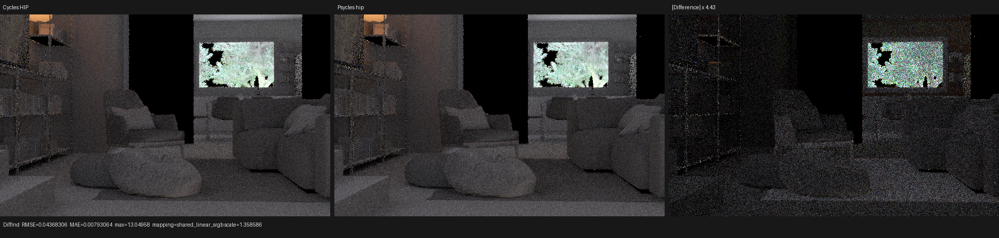
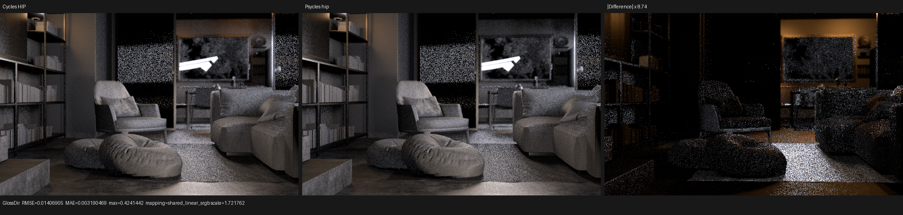
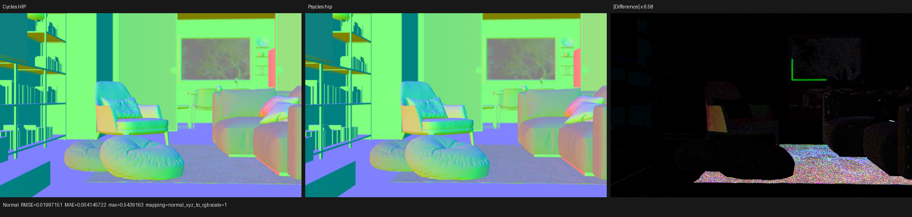

# Flat Archiviz Fast GI: HIP canary

This checkpoint validates implementation commit `debbadb` against Blender
5.2.1 / Cycles commit `9e2066aef7ef7e20c142ad7bd3303138a4304c93` on
the Radeon RX 9070 XT. Both renderers use 640x391, 1024 fixed samples,
`TABULATED_SOBOL`, seed 0, disabled adaptive sampling, and disabled denoising.
Psycles receives the original Blender node graphs and closures; no material or
lighting result is baked by Cycles.

This is the bounded canary before the native 1800x1100/1024 HIP gate. Vulkan
and fallback were deliberately not launched.

## Root cause and implementation

The source scene enables Cycles Fast GI with method `REPLACE`, render bounce
limit 2, world factor 1, and world distance 10. The old exporter omitted all
of those fields, so Psycles traced ordinary indirect paths while the Cycles
reference shortened and terminated late diffuse-like paths. A diagnostic
Cycles render with Fast GI disabled reproduced the old Psycles energy, ruling
out UV, transform, texture, and arbitrary closure-gain hypotheses.

The repair carries the authored contract through export, import, and the Luisa
kernel ABI, then implements the same transfer functions as Cycles:

- the effective bounce is `bounce - transmission_bounce -
  (glossy_bounce > 0) + 1`, with Fast GI active only when this value is greater
  than the render bounce limit;
- the next closest query uses the world AO distance or the exact source
  object's non-zero override, without modifying the persistent path ray;
- surface endpoints with emission or transparent-shadow capability defer
  termination until that surface is evaluated; an active volume is otherwise
  reduced to attenuation/emission transport, and an empty endpoint terminates
  immediately;
- background misses retain evaluation and scale radiance by the authored AO
  factor.

The endpoint cases form an ordered, exhaustive partition and are covered by
HIP path-state regressions. Material transparent-shadow capability is derived
from the raw closure graph plus Blender's authored switch; volume boundaries
retain Cycles' transparent-shadow flag. Emission endpoint capability is now
independent from NEE sampling policy, so `NONE` and low-energy `AUTO` emitters
remain visible to indirect rays.

Fast GI `ADD` is preserved in the scene contract but its additive AO branch is
not yet implemented; the importer emits an explicit warning instead of
silently claiming support. Flat Archiviz uses `REPLACE`.

## Performance

| renderer | render-only | process wall | scene compile | shader JIT |
|---|---:|---:|---:|---:|
| Psycles HIP | 26.3309 s | 44.4750 s | 7.80338 s | 9.87643 s |
| Cycles 5.2.1 HIP | 29.3602 s | 45.7193 s | n/a | n/a |

Psycles is 1.1150x, or 10.32%, faster than Cycles in render-only time for
this canary. Relative to the old Psycles run at the same 640x391/1024 setting,
render-only time falls from 38.7189 s to 26.3309 s, a 31.99% reduction. The
export contains 120 deduplicated surface programs, 1,457 SVM records, maximum
program length 119, and 20 stack lanes.

## Numerical comparison

All metrics compare linear multilayer EXR channels. Both outputs contain zero
invalid pixels in every requested pass. The complete report is in
[all-pass-report.json](all-pass-report.json).

| pass | relative RMSE | luminance ratio | RMSE |
|---|---:|---:|---:|
| Combined | 1.9364% | 0.994441 | 0.00388743 |
| Diffuse Color | 1.0663% | 1.003256 | 0.00396109 |
| Diffuse Direct | 25.5861% | 0.993276 | 0.0425403 |
| Diffuse Indirect | 36.9369% | 0.985976 | 0.0436831 |
| Glossy Direct | 14.1487% | 0.962926 | 0.0140691 |
| Glossy Indirect | 14.0580% | 0.989757 | 0.0133259 |
| Transmission Indirect | 3.1649% | 0.997728 | 0.00362367 |
| Emission | 0.1363% | 1.000260 | 0.00006331 |
| Environment | 0.1028% | 0.999973 | 0.00008219 |
| Normal | 4.1357% | 0.994352 | 0.0199715 |

The old Combined relative RMSE was 16.329%, so the structural error is 8.43x
smaller. More importantly, old indirect luminance ratios of 1.8771 diffuse,
1.7932 glossy, and 1.2428 transmission become 0.9860, 0.9898, and 0.9977.
Direct/indirect pass RMSE remains sensitive to different finite-sample path
scheduling; its mean energy and spatial support are reported rather than
discarded.

## Visual inspection

All triptychs were opened at their generated 1920x391 resolution. Panels are
Cycles, Psycles, and amplified absolute difference. The Combined image aligns
in geometry, furniture placement, apertures, textures, and exposure; no
handedness, registration, UV, or material-class shift is visible. Diffuse
Indirect preserves the reference's dark cutout regions and illumination
support. Glossy Direct residuals concentrate around bright sources and
high-frequency sampling. The Normal pass aligns in geometry and bump detail,
with residuals concentrated on the rug and bright boundaries.









## Commands and validation

```sh
cmake --build build --parallel "$(nproc)"
ctest --test-dir build --output-on-failure -j1 \
  -R 'psycles\.(blender_import|luisa_scene_traversal_hip|luisa_cycles_path_state_hip)$'

blender-5.2.1 flat-archiviz.blend --background --python-exit-code 1 \
  --python tools/export_psycles_scene.py -- EXPORT

build/bin/psycles_render_blender_scene EXPORT psycles.ppm hip \
  640 391 1024 64

blender-5.2.1 flat-archiviz.blend --background --python-exit-code 1 \
  --python tools/render_cycles_golden.py -- \
  cycles.exr 640 391 1024 --cycles-device HIP \
  --device-name 'RX 9070 XT'
```

The complete HIP CTest gate is 85/85 passing serially in 78.74 s. The focused
three-test gate above passes in 6.04 s after the final source edit. Four source
IES paths are missing from this downloaded blend and Cycles reports the same
missing files; this is retained as an input caveat, not hidden as a Psycles
match.
