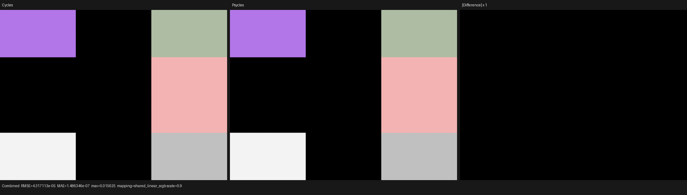

# Cycles Normal-node semantics

This checkpoint closes the production-scene `ShaderNodeNormal` gap found in
the Blender 5.2 benchmark scene. Psycles previously treated the linked `Dot`
output as its UI default, zero, which changed the rock and tree shader graphs.

## Formal contract

The only oracle is Cycles 5.2.1 commit `9e2066aef7ef`. Its
`intern/cycles/scene/shader_nodes.cpp` compiler stores the authored direction
from the Normal output socket, and `intern/cycles/kernel/svm/normal.h` defines

```text
D      = normalize(direction)
Normal = D
Dot    = dot(D, normalize(input_normal))
```

Both normalizations are Cycles' unchecked `a / len(a)`, not the zero-safe
Vector Math Normalize operation. A zero direction or input therefore becomes
non-finite and is cleared only at the common Cycles-compatible film boundary.
Psycles represents this distinction as an internal `CYCLES_NORMALIZE`
immediate in the existing vector-math SVM family. The authored direction is a
shared typed-DAG value, so requesting both outputs does not recompute it and no
scene-specific runtime branch is introduced.

## Permanent regression

`normal_node_matrix` contains nine original Blender node graphs covering:

- linked, non-unit inputs and authored directions;
- negative dot products;
- zero direction and zero input behavior;
- Normal-only, Dot-only, and simultaneous Normal plus Dot consumers.

The runner exports the untouched closures and values, renders Cycles HIP and
Psycles HIP, compares linear multilayer EXRs, and applies energy, global RMSE,
and normalized p99 gates. The 640x480, 64 spp command was:

```sh
python3 tools/run_cycles_shader_probes.py normal_node_matrix \
  --blender /home/mike/Projects/blender-install-5.2-hiprt/blender \
  --psycles-render build/bin/psycles_render_blender_scene \
  --output-dir /var/tmp/psycles-normal-node-hip-20260830-v3 \
  --backend hip --cycles-device HIP \
  --cycles-device-name 'Radeon RX 9070 XT' \
  --width 640 --height 480 --samples 64
```

The probe passed. Combined and Emit both have luminance ratio
`0.9999996216`, relative RMSE `8.5703e-5`, zero invalid Psycles pixels, and
zero p95/p99 pixel RMSE. Four isolated material-boundary pixels differ by one
camera sample at 64 spp (maximum channel error `1/64`); all case interiors are
exact. The strict mean-energy plus normalized-p99 gates make that boundary
model explicit and still reject an incorrect implementation of any full cell.

Complete metrics are in [hip-report.json](hip-report.json).



## Build and focused tests

- full build: `cmake --build build --parallel $(nproc)`;
- `psycles.surface_svm_vector_math_immediate` passed;
- `psycles.luisa_surface_vector_math_svm_hip` passed serially, including the
  unchecked zero-vector boundary;
- `psycles.blender_import` passed;
- the coverage registry now classifies `NORMAL` as verified by the newer
  Blender probe.
