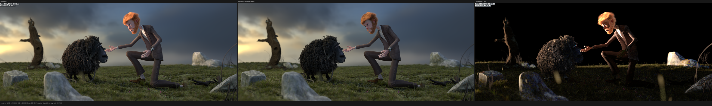
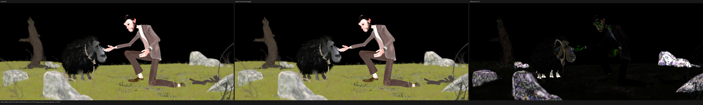
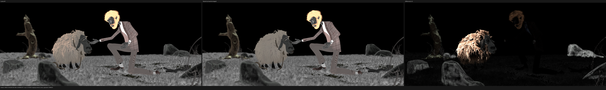
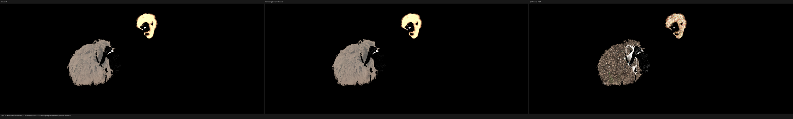
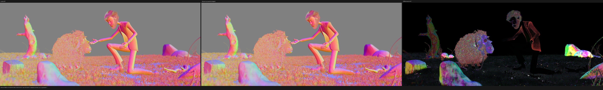
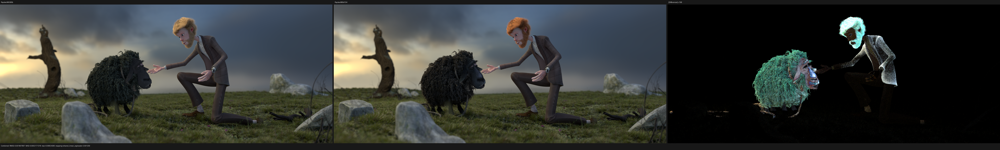
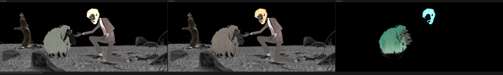
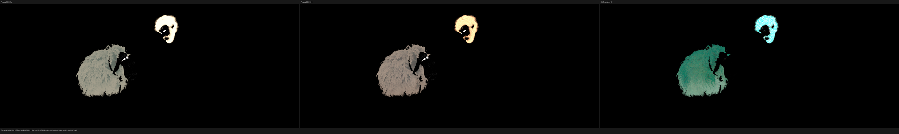
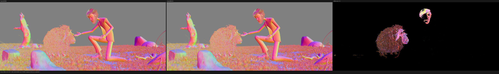

# Particle-hair emitter-root UV: full-resolution HIP validation

This checkpoint validates commit `880d134` against Blender 5.2.1 / Cycles
commit `9e2066aef7ef7e20c142ad7bd3303138a4304c93` on the same Radeon RX 9070 XT.
LuisaCompute is `57f46f709`. Only HIP was launched: the HIP correctness and
full-resolution gates are not yet complete enough to justify moving to Vulkan
or fallback.

The change fixes a structural shader-input error in legacy Blender particle
hair. Psycles previously exported the curve positions, radii, Hair Info
attributes, and original material closure graph, but omitted the UV coordinate
that Cycles reconstructs on the emitter for every strand. Consequently a UV
Map node on hair observed zero rather than its authored emitter-root value.
This was not an SVM closure-topology error and could not be fixed correctly by
adjusting a hair color or closure weight.

## Outcome

- The official benchmark exports all 651,758 `GEO-victor_head.particle_hair`
  `face_main` coordinates. Every coordinate is finite and nonzero; the binary
  section is exactly `651758 * 2 * sizeof(float)` bytes.
- A sample-zero trace at film pixel `(1094, 741)` preserves the same first-hit
  object, primitive, material, closure count, closure order, and closure types
  as Cycles HIP.
- Hair Reflection/Transmission color at that hit moves from the old Psycles
  `(0.396835, 0.284091, 0.182147)` to
  `(0.274487, 0.161705, 0.085017)`. Cycles HIP is
  `(0.275890, 0.162521, 0.085406)`.
- At 2048x858 and 1024 fixed samples, Diffuse Color relative RMSE falls from
  6.9762% to 3.7409%, Glossy Color from 23.2036% to 10.1212%, and
  Transmission Color from 28.6838% to 0.5959%.
- Render-only time remains neutral: Psycles takes 128.498 s versus the prior
  128.556 s. The same-run Cycles HIP reference takes 119.236 s, so Psycles is
  1.0777x as slow (+7.77%).
- The scene is still not a strict Cycles match. Combined remains 21.4008%, and
  the traced curve intersection parameters and normal still differ. These are
  explicit remaining failures rather than being hidden by a looser gate.

## Formal contract

Let `C` be the set of curves, `S` the set of curve segments, and
`pi: S -> C` the total map stored as `CurveSegmentGpu.curve_index`. For every
exported emitter UV layer `L`, the exporter constructs

```text
U_L: C -> R^2
U_L(c) = BKE_particle_uv_on_emitter(system(c), parent(c), particle_no(c), L)
```

using Blender's RNA wrapper with the exact parent/child pointer progression in
Cycles. Parent strands advance the parent-particle pointer. Child strands keep
the first parent pointer and pass the child `particle_no` to BKE. A shaded
segment `s` must therefore observe `U_L(pi(s))`; the value is constant across
the strand because Cycles stores this attribute on `ATTR_ELEMENT_CURVE`, not
on the key or segment domain.

The active render layer is also the default `ATTR_STD_UV`. Named UV Map nodes
address the same immutable curve-domain values through the existing stable
attribute ID. The scene contract proves totality before upload:

- every layer has exactly `|C|` values;
- both components of every value are finite;
- a declared default layer names an existing layer.

On device, the attribute binding packs domain and storage format in the
existing 32-bit layout word. Curve UVs stay `float2`; they are not widened to
`float4` in memory. The lookup loads the hit segment, applies `pi`, then reads
the curve value. The active default layer reuses the curve geometry's fixed
bindless slot, while non-default named layers are uploaded only when demanded
by a material reachable from that geometry. The 16-byte
`AttributeBindingGpu` ABI is unchanged.

This carries only original scene data. No material, closure, texture result,
or Cycles film value is baked or substituted.

### Cycles 5.2.1 source oracle

The implementation was derived from the following Cycles behavior, not from
case-specific benchmark colors:

- `intern/cycles/blender/curves.cpp`, `ObtainCacheParticleUV`, calls
  `BKE_particle_uv_on_emitter` once per selected curve and encodes the
  parent/child pointer progression.
- The UV synchronization loop chooses the mesh default UV map as
  `ATTR_STD_UV` and creates non-default named maps as `TypeFloat2` on
  `ATTR_ELEMENT_CURVE`.
- `intern/cycles/kernel/geom/curve.h`, `curve_attribute`, fetches a
  curve-domain attribute using the curve primitive index without key
  interpolation.

## Regression gates

The implementation adds or strengthens independent checks at every boundary:

- `test_blender_export_particle_hair.py` creates parent and child hair with
  two distinct UV maps, computes an independent Blender RNA oracle, and checks
  names, default selection, values, and non-aliasing.
- `curve_scene_contract`, `blender_curve_import`, and
  `curve_geometry_upload` cover finite/count/default validation and binary
  import/upload preservation.
- `attribute_residency` proves exact reachable curve-UV demand and byte
  census.
- `luisa_attribute_lookup_callable_hip` uses segments from different curves
  to prove the segment-to-curve quotient lookup and `float2` format.
- `luisa_curve_path_hip` exercises the real HIP path with named UV and Hair
  Info inputs together.
- The path trace now records the post-reconstruction curve coordinates rather
  than the stale raw procedural-hit barycentrics.
- `blender_particle_hair.py` is part of the exporter identity closure; changing
  it invalidates a cached bundle, with a permanent runner regression.

Commands and results:

```text
cmake --build build --parallel "$(nproc)"
# 197 build steps; passed

ctest --test-dir build --output-on-failure -j "$(nproc)" \
  -R 'psycles\.(curve_geometry_upload|blender_curve_import|attribute_residency|curve_scene_contract|scene_benchmark_runner_contract|blender_export_particle_hair)$'
# 6/6 passed

ctest --test-dir build --output-on-failure -j 1 -R '_hip$'
# 85/85 passed in 48.97 s
```

All modified source and test files remain below 2,000 lines. The exporter was
split by responsibility into a 1,890-line scene serializer and a 130-line
Cycles-compatible particle-hair host-contract module.

## Sample-zero path trace

The trace uses the full 2048x858 camera, absolute sample zero, seed zero,
Tabulated Sobol, fast math, and the `wavefront-staged` scheduler. Cycles CPU
and HIP already agree on the reference closure values to float-level noise.

| value | Cycles HIP | Psycles before | Psycles `880d134` |
|---|---:|---:|---:|
| intersection `u` | 0.361174 | 0.399028 | 0.399028 |
| intersection `v` | 0.858687 | 0.870861 | 0.870861 |
| Transparent weight | 0.377992 | 0.380772 | 0.380772 |
| Hair R | 0.275890 | 0.396835 | 0.274487 |
| Hair G | 0.162521 | 0.284091 | 0.161705 |
| Hair B | 0.085406 | 0.182147 | 0.085017 |

The post-fix Hair RGB errors are 0.51%, 0.50%, and 0.46%. This isolates the
remaining Transparent and normal error from the fixed UV error: it follows
the unchanged curve hit `u/v`, not a missing UV input or altered SVM topology.
The complete decoded Psycles trace and strict comparison are in
[psycles-path-trace.json](psycles-path-trace.json) and
[path-trace-comparison.json](path-trace-comparison.json).

## Full-resolution HIP benchmark

The benchmark uses a fresh final-identity Blender export, 2048x858, 1024 fixed
samples, seed zero, Tabulated Sobol, adaptive sampling off, denoising off, and
the same RX 9070 XT for both renderers. Psycles uses 64 samples per dispatch,
1,048,576 frames, staged surface sorting, no staged direct-light queue, and
fast math.

| renderer | render-only | scene compile | shader JIT | relative |
|---|---:|---:|---:|---:|
| Cycles 5.2.1 HIP | 119.236 s | excluded | excluded | 1.0000x |
| Psycles HIP `wavefront-staged` | 128.498 s | 60.644 s | 6.794 s | 1.0777x |

Scene loading, HIPRT builds, JIT, EXR writing, comparison, and destruction are
excluded from render-only time. During the render-only interval, ten
consecutive samples reported 100% GPU busy, 259--269 W package power, and
76--77% VRAM allocation. The coroutine frame is unchanged at 520 bytes, 126
fields, and 9 subroutines.

The exact runner command, device metadata, hashes, settings, and process times
are preserved in [benchmark.json](benchmark.json).

## Numerical comparison

All values compare linear multilayer EXR channels. Relative RMSE is shown as a
percentage; every listed reference and actual pass has zero invalid pixels.

| pass | before | `880d134` | luminance ratio |
|---|---:|---:|---:|
| Combined | 21.0662% | 21.4008% | 0.964535 |
| Diffuse Color | 6.9762% | 3.7409% | 0.997664 |
| Glossy Color | 23.2036% | 10.1212% | 0.974153 |
| Transmission Color | 28.6838% | 0.5959% | 0.997548 |
| Normal | 4.4767% | 4.4701% | 0.999710 |

The two Cycles renders differ by ordinary stochastic scheduling, so the small
Combined movement is not used as an implementation-regression claim. The
large, coherent color-pass reductions and the sample-zero raw closure values
are the causal evidence for the UV fix. The complete report is
[cycles-vs-psycles-report.json](cycles-vs-psycles-report.json).

Directly comparing the preceding Psycles EXR with `880d134` gives 2.6077%
Combined relative RMSE and a 0.994591 luminance ratio. The change is expected
to be material rather than bit-level because the old render evaluated the
wrong UV over two major hair systems. The complete comparison is
[prior-vs-current-report.json](prior-vs-current-report.json).

## Visual inspection

The source triptychs were inspected at their full 6144x858 resolution. The
committed images are 50% previews. Each image contains reference, actual, and
amplified absolute difference panels.

The Combined camera, terrain, grass, rocks, character silhouettes, and sheep
support align. The man's hair changes from the old pale/yellow response toward
the Cycles orange response. Remaining energy is concentrated on hair/wool and
direct/indirect illumination rather than a new scene-wide transform or UV
failure.



Diffuse Color support is substantially closer. Remaining amplified residuals
are visible on some rocks, the man's skin/clothing, and parts of the sheep;
they are not hidden by the improved aggregate number.



Glossy Color improves strongly but retains coherent sheep-wool and human-hair
residuals. This remains a strict failure.



Transmission Color is visually coincident at the shared display scale; the
difference panel is amplified by about 907x and exposes the remaining small
hair/wool error.



Normal remains broadly different on curves while the scene support aligns.
This agrees with the sample-zero curve intersection and surface-normal
evidence and selects the next implementation target.



The old-versus-new images verify locality: the material change is concentrated
on the two particle-hair systems rather than unrelated meshes or instances.









## Remaining HIP work

This checkpoint does not claim official-benchmark parity. The next formal
divergence is the ribbon/curve intersection representation: the same first-hit
object and primitive produce different `u/v` and normals. That error affects
Hair Info transparency, normal-dependent closure evaluation, NEE, and later
path topology. After it is corrected with a geometry-level regression, the
official benchmark and the other full-resolution HIP scenes must be rerun.
Vulkan and fallback remain deferred until the HIP gates pass, as requested.
