# Post-reboot full-resolution HIP matrix

This checkpoint reruns the complete HIP scene matrix after the workstation
reboot. It validates Psycles commit `ddcc363` with LuisaCompute commit
`10b4f6d` against Blender 5.2.1 / Cycles commit `9e2066aef7ef` on the same
AMD Radeon RX 9070 XT (`gfx1201`, HIP 7.2). The current exporter identity is
`cb7481cd39d4e018675d686414992d2380e44f7f0924faa352e1607fd266d3f9`.

Every row uses the scene's native validation resolution, exactly 1024 samples,
seed zero, disabled adaptive sampling, and disabled denoising. Psycles uses the
HIP `wavefront-staged` scheduler, one coroutine per `(pixel, sample)`, 64
samples per host dispatch, and a 1,048,576-frame capacity. Timings below are
render-only: export, scene construction, HIPRT acceleration builds, shader JIT,
EXR conversion, comparison, and destruction are excluded.

No Vulkan or fallback task was launched. The execution gate now passes on HIP,
but strict Cycles image parity still fails on the official benchmark and
Splash; other backends remain intentionally deferred.

## Commands and provenance

The matrix used this command shape, with the scene, bundle, output directory,
and native resolution varied per row:

```sh
python3 tools/run_scene_benchmark.py \
  --blender /home/mike/Projects/blender-install-5.2-hiprt/blender \
  --psycles-render build/bin/psycles_render_blender_scene \
  --blend <scene.blend> --bundle <current-export> --reuse-export \
  --output-dir <output> \
  --cycles-gpu-device HIP --cycles-gpu-device-name 'RX 9070 XT' \
  --skip-cycles-cpu --psycles-backends hip \
  --psycles-schedulers wavefront-staged \
  --width <native-width> --height <native-height> --samples 1024 \
  --max-samples-per-dispatch 64 \
  --compiler-tmp /var/tmp/psycles-compiler-tmp
```

Monster, Lone Monk, Classroom, and Flat Archiviz were freshly exported because
their earlier bundles predated the current exporter identity. Benchmark,
Splash, and Barbershop reused bundles whose identity matched exactly. The
runner verified the Cycles build identity and forced fixed sampling before
rendering.

## Outcome

- All seven scenes export or validate, construct, JIT, render, write multilayer
  EXR, and compare successfully on HIP.
- Every Psycles pass contains zero non-finite pixels. Cycles itself contains 74
  invalid Classroom Diffuse Direct pixels and 77 invalid Classroom Glossy
  Direct pixels; comparison masks only those reference-invalid samples.
- Monster, Lone Monk, and Classroom pass the structural and current numerical
  quality gates. Flat Archiviz also retains structural alignment, with the IES
  caveat below.
- Barbershop has correct geometry, UVs, textures, floor gaps, cabinets, brick
  wall, ceiling, and transforms. It remains a numerical work item because
  shading-normal and indirect-response differences are coherent in a few
  materials.
- Official Benchmark and Blender 4.1 Splash remain strict failures. Their
  material-color support is substantially closer than the preceding matrix,
  but the remaining error is in direct/indirect transport and high-energy
  tails rather than a scene-wide transform or diffuse fallback.
- Volume Direct and Volume Indirect are identically zero in all seven scenes.
  This matrix does not validate active volume transport.

## Render-only performance

| scene | resolution | Cycles HIP | Psycles HIP | Psycles/Cycles | gap |
|---|---:|---:|---:|---:|---:|
| Monster Under the Bed | 1024x1024 | 58.182 s | 76.906 s | 1.3218x | +32.18% |
| Lone Monk | 1440x1080 | 56.761 s | 77.580 s | 1.3668x | +36.68% |
| Classroom | 1920x1080 | 84.066 s | 132.646 s | 1.5779x | +57.79% |
| Official Benchmark | 2048x858 | 119.542 s | 133.948 s | 1.1205x | +12.05% |
| Flat Archiviz | 1800x1100 | 115.181 s | 164.395 s | 1.4273x | +42.73% |
| Blender 4.1 Splash | 1920x1080 | 209.328 s | 378.575 s | 1.8085x | +80.85% |
| Barbershop Interior | 2048x858 | 127.951 s | 218.455 s | 1.7073x | +70.73% |

The sum over the identical seven-scene workload is 771.010 s for Cycles and
1182.504 s for Psycles, or 1.5337x total time (+53.37%). This is not yet the
performance target. The current scene range is +12.05% to +80.85%, so a single
global multiplier would hide important scene-specific bottlenecks.

Steady samples confirmed the intended GPU. The official benchmark sustained
100% busy at about 382 W and 77% VRAM. Splash sustained 100% busy at about
267 W and 85% VRAM. Flat Archiviz was observed at 54% busy / 122 W / 43% VRAM,
and Barbershop at 87% busy / 187 W / 52% VRAM. These latter observations are
single samples, but they establish a scene-specific scheduler or kernel-mix
utilization gap worth profiling; they are not evidence of a wrong device.

Compared with the immediately preceding matrix, render-only movement is mixed:
Lone Monk and Flat Archiviz are 3.7% and 5.0% faster, while Benchmark and
Classroom are 4.2% and 2.4% slower; the other scenes move by less than 0.4%.
These are single repeats after a reboot, so no renderer speedup or regression
is attributed to the code from this timing alone.

## Linear EXR comparison

Relative RMSE is shown as a percentage. Luminance is the ratio of Psycles mean
linear luminance to Cycles mean linear luminance.

| scene | Combined | luminance | Diffuse Color | Normal | Glossy Color | Transmission Color |
|---|---:|---:|---:|---:|---:|---:|
| Monster | 1.8148% | 1.002918 | 0.0367% | 0.0159% | 0.0200% | 0.0000% |
| Lone Monk | 1.1629% | 1.000752 | 0.0737% | 0.1980% | 0.0872% | 0.0000% |
| Classroom | 0.6687% | 0.999389 | 0.5916% | 0.9866% | 0.0179% | 0.0083% |
| Official Benchmark | 20.5264% | 0.967303 | 3.5649% | 4.2867% | 1.9576% | 0.5305% |
| Flat Archiviz | 1.9564% | 0.994652 | 2.0796% | 7.1537% | 1.3046% | 0.0037% |
| Splash | 13.6800% | 0.991396 | 0.7509% | 1.6068% | 2.3682% | 0.0027% |
| Barbershop | 4.3944% | 1.004749 | 4.6037% | 3.1989% | 0.8109% | 0.0743% |

The latest surface-SVM/hair work materially improved the official benchmark's
first-hit closure colors versus the preceding matrix: Diffuse Color fell from
6.9762% to 3.5649%, Glossy Color from 23.2036% to 1.9576%, and Transmission
Color from 28.6838% to 0.5305%. This rules out the former gross closure-color
fallback as the dominant remaining Combined error.

Transport passes localize the current failures:

| scene | Diffuse Direct | direct energy | Diffuse Indirect | indirect energy | Glossy Direct | direct energy | Glossy Indirect | indirect energy |
|---|---:|---:|---:|---:|---:|---:|---:|---:|
| Benchmark | 32.0135% | 0.909001 | 56.2293% | 0.894573 | 52.8372% | 0.845940 | 56.6767% | 0.891979 |
| Splash | 15.2733% | 0.998099 | 25.3889% | 0.982336 | 134.1703% | 1.005259 | 14.9176% | 0.986947 |
| Barbershop | 2.1644% | 1.000659 | 14.9089% | 1.005907 | 11.2124% | 1.000049 | 32.7835% | 1.006332 |

Benchmark has a coherent 9--15% mean-energy deficit in all four principal
transport passes. That is a structural NEE/visibility/BSDF-light evaluation
problem, not merely decorrelated noise. Splash and Barbershop have near-equal
mean direct energy but much larger RMSE, identifying distribution and rare
high-energy-tail differences. Splash Transmission Direct and Env have very
large relative errors only because both references carry negligible absolute
energy; they are not priorities for Combined parity.

Flat Archiviz's source references a missing `three-lobe-vee.ies`. Cycles cannot
load that file, while Psycles also reports four `TEX_IES` nodes as not lowered
and uses their socket defaults. The image is structurally aligned, but this run
must not be cited as validation of IES support.

Barbershop references missing `generic_scratches.png` and
`guilder_ornament.png`; both Cycles and Psycles report the same absent source
assets. The visible floor layout and its black gaps align, so the historical
floor discrepancy is not reproduced with the current Blender 5.2.1 source and
export path.

## Full-resolution visual inspection

Every source triptych below was opened at original resolution before the 50%
documentation preview was produced. Panels are Cycles, Psycles, and amplified
absolute difference from left to right.

### Monster Under the Bed

The BSSRDF monster, child, bed, floor, eyes, teeth, and material boundaries
align. Residuals have noise support rather than a missing or substituted
closure.

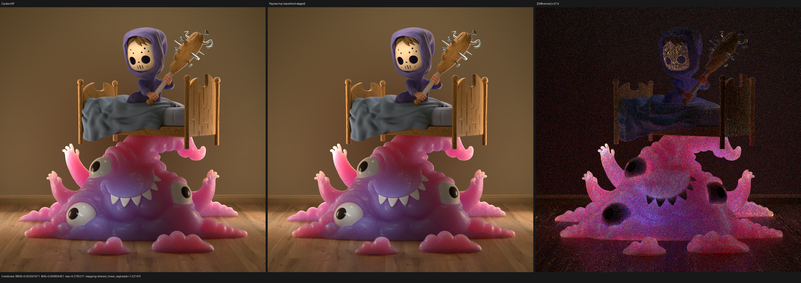

### Lone Monk

Grass bands, arches, stone and brick, furniture, books, and deep silhouettes
align. No coherent UV or instance-transform residual is visible.

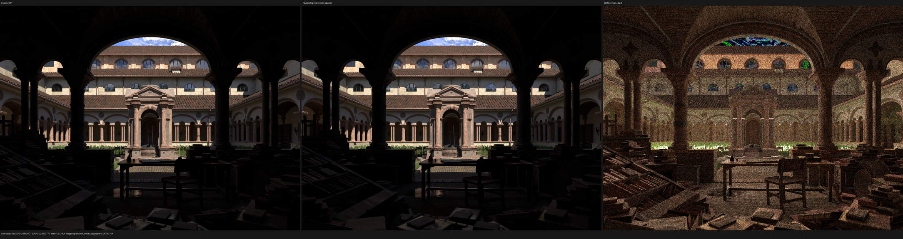

### Classroom

The clock, door, lamps, blinds, blackboard, desks, cabinets, chairs, and floor
align. The formerly suspicious clock and doorway are not systematically
brighter than Cycles in this run.

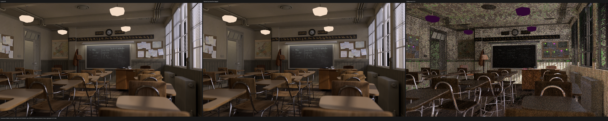

### Flat Archiviz

Room geometry, furniture, shelves, books, window, and texture registration
align. Normal residuals concentrate on dark/high-variance foreground and floor
support; the missing-IES caveat still applies.

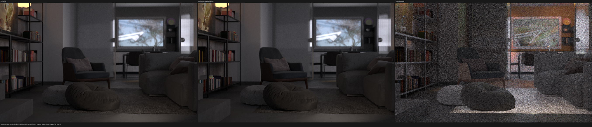

### Official Benchmark

Camera, terrain, characters, sheep, rocks, grass, and hair support align. The
new closure-color result is much closer, but the man, sheep, tree, and ground
are coherently darker in direct and indirect light. This scene remains a strict
failure.

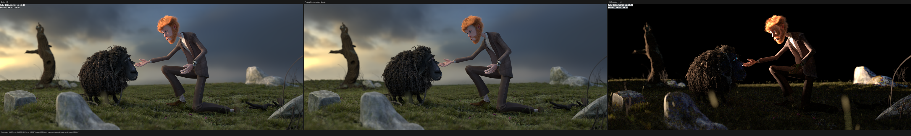

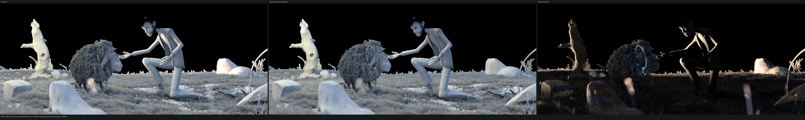

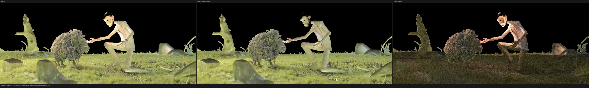

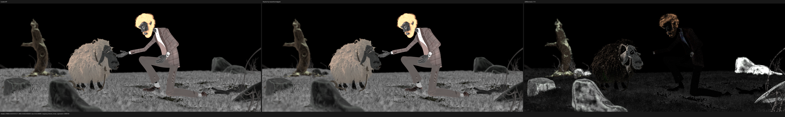

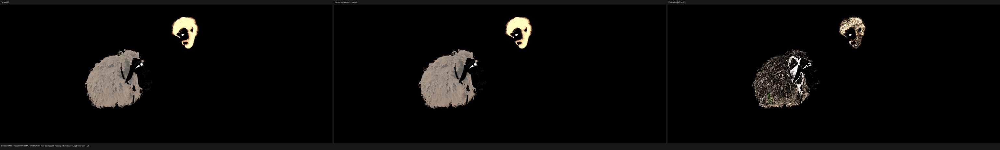

### Blender 4.1 Splash

Room shell, stairs, fireplace, slats, paintings, furniture, carpet, branches,
and kitchen align. Diffuse Color and Normal exclude a scene-wide transform,
UV, or material-class failure. Combined and Glossy Direct retain broad noise
and firefly differences; this scene remains a strict failure.

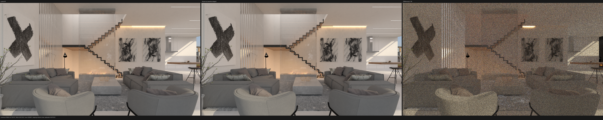

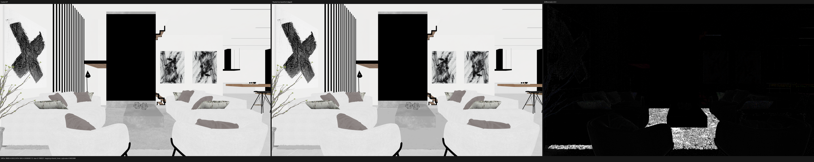

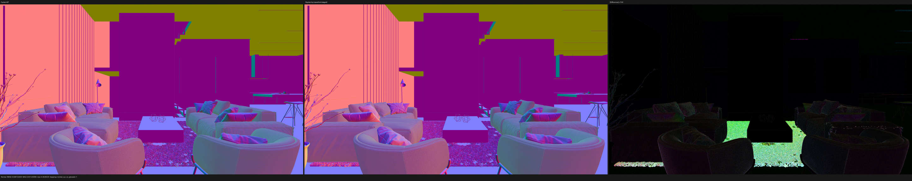

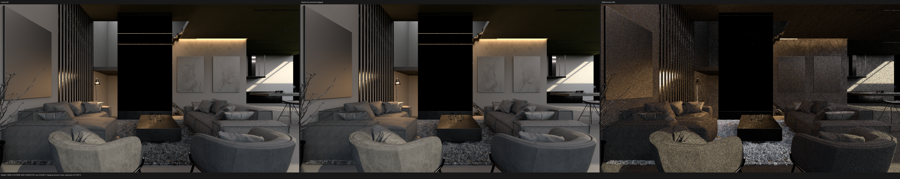

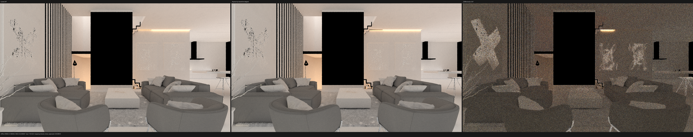

### Barbershop Interior

The wood-floor pattern and black gaps, left cabinet wood/glass/bottles/knobs,
brick wall, ceiling beams, picture frames, right cabinet, chairs, and newspaper
all occupy the same support. Residuals remain in indirect transport and a few
shading-normal/material responses, not in handedness, UVs, or export topology.

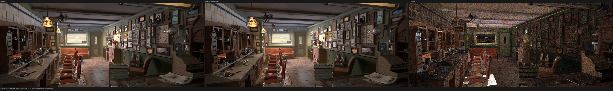

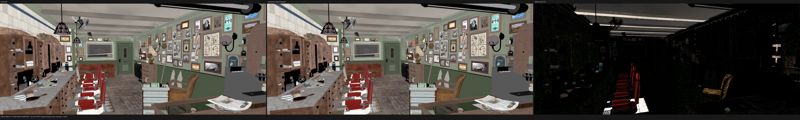

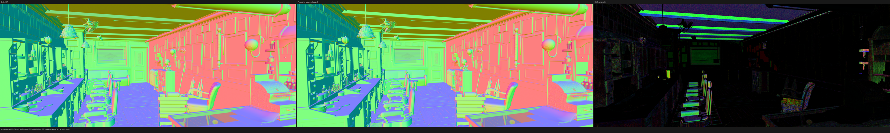

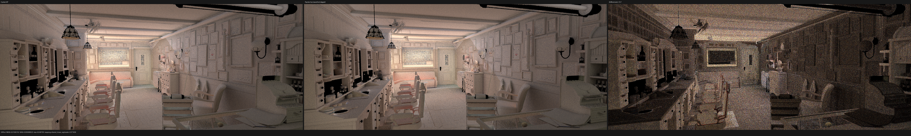

## Next HIP gate

The next fix is not another surface-SVM syntax patch. The formal counterexample
must start from a benchmark path whose first-hit SVM closure values agree with
Cycles and whose light contribution first diverges. The trace boundary is:

1. selected emitter identity and selection measure;
2. light sample geometry and PDF;
3. BSDF evaluation and PDF for the sampled direction;
4. shadow visibility/transmittance;
5. MIS weight and clamped contribution;
6. resulting direct/indirect film-pass classification.

The recently added forward-emission trace already proves an exact matching
sample for emitter selection/PDF/MIS. The benchmark's coherent energy deficit
therefore requires locating a differing NEE or visibility sample rather than
assuming all emitter sampling is wrong. A minimal traced counterexample and a
permanent regression are required before changing renderer or Luisa code.

Only after Benchmark and Splash clear the HIP image gate should the same fixed
matrix be expanded to native XIR Vulkan and fallback.
