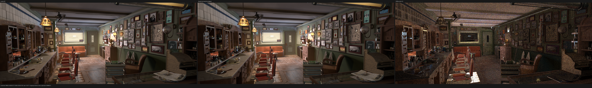
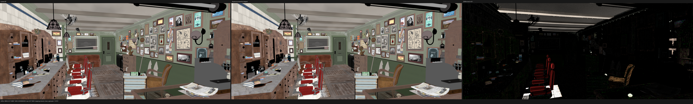
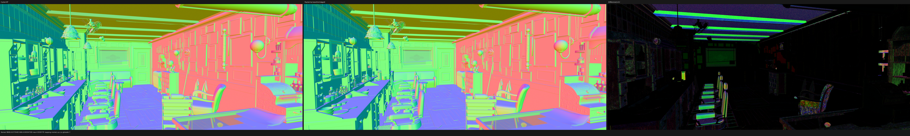
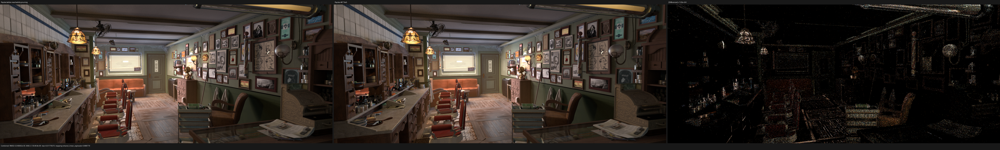

# Reachable material-domain HIP validation

This checkpoint validates commit `4671bc5` on the native-resolution
Barbershop Interior scene. It removes materials that no runtime shader lookup
can reach before constructing the replacement surface SVM. The reference is
Cycles from Blender 5.2.1 commit
`9e2066aef7ef7e20c142ad7bd3303138a4304c93`, running on the same Radeon RX
9070 XT. Both renderers use 2048x858, 1024 fixed samples, no adaptive sampling,
and no denoising.

The checkpoint passes its intended gate: the compiled SVM domain and shader
queue shrink, every HIP regression passes, and the full image is
observationally unchanged. It is not a claim that Barbershop transport or
performance has reached Cycles parity; indirect-light residuals and a 68.76%
render-time gap remain.

## Formal domain

For geometry `G`, primitive `p`, and instance `I`, define:

- `S_G(p)` as the primitive's authored material-slot index, defaulting to zero;
- `R_G,I(s)` as instance override `s` when present, otherwise geometry slot
  `min(s, last)`, matching Cycles' last-slot clamp;
- an undefined result when the geometry has no slot and the instance supplies
  no override.

The exact surface domain is
`union_I image(R_G,I o S_G)`. The shader domain is this surface union plus the
analytic-light shader roots and world shader root. These are the only
`MaterialId` dereference sources in the immutable scene snapshot. Therefore:

1. compiling every material in this closed domain is complete;
2. a material outside it cannot affect a renderer observation;
3. if an uncompiled entry remains in an authored geometry or override table,
   no runtime primitive can select that entry.

The upload keeps authored table lengths and indices stable. Proven-unreachable
entries become poisoned inert bindings rather than shifting later slots.
Missing materials inside the closed domain are still rejected transactionally.
The same per-geometry material image now roots named-attribute residency, so
unused material slots cannot retain unrelated UV/color/tangent buffers.

The Blender exporter performs an earlier conservative filter over material
names present in exported geometry and curve slot tables. The runtime pass is
still authoritative and performs the exact primitive/instance image above.

## Regression gates

The all-thread Release build succeeds. Focused tests cover:

- exact surface/light/world closure of the material domain;
- transactional selected-domain compilation, removal, missing roots, and an
  invalid graph outside the selected domain;
- exact per-geometry attribute demand and storage census;
- Blender export excluding an unrelated material datablock;
- unused triangle geometry-slot and instance-override holes on HIP;
- an unused curve material-slot hole on HIP.

The final serial HIP gate is 85/85 in 21.68 s. All 711 first-party source files
remain within the 2,000-line limit.

## Scene and SVM reduction

The comparison is against the immediately preceding native Barbershop gate at
`ca88f5c`, using the same scene and scheduler.

| measure | before | reachable domain | change |
|---|---:|---:|---:|
| exported Blender materials | 547 | 263 | -51.9% |
| compiled materials including light/world roots | 564 | 280 | -50.4% |
| SVM programs | 380 | 338 | -11.1% |
| SVM records | 10,177 | 8,601 | -15.5% |
| value operands | 9,628 | 8,235 | -14.5% |
| metadata records | 4,210 | 3,554 | -15.6% |
| closure leaves | 381 | 335 | -12.1% |
| semantic SVM families / variants | 34 / 67 | 33 / 64 | -1 / -3 |
| staged surface queue keys | 190 | 169 | -11.1% |
| resident named-attribute bindings | 658 | 632 | -4.0% |
| resident named-attribute bytes | 252,140,688 | 244,434,128 | -3.1% |

Maximum SVM program length remains 210 and stack width remains 33 lanes. The
coroutine remains 864 B / 182 fields / 9 subroutines. This proves the large
frame is caused by capabilities still reachable in Barbershop, not by the
discarded material datablocks.

The former `agent_skin` / `agent_face_*` warnings disappear. The remaining
`generic_scratches.png` and `guilder_ornament.png` warnings also occur in
Cycles and are source-asset defects.

## Performance

| renderer | render-only | ratio to Cycles |
|---|---:|---:|
| Cycles 5.2.1 HIP | 129.150 s | 1.0000x |
| Psycles HIP `wavefront-staged` | 217.951 s | 1.6876x |

Psycles is 68.76% slower than Cycles in this run. Relative to the preceding
Psycles result of 219.418 s, it is 0.67% faster; that single-run difference is
reported as approximately neutral rather than a claimed kernel speedup. The
observed shader-JIT interval falls from 14.613 s to 10.352 s (-29.2%), while
whole-scene compilation changes from 14.208 s to 15.817 s because it is
dominated by 1,059 HIPRT geometry builds and cache state. GPU samples during
both Cycles and Psycles render phases show 100% busy, roughly 213--219 W, and
52% VRAM allocation.

## Numerical result

Against the fresh Cycles reference, Combined remains at 4.3986% relative RMSE,
with luminance ratio 1.004774 and no invalid pixels. First-hit support remains
aligned: Diffuse Color is 4.6098%, Normal 3.2009%, Glossy Color 0.8109%, and
Transmission Color 0.0743%. The remaining high errors are transport passes:
Diffuse Indirect is 14.9157% and Glossy Indirect is 32.7790%. Both volume
passes are exactly zero in both renderers, so this scene does not validate
active volume transport.

Comparing the new Psycles image directly with the previous Psycles image gives
Combined relative RMSE 0.02299%, luminance ratio 0.99999984, and mean absolute
error 2.14e-6. Diffuse Color changes by only 0.00162% relative RMSE and Normal
by 0.000109%. Glossy Indirect is the largest stochastic outlier at 0.6242%
relative RMSE, while its mean luminance changes by only 0.00017%. The surface
queue key reduction changes concurrent accumulation order, so exact EXR hashes
are not expected; the deterministic unit contracts and tolerant full-pass
comparison remain intact.

Complete metrics are in
[Cycles versus Psycles](cycles-vs-psycles-report.json) and
[new versus previous Psycles](new-vs-old-report.json). The exact command and
timing manifest is [benchmark.json](benchmark.json).

## Visual inspection

All source triptychs were opened at their full 6160x928 resolution. The
checked-in images are 50% previews.

The Cycles and Psycles panels align on the wood-floor texture and black glossy
gaps, the left cabinet's wood/glass/bottles/knobs and glossy support, the tiled
wall, ceiling beams, back wall, picture frames, right cabinet, chairs, and
foreground newspaper. The amplified Combined residual is distributed over
indirect illumination and highlights; it does not show a missing material,
UV/transform shift, or diffuse replacement.







The old and new Psycles panels are visually indistinguishable. Their
difference panel is displayed at about 13,193x amplification and contains only
small sampling/accumulation residuals around edges and indirect highlights.



## Reproduction

```sh
python tools/run_scene_benchmark.py \
  --blender /home/mike/Projects/blender-install-5.2-hiprt/blender \
  --psycles-render build/bin/psycles_render_blender_scene \
  --blend /home/mike/Projects/Psycles/assets/official-blender-scenes/barbershop-interior/barbershop_interior.blend \
  --output-dir /var/tmp/psycles-fullres-hip-20260830/barbershop/reachable-materials-4671bc5 \
  --bundle /var/tmp/psycles-fullres-hip-20260830/exports/barbershop-reachable-materials-4671bc5 \
  --cycles-gpu-device HIP --cycles-gpu-device-name 'RX 9070 XT' \
  --skip-cycles-cpu --psycles-backends hip \
  --psycles-schedulers wavefront-staged \
  --width 2048 --height 858 --samples 1024 \
  --max-samples-per-dispatch 64 \
  --compiler-tmp /var/tmp/psycles-fullres-hip-20260830/compiler-tmp
```
