# Reachable-material full-resolution HIP scene matrix

This checkpoint revalidates the full HIP scene matrix after commit `4671bc5`
restricted surface compilation and named-attribute residency to the formally
reachable material domain. The measured Psycles renderer source is `4671bc5`;
the reference is Blender 5.2.1 / Cycles commit
`9e2066aef7ef7e20c142ad7bd3303138a4304c93` on the same Radeon RX 9070 XT.
The LuisaCompute submodule is `57f46f709`.

Every run uses a fresh Blender 5.2.1 export, 1024 fixed samples, seed zero,
`TABULATED_SOBOL`, disabled adaptive sampling, and disabled denoising. Psycles
uses the HIP `wavefront-staged` scheduler with one coroutine per
`(pixel, sample)`, 64 samples per host dispatch, a 1,048,576-frame capacity,
staged surface sorting, and fast math. The exporter carries the original
Blender node graphs and closures; no Cycles material, light, volume, or film
result is baked.

Vulkan and fallback were deliberately not launched during this checkpoint.
The HIP matrix had to complete first, and two scenes still fail strict
Cycles-parity gates even though all seven render to completion.

## Outcome

- All seven fresh exports build, JIT, render, write multilayer EXR, and compare
  without a missing reachable material, crash, GPU OOM, or invalid Psycles
  pixel.
- Classroom, Lone Monk, Monster Under the Bed, Barbershop Interior, and Flat
  Archiviz retain structural image alignment with Cycles at full resolution.
- The official benchmark still fails strict parity on the man's hair and the
  sheep wool. Glossy and transmission color have coherent closure-response
  differences; this is not sampling noise.
- Blender 4.1 Splash still fails strict parity on broad indirect transport and
  high-variance glossy paths. Geometry, transforms, first-hit material support,
  and major texture registration align.
- Every scene has exactly zero Volume Direct and Volume Indirect in both
  renderers. This matrix therefore does not validate active volume transport;
  a dedicated volume scene remains required before claiming that feature.
- Removing unreachable materials is observationally safe across the matrix.
  Direct old-versus-new Psycles comparisons preserve mean energy and show no
  new geometry, UV, transform, texture, or closure-class support mismatch.

## Render-only performance

Scene construction, Blender export, HIPRT acceleration builds, shader JIT,
image conversion, EXR writing, and destruction are excluded from every time
below.

| scene | resolution | Cycles HIP | Psycles HIP | Psycles/Cycles | gap |
|---|---:|---:|---:|---:|---:|
| Barbershop Interior | 2048x858 | 129.150 s | 217.951 s | 1.6876x | +68.76% |
| Blender 4.1 Splash | 1920x1080 | 208.703 s | 377.468 s | 1.8086x | +80.86% |
| Official benchmark | 2048x858 | 119.332 s | 128.556 s | 1.0773x | +7.73% |
| Monster Under the Bed | 1024x1024 | 58.179 s | 76.820 s | 1.3204x | +32.04% |
| Lone Monk | 1440x1080 | 56.759 s | 80.589 s | 1.4198x | +41.98% |
| Classroom | 1920x1080 | 83.927 s | 129.565 s | 1.5438x | +54.38% |
| Flat Archiviz | 1800x1100 | 115.202 s | 172.995 s | 1.5017x | +50.17% |

The current render times are effectively neutral against the immediately
preceding matrix. Psycles changes by -0.67% Barbershop, -0.01% Splash, +0.02%
benchmark, -2.76% Monster, +0.47% Lone Monk, +0.13% Classroom, and +0.14% Flat
Archiviz. These are single runs, and the corresponding Cycles repeats move by
as much as +1.36% on Barbershop, so no kernel speedup is claimed from those
differences.

The optimization does reduce host-side shader work. Observed shader-JIT time
changes from 14.613 to 10.352 s on Barbershop, 18.143 to 16.331 s on Splash,
11.348 to 7.169 s on the benchmark, 8.186 to 7.175 s on Monster, 6.234 to
5.149 s on Lone Monk, 6.857 to 5.304 s on Classroom, and 13.377 to 9.459 s on
Flat Archiviz. These intervals include cache-state effects, so they are
reported as observations rather than isolated compiler benchmarks.

Representative steady-state samples all reach 100% GPU busy:

| scene | package power | VRAM allocated |
|---|---:|---:|
| Barbershop Interior | 213--219 W | 52% |
| Blender 4.1 Splash | 238--245 W | 86% |
| Official benchmark | 266--268 W | 76% |
| Monster Under the Bed | 228--229 W | 25% |
| Lone Monk | 236--237 W | 25% |
| Classroom | 241--242 W | 23% |
| Flat Archiviz | 218--219 W | 43% |

This rules out a wrong device or persistent gross under-utilization. It does
not identify the remaining 7.7--80.9% gaps; kernel-level HIP profiling is
still required per scene.

## Reachable-domain reduction

The table compares the preceding full-resolution exports with the exact
runtime domain after `4671bc5`.

| scene | exported materials | SVM programs | SVM records | surface queue keys |
|---|---:|---:|---:|---:|
| Barbershop | 547 -> 263 | 380 -> 338 | 10,177 -> 8,601 | 190 -> 169 |
| Splash | 76 -> 74 | 98 -> 96 | 947 -> 934 | 49 -> 48 |
| Benchmark | 119 -> 75 | 150 -> 118 | 2,907 -> 2,572 | 75 -> 59 |
| Monster | 20 -> 19 | 38 -> 34 | 369 -> 363 | 19 -> 17 |
| Lone Monk | 35 -> 34 | 50 -> 46 | 502 -> 496 | 25 -> 23 |
| Classroom | 85 -> 78 | 116 -> 114 | 1,390 -> 1,378 | 58 -> 57 |
| Flat Archiviz | 109 -> 104 | 120 -> 108 | 1,457 -> 1,331 | 60 -> 54 |

The maximum program length and stack width do not increase in any scene. The
coroutine frame also remains unchanged, as expected: unreachable material
graphs were compilation roots, not live path state.

| scene | max program / stack lanes | coroutine frame |
|---|---:|---:|
| Barbershop | 210 / 33 | 864 B / 182 fields / 9 subroutines |
| Splash | 79 / 21 | 464 B / 111 fields / 8 subroutines |
| Benchmark | 143 / 38 | 520 B / 126 fields / 9 subroutines |
| Monster | 48 / 22 | 496 B / 120 fields / 9 subroutines |
| Lone Monk | 62 / 24 | 440 B / 105 fields / 7 subroutines |
| Classroom | 71 / 20 | 440 B / 105 fields / 8 subroutines |
| Flat Archiviz | 119 / 20 | 496 B / 120 fields / 9 subroutines |

The full formal domain definition, regressions, and Barbershop reduction are
documented in the
[reachable-material validation](../reachable-material-domain-hip/README.md).

## Numerical comparison with Cycles

All metrics compare linear EXR channels. Relative RMSE values below are shown
as percentages. Complete per-pass metrics, orientation checks, invalid-pixel
counts, exact paths, and build identities are linked under each scene.

| scene | Combined | luminance ratio | Diffuse Color | Normal | Glossy Color | Transmission Color |
|---|---:|---:|---:|---:|---:|---:|
| Barbershop | 4.3986% | 1.004774 | 4.6098% | 3.2009% | 0.8109% | 0.0743% |
| Splash | 13.6902% | 0.991473 | 0.7551% | 3.0581% | 2.4673% | 0.0027% |
| Benchmark | 21.0662% | 0.969788 | 6.9762% | 4.4767% | 23.2036% | 28.6838% |
| Monster | 1.8148% | 1.002918 | 0.0367% | 0.0159% | 0.0200% | 0.0000% |
| Lone Monk | 1.1634% | 1.000752 | 0.0737% | 0.1981% | 0.0871% | 0.0000% |
| Classroom | 0.6687% | 0.999389 | 0.5916% | 0.9866% | 0.0179% | 0.0083% |
| Flat Archiviz | 1.9564% | 0.994650 | 2.0796% | 7.1537% | 1.3046% | 0.0037% |

All Combined references and Psycles outputs contain zero invalid pixels.
Cycles itself contains 74 invalid Classroom Diffuse Direct pixels and 77
invalid Classroom Glossy Direct pixels; the report excludes those
reference-invalid values for the affected pass only.

The larger remaining errors are transport-specific. Barbershop Diffuse
Indirect is 14.9157% and Glossy Indirect 32.7790%. Splash Diffuse Indirect is
25.4589% and Glossy Indirect 14.9931%. Benchmark Diffuse Indirect is 87.4536%
and Glossy Indirect 64.3121%, in addition to its first-hit hair/wool closure
color mismatch. Flat Archiviz uses authored Fast GI `REPLACE`; its Diffuse
Indirect is 32.2329% but its mean luminance ratio is 0.985410 and its spatial
support aligns.

## Direct comparison with the preceding Psycles matrix

Changing queue-key and material-index domains can change concurrent atomic
accumulation order, so exact EXR hashes are not required. The regression gate
uses deterministic unit contracts plus tolerant full-pass and visual
comparison.

| scene | Combined relative RMSE | luminance ratio | mean absolute error |
|---|---:|---:|---:|
| Barbershop | 0.02299% | 0.99999984 | 2.14e-6 |
| Splash | 0.14460% | 1.00000000 | 1.77e-4 |
| Benchmark | 0.02452% | 1.00000077 | 1.11e-6 |
| Monster | 0.00000026% | 1.00000000 | 4.03e-12 |
| Lone Monk | 0.01762% | 1.00000078 | 7.38e-6 |
| Classroom | 0.01187% | 1.00000007 | 1.08e-6 |
| Flat Archiviz | 0.08140% | 0.99999818 | 2.00e-5 |

No old-versus-new comparison has an invalid pixel or a coherent missing
surface. Splash and Flat Archiviz have the largest stochastic differences,
but their mean energy remains stable and their amplified difference panels do
not reveal a material-domain support change.

## Visual inspection

Every generated source triptych was opened at its full resolution. The images
below are 50% previews with Cycles, Psycles, and amplified absolute difference
panels. Each scene also includes a previous-Psycles, current-Psycles, amplified
difference triptych.

### Barbershop Interior

The floor texture and black glossy gaps, left cabinet wood/glass/bottles/knobs,
tiled wall, ceiling beams, picture frames, right cabinet, chairs, and
foreground newspaper align. Remaining residuals are indirect-light and
highlight noise, not a UV, transform, or diffuse-replacement error.


### Blender 4.1 Splash

The room shell, stair, fireplace, slats, paintings, furniture, carpet,
branches, and kitchen occupy the same support. Diffuse Color and Normal rule
out a scene-wide handedness, UV, or instance-transform failure. The Combined,
Glossy Direct, and Transmission Indirect residuals remain broad transport and
high-variance differences, so this scene is still a strict failure.

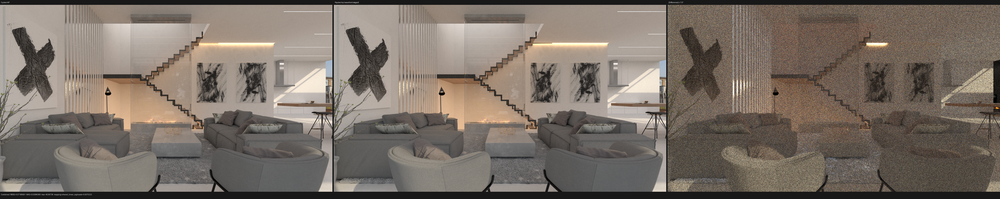

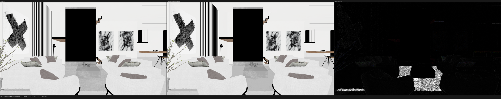

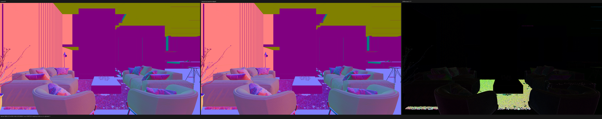

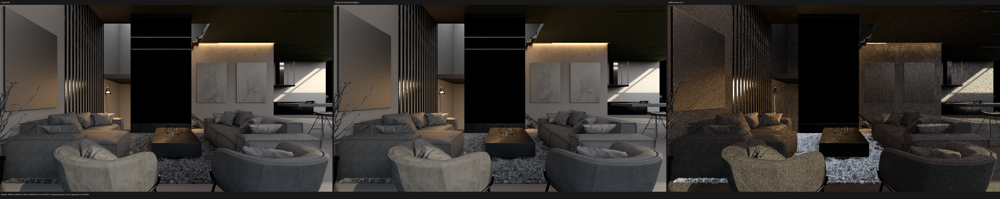

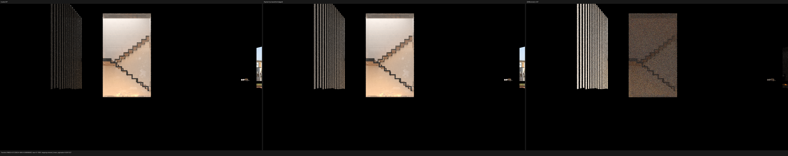

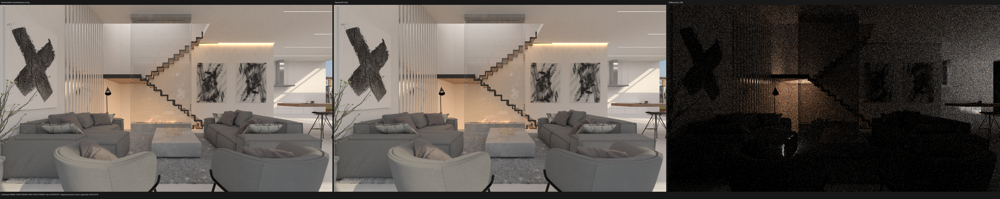

Reports: [Cycles versus Psycles](splash-4.1/cycles-vs-psycles-report.json),
[previous versus current](splash-4.1/prior-report.json), and
[benchmark manifest](splash-4.1/benchmark.json).

### Official benchmark

Camera, terrain, rocks, grass, characters, sheep geometry, and environment
align. The man's hair and sheep wool do not: coherent Glossy Color and
Transmission Color residuals prove a remaining closure/SVM transport gap.

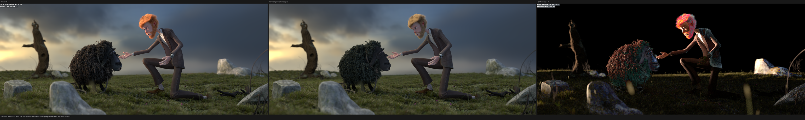

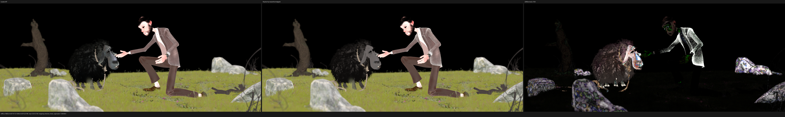

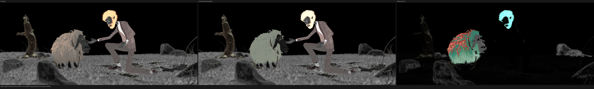

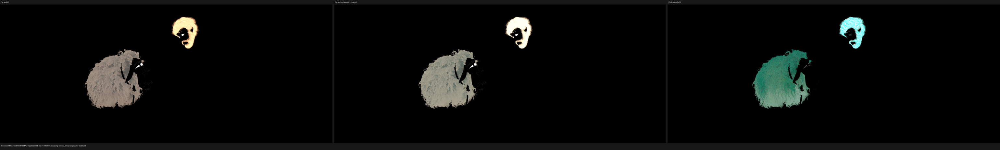

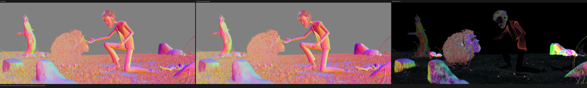

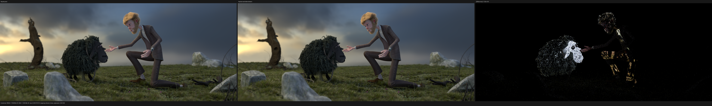

Reports: [Cycles versus Psycles](benchmark/cycles-vs-psycles-report.json),
[previous versus current](benchmark/prior-report.json), and
[benchmark manifest](benchmark/benchmark.json).

### Monster Under the Bed

The BSSRDF monster, child, bed, blanket, eyes, teeth, wooden frame, and floor
align. First-hit Diffuse Color and Normal are nearly exact; Combined residual
energy is concentrated in stochastic subsurface and indirect transport. The
old and new Psycles Combined images are effectively bit-identical.

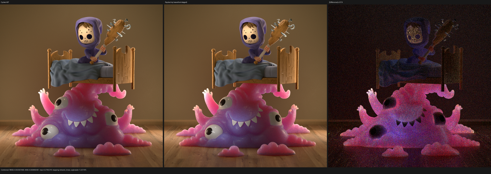

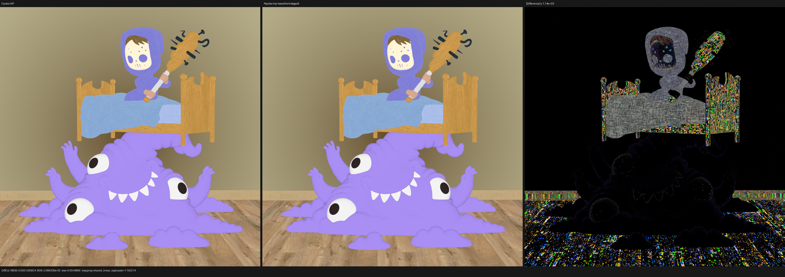

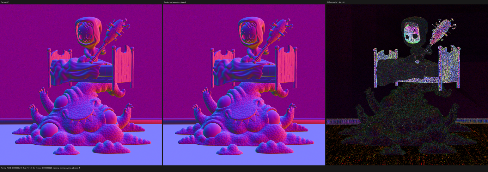

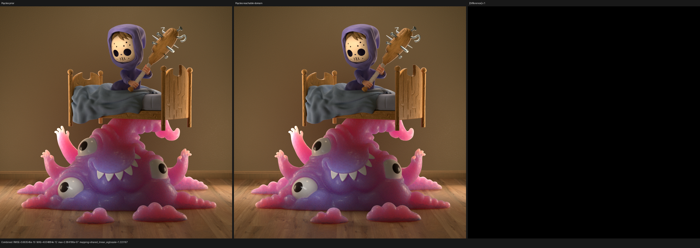

Reports: [Cycles versus Psycles](monster/cycles-vs-psycles-report.json),
[previous versus current](monster/prior-report.json), and
[benchmark manifest](monster/benchmark.json).

### Lone Monk

Grass bands, arches, brick and stone textures, roof, books, furniture, and
deep silhouettes align. The previously questioned grass discrepancy is not
present in the current full-resolution comparison.

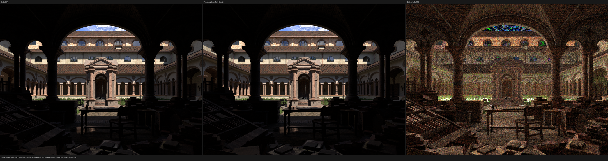

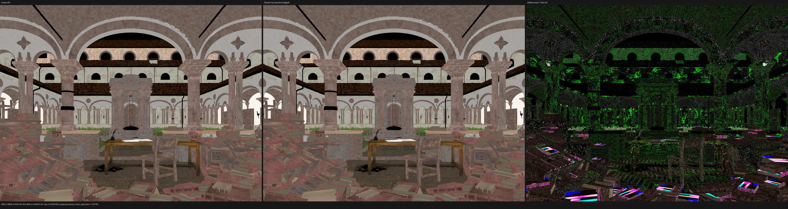

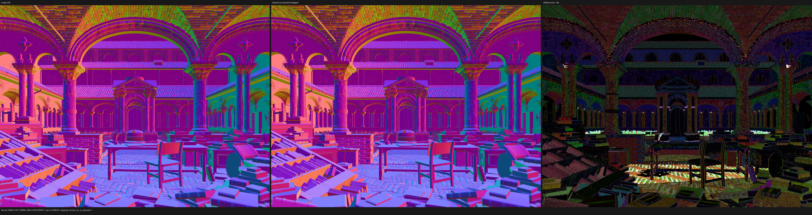

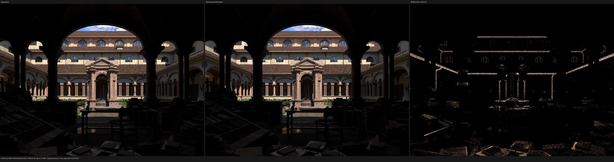

Reports: [Cycles versus Psycles](lone-monk/cycles-vs-psycles-report.json),
[previous versus current](lone-monk/prior-report.json), and
[benchmark manifest](lone-monk/benchmark.json).

### Classroom

The clock, doorway, lamps, blackboard, blinds, desks, cabinets, chairs, and
floor align. In particular, the clock and doorway no longer show a coherent
brightness excess against Cycles. Combined and Diffuse Indirect differences
are amplified finite-sample residuals; first-hit material and normal support
remain registered.

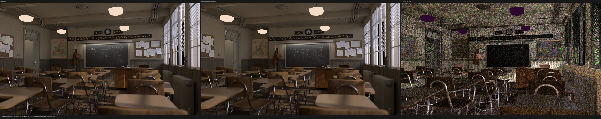

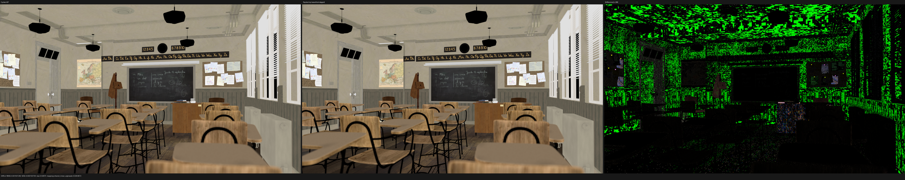

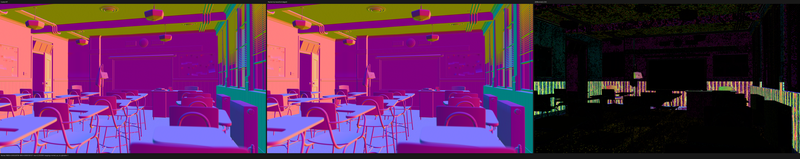

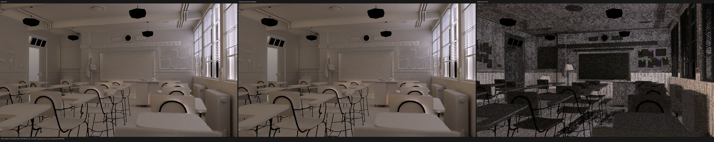

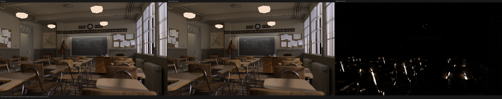

Reports: [Cycles versus Psycles](classroom/cycles-vs-psycles-report.json),
[previous versus current](classroom/prior-report.json), and
[benchmark manifest](classroom/benchmark.json).

### Flat Archiviz

The shelves, books, chair, sofas, beanbags, rug, floor, apertures, and window
image align. Fast GI restores the dark indirect support. Normal retains a
localized rug/upholstery residual and Glossy Direct remains low around bright
sources, but there is no new material-domain mismatch.

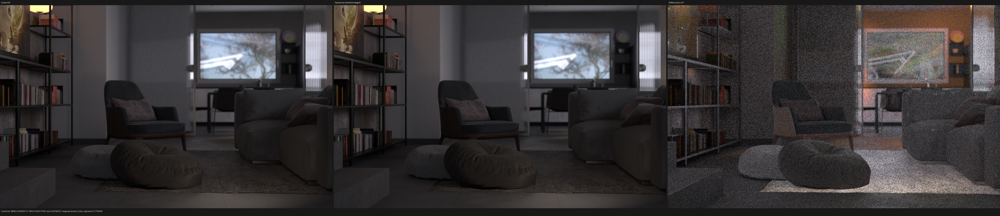

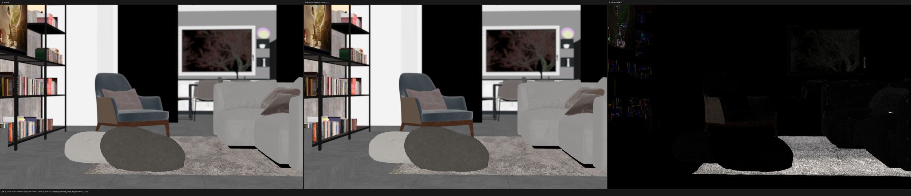

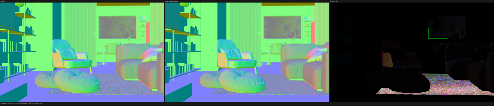

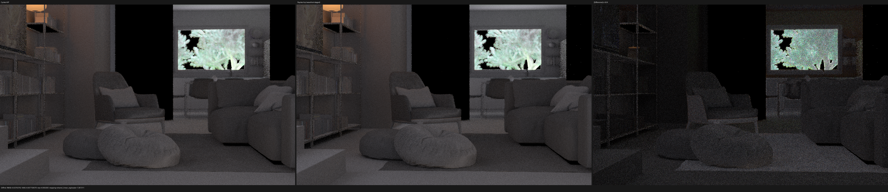

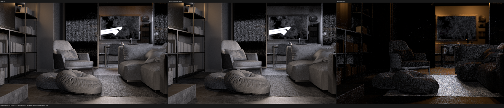

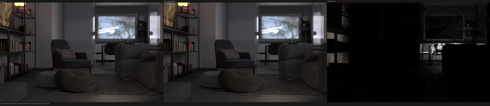

Reports: [Cycles versus Psycles](flat-archiviz/cycles-vs-psycles-report.json),
[previous versus current](flat-archiviz/prior-report.json), and
[benchmark manifest](flat-archiviz/benchmark.json).

## Input caveats

- The benchmark emits legacy Blender dependency-graph warnings for rope
  constraints, one MeshDeform vertex-count change, and five unavailable empty
  image references. Its fresh export contains 166 meshes, five curve
  geometries, 1,503,013 instances, 75 materials, and 52 images.
- Classroom's `dustbin_wireframe.png.001` has an invalid TIFF/MDI header.
- Splash crosses the 4 GiB geometry-stream boundary and produces a
  7,105,235,248-byte `geometry.bin`. Several large geometries select HIPRT
  `BalancedBuild` under memory pressure; this happens during excluded scene
  construction, and the final render has no invalid pixels.
- Barbershop retains the Cycles-shared missing `generic_scratches.png` and
  `guilder_ornament.png` assets. The former unused `agent_face_*` warnings are
  gone because their material is not reachable.
- Flat Archiviz refers to missing `three-lobe-vee.ies` data. Cycles reports the
  same missing source path; no replacement profile is synthesized.

These defects are recorded rather than used to excuse renderer-specific
differences.

## Reproduction topology

Each scene used the same command shape with its native dimensions:

```sh
python tools/run_scene_benchmark.py \
  --blender /home/mike/Projects/blender-install-5.2-hiprt/blender \
  --psycles-render build/bin/psycles_render_blender_scene \
  --blend SCENE.blend \
  --output-dir OUTPUT \
  --bundle FRESH_EXPORT \
  --cycles-gpu-device HIP \
  --cycles-gpu-device-name 'RX 9070 XT' \
  --skip-cycles-cpu \
  --psycles-backends hip \
  --psycles-schedulers wavefront-staged \
  --width WIDTH --height HEIGHT --samples 1024 \
  --max-samples-per-dispatch 64 \
  --compiler-tmp /var/tmp/psycles-fullres-hip-20260830/compiler-tmp
```

The source checkpoint had already passed the all-thread Release build, the
serial 85/85 HIP CTest gate, the focused reachable-domain regressions, and the
2,000-line first-party source-file audit before these scene runs. This document
records the post-reboot full-resolution scene gate; it does not claim that the
unit suite was rerun after the reboot.
