# Scalar Displacement semantics and full-resolution HIP validation

This checkpoint validates Psycles commit `bd7c634` with LuisaCompute commit
`10b4f6d` against the clean Blender 5.2.1 / Cycles commit `9e2066aef7ef` on an
AMD Radeon RX 9070 XT (`gfx1201`, HIP 7.2). It fixes a structural surface-SVM
error: Blender scalar Displacement nodes in `OBJECT` space were previously
lowered as if they were in `WORLD` space.

All seven scenes completed at their native validation resolutions with exactly
1024 samples, seed zero, adaptive sampling disabled, and denoising disabled.
Only the HIP backend was run. Vulkan and fallback remain deliberately deferred
until the remaining HIP image-parity failures are understood.

## Root cause and formal model

The old Blender graph normalizer erased the Displacement node's `Space` and
replaced every scalar node by

```text
world_normal * ((height - midlevel) * scale)
```

That expression is the Cycles `WORLD` endpoint, but it is not the `OBJECT`
endpoint under a non-uniform or sheared instance transform. The replacement
also erased whether the Normal input was linked, so the downstream IR could no
longer recover the missing semantics.

The fix preserves a first-class `psycles.displacement` value operation through
Blender normalization, typed surface IR, exact scheduling/dependency analysis,
the static evaluator, dynamic immediate evaluator, and both direct and
state-family SVM execution. It records four named operands (`height`,
`midlevel`, `scale`, and `normal`) plus `Space` and normal-linkage flags. An
unlinked Normal explicitly observes the current shading normal, so scheduling
cannot move it across a normal-changing operation.

Let `M` map object-space directions to world space and let the SurfacePoint
store the normal transform

```text
A = (M^-1)^T.
```

For scalar amount `h = (height - midlevel) * scale`, the exact Cycles 5.2
`OBJECT` endpoint is

```text
n_object = normalize(A^-1 * n_world) = normalize(M^T * n_world)
d_world  = A^-T * n_object * h       = M * n_object * h.
```

Psycles evaluates both inverse applications from the cofactors and determinant
of `A`; it does not infer the transform from unrelated geometry values. A
singular transform yields zero displacement. The `WORLD` endpoint deliberately
does not normalize a linked normal, matching Cycles.

The device regression uses both a non-uniform diagonal transform and a
non-symmetric shear. The shear is essential: a diagonal-only test cannot
distinguish inverse, transpose, row-major, and column-major mistakes. The
Blender import regression verifies that `Space=OBJECT` and the linked topology
survive normalization as the semantic node instead of the former ad hoc
subtract/multiply/vector-math expansion.

## Verification commands

The implementation was built with all host threads. The complete host plus HIP
test set was then run serially so concurrent HIP contexts could not distort the
result:

```sh
cmake --build build -j$(nproc)
ctest --test-dir build -E '(_fallback|_vk)$' --output-on-failure -j1
```

Result: `153/153` tests passed in 27.98 seconds. This includes the new
`psycles.blender_displacement_import` and `psycles.luisa_displacement_hip`
regressions, compact direct/state SVM coverage, the full displacement scene,
all light/film passes, and the source-size gate.

Each full scene used this runner shape:

```sh
python3 tools/run_scene_benchmark.py \
  --blender /home/mike/Projects/blender-install-5.2-hiprt/blender \
  --psycles-render build/bin/psycles_render_blender_scene \
  --blend <scene.blend> --bundle <current-export> --reuse-export \
  --output-dir <output> \
  --cycles-gpu-device HIP --cycles-gpu-device-name 'RX 9070 XT' \
  --skip-cycles-cpu --psycles-backends hip \
  --psycles-schedulers wavefront-staged \
  --width <native-width> --height <native-height> --samples 1024 \
  --max-samples-per-dispatch 64 \
  --compiler-tmp /var/tmp/psycles-compiler-tmp
```

The runner records the exact commands and identities in each scene's checked-in
`benchmark.json`. Psycles used one coroutine per `(pixel, sample)`, 64 samples
per host dispatch, a 1,048,576-frame capacity, fast math, and the staged surface
sort. Timings exclude export, scene/acceleration construction, shader JIT, EXR
conversion, comparison, and destruction.

## Exact path oracle

The formal counterexample is official Benchmark pixel `(1680, 394)`, sample
zero, at 2048x858 with a 1024-sample global Sobol domain. The first hit is the
same object, primitive, shader, and random path in Cycles and Psycles. It uses
`mat_rock_light2`, whose scalar Displacement is in `OBJECT` space.

The first-hit values are:

| implementation | barycentric u | barycentric v | shading normal |
|---|---:|---:|---|
| Cycles CPU | 0.416349173 | 0.071288802 | (0.196237788, -0.942865372, -0.269250214) |
| Cycles HIP | 0.416337311 | 0.071291156 | (0.195433140, -0.943054616, -0.269172460) |
| Psycles HIP, fixed | 0.416357249 | 0.071311422 | (0.199970275, -0.943687379, -0.263563991) |
| Psycles HIP, old | -- | -- | (0.072906323, -0.997210920, 0.015969368) |

The largest component error against Cycles HIP falls from approximately
`0.28514` to `0.005608`. Cycles CPU and HIP themselves differ by up to
`0.000805` in this bump normal because their intersection barycentrics differ,
so exact bit parity is not a valid accelerator-independent requirement. The
remaining Psycles error is still larger than the Cycles CPU/HIP spread and is
therefore retained as a numerical follow-up rather than dismissed as HIPRT
precision.

The new path reaches substantially more aligned state: the comparison checks
98 exact, 238 float, 27 random-exact, and 6 topology fields, versus 53 exact,
127 float, 16 random-exact, and 3 topology fields before the fix. Consequently
the raw failure count is not a monotone quality metric. The durable reports are
[Psycles vs Cycles HIP](benchmark/psycles-vs-cycles-hip-path-trace.json) and
[Cycles CPU vs HIP](benchmark/cycles-cpu-vs-hip-path-trace.json).

## Full-resolution image results

Relative RMSE is a percentage in linear EXR space. Every Psycles pass has zero
non-finite pixels. Cycles has 74 invalid Classroom Diffuse Direct pixels and 77
invalid Classroom Glossy Direct pixels; official Benchmark has 65/1/65/1 in
Diffuse Direct/Indirect and Glossy Direct/Indirect. Only reference-invalid
samples are masked.

| scene | resolution | Combined | Normal | Diffuse Color | Glossy Color |
|---|---:|---:|---:|---:|---:|
| Monster Under the Bed | 1024x1024 | 1.81477% | 0.01588% | 0.03672% | 0.02004% |
| Lone Monk | 1440x1080 | 1.16321% | 0.19832% | 0.07369% | 0.08715% |
| Classroom | 1920x1080 | 0.58188% | 0.09969% | 0.59161% | 0.01794% |
| Official Benchmark | 2048x858 | 20.70763% | 1.39296% | 0.31228% | 0.34552% |
| Flat Archiviz | 1800x1100 | 1.95636% | 7.15367% | 2.07958% | 1.30465% |
| Blender 4.1 Splash | 1920x1080 | 13.68011% | 1.60682% | 0.75085% | 2.36820% |
| Barbershop Interior | 2048x858 | 3.99921% | 0.34702% | 4.56205% | 0.18743% |

The change is localized as expected:

| scene/pass | before | after | interpretation |
|---|---:|---:|---|
| Classroom Combined | 0.66871% | 0.58188% | visible full-scene improvement |
| Classroom Normal | 0.98658% | 0.09969% | 9.9x lower normal error |
| Benchmark Normal | 4.28670% | 1.39296% | object-space bump structure fixed |
| Benchmark Diffuse Color | 3.56487% | 0.31228% | material color now closely aligned |
| Benchmark Glossy Color | 1.95762% | 0.34552% | material color now closely aligned |
| Barbershop Combined | 4.39444% | 3.99921% | coherent improvement |
| Barbershop Normal | 3.19894% | 0.34702% | 9.2x lower normal error |
| Barbershop Glossy Color | 0.81094% | 0.18743% | coherent improvement |

Monster, Lone Monk, Flat Archiviz, and Splash are numerically unchanged within
run-to-run floating-point noise, demonstrating that scenes which do not use the
affected endpoint did not regress.

Official Benchmark remains a strict failure despite the corrected surface
passes. Diffuse Direct is 32.78% relative RMSE with a 0.90372 mean-luminance
ratio; Glossy Direct is 53.51% with a 0.83348 ratio. Its characters, sheep,
tree, and ground therefore remain coherently under-lit. This is a separate
light-sampling/BSDF-light-evaluation/visibility/MIS problem, not justification
to change the now-formal displacement implementation.

Splash also remains a strict failure at 13.68% Combined. Its direct mean energy
is close to Cycles while its glossy high-energy tail differs, so it remains a
distribution/transport investigation. Flat Archiviz still references the
missing `three-lobe-vee.ies`; neither renderer has a valid source for that IES
profile, and Psycles does not yet lower the four `TEX_IES` nodes. It is not an
IES-support validation.

## Render-only performance

| scene | Cycles HIP | Psycles HIP | Psycles/Cycles | gap |
|---|---:|---:|---:|---:|
| Monster Under the Bed | 58.073 s | 76.890 s | 1.3240x | +32.40% |
| Lone Monk | 56.604 s | 78.066 s | 1.3792x | +37.92% |
| Classroom | 83.916 s | 133.302 s | 1.5885x | +58.85% |
| Official Benchmark | 120.207 s | 133.894 s | 1.1139x | +11.39% |
| Flat Archiviz | 115.634 s | 167.857 s | 1.4516x | +45.16% |
| Blender 4.1 Splash | 210.891 s | 389.311 s | 1.8460x | +84.60% |
| Barbershop Interior | 127.593 s | 216.093 s | 1.6936x | +69.36% |

The identical seven-scene workload totals 772.917 seconds in Cycles and
1195.413 seconds in Psycles, or `1.5466x` total time (`+54.66%`). The preceding
single-repeat matrix was `1.5337x`. Per-scene Psycles movement ranges from
`-1.08%` to `+2.84%`; unaffected Splash is the largest positive movement while
affected Benchmark is unchanged and Barbershop is 1.08% faster. This does not
support attributing either a speedup or regression to the displacement change.
The renderer is still substantially short of the Cycles performance target.

Steady-state checks confirmed the intended RX 9070 XT. Benchmark reached 100%
busy at about 278 W after queue fill. Splash reached 100% at about 241 W.
Barbershop remained scene-specifically lower at about 85% and 195 W, consistent
with the existing scheduler/kernel-mix utilization gap rather than a fallback.

## Visual inspection

All generated triptychs were opened at original resolution. Checked-in images
are 50% previews; panels are Cycles HIP, Psycles HIP, and amplified absolute
difference from left to right.

### Monster Under the Bed

The BSSRDF monster, child, bed, floor, eyes, teeth, and all material boundaries
align. The residual is noise-like rather than a missing closure.

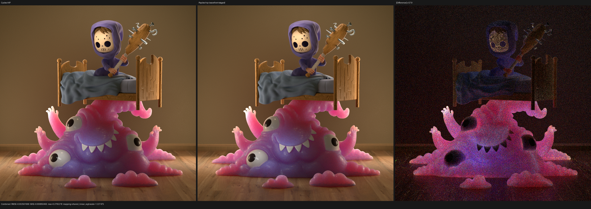

### Lone Monk

Grass bands, arches, stone, books, furniture, and silhouettes align. No UV,
instance-transform, or grass-support regression is visible.

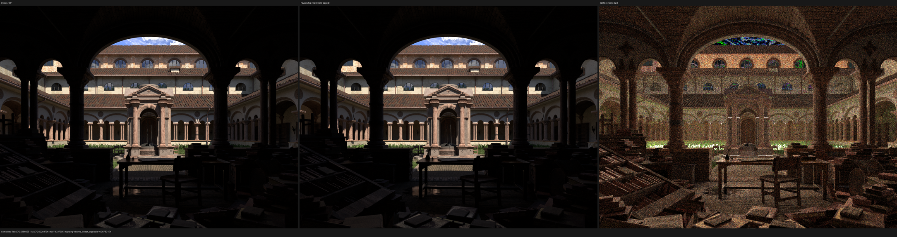

### Classroom

Clock, doorway, lamps, blinds, board, desks, cabinets, chairs, and floor align.
The former coherent normal residual is gone; remaining Combined differences
are small illumination/noise features.

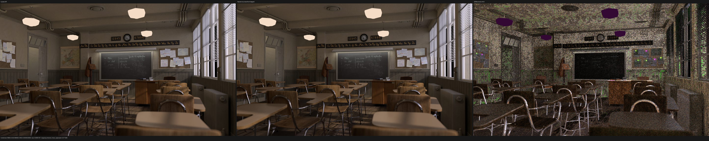

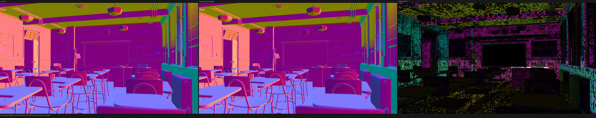

### Official Benchmark

Geometry, UVs, hair/grass support, and surface colors align much more closely.
The man, sheep, tree, rocks, and ground remain coherently darker in Combined,
matching the transport-pass energy deficit above.

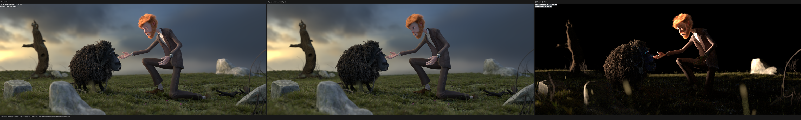

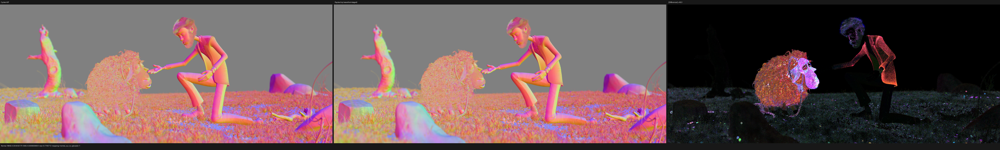

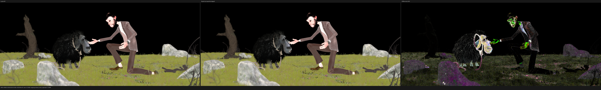

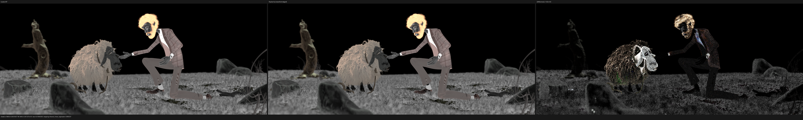

### Flat Archiviz

Room geometry, furniture, shelves, books, window, and texture registration
align. The missing-IES limitation remains.

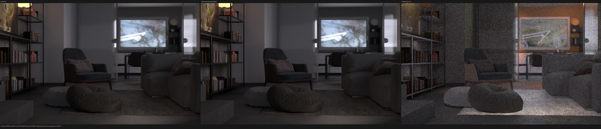

### Blender 4.1 Splash

Room shell, stairs, fireplace, slats, art, furniture, carpet, branches, and
kitchen align. The broad high-frequency/high-energy transport residual is
unchanged.

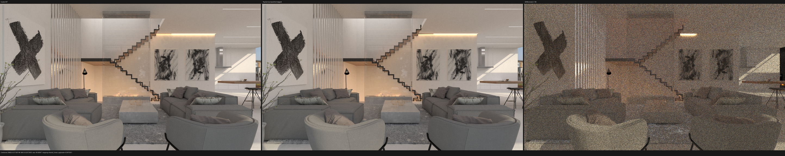

### Barbershop Interior

The wood-floor texture and black gaps, left cabinet, bottles, brick wall,
ceiling beams, frames, right cabinet, chairs, and newspaper all align. The
normal improvement is visually coherent. Remaining error is concentrated in
indirect transport and a few material-color responses, not handedness, UVs, or
export topology.

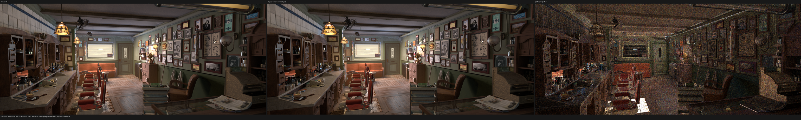

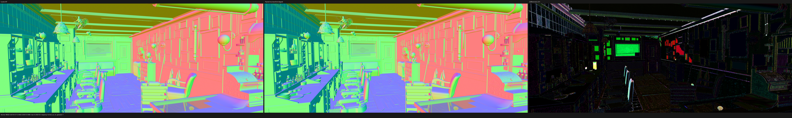

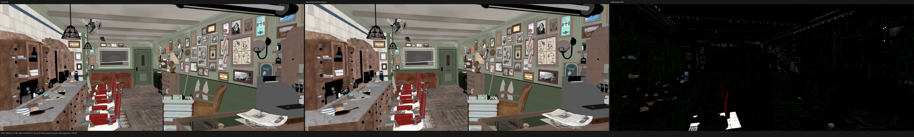

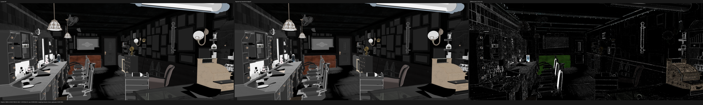

## Next HIP boundary

The HIP execution matrix is green, but strict image parity is not. The next
formal counterexample remains a Benchmark path after the now-aligned surface
closure values. It must compare, in order, emitter identity and selection
measure, sampled light geometry/PDF, BSDF value/PDF, shadow
visibility/transmittance, MIS weight, and the unclamped/clamped contribution.
No Vulkan or fallback performance run should precede resolving that structural
HIP transport deficit.
