# XIR enclosing-boundary preservation and full-resolution HIP validation

This checkpoint validates the Psycles repair sequence through `cd397f9` with
LuisaCompute `next@10b4f6dbd` on the Radeon RX 9070 XT (`gfx1201`, ROCm/HIP
`7.2.53211`). The reference renderer is Blender 5.2.1 / Cycles
`9e2066aef7ef`. Only HIP was launched. Vulkan and fallback remain gated on
completion of the HIP work.

## Verdict

- The XIR coroutine restructuring defect that skipped the first valid ribbon
  interval is fixed at the CFG transformation boundary, not patched in the
  curve intersector or in Psycles scene code.
- The complete Luisa XIR suite passes `60/60`, the HIP coroutine state-machine
  suite passes `26/26` with 313 assertions, and the complete Psycles HIP suite
  passes `85/85`.
- The original 2048x858 sample-zero failure now commits the same unique ribbon
  interval as Cycles. Psycles obtains `(u, v) = (0.361166, 0.858516)` and
  Cycles obtains `(0.361174, 0.858687)`.
- All seven established complex scenes plus a newly re-exported active
  heterogeneous-volume scene complete at native/full-HD resolution and 1024
  fixed samples, write multilayer EXR, and contain no invalid Psycles pixels.
- A post-restart impact audit proves that the new particle-hair color path is
  active only in the official benchmark among the established curve scenes.
  Exact-build Barbershop and Splash exports retain empty curve-color demand;
  both pass native-resolution HIP load/render canaries. A fresh 1024x1024,
  1024-spp Monster negative control reproduces the prior output to
  `1.8938e-10` multilayer-EXR RMS.
- Monster, Lone Monk, and Classroom remain close to Cycles. Barbershop is
  structurally aligned but still differs in indirect transport. Flat Archiviz
  retains a Normal/bump mismatch. The official benchmark retains hair/wool
  closure and transport residuals. Splash retains broad indirect and glossy
  transport residuals. These strict failures are not hidden by the successful
  runtime gate.
- Psycles is not yet faster than Cycles. Across this matrix it is 1.076x to
  1.837x as slow. The same-run active-volume result is 1.218x as slow.

## Formal XIR failure and repair

Let a structured construct be represented by an entry block `H`, a merge
block `M`, and a boundary set `B`. During restructuring, a nested construct
may propose an entry `E` that is already a boundary of an enclosing construct.
The previous algorithm cloned `E` and redirected the nested predecessor to the
clone. When `E` carried an enclosing loop update, the clone copied that update
payload. One logical iteration therefore executed the update twice. In the
Psycles ribbon loop this advanced the subdivision index from 4 to 6 and
skipped subdivision 5, the only valid hit.

The enclosing relation is computed with the sparse dominator relation rather
than a scene- or opcode-specific rule. For an outer construct `(Ho, Mo)` and a
nested entry `H`, the outer construct encloses `H` exactly when

```text
Ho strictly-dominates H && Mo does not strictly-dominate H.
```

If the proposed nested entry `E` belongs to an enclosing boundary set, the
repair subdivides the incoming edge:

```text
H -> E    becomes    H -> Q -> E
```

where `Q` is a fresh empty block. It never clones the payload of `E`.

The proof obligations are:

1. **Path bijection:** replacing edge `(H, E)` with `(H, Q), (Q, E)` gives a
   one-to-one mapping between pre- and post-transform execution paths.
2. **Payload preservation:** `Q` is empty, so every instruction in `E`
   executes in the same order and exactly the same number of times.
3. **Boundary separation:** `Q` is a distinct entry for the nested construct,
   while `E` remains the enclosing construct's boundary.
4. **Termination:** the number of nested-entry/enclosing-boundary aliases
   strictly decreases and no new alias is introduced for an existing
   boundary.

This is recorded in Luisa's pass-correctness audit. The implementation is
factored into a 121-line `.cpp` and 37-line `.h` analysis helper. The legacy
`restructure_cfg.cpp` is still 10,421 lines and remains explicit refactoring
debt; this fix did not disguise the old file as an `.inl` split.

## Regression gates

The fix is pinned at three independent levels:

- A backend-independent XIR regression proves that an enclosing boundary
  payload retains exactly two stores after restructuring.
- A HIP coroutine state-machine regression executes a nested break/update
  case and requires the final value 5, proving one update per iteration.
- `psycles_luisa_curve_ribbon_tests` contains both ordinary-kernel and
  coroutine reductions of the real unique-valid-interval curve. Both require
  the Cycles interval and reject the previously skipped result.

Disabling the boundary repair makes both the pure-XIR and HIP runtime
regressions fail. Restoring it makes the complete suites pass:

```text
cmake --build build --parallel "$(nproc)"
# passed; incremental confirmation had no unfinished work

ctest --test-dir third_party/LuisaCompute/build-codex-xir \
  --output-on-failure -R unit_xir
# 60/60 passed

third_party/LuisaCompute/build-tests-hip/bin/test_coro_state_machine hip
# 26/26 passed, 313 assertions

build/bin/psycles_luisa_curve_ribbon_tests hip
# passed

ctest --test-dir build --output-on-failure -j 1 -R '_hip$'
# 85/85 passed in 23.00 s
```

## Real-scene sample-zero trace

The trace uses the official benchmark camera at 2048x858, global sample zero
inside the full 1024-sample Sobol domain, seed zero, and the production staged
wavefront path. The total sample domain remains 1024 because reducing it to
one changes the Sobol sample itself.

```text
ray P = ( 3.062950611, -4.760425091, 0.193358243)
ray D = (-0.970721602,  0.007022469, 0.240104675)

Psycles: distance=2.875350952 u=0.361165702 v=0.858515978 valid=1
Cycles:  distance=2.875350475 u=0.361174196 v=0.858687282 valid=1
```

The remaining parameter error is small floating-point drift. The structural
error was the different subdivision identity; that error is gone. The complete
device trace is [reports/ribbon-trace.json](reports/ribbon-trace.json).

## Legacy Hair conditional-support repair

Tracing wool pixel `(544, 380)` at global sample zero exposed a second,
independent structural failure after the ribbon interval was repaired. Both
renderers selected closure 1, legacy Hair Transmission, with the same closure
random numbers. Cycles accepted the sample and continued to bounce one, while
Psycles replaced its positive conditional PDF with zero and terminated the
path. The generated direction was valid for Cycles' longitudinal Hair sampler
but lay on the evaluation-side of `ShaderClosure::N`.

Let `I` be the selected closure, `P(I=i)=s_i/S`, and let `V_i(w)` denote the
support predicate implemented by conditional sampler `p_i(w)`. The composed
one-sample estimator is valid on exactly

```text
(I = i) and V_i(w).
```

The old `finish()` added a family-independent geometric predicate `G(w)` and
therefore sampled `p_i(w) 1[G(w)]`. This is equivalent only if
`V_i(w) => G(w)` for every closure family. Cycles' legacy Hair sampler is a
constructive counterexample: its sampling support is defined by longitudinal
angle bounds and deliberately does not apply the normal-side predicate used by
arbitrary-direction Hair evaluation.

The repair makes each conditional sampler the sole owner of its support.
Diffuse, translucent, rough-translucent, velvet, and Sheen retain their
Cycles-compatible geometric-normal tests inside their own samplers;
Transparent and legacy Hair retain their distinct support rules. The selected
Hair term uses the sampler result, while other mixture terms still use the
arbitrary-direction evaluation predicate. A ribbon Hair Transmission
regression pins the counterexample: the incoming direction is on the front
side, the sampled transmission direction has `dot(N, wo) > 0`, and the sample
must remain valid.

The production trace after the repair records label 9 and reaches bounce one.
Its selected conditional value is numerically aligned with Cycles:

```text
                         Cycles                 Psycles
wo.x                  -0.253024459           -0.253011256
wo.y                   0.954300523            0.954313517
wo.z                   0.159025207            0.158967823
BSDF.r                  0.000627175            0.000627140
BSDF.g                  0.000518232            0.000518213
BSDF.b                  0.000448958            0.000448946
label                            9                       9
next bounce                      1                       1
```

The remaining PDF difference, `0.003009085` versus `0.003556651`, is not a
Hair Transmission sampling error. The trace localizes it to the categorical
measure: closure 2, Hair Reflection, has a different populated weight. That
SVM/material-input mismatch remains the next strict HIP target.

After the repair, a full parallel build and the serialized HIP suite pass:

```text
cmake --build build --parallel "$(nproc)"
# passed

ctest --test-dir build --output-on-failure -j 1 -R '_hip$'
# 85/85 passed in 20.29 s
```

## Particle-hair color projection repair

The remaining wool mismatch was not closure arithmetic. Cycles shader index
48 maps to `franck_wool_brown_furcoat`; its Hair Reflection weight is an ADD
Mix whose factor is the named emitter attribute `hair_tip_color`. Psycles had
exported particle-hair UVs but no color attributes, so the SVM correctly read
the missing attribute as zero and evaluated only the first Mix input.

Blender/Cycles 5.2.1 defines the required geometry lifting in
`intern/cycles/blender/curves.cpp`: it enumerates every CORNER/BYTE_COLOR
attribute, retains the original `vcol_num`, filters by `need_attribute`, calls
`BKE_particle_mcol_on_emitter` once per strand, converts RGB from sRGB to
linear Rec.709, and stores a `TypeRGBA/ATTR_ELEMENT_CURVE` array. The kernel
then indexes that array by curve identity. Psycles now implements the same raw
geometry contract; it does not pre-evaluate a shader node or closure.

Formally, let

```text
C = [c_i | domain(c_i) = CORNER and type(c_i) = BYTE_COLOR]
D = the static named-attribute demand of the hair geometry's materials
N = number of exported strands
```

For every `c_i` whose name is in `D`, the exporter constructs exactly

```text
A_i[k] = (srgb_to_linear(BKE_particle_mcol_on_emitter(k, i)), 1),
          0 <= k < N.
```

Filtering happens after `i` is assigned from the complete eligible sequence;
otherwise dropping an unrelated attribute would silently retarget every later
`mcol_on_emitter` query. The scene contract requires `|A_i| = N` and finite
RGBA components. HIP uploads each retained `A_i` as a float4 binding with
`id = attribute_id(name)`, `domain = curve`, and resolves a hit through
`segment.curve_index`. Thus the exported index, curve-domain cardinality, and
device lookup form one commuting identity map from the Blender emitter sample
to the Luisa SVM input.

The exact production trace uses wool pixel `(544, 380)`, global sample zero in
the 1024-sample Sobol domain, and the staged wavefront path. It closes the
previous structural discrepancy:

| quantity | missing attribute | repaired Psycles | Cycles 5.2.1 HIP |
|---|---:|---:|---:|
| Hair Reflection weight R | 0.064140178 | 0.109573483 | 0.109574236 |
| Hair Reflection weight G | 0.060643360 | 0.083427072 | 0.083428346 |
| Hair Reflection weight B | 0.056973599 | 0.070447929 | 0.070449308 |
| mixed BSDF PDF | 0.003556651 | 0.003008994 | 0.003009085 |
| post-sample throughput R | structurally divergent | 0.208421901 | 0.208426997 |

The permanent regression chain covers five independent boundaries:

1. Blender calls the RNA `mcol_on_emitter` oracle and verifies float32 sRGB
   conversion, one value per strand, and omission of an unused color layer.
2. Bundle import round-trips a curve float4 attribute.
3. Contract validation checks curve cardinality and finite components.
4. Attribute residency proves reachable UV/color retention, unreachable
   pruning, binding counts, and byte counts.
5. The HIP callable test resolves float2 UV and float4 color bindings through
   two curve identities and compares shared-callable and direct lookup paths.

After removing unrelated whole-file formatting churn, the final gates are:

```text
cmake --build build --parallel "$(nproc)"
# passed

ctest --test-dir build --output-on-failure -j 1 \
  -R 'psycles\.(curve_geometry_upload|blender_curve_import|attribute_residency|luisa_attribute_lookup_callable_hip)$'
# 4/4 passed in 0.58 s

blender --background --factory-startup \
  --python tests/test_blender_export_particle_hair.py -- \
  tools/export_psycles_scene.py
# Psycles native particle-hair export regression passed

ctest --test-dir build --output-on-failure -j 1 -R '_hip$'
# 85/85 passed in 23.20 s (warm cache)
```

## Post-restart particle-hair impact gate

The exact Blender build was used to re-export both established legacy-curve
scenes after the workstation restart. This is an impact-set proof, not a
guess based on whether a scene merely contains curves:

| scene | curve counts | requested curve colors | current HIP gate | render-only |
|---|---:|---:|---|---:|
| Official benchmark | affected legacy hair | nonempty | 2048x858, 1024 spp | 134.086 s |
| Barbershop | 21,800 + 21,800 + 21,800 + 5,000 | 0 + 0 + 0 + 0 | 2048x858, 1-spp canary | 0.468 s |
| Splash | 150,000 + 150,900 | 0 + 0 | 1920x1080, 1-spp canary | 0.666 s |

The Barbershop canary builds the real 338-program/8,601-record SVM and its
1,055 geometries. Splash reports named-attribute residency of exactly
`0/570` bindings and `0/6,188,547,168` candidate bytes. Thus neither scene
executes or uploads the new curve-color data, and repeating their expensive
1024-spp integrations would measure the same shader and geometry payload.

Monster provides the full no-curve negative control on the current binary:

```text
resolution / samples       1024x1024 / 1024 fixed spp
Psycles HIP render-only    76.8031 s
Cycles HIP render-only     58.1790 s
Psycles / Cycles           1.3201x (+32.01%)
Combined relative RMSE     1.81477%
Combined luminance ratio   1.002918
invalid Psycles pixels     0 in every requested AOV
```

The fresh multilayer EXR and the preceding Psycles full render have different
container hashes, as expected for independently written files, but an exact
pixel comparison gives RMS `1.8938e-10`, maximum absolute error
`4.7684e-7`, and only 0.484% non-bit-identical pixels. The changed values are
isolated last-bit differences from nondeterministic floating atomic
accumulation order; there is no changed image support, SVM program, material,
or attribute binding. The complete machine-readable impact record is
[particle-hair-color-impact-gate.json](reports/particle-hair-color-impact-gate.json).

## Full-resolution HIP matrix

Every render uses 1024 fixed samples, seed zero, Tabulated Sobol, adaptive
sampling off, denoising off, 64 samples per dispatch, 1,048,576 coroutine
frames, staged surface sorting, no staged direct-light queue, and fast math.
Scene construction, HIPRT build, JIT, EXR writing, comparison, and destruction
are excluded from render-only time.

Six established-scene Cycles timings are the retained Blender 5.2.1
references for the exact same exported scenes and device. They predate the
workstation restart, so small before/after timing changes are observations
rather than isolated speedups. Classroom was rerun after the restart and
matched its retained 83.927 s reference within 0.06%. Classroom and the volume
row therefore have same-boot Cycles measurements; the volume row was rendered
by Cycles and Psycles in one runner invocation.

| scene | resolution | Cycles HIP | Psycles HIP | Psycles/Cycles | gap |
|---|---:|---:|---:|---:|---:|
| Official benchmark | 2048x858 | 119.236 s | 134.086 s | 1.1245x | +12.45% |
| Monster Under the Bed | 1024x1024 | 58.179 s | 76.803 s | 1.3201x | +32.01% |
| Lone Monk | 1440x1080 | 56.759 s | 78.022 s | 1.3746x | +37.46% |
| Classroom | 1920x1080 | 83.977 s | 132.045 s | 1.5724x | +57.24% |
| Flat Archiviz | 1800x1100 | 115.202 s | 176.975 s | 1.5362x | +53.62% |
| Barbershop Interior | 2048x858 | 129.150 s | 214.924 s | 1.6641x | +66.41% |
| Blender 4.1 Splash | 1920x1080 | 208.703 s | 383.427 s | 1.8372x | +83.72% |
| Heterogeneous volume | 1920x1080 | 79.106 s | 96.334 s | 1.2178x | +21.78% |

Classroom was repeated after all scene caches were warm: 134.360 s and
132.045 s. The 1.72% spread is retained rather than selecting the faster value
as a claimed optimization. Representative main-render samples reached 100%
GPU busy. Observed package power was approximately 227 W for Monster, 240 W
for Lone Monk, 241--242 W for Classroom, 220--221 W for Flat Archiviz,
218--220 W for Barbershop, 236--239 W for Splash, 261--267 W for the official
benchmark, and 213 W for the active-volume scene. No run used the wrong device
or exhibited a persistent low-utilization tail.

The benchmark row is the post particle-hair-color exact-build run. The first
full run used a different patched Blender 5.2.1 build and is retained only as
a diagnostic; it took 133.943 s. Re-exporting with the exact Cycles-reference
build hash `9e2066aef7ef` took 134.086 s, a 0.11% spread. Compared with the
pre-color 128.305 s row, evaluating the newly correct curve-domain attributes
costs about 4.5%. This is a measured feature cost, not a performance gain, and
is the next attribute-lookup optimization target. During the exact run the RX
9070 XT reached 100% busy, 3212 MHz shader clock, PCIe x16, and a 305 W package
power sample.

## Runtime program and frame sizes

Surface SVM program topology is deduplicated before upload. The table records
the actual production program domain and coroutine ABI selected for each
scene, not source-node counts or a pre-expanded shader AST.

| scene | SVM programs | records | max program / stack lanes | coroutine frame |
|---|---:|---:|---:|---:|
| Benchmark | 118 | 2,572 | 143 / 38 | 520 B / 126 fields / 9 routines |
| Monster | 34 | 363 | 48 / 22 | 496 B / 120 fields / 9 routines |
| Lone Monk | 46 | 496 | 62 / 24 | 440 B / 105 fields / 7 routines |
| Classroom | 114 | 1,378 | 71 / 20 | 440 B / 105 fields / 8 routines |
| Flat Archiviz | 108 | 1,331 | 119 / 20 | 496 B / 120 fields / 9 routines |
| Barbershop | 338 | 8,601 | 210 / 33 | 864 B / 182 fields / 9 routines |
| Splash | 96 | 934 | 79 / 21 | 464 B / 111 fields / 8 routines |
| Heterogeneous volume | 4 | 7 | 2 / 0 | 848 B / 176 fields / 9 routines |

Barbershop and active volume remain the largest frame-pressure cases. The
volume result in particular shows that a tiny four-program SVM does not imply
a small continuation frame; volume transport state, not surface graph
expansion, dominates that 848-byte ABI.

## Numerical comparison

All metrics compare linear multilayer EXR channels. Relative RMSE is shown as
a percentage. Every listed Combined pass has zero invalid Psycles pixels.

| scene | Combined | luminance ratio | Diffuse Color | Glossy Color | Transmission Color | Normal |
|---|---:|---:|---:|---:|---:|---:|
| Benchmark | 20.5486% | 0.967275 | 3.5651% | 1.9600% | 0.5416% | 4.2853% |
| Monster | 1.8148% | 1.002918 | 0.0367% | 0.0200% | 0.0000% | 0.0159% |
| Lone Monk | 1.1625% | 1.000754 | 0.0737% | 0.0872% | 0.0000% | 0.1983% |
| Classroom | 0.6687% | 0.999389 | 0.5916% | 0.0179% | 0.0083% | 0.9866% |
| Flat Archiviz | 1.9564% | 0.994650 | 2.0796% | 1.3046% | 0.0037% | 7.1537% |
| Barbershop | 4.3944% | 1.004749 | 4.6037% | 0.8109% | 0.0743% | 3.1989% |
| Splash | 13.6801% | 0.991394 | 0.7509% | 2.3682% | 0.0027% | 1.6068% |
| Heterogeneous volume | 0.0296% | 0.999998 | 0.0000% | 0.0000% | 0.0000% | 0.0000% |

The active-volume scene has Volume Direct relative RMSE `0.02962%`, mean
absolute error `1.0833e-5`, p99 pixel RMSE `2.7697e-4`, and zero invalid
pixels. Volume Indirect is exactly zero in both renderers, so this run validates
heterogeneous direct volume transport but not nonzero indirect volume energy.
The source file was authored by a newer Blender development build; Blender
5.2.1 emitted a compatibility warning while loading it. Both the Cycles
reference and Psycles export came from that same 5.2.1 load, and the retained
graph is the original Volume closure rather than a baked coefficient field.

Complete reports are under [reports](reports/).

## Visual inspection

Every source triptych was opened at full generated resolution. The committed
images below are 50% previews with Cycles, Psycles, and amplified absolute
difference panels.

### Official benchmark

Camera, terrain, rocks, grass, character silhouettes, and sheep support align.
The curve-color repair restores the wool's authored glossy color: Glossy Color
relative RMSE falls from 10.1168% to 1.9600%, and its luminance ratio improves
from 0.974153 to 0.997511. The Combined result improves more modestly from
21.4339% to 20.5486%. Visual inspection confirms that the old nearly uniform
wool lobe is gone; the remaining amplified difference is concentrated in
direct/indirect illumination on the character, sheep, tree, and rocks rather
than missing graph color. Normal residuals remain coherent on hair, wool,
rocks, and parts of the character.

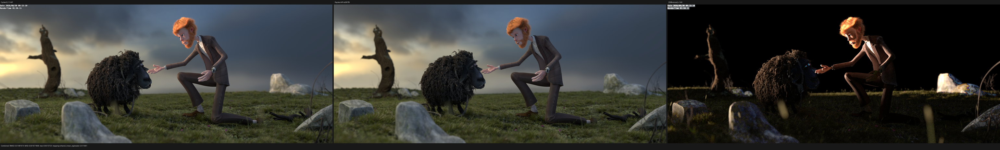

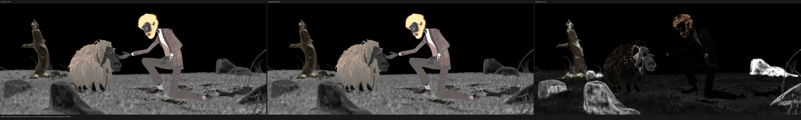

### Monster Under the Bed

The SSS monster silhouette and color gradients, child, bed, wood grain, floor,
and shadows align. Combined, Diffuse Color, and Normal were reopened from the
fresh post-restart 3088x1094 triptychs at original resolution. The amplified
Combined difference is predominantly stochastic transport noise; Diffuse
Color and Normal show matching support with only tiny boundary/last-bit
residuals.

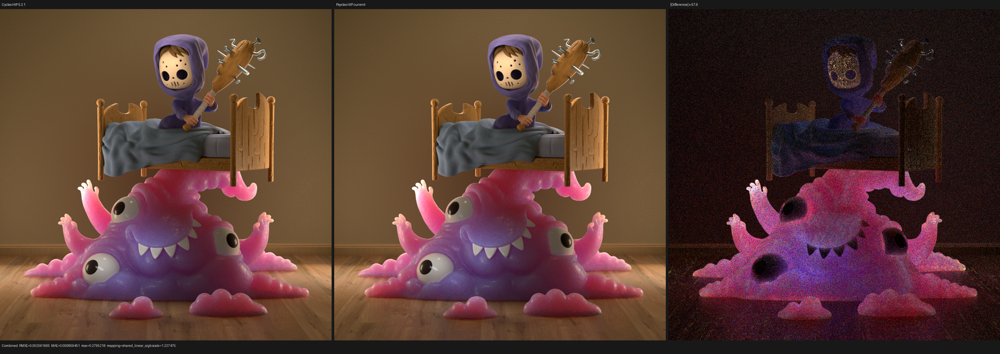

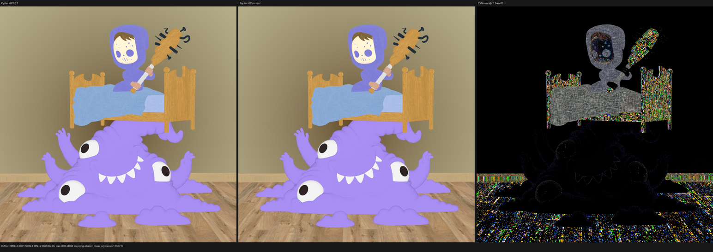

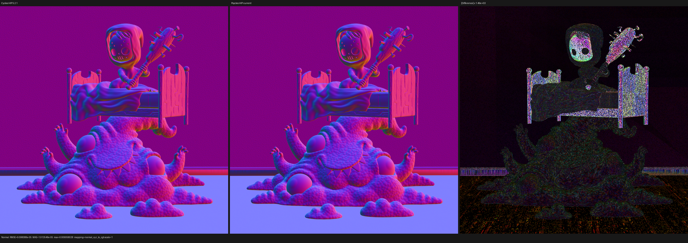

### Lone Monk

Arches, courtyard facade, grass, desks, books, and the deep interior shadow
support align. No grass-card, transform, or alpha-cutout mismatch is visible.

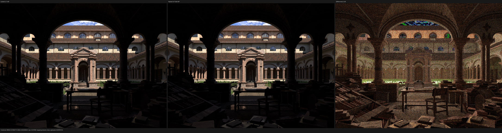

### Classroom

The clock, doorway, lamps, blinds, blackboard, desks, chairs, and wall panels
align. The previously suspicious clock/door brightness is not a structural
current-render mismatch.

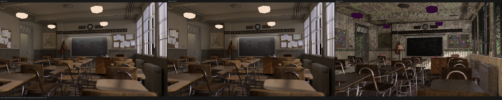

### Flat Archiviz

Walls, shelving, books, chairs, sofa, glass door, floor, and screen support
align. The Normal panel still exposes coherent floor, upholstery, and screen
surface residuals and remains a strict material/bump failure.

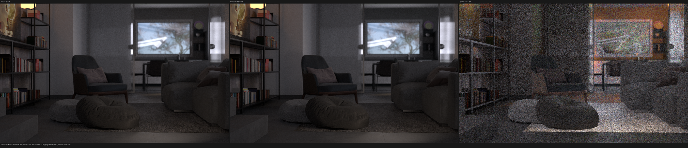

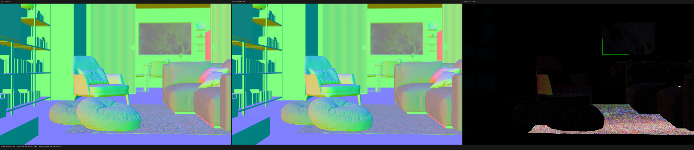

### Barbershop Interior

The parquet floor including black glossy gaps, tiled/brick wall, ceiling
beams, left cabinet wood/glass/bottles/knobs, right cabinet, chairs, frames,
and foreground newspaper align. Diffuse Color confirms that the old apparent
UV/transform/diffuse-substitution failure is absent. Indirect-light residuals
remain measurable.

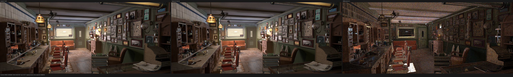

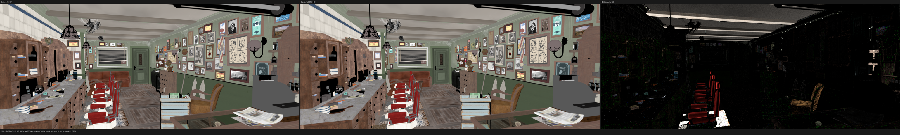

### Blender 4.1 Splash

Room shell, stairs, fireplace, slats, paintings, furniture, carpet, branches,
and kitchen support align. Combined remains broadly different in indirect and
glossy transport. Normal support is aligned, with residual energy concentrated
on carpet/upholstery and fine surface response.

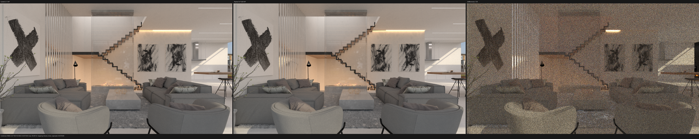

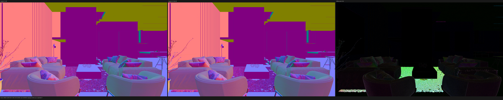

### Active heterogeneous volume

The full-HD direct-volume gradient is visually indistinguishable at normal
exposure. The difference panel requires strong amplification and contains no
orientation, boundary, density-support, or lighting-structure mismatch.

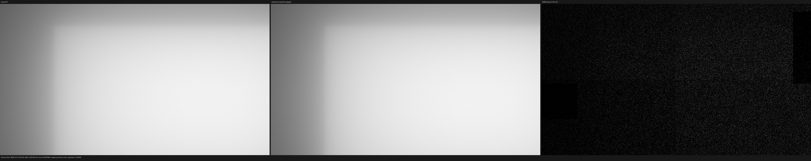

## Remaining HIP work

The HIP runtime gate is complete, but strict Cycles parity is not. Work should
continue in this order:

1. isolate official-benchmark hair/wool closure and indirect-transport
   residuals with exact SVM state/closure traces;
2. isolate Splash indirect/glossy path differences and Flat Archiviz
   Normal/bump differences;
3. compare the slow scenes kernel-by-kernel against Cycles HIP, prioritizing
   Splash, Barbershop, Classroom, and Flat Archiviz;
4. reduce the 864-byte Barbershop and 848-byte volume continuation frames by
   moving/recomputing state across proven hourglass cut points; and
5. add a nonzero Volume Indirect full-resolution fixture before claiming
   complete volume-pass parity.

Vulkan and fallback were not launched during this checkpoint.
