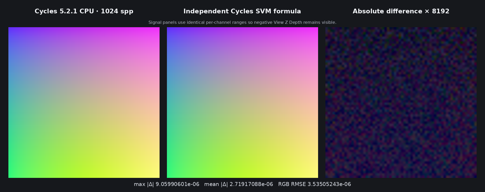

# Cycles 5.2 SVM Camera Data validation

Date: 2026-09-01

## Scope

This milestone copies Blender Cycles 5.2.1's `CameraNode` into the Luisa SVM
path. It covers the exact raw Blender socket contract, one shared semantic
node for all three outputs, the Cycles bytecode payload and output-liveness
masks, camera-space evaluation, and dispatch through the real SVM
program-counter loop.

The representation remains the original shader graph. Blender exports the
raw Camera Data node and Psycles emits its typed SVM instruction; no closure,
material, or camera output is pre-rendered or baked.

This remains a node-level SVM milestone. The copied interpreter is not yet the
production path-tracer material evaluator; the remaining Cycles SVM families
must be migrated before that switch. In particular, the old production
`surface_program` path does not implement Camera Data and is deliberately not
being extended with a second, divergent evaluator.

Pinned references:

- Cycles 5.2.1 source: `9e2066aef7ef7e20c142ad7bd3303138a4304c93`
- diagnostic-only Cycles bytecode dumper:
  `cb168525138fecc792cc393f94afc39582b0103c`
- Psycles parent revision: `640ef787372df77aca812def580be903333240ef`

## Structural correspondence

Blender's raw `CAMERA` node has no inputs and exactly these outputs:

| Output | Psycles type | Cycles payload field |
| --- | --- | --- |
| `View Vector` | vector | `vector_offset` |
| `View Z Depth` | float | `zdepth_offset` |
| `View Distance` | float | `distance_offset` |

After `NODE_CAMERA`, Psycles emits the exact one-word Cycles `SVMNodeCamera`
payload. Its low three bytes contain those stack offsets in table order and
the high byte is padding. `SVM_STACK_INVALID` independently disables each
store.

The external Cycles stream contains `NODE_CAMERA` at global word 89 and the
payload at word 90:

```text
word 89: 0000003c
word 90: 00040300
```

Thus the external all-live offsets are View Vector `0`, View Z Depth `3`, and
View Distance `4`. Permanent regressions also freeze the three independent
output masks:

```text
View Vector only:   00ffff00
View Z Depth only:  00ff00ff
View Distance only: 0000ffff
```

The Blender adapter interns all three raw output sockets through one shared
output key. Consequently, a graph that consumes all outputs contains one
semantic Camera Data node and emits exactly one `NODE_CAMERA`, rather than
recomputing the camera transform three times. The node has no Cycles feature
mask because the original `CameraNode` is not gated by a `NODE_FEATURE_*`
capability.

## Formal device transition

Let `P` be `sd->P`, `W` be `kernel_data.cam.worldtocamera`, and `valid(o)` mean
that output offset `o` is not `SVM_STACK_INVALID`. The transition is:

```text
v = transform_point(W, P)
z = v.z
d = sqrt(dot(v, v))
n = v / sqrt(dot(v, v))

if valid(vector_offset):   stack[vector_offset]   = n
if valid(zdepth_offset):   stack[zdepth_offset]   = z
if valid(distance_offset): stack[distance_offset] = d
cursor' = cursor + 1
```

This is a direct transcription of Cycles 5.2.1's evaluation order: the point
transform and all three derived values are computed once before the guarded
stores. Output liveness therefore changes only observable writes, not the
mathematical transition. At `v = 0`, distance and Z depth are zero while the
normalized vector contains NaNs, matching the native Cycles normalization
boundary. No software arithmetic or fused-operation detour was introduced to
chase insignificant ULP differences.

The device regression proves the transition for all-live and independently
live outputs, checks that invalid outputs retain sentinels, checks the zero
boundary, and requires exact one-word cursor advancement. A second kernel
reaches the same handler through the complete SVM program-counter loop.

## External Cycles oracle

The canonical probe uses a nontrivial orthographic camera at
`(1.1, -0.8, 3.2)` looking at the origin. All Camera Data outputs remain live:

```text
R = 0.5 * ViewVector.x + 0.5
G = -0.2 * ViewZDepth
B = 0.2 * ViewDistance
```

Cycles CPU rendered the 64x64 probe at 1,024 spp with box filtering, adaptive
sampling, and denoising disabled. The diagnostic build only copies the
already-compiled SVM stream; it does not change shader evaluation.

| Artifact | SHA-256 |
| --- | --- |
| Blender probe | `8a40f7b20ca97bea799fef8440710e678906d866e2e1f3c338c0085cf5cba31b` |
| Cycles SVM stream | `4a27083b3f0595823472b6778412774b058b17372b7eb9ed5f2e4e9f8cb8d2a4` |
| Cycles CPU 1,024 spp EXR | `c6434ab654068219d04a697bd4fe96c8fc9e1be6ffc3fc2d250a6478f9106787` |
| Psycles export JSON | `bb9505fe9ab0ceb1b217de0ac5f378fc972117de0d553a417c3c4c785869305e` |
| Independent formula EXR | `eee608bab56b7b165106bd9a03c3be5f8c94137f70a5b7ede5426ac53400665a` |

For the independent scene evaluator, let `M_B` be the exported Blender camera
object transform. Cycles constructs its camera-to-world transform as

```text
M_C = M_B * diag(1, 1, -1, 1)
```

For each orthographic pixel center, the evaluator constructs camera-space
`x` and `y`, solves the world-plane equation
`(M_C * (x, y, z, 1)).z = 0`, and applies the exact SVM formula above to
`v = (x, y, z)`. This evaluation is independent of both the Cycles render and
the Psycles device handler.

| Comparison | Value |
| --- | ---: |
| maximum absolute RGB error | `9.05990601e-6` |
| mean absolute RGB error | `2.71917088e-6` |
| RGB RMSE | `3.53505243e-6` |

The residual is unstructured finite-spp sampling noise. I opened the retained
1,848x734 triptych at original resolution: the two signal panels are visually
indistinguishable. The difference panel amplified by 8,192 contains only
random high-frequency residue and no camera-transform, orientation, or
material structure. Because View Z Depth is negative in this probe, both
signal panels use the same per-channel display ranges instead of clipping the
green channel away.



This is a node-level visual oracle, not a production full-scene Psycles
render.

## Backend shape and validation

HIP, fallback, and strict native XIR-to-SPIR-V Vulkan produced byte-identical
direct-handler capture files:

```text
35407bea9e32cfd05091e38b86f451b8a08842a4dc76afd08dd50122369c16db
```

The direct handler has 988 pre-optimization XIR instructions, zero loops, and
zero callable definitions. The permanent guard permits at most 1,200
instructions and forbids loops and callables. Therefore output liveness,
camera values, and scene resolution do not expand the AST or shader-cache
identity.

Focused generated-code results:

- HIP direct handler: 5,128-byte AMDGPU code and 4,416-byte code object
- HIP full interpreter: 8,180-byte AMDGPU code and 5,824-byte code object
- strict Vulkan direct handler: 4,467 to 4,169 SPIR-V words
- strict Vulkan full interpreter: 5,454 to 5,097 SPIR-V words

Build and full validation commands:

```sh
cmake --build build --parallel 32
ctest --test-dir build --output-on-failure -j32 \
  -E '(_fallback|_vk|_hip)$'
ctest --test-dir build --output-on-failure -R '_hip$' -j1
ctest --test-dir build --output-on-failure -R '_fallback$' -j1
LUISA_VULKAN_USE_XIR=1 \
LUISA_VULKAN_REQUIRE_NATIVE_XIR_SPIRV=1 \
LUISA_VULKAN_DISABLE_DXC=1 \
  ctest --test-dir build --output-on-failure -R '_vk$' -j1
```

Full-suite results after the 32-thread whole-project build:

- non-backend: 99/99 passed
- HIP: 100/100 passed
- fallback: 102/102 passed
- strict native XIR-to-SPIR-V Vulkan, DXC disabled: 100/100 passed
