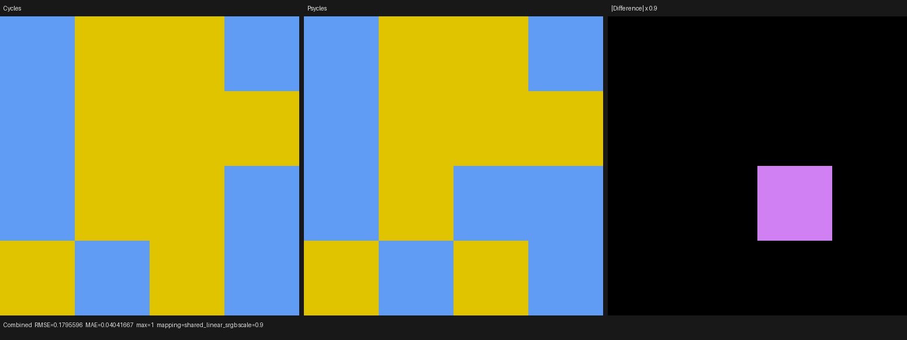
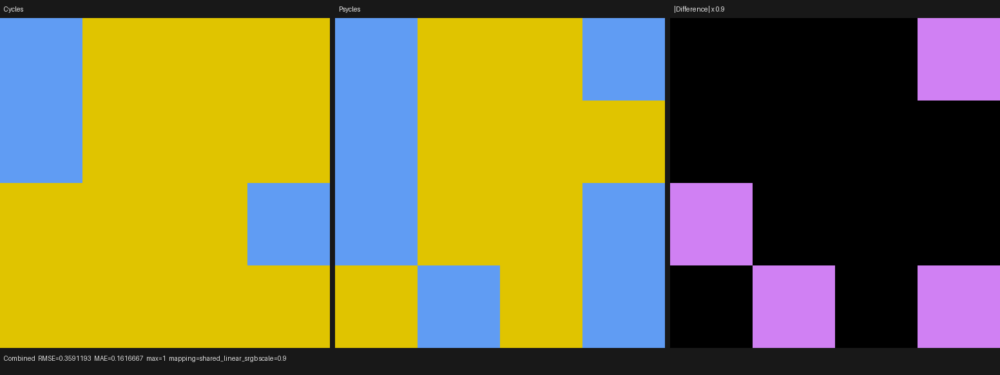

# Cycles 5.2 Checker SVM validation

## Scope and source oracle

This validation covers the `NODE_TEX_CHECKER` operation graph used by the
copied Cycles SVM interpreter and by the transitional surface evaluator.
The source oracle is Blender Cycles 5.2.1 commit
`9e2066aef7ef7e20c142ad7bd3303138a4304c93`, specifically
`intern/cycles/kernel/svm/checker.h`.

The implementation now has one shared Luisa DSL definition with the same
ordered operations as `svm_checker`:

1. multiply the coordinate by Scale;
2. compute `(p + 0.000001f) * 0.999999f`;
3. floor and convert each component to an integer;
4. take absolute values and compare component parity;
5. select Color1 or Color2 and write the optional Color and Fac outputs.

The previous transitional evaluator performed two extra NaN sanitizations,
rewrote the final multiply as a subtraction, and selected colors with `lerp`.
Those operations were not present in Cycles and existed only to force one
host-side boundary-rounding result. They have been removed. Both Psycles
execution paths now call `cycles_checker::evaluate`.

## Permanent regression

`psycles_luisa_cycles_svm_procedural_texture_tests` checks both Cycles record
decoding and execution. Its additional XIR operation-graph regression requires
the shared Checker formula to contain one add, two multiplies (including
coordinate scaling), three floors, three modulo operations and two selects.
It rejects subtraction and `isnan`, so the removed workaround cannot silently
return.

The following backend matrix passed:

```text
psycles.luisa_cycles_svm_procedural_texture_fallback  Passed
psycles.luisa_cycles_svm_procedural_texture_hip       Passed
psycles.luisa_cycles_svm_procedural_texture_vk        Passed
```

The Vulkan CTest uses
`LUISA_VULKAN_USE_XIR=1`, `LUISA_VULKAN_REQUIRE_NATIVE_XIR_SPIRV=1`, and
`LUISA_VULKAN_DISABLE_DXC=1`.

## Production render probe

The 4x4 probe contains signs, positive and negative scales, zero scale, large
coordinates, Color and Fac outputs, and deliberately discontinuous integer
boundary inputs. It was rendered at 64x64, 1 spp with shader caches disabled:

```sh
PSYCLES_DISABLE_SHADER_CACHE=1 \
python3 tools/run_cycles_shader_probes.py checker_texture_matrix \
  --blender /home/mike/Projects/blender-install-5.2-hiprt/blender \
  --psycles-render build/bin/psycles_render_blender_scene \
  --output-dir /tmp/psycles-checker-direct-cycles-hip \
  --backend hip --cycles-device HIP \
  --cycles-device-name 'AMD Radeon RX 9070 XT' \
  --width 64 --height 64 --samples 1
```

| Comparison | Combined RMSE | Relative RMSE | MAE | Maximum |
|---|---:|---:|---:|---:|
| Cycles HIP vs Psycles HIP | 0.17955965 | 0.29631759 | 0.04041667 | 1.0 |
| Cycles CPU vs Cycles HIP | 0.35911930 | 0.59897597 | 0.16166668 | 1.0 |

The apparently large aggregate error is a discontinuity diagnostic, not a
continuous shader error. Cycles CPU and Cycles HIP themselves choose different
Checker cells for cases 1, 3, 4 and 15. Psycles HIP and Cycles HIP agree on
15 of 16 complete cells and differ only on case 6, whose scaled coordinate is
exactly `(1, -2, 3)`. Every non-boundary case agrees. This is the explicitly
deprioritized sub-ULP boundary class: changing a pre-`floor` value across an
integer changes the entire selected color, but does not establish a different
SVM algorithm.

I opened both retained triptychs at their original 1552x582 resolution. The
Cycles HIP and Psycles HIP signal panels have the same layout and colors except
for that single boundary tile; the difference panel contains exactly that
tile. The Cycles CPU/HIP envelope visibly contains four boundary tiles, which
is broader than the remaining Psycles HIP difference.





| Artifact | SHA-256 |
|---|---|
| Cycles HIP vs Psycles HIP triptych | `17c391c6fbb7ac221c4921c0a99c1abee9cb3a796a6347dc91750d2f88e7bf5a` |
| Cycles CPU vs Cycles HIP triptych | `663b9a6dd84c2932815f7aa527fa4fecc23d72da36968d473339cb8e8814cae1` |
