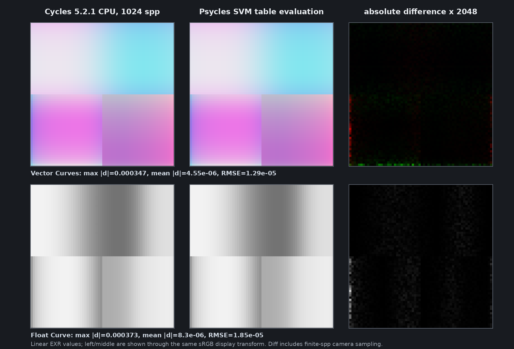

# Cycles 5.2 SVM Vector Curves and Float Curve validation

Date: 2026-09-01

## Scope

This milestone copies Blender Cycles 5.2.1's `VectorCurvesNode` and
`FloatCurveNode` into the Luisa SVM path. It covers Blender's normalized
257-entry tables, the common input domain, extrapolation flag, socket and
constant-fold semantics, exact Cycles bytecode layouts, and both device
handlers reached through the real SVM program-counter loop.

The representation is still the original shader graph and closure graph.
Blender exports the same normalized CurveMapping node data that Cycles places
inline in its SVM stream; neither Blender nor Cycles pre-renders a material or
bakes a closure into a texture. The former 17-point control-point fallback has
been deleted. A missing, malformed, or unsampled table now fails closed.

This remains a node-level SVM milestone. The copied interpreter is not yet the
production path-tracer material evaluator; the remaining Cycles SVM families
must be migrated before that switch.

Pinned references:

- Cycles 5.2.1 source: `9e2066aef7ef7e20c142ad7bd3303138a4304c93`
- diagnostic-only Cycles bytecode dumper:
  `cb168525138fecc792cc393f94afc39582b0103c`
- Psycles parent revision: `799da6f54dbdd5cd31f2d24cca92b92ee20d9af0`

## Structural correspondence

### Vector Curves

After `NODE_CURVES`, Psycles emits the exact eight-word Cycles
`SVMNodeCurves` payload followed by `table_size` float4 rows:

| Payload words | Cycles field | Psycles representation |
| ---: | --- | --- |
| 0..2 | `color` | immediate float3 or three typed stack words |
| 3 | `fac` | immediate float or typed stack word |
| 4 | `min_x` | common minimum of the three curves |
| 5 | `max_x` | common maximum of the three curves |
| 6 | `table_size` | 257 for Blender's normalized table |
| 7 | `extrapolate`, `out_offset`, pad | four packed bytes |
| 8... | sampled vector table | four words per row; unused `w = 1` |

The external dynamic Cycles stream contains the following exact header at
global word 105:

```text
0000004b 7fc00000 00000000 00000000 3f800000
00000000 3f800000 00000101 00000301
```

Selected external table rows are frozen word-for-word in the permanent host
and device regressions:

```text
row   0: 3df5c28f 3f6147ae 3e75c28f 3f800000
row  64: 3f540e2c 3e3bb925 3f66d4a5 3f800000
row 128: 3f17f9de 3f0aae90 3f4bfc0e 3f800000
row 192: 3e6ec68e 3f4780f0 3de3b8eb 3f800000
row 256: 3f68defa 3e23d6fe 3f383aff 3f800000
```

### Float Curve

After `NODE_FLOAT_CURVE`, Psycles emits the exact six-word
`SVMNodeFloatCurve` payload followed by `table_size` scalar float words:

| Payload words | Cycles field | Psycles representation |
| ---: | --- | --- |
| 0 | `fac` | immediate float or typed stack word |
| 1 | `value_in` | immediate float or typed stack word |
| 2 | `min_x` | scalar curve-domain minimum |
| 3 | `max_x` | scalar curve-domain maximum |
| 4 | `table_size` | 257 for Blender's normalized table |
| 5 | `extrapolate`, `out_offset`, pad | four packed bytes |
| 6... | sampled scalar table | one float word per row |

The external stream header at global word 120 is:

```text
00000066 3f800000 7fc00003 00000000
3f800000 00000101 00000001
```

Its selected table words are:

```text
row   0: 3da3d70a
row  64: 3f638f51
row 128: 3e8c20f8
row 192: 3f1fd781
row 256: 3e9eb850
```

The probe has four materials per family. Their opcodes occur at words
`105, 1156, 2207, 3258` for Vector Curves and
`120, 416, 712, 1008` for Float Curve. Those strides prove that the complete
inline tables, rather than a side representation, are present in every
Cycles stream.

## Blender normalization

The exporter now follows the node-specific Cycles representation:

- Vector Curves consumes three authored curves, finds one common domain, and
  samples each curve at all 257 endpoints.
- Float Curve consumes one curve and emits 257 scalar samples.
- RGB Curves continues to consume four curves and applies the common curve
  before each channel curve.
- Vector/RGB use Blender's raw `Fac` socket; Float Curve uses its raw
  `Factor` socket. The normalized graph retains the semantic `Factor` name.

The table serializer accepts only the sampled representation and exact scalar
or vector row shape. It does not reinterpret authored control points. The
live Blender regression creates all three node families and checks their
domain, extrapolation mode, common-curve ordering, and all 257 exported rows.

## Formal device transition

Let the input domain be `[a,b]`, table size be `N >= 2`, and normalized input
be

```text
q = (input - a) / (b - a)
```

For an in-domain or horizontally extended lookup:

```text
s = saturate(q) * (N - 1)
i = clamp(float_to_int(s), 0, N - 1)
t = s - float(i)
r = T[i]
if t > 0: r = (1 - t) * r + t * T[i + 1]
```

The `t > 0` guard proves that the `i + 1` read is absent at the upper endpoint.
When extrapolation is enabled and `q` lies outside `[0,1]`, the first or last
table segment is extended exactly as Cycles does.

Vector Curves performs the lookup independently for x/y/z and computes

```text
output = (1 - factor) * input + factor * (rx, gy, bz)
```

Float Curve computes the equivalent Cycles host/device form

```text
output = input + factor * (r - input)
```

The cursor advances by exactly `4N` words for Vector Curves and `N` words for
Float Curve. `N`, the table, input, factor, domain, and extrapolation byte are
runtime data. The generated AST has a constant number of reads and branches:
there is no table walk, table expansion, material specialization, or generated
loop.

## Constant folding and invalid states

Both nodes reproduce Cycles' two-stage behavior:

- Blender's node multi-function folds only when primitive inputs are already
  available at that graph stage.
- Cycles' later constant fold evaluates a fully constant sampled node.
- A live linked value is bypassed only when the unlinked factor is exactly
  zero.

Regressions cover constant and dynamic inputs, immediate and stack payloads,
factor mixing, clamp and extrapolation, exact cursor advancement, and the full
PC interpreter. Unsampled, malformed, one-row, ill-typed, and oversized table
representations are rejected instead of approximated.

## External Cycles oracles

Both probes were rendered by Cycles CPU with adaptive sampling and denoising
disabled. The diagnostic build only copies the compiled SVM word stream; it
does not alter shader evaluation.

| Probe | Blend SHA-256 | SVM stream SHA-256 | Export JSON SHA-256 |
| --- | --- | --- | --- |
| Vector Curve matrix | `2e806eb96c541d9d40840da68fe158d0aac63d597e71c4cfba5aa530cb844c39` | `c8ca69565116b5013d28adb474437a3b22f3460b5d61ffd0be9a0110d54dbb70` | `8540982cc829f2bed25d299a21d5da28bc63c0145cef046589a368d20cbbcab7` |
| Float Curve matrix | `6f8530d83271cc8d77b914249d84497528e2d8e0895e1e6b2262c0bdf89585dc` | `abbabb8adfded76a1b4afb2dc8e46d767eac9a273317b2ae17efd58f78bc2096` | `fa456e62085d6625fb5eaaface0d278adc06464fde068e2911f989af677bbd54` |

For the two unit-domain materials in each probe, the exported table and
external Cycles stream are bit-identical. The two deliberately wide-domain
materials differ in some table words by at most 13 ULP for Vector Curves and
10 ULP for Float Curve because Blender's Python API computes the sample x
coordinate in binary64 before calling CurveMapping, whereas Cycles constructs
it with binary32 host arithmetic. Their topology, domain, row count, and
lookup semantics are identical. Per project policy, no slower fused-operation
emulation or other arithmetic detour was added to chase these insignificant
host sampling differences.

## Numerical and visual check

Cycles CPU rendered each 64x64 probe at 1,024 spp. The comparison panel is an
independent host evaluation of the exported 257-entry table and exact SVM
formula over the same scene layout; it is deliberately not labeled as a
production Psycles path-tracer render.

| Family | max absolute RGB | mean absolute RGB | RGB RMSE |
| --- | ---: | ---: | ---: |
| Vector Curves | `3.46630812e-4` | `4.55471900e-6` | `1.29357322e-5` |
| Float Curve | `3.72976065e-4` | `8.29754936e-6` | `1.85083099e-5` |

The remaining error is confined to finite-spp camera/geometry-edge sampling.
I opened the retained 1,840x1,250 triptych at original resolution: the Cycles
and independent SVM-evaluation columns are visually indistinguishable, while
the difference column amplified by 2,048 shows only faint random and edge
residue, with no structured material discrepancy.



This is a node-level visual oracle, not a production full-scene render.

## Backend shape and validation

Build and validation commands:

```sh
cmake --build build --parallel 32
ctest --test-dir build --output-on-failure -j32 \
  -E '(_fallback|_vk|_hip)$'
ctest --test-dir build --output-on-failure -R '_hip$' -j1
ctest --test-dir build --output-on-failure -R '_fallback$' -j1
LUISA_VULKAN_USE_XIR=1 \
LUISA_VULKAN_REQUIRE_NATIVE_XIR_SPIRV=1 \
LUISA_VULKAN_DISABLE_DXC=1 \
  ctest --test-dir build --output-on-failure -R '_vk$' -j1
```

Focused backend results:

- Vector direct handler: 3,090 pre-optimization XIR instructions, zero loops,
  zero callables; HIP generated 10,972-byte AMDGPU code and an 8,896-byte code
  object; strict Vulkan optimized 8,877 to 7,416 SPIR-V words.
- Float direct handler: 1,052 pre-optimization XIR instructions, zero loops,
  zero callables; HIP generated 8,196-byte AMDGPU code and a 5,952-byte code
  object; strict Vulkan optimized 4,855 to 4,682 SPIR-V words.
- Full PC-loop interpreter: HIP generated 9,032-byte AMDGPU code and a
  6,848-byte code object; strict Vulkan optimized 6,086 to 5,782 SPIR-V words.
- HIP and fallback captures are byte-identical:
  `9944d5d846eb7ea824460a3f3b63ccc2443d646f9b12e8903130daf3720f6a5c`.
- Strict Vulkan differs from HIP in two extrapolated Vector components by one
  binary32 ULP and passes the numerical contract. No exactness slow path was
  introduced.

The shape guards cap Vector at 3,500 and Float at 1,250 pre-optimization XIR
instructions, with zero loops and zero callable definitions. Variable table
sizes and the 257-entry production tables therefore cannot enter the shader
AST or cache identity.

Full-suite results after the 32-thread whole-project build:

- non-backend: 96/96 passed
- HIP: 99/99 passed
- fallback: 101/101 passed
- strict native XIR to SPIR-V Vulkan, DXC disabled: 99/99 passed
