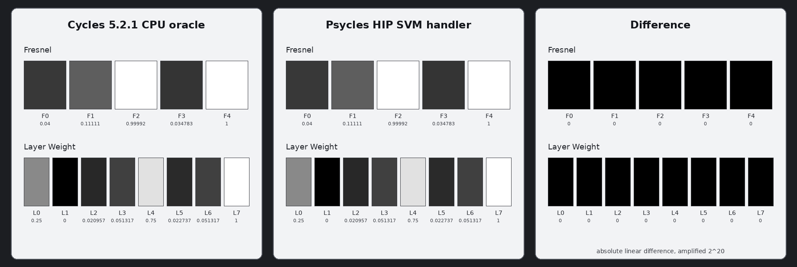

# Cycles 5.2 SVM Fresnel and Layer Weight validation

Date: 2026-09-01

## Scope

This milestone copies Blender Cycles 5.2.1's `FresnelNode` and
`LayerWeightNode` into the Luisa SVM path. It covers the raw Blender socket
contract, the Cycles graph default-input rule, one shared semantic Layer
Weight node for both outputs, exact SVM payloads and output ordering, the
device transitions, and dispatch through the real SVM program-counter loop.

The representation remains the original shader graph. Blender exports the
raw nodes and Psycles emits their typed SVM instructions; no closure,
material, or node output is rendered or baked by Blender/Cycles.

This remains a node-level SVM milestone. The copied interpreter is not yet
the production path-tracer material evaluator; the remaining Cycles SVM
families must be migrated before that switch. The old production
`surface_program` evaluator is deliberately not being extended with a second
implementation of these nodes.

Pinned references:

- Cycles 5.2.1 source: `9e2066aef7ef7e20c142ad7bd3303138a4304c93`
- diagnostic Cycles build: `cb168525138fecc792cc393f94afc39582b0103c`
- Psycles parent revision: `68c22be4ed5582ed21a8d9f32c80ae24e5869187`

## Structural correspondence

### The `OSL_INTERNAL` normal boundary

Both nodes' Normal socket is
`LINK_NORMAL | OSL_INTERNAL` in Cycles 5.2.1. These are the only two Cycles
shader nodes with that combination. `ShaderGraph::default_inputs` uses the
predicate

```text
unlinked && (!OSL_INTERNAL || do_osl)
```

before considering any `LINK_*` default. The SVM graph has `do_osl = false`,
so an unlinked Normal must remain unlinked and the device handler must use
`sd->N`. Injecting `Geometry.Normal` merely because `LINK_NORMAL` is present
is structurally wrong and changes the emitted stack payload.

Psycles now represents `OSL_INTERNAL` in its Cycles graph, applies the same
predicate, and removes the legacy `NormalLinked` property at the SVM
projection boundary. An actual Normal edge remains authoritative and is not
suppressed. Permanent regressions cover both sides of this predicate.

### Host bytecode

Fresnel emits one opcode followed by `SVMNodeFresnel`:

| Payload word | Cycles field | Psycles representation |
| ---: | --- | --- |
| 0 | `ior` | immediate float bits or typed stack-offset payload |
| 1 | `normal_offset`, `out_offset`, padding | four packed bytes |

Layer Weight emits one opcode and `SVMNodeLayerWeight` for each live output:

| Payload word | Cycles field | Psycles representation |
| ---: | --- | --- |
| 0 | `weight_type` | Fresnel `0` or Facing `1` |
| 1 | `blend` | immediate float bits or typed stack-offset payload |
| 2 | `normal_offset`, `out_offset`, padding | four packed bytes |

When both Layer Weight outputs are live, Cycles emits Fresnel first and Facing
second. The Blender adapter interns both outputs through one semantic source
node, and the host compiler preserves that two-instruction order rather than
duplicating the graph node.

The external Fresnel stream contains 475 words and 21 shader entries. Its
first unlinked material has this instruction at global word 149:

```text
00000027 3fc00000 000000ff
```

The linked-normal case at global word 170 is:

```text
00000027 3f800000 00000300
```

The external Layer Weight stream contains 897 words and 37 shader entries.
Its first Fresnel and Facing instructions begin at global words 213 and 230:

```text
00000028 00000000 c0000000 000000ff
00000028 00000001 c0000000 000000ff
```

## Formal device transitions

Let `N` be the explicit stack normal when its offset is valid and `sd->N`
otherwise, `B` mean `SD_BACKFACING`, and `D(c, eta)` be Cycles'
`fresnel_dielectric_cos`:

```text
c = abs(cosine)
g2 = eta * eta - 1 + c * c
if g2 <= 0: D = 1
otherwise:
  g = sqrt(g2)
  A = (g - c) / (g + c)
  C = (c * (g + c) - 1) / (c * (g - c) + 1)
  D = 0.5 * A * A * (1 + C * C)
```

Fresnel is:

```text
eta = max(IOR, 1e-5)
if B: eta = 1 / eta
Factor = D(dot(sd->wi, N), eta)
cursor' = cursor + 2
```

Layer Weight Fresnel is:

```text
eta = max(1 - Blend, 1e-5)
if !B: eta = 1 / eta
Fresnel = D(dot(sd->wi, N), eta)
cursor' = cursor + 3
```

Layer Weight Facing is:

```text
Facing = abs(dot(sd->wi, N))
if Blend != 0.5:
  b = clamp(Blend, 0, 1 - 1e-5)
  exponent = 2 * b                 if b < 0.5
             0.5 / (1 - b)        otherwise
  Facing = pow(Facing, exponent)
Facing = 1 - Facing
cursor' = cursor + 3
```

The shared dielectric primitive previously contained extra denominator
guards that Cycles does not have. They were removed in favor of the exact
branch above. This restores the original mathematical transition and removes
extra operations; no software arithmetic, fused-operation detour, or slower
path was introduced to chase insignificant ULP differences.

## External Cycles oracles

The diagnostic build copies the already-compiled SVM stream. A clean Cycles
5.2.1 build rendered both probes independently at 64x64 and 1,024 spp on CPU,
with box filtering, adaptive sampling, and denoising disabled. Clean and
diagnostic renders were compared across all 17 multilayer EXR subimages:
every float word was identical for both probes.

| Probe | Blender SHA-256 | SVM stream SHA-256 | Cycles CPU EXR SHA-256 | export JSON SHA-256 |
| --- | --- | --- | --- | --- |
| Fresnel matrix | `40425b7c6cf34a7ee5e72a265b05abf78523b3f7aba1c829b9e0f3ef88b5510b` | `4e3e862e69a4de0b1c73d54eccbd9e9c7021268c74efef59a184a26bf3d37a20` | `dccf0a6c69d54623b264d2713566a60dacb139bad883b9d7aec275ca83f789c0` | `34ef2b6b692387e48cd4557cc7a084ecab7b7ebe8eae3b44309594595b8a3ac0` |
| Layer Weight matrix | `c79bfc3c95ef1c8558ba08c0a5830cf244092be28bf50f8902785597296b66f2` | `209f28cfac5c27f5e453ed15acf6969662e835560f97e43933f490bd9c7ee28a` | `e31348696b28a6796c2b93be096d71983da724b99efb6dbbe1f7ff0dbab7dc70` | `42995be4be6fa42a4a55fed9deb82ab5c399da5ebbf6593c665dd90a27eaf11f` |

The device regression selects external Cycles cells that cover immediate and
stack inputs, explicit and implicit normals, front/back-facing Fresnel,
clamping, both Facing exponent branches, the exact `Blend == 0.5` branch,
and a grazing-angle boundary. Their Cycles values are:

```text
Fresnel:     0.0400000028 0.111111119 0.999915004 0.0347833373 1
LayerWeight: 0.25 0 0.0209565088 0.0513167381 0.75 0.0227367077
             0.0513167381 0.999998987
```

HIP reproduced every value after the nine-significant-digit float capture
round trip, so the measured maximum absolute difference is zero. This is a
direct GPU-buffer capture; there is no Psycles CPU reference formula. I
opened the retained 1,840x620 triptych at original resolution. Both signal
panels are visually identical and the absolute-difference panel, amplified
by 2^20, is black.



This is a node-level visual oracle, not a production full-scene Psycles
render.

## Backend shape and validation

HIP and fallback produced byte-identical captures:

```text
03876918d347466c0e4bca58e285dc24681d410f674b3421789e1394c370bd29
```

Strict native XIR-to-SPIR-V Vulkan passed the same semantic tolerance and
cursor checks. Three values differ from HIP by ordinary backend rounding;
the maximum absolute difference is `2.2e-8`. This is intentionally not hidden
behind a slower exactness path. The Vulkan capture hash is:

```text
5b0f604c2faba8d432e195084624c0e2979fe403db120d212111f5d384281711
```

Pre-optimization XIR shape:

- Fresnel direct handler: 923 instructions, zero loops, zero callables
- Layer Weight direct handler: 1,037 instructions, zero loops, zero callables

Focused generated-code results:

- HIP Fresnel: 7,868-byte AMDGPU code and 5,568-byte code object
- HIP Layer Weight: 8,164-byte AMDGPU code and 5,824-byte code object
- HIP full interpreter: 9,236-byte AMDGPU code and 7,616-byte code object
- strict Vulkan Fresnel: 4,456 to 4,262 SPIR-V words
- strict Vulkan Layer Weight: 4,748 to 4,459 SPIR-V words
- strict Vulkan full interpreter: 6,206 to 5,930 SPIR-V words

Build and full validation commands:

```sh
cmake --build build --parallel 32
ctest --test-dir build --output-on-failure -j32 \
  -E '(_fallback|_vk|_hip)$'
ctest --test-dir build --output-on-failure -R '_hip$' -j1
ctest --test-dir build --output-on-failure -R '_fallback$' -j1
LUISA_VULKAN_USE_XIR=1 \
LUISA_VULKAN_REQUIRE_NATIVE_XIR_SPIRV=1 \
LUISA_VULKAN_DISABLE_DXC=1 \
  ctest --test-dir build --output-on-failure -R '_vk$' -j1
```

Full-suite results after the 32-thread whole-project build:

- non-backend: 102/102 passed
- HIP: 101/101 passed
- fallback: 103/103 passed
- strict native XIR-to-SPIR-V Vulkan, DXC disabled: 101/101 passed
