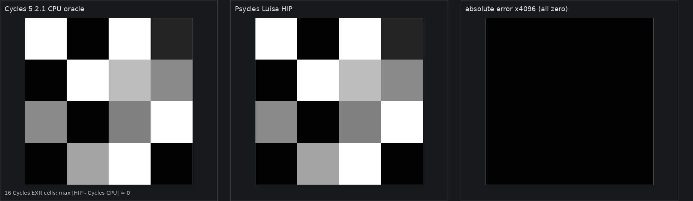

# Cycles 5.2 SVM Gradient Texture validation

Date: 2026-09-01

## Scope

This milestone copies Blender Cycles 5.2.1's Gradient Texture schema, Blender
function-node folding boundary, SVM payload, and device evaluation into the
Luisa SVM path. It covers all seven gradient modes, independently live Factor
and Color outputs, saturation, invalid payload defaults, exact cursor advance,
embedded `TextureMapping`, Blender import, and dispatch through the real SVM
program-counter loop.

It does not claim production full-scene parity yet. The copied SVM interpreter
is not yet the production path-tracer material evaluator; the remaining SVM
families must be migrated before that end-to-end switch.

Pinned references:

- Cycles source: `9e2066aef7ef7e20c142ad7bd3303138a4304c93`
- diagnostic-only Cycles bytecode dumper:
  `cb168525138fecc792cc393f94afc39582b0103c`
- Psycles parent revision: `00a7679959671fabe8dc47f0a7db2d3dd9117155`

## Structural correspondence

The host compiler emits the exact two-word Cycles `SVMNodeTexGradient`
payload after `NODE_TEX_GRADIENT`:

| Payload word | Cycles field | Psycles representation |
| ---: | --- | --- |
| 0 | `gradient_type` | one of the seven `NodeGradientType` values |
| 1 | `co`, `fac_offset`, `color_offset` | three packed stack bytes and one zero pad byte |

Compilation uses Cycles' `TextureNode` protocol: `TextureMapping::compile_begin`,
the Gradient payload, then `TextureMapping::compile_end`. The device transition
loads one float3, evaluates the selected scalar function, saturates it to
`[0, 1]`, and independently stores Factor and replicated RGB only when their
stack offsets are valid. It always consumes exactly two payload words.

The schema and Blender adapter preserve both original outputs. A Blender link
from `Fac` becomes the typed Factor output, while a link from `Color` remains
the typed Color output; neither is converted or pre-baked by Blender/Cycles.

### Formally separated fold stages

The external oracles exposed a stage-ordering invariant that a single
`constant_folded_in` predicate cannot represent. Blender first runs
`inline_shader_node_tree` over nodes that provide a multi-function. Cycles then
constructs its own `ShaderGraph` and runs `ShaderNode::constant_fold`.

Let `P_B` be primitive values available during Blender inlining and `P_C` the
larger set after Cycles graph folding. Blender function evaluation computes a
topological closure only over `P_B`:

```text
P_B(i + 1) = P_B(i) union outputs(function nodes whose available inputs
                                      are all in P_B(i))
```

The later Cycles fold may enlarge `P_C`, but there is no edge from `P_C` back
to the already-completed Blender closure. Psycles now models these as two
ordered graph passes with separate virtual operations. Therefore:

- constant `Combine XYZ -> Gradient` folds completely, because both nodes are
  Blender multi-functions;
- constant `Combine XYZ -> Mapping -> Gradient` does not fold Gradient during
  Blender inlining, because Mapping has no multi-function;
- the later Cycles pass folds Mapping to `NODE_VALUE_V`, but retains
  `NODE_TEX_GRADIENT`, because it cannot re-enter the Blender pass.

The second case is checked both through a direct semantic graph and through a
raw Blender JSON import. Its complete 25-word shader-local stream is compared
word for word with Cycles 5.2.1. This stage model also replaces the former
White Noise approximation, so the same invariant is shared rather than patched
per texture family.

## External Cycles oracles

The diagnostic build copies the already-compiled SVM stream without changing
the renderer or kernels. A representative render and bytecode capture was:

```sh
PSYCLES_CYCLES_SVM_DUMP=/tmp/gradient_matrix.svm52 \
  /home/mike/Projects/blender-install-psycles-trace-5.2/blender \
  /tmp/gradient_matrix.blend --background \
  --python tools/render_cycles_golden.py -- \
  /tmp/gradient_matrix.exr 64 64 1 0 --cycles-device CPU
```

| Probe | Blend SHA-256 | SVM stream SHA-256 | EXR SHA-256 | Export JSON SHA-256 |
| --- | --- | --- | --- | --- |
| Seven opcodes plus Color liveness | `98f2102cb99ac22fd7dd49aae329e37b0bea749204631a14b8422ce8f742e9f3` | `e0b6cdc4f5ed9f368df7e4ed88cf03f572b7d2466f04b4f8ccf6a65cc1f2c130` | `567a9fec1fecadfc7a7779310ad1f7d354aab0f6e8970bd40378e8d0c47f4758` | `0e26d5353c0c4326f0785da93994f6b8695af63fc076a726a54095b67c1e5c45` |
| 16-case value/saturation matrix | `0f271adc50180d74b8d44bcb1997b55ce42a1f6f5f022cc14ba237ae4ff1334e` | `e102ecee16b088cf424a3648436afbe49d98315a4c0e12bbef8d4c93e6a75470` | `2507e8238963dde44970920da3a8d856d3a1f4c8a651cb8c09bbc55896e1a400` | `e558c74e3840b5e789aa5dd5171fb8fbc585ada1e069c77d9fc4d9d55c05367a` |
| Mapping fold-stage boundary | `e69040eb7fc4b96e6f7466f5f28ce6930e28899f01d5be4cbf124ac1b6d2d072` | `bf613962aefab03825d5cb0be11a6a377182ec7f094b02eee6967c77ad4fd334` | `8717e2047c7163c10d335ddd8e0d8f842e51a40179ba14379b110d7e4deb3bad` | `873e1fc6f4635baac6e2560dc00625f878cb82f27c4e06090ac3e36b4061bebe` |
| Full spherical PC-loop stream | `1cd64106f245478913ff91a9479b9fcb6c353685fa5bd695182779bad830e0db` | `fc61048c6dacbf0a83146b94739375faf74aa49709847dc49da34a4ee5494a84` | `2bdfe7f54424be2701422eb29b19def9449512dd2c3f956750ad36f381af5c64` | n/a |

## Numerical and visual check

The device regression stores the 16 Cycles CPU EXR results as float values and
evaluates every case twice: once with only Factor live and once with only Color
live. HIP, fallback, and strict Vulkan produced byte-identical capture files:

```text
724f1f3ef36c64adabc399c2978fd0209bfad59cf2a090d0dda01867efcf51af
```

The maximum absolute difference from the full external Cycles CPU 4 x 4 EXR
was zero. Assertions still use a `2e-7` tolerance so a harmless future 1 ULP
backend difference does not justify replacing efficient native arithmetic.

The first two panels below apply the same clamped linear-to-display transform
and are visually identical. The third panel magnifies absolute linear RGB
error by 4096 and remains black.



This is a node-level visual oracle, not a production full-scene render.

## Code shape and validation

Build and validation commands:

```sh
cmake --build build --parallel 32
ctest --test-dir build --output-on-failure -j32 \
  -E '(_fallback|_vk|_hip)$'
ctest --test-dir build --output-on-failure -R '_hip$' -j1
ctest --test-dir build --output-on-failure -R '_fallback$' -j1
LUISA_VULKAN_USE_XIR=1 \
LUISA_VULKAN_REQUIRE_NATIVE_XIR_SPIRV=1 \
LUISA_VULKAN_DISABLE_DXC=1 \
  ctest --test-dir build --output-on-failure -R '_vk$' -j1
```

Focused results:

- exact host streams, schema, Blender import, fold stages, and invalid enum:
  passed
- HIP direct handler and full PC-loop interpreter: passed
- fallback direct handler and full PC-loop interpreter: passed
- strict native XIR to SPIR-V Vulkan, with DXC disabled: passed
- direct pre-optimization XIR: 945 instructions and zero callables
- HIP direct handler: 8,552-byte AMDGPU code and 6,208-byte code object
- HIP full interpreter: 12,208-byte AMDGPU code and 10,944-byte code object
- strict Vulkan direct handler: 4,512 to 4,388 SPIR-V words
- strict Vulkan full interpreter: 9,698 to 9,027 SPIR-V words

The XIR guard permits at most 1,000 instructions and zero callable
definitions. Dispatch width and the 34 payload cases do not enter the shader
AST.

Full-suite results after the 32-thread whole-project build:

- non-backend: 89/89 passed
- HIP: 96/96 passed
- fallback: 98/98 passed
- strict native XIR to SPIR-V Vulkan, DXC disabled: 96/96 passed

The device matrix additionally checks invalid enum words, independently
invalid output offsets, exact two-word cursor advancement, and a complete
external Gradient stream through `eval_nodes`.
