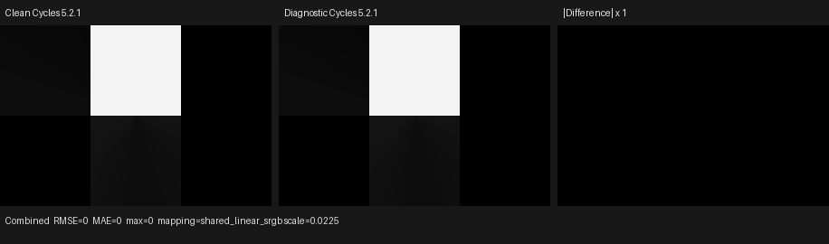

# Cycles 5.2 SVM IES validation

Date: 2026-09-01

## Scope

This milestone copies Blender Cycles 5.2.1's IES Light node into the typed
Psycles host compiler and Luisa SVM interpreter. It covers:

- Blender INTERNAL and EXTERNAL IES source transport without a sampled or
  baked substitute;
- Cycles' scene-wide IES slot identity and packed `KernelData::ies` layout;
- Type A, B, and C parsing, coordinate conversion, mirroring, and radiometric
  scale;
- the exact `SVMNodeIES` payload and implicit texture-Incoming topology;
- Cycles' two-dimensional cubic lookup, invalid-profile sentinel, angular
  bounds, wrap behavior, and unchecked zero-vector boundary;
- direct handler and complete SVM program-counter execution on HIP, fallback,
  and strict native XIR-to-SPIR-V Vulkan.

The semantic oracle is Cycles 5.2.1. Fallback is a backend conformance target,
not a CPU reference model. No path attempts to compensate for backend-native
floating-point differences or to reproduce one-ULP details at a performance
cost.

This remains a node-level SVM migration milestone. The copied interpreter is
not yet the production path-tracer material evaluator, so this document does
not claim a production Psycles IES render or a renderer performance result.
The scene-wide `IESIDMap` and `KernelGlobals::ies` service are the explicit
resource boundary that production SVM integration must retain.

Pinned references:

- Cycles 5.2.1 source: `9e2066aef7ef7e20c142ad7bd3303138a4304c93`
- diagnostic Cycles branch: `cb168525138fecc792cc393f94afc39582b0103c`
- diagnostic branch merge base: the same `9e2066aef7ef...` Cycles revision
- Psycles parent revision: `136694b75ab3acef0f2c224cfd97d6734ce665eb`

## Source correspondence

The implementation was derived from these Cycles 5.2.1 units:

| Concern | Cycles source |
| --- | --- |
| Blender node import | `intern/cycles/blender/shader.cpp`, `ShaderNodeTexIES` |
| INTERNAL text semantics | `intern/cycles/blender/util.h`, `get_text_datablock_content` |
| node/socket and host compile | `intern/cycles/scene/shader_nodes.cpp`, `IESLightNode` |
| default Vector source | `intern/cycles/scene/shader_graph.cpp`, `ShaderGraph::default_inputs` |
| slot ownership and table packing | `intern/cycles/scene/light.cpp`, `LightManager::add_ies` and `device_update_ies` |
| Type A/B/C parser | `intern/cycles/util/ies.cpp`, `IESFile` |
| device table interpolation | `intern/cycles/kernel/util/ies.h` |
| SVM node transition | `intern/cycles/kernel/svm/ies.h` |
| payload ABI | `intern/cycles/kernel/svm/node_types.h`, `SVMNodeIES` |

The diagnostic tree's `shader_nodes.cpp`, `shader_graph.cpp`, `util/ies.cpp`,
`kernel/util/ies.h`, `kernel/svm/ies.h`, and `kernel/svm/node_types.h` are
byte-identical to the clean pinned source. Its local IES/SVM dump changes only
observe the completed host arrays before upload.

## Raw resource semantics

Let `R` be the complete byte string supplied to Cycles and let `M` be the
scene-wide map from `R` to an unsigned slot. Psycles maintains the invariant

```text
M[R] = s  implies  profiles[s] = parse_and_process(R)
M[R1] = M[R2]  iff  R1 and R2 are byte-identical
```

Using the complete byte string is a collision-free refinement of Cycles'
32-bit content-hash lookup: it preserves all information and cannot merge two
different resources because of a hash collision. Slot allocation is protected
by one mutex; allocation order may vary when materials compile concurrently,
so validation follows profile contents and SVM references rather than freezing
an incidental slot number.

EXTERNAL nodes carry the exact bytes read by Cycles' `path_read_text`. INTERNAL
nodes require a less obvious rule: Cycles appends one LF for every Blender
`TextLine`, including the final empty line. Python's `Text.as_string()` omits
that additional LF. The first implementation used `as_string()` and would
therefore have merged resources differently. The exporter now reconstructs
`get_text_datablock_content` exactly, and a permanent regression covers both a
Text with and without an authored final LF.

In the canonical matrix this produces the same five logical Cycles slots:

- two INTERNAL Type C users share 174 bytes;
- the EXTERNAL Type C source remains a distinct 173-byte resource;
- Type B and Type A INTERNAL sources contain 132 and 135 bytes;
- the missing INTERNAL profile is the ordinary invalid slot.

No parsed angles, lookup texture, or precomputed material value enters the
Blender manifest. It contains only mode, source identity, availability, and
the Cycles input bytes.

## Formal packed-table invariant

For `n` slots, the device array `D` begins with `n` bit-cast signed offsets:

```text
D[s] = int_bits(-1)                 invalid profile
D[s] = int_bits(o), o >= n          valid profile

D[o + 0] = int_bits(h_count)
D[o + 1] = int_bits(v_count)
D[o + 2 ..] = h angles, v angles, then h-major intensities
```

For every valid profile, both counts are at least two, angles are finite and
strictly increasing after Type A/B/C processing, and the intensity extent is
exactly `h_count * v_count`. All offsets and counts fit signed 32-bit device
indexing. These conditions prove that both device searches can read `i + 1`
and that all four cubic taps stay within the packed profile.

Cycles itself leaves malformed one-sample and non-monotone profiles outside
the safe device domain. Psycles maps only that undefined domain to the same
`-1` invalid-profile behavior. Bounds checks also reject negative/overflowing
counts before allocation. Valid Cycles inputs retain the original parser,
conversion, mirroring, fixed `0.0706650768394` scale, and float conversion
order.

The external Cycles dump contains 159 floats. Its five-entry offset table in
this run is `5, 54, 91, 128, -1`; the corresponding profile lengths are 49
(Type B), 37 and 37 (the two byte-distinct Type C sources), and 31 (Type A).
Host regressions compare all words in independent Type A/B/C profile slices,
not just decoded decimal values.

## Exact graph and bytecode

Cycles marks IES Vector with `LINK_TEXTURE_INCOMING`. The generic default-input
rule is not a direct Geometry edge. It is:

```text
Geometry.Incoming
    -> Vector Transform(Type=NORMAL, WORLD -> OBJECT)
    -> Convert(VECTOR -> POINT, AUTOCONVERT)
    -> IES Light.Vector
```

Psycles previously grouped `LINK_TEXTURE_INCOMING` with direct Geometry
inputs. That was a structural coordinate-space bug. `CyclesGraph::default_inputs`
now creates and shares the same transform node. It also restores IES Vector's
exact Cycles `SOCKET_IN_POINT` type at the contract-to-Cycles projection
boundary. The transform output is a VECTOR, so the projected graph inserts the
same `SHADER_SPECIAL_TYPE_AUTOCONVERT` node as `ShaderGraph::connect`.
Float3-to-float3 Convert compiles as a stack alias and emits no
`NODE_CONVERT`; a permanent guard verifies both the host node and the absence
of a device opcode. Blender import leaves the unlinked Vector socket
unmaterialized so this Cycles rule remains authoritative.

The adapter's canonical contract may already contain an `A -> VECTOR`
conversion for an authored Blender float3-family link. Every float3 conversion
is the identity on its three stored components, so composition has the normal
form `A -> VECTOR -> B = A -> B`, with no Convert at all when `A == B`.
Before Cycles graph cleanup, projection applies that rule only to its own
AUTOCONVERT: the regressions cover both elimination of
`POINT -> VECTOR -> POINT` and composition of
`NORMAL -> VECTOR -> POINT` into one `NORMAL -> POINT` node. Automatic
conversion is deliberately invoked only at socket boundaries whose precise
Cycles types have been restored; applying it globally exposed an unrelated
Image path whose contract socket is still canonicalized as VECTOR. The
existing exact Image byte-stream regression caught that scope error, and both
oracles pass with the projection boundary made explicit.

The permanent import regression matches complete records, never a lone opcode
word that could also occur in payload data. The externally observed sequence
is:

```text
NODE_GEOMETRY:       0000000b 00000003 00000000
NODE_VECTOR_TRANSFORM:
                     00000059 00000002 00000000 00000001
                     7fc00000 00000000 00000000 00000003
NODE_LIGHT_PATH:     00000032 00000009 00000000
NODE_IES:            0000004a 7fc00000 <slot>   00000103
```

The last record means stack-backed Strength, scene slot, Vector at stack lane
3, and Factor at lane 1. An independent immediate-input graph produces:

```text
0000004a 3ecccccd 00000000 00000003
```

The host compiler performs TextureMapping `compile_begin`, emits exactly one
`SVMNodeIES`, then performs `compile_end`, matching `IESLightNode::compile`.
Identical raw resources compiled through one `IESIDMap` share a slot; resources
differing only by the Cycles TextLine LF do not.

## Device transition

For normalized input direction `p`, Strength `q`, horizontal angle `h`, and
vertical angle `v`, the node transition is

```text
p = normalize_unchecked(stack[vector_offset])
v = safe_acos(-p.z)
h = atan2(p.x, p.y) + pi
factor = q * ies_interp(slot, h, v)
store factor only when fac_offset is valid
```

`ies_interp` returns 100 for an invalid slot and zero outside the valid angular
half-open intervals. Inside, it linearly searches each nonuniform angle axis,
computes inverse-lerp fractions, performs Cycles' vertical cubic interpolation
for four horizontal rows, then performs the horizontal cubic and clamps the
result to nonnegative. Pole and full-360-degree wrapping use the same boundary
tests and taps as Cycles 5.2.1, including its intentional `d = b` fallback.

The two angle searches remain two dynamic XIR loops. They are neither unrolled
nor specialized by profile size, so scene contents do not enter shader cache
identity and large IES tables do not expand the kernel.

## External Cycles oracle

The canonical scenes and clean/diagnostic render pair were generated with:

```sh
/home/mike/Projects/blender-install-5.2-hiprt/blender \
  --background --factory-startup \
  --python tools/create_cycles_shader_probe.py -- \
  /tmp/psycles-ies-oracle.tMda8S/ies_light_matrix.blend \
  ies_light_matrix

PSYCLES_CYCLES_SVM_DUMP=/tmp/psycles-ies-oracle.tMda8S/cycles_svm_64.bin \
PSYCLES_CYCLES_IES_DUMP=/tmp/psycles-ies-oracle.tMda8S/cycles_ies_64.bin \
/home/mike/Projects/blender-install-psycles-trace-5.2/blender \
  /tmp/psycles-ies-oracle.tMda8S/ies_light_matrix.blend \
  --background --threads 0 --python tools/render_cycles_golden.py -- \
  /tmp/psycles-ies-oracle.tMda8S/cycles_trace_64.exr \
  300 200 64 1 --cycles-device CPU

/home/mike/Projects/blender-install-5.2-hiprt/blender \
  /tmp/psycles-ies-oracle.tMda8S/ies_light_matrix.blend \
  --background --threads 0 --python tools/render_cycles_golden.py -- \
  /tmp/psycles-ies-oracle.tMda8S/cycles_clean_64.exr \
  300 200 64 1 --cycles-device CPU
```

Adaptive sampling and denoising were disabled. The diagnostic build has a
different Git identity because it also contains an earlier path-trace oracle,
so the comparison report intentionally marks build identity unverified.
However, its IES graph, parser, payload, and kernel sources are byte-identical
to the clean revision, its merge base is the pinned clean revision, and the
clean and diagnostic Combined images are numerically exact over all 60,000
pixels:

```text
RMSE                 0
relative RMSE        0
mean absolute error  0
maximum error        0
invalid pixels       0 / 0
mean energy ratio    1
```

I opened the retained 916x270 triptych at original resolution. Both signal
panels show the same matrix boundaries, central bright region, and faint
lower-cell gradients; the absolute-difference panel is entirely black.



| Artifact | SHA-256 |
| --- | --- |
| canonical matrix `.blend` | `0df4f9b83d07f0eaeb7e3d604ae2ae1afae624c12a83e8c0fab1c3c98df75c05` |
| diagnostic SVM stream | `6853abe4cc9746e0c5a63718c63c9fc25ef7513b3813e79f7df90974d0cc6861` |
| diagnostic packed IES table | `97b4e97a96368c8c174da68cacf2268a4e47be9070f3844d9cf6ad0ab6437cb2` |
| clean Cycles CPU EXR | `3495b1c5379ffd030ae875635787d75e456822547076ae3943676270e7481261` |
| diagnostic Cycles CPU EXR | `bcdf68cf884089e18382e0fd2d2f8227ddc3f649653f0b33c3b9f4b28c91b949` |
| current exported matrix `scene.json` | `b92e6b95b249aa1c062c319567838fd0a7b7a11d3cab1154f859a6813037c913` |
| exported matrix `geometry.bin` | `15a20c930488c8cd90806df789deeda48c8f40d8f83c5b58b50b9412376d3d29` |
| retained triptych | `f656e3e44d4ccf67a0f73a0230551e38885a48defd769a4a411c7f694e8f15a2` |

## Numerical oracle and backend behavior

The second scene renders eight flat cells at 256x128 and one sample. Center
pixels from clean Cycles 5.2.1 CPU freeze these structural cases:

| Case | Profile/path | Combined value |
| ---: | --- | ---: |
| 0 | Type C, near horizontal wrap | 0.0685461387 |
| 1 | Type C, nonuniform interior | 0.2626886368 |
| 2 | Type C, far interior | 0.3460253179 |
| 3 | Type B conversion | 0.1153583303 |
| 4 | Type A conversion | 0.1663088650 |
| 5 | Type A, outside range | 0 |
| 6 | invalid profile, Strength 0.25 | 25 |
| 7 | unchecked zero direction | 0 |

The `.blend`, EXR, current export, and geometry hashes are respectively:

```text
805960e0827e1ada64f22b16d69b5da05f499b6fef70007a65022c7d90bd1889
a0d4a7894f7db7deb6472d82ed3a7b89cefa766070c3bae77189c8b3077c4a10
c8fbdcb5a0617677d2846d965057eb37952f26be029c9b1031da197cec0f8fb8
92885d7577ee87f2fd7d00e501e32e3f49e43baf9dd8425252e7354a2cb2b649
```

HIP, fallback, and strict Vulkan pass all eight cases through the direct node
and also execute an IES/emission program through the full PC loop. Backend
captures use native arithmetic: fallback and Cycles agree bitwise on the five
nonzero profile cases, HIP differs by at most three ULP, and Vulkan differs by
at most 22 ULP. All are far inside the `8e-6` structural tolerance. Zero,
out-of-range, and invalid-profile behavior agree exactly. No slow exact-math
path was introduced.

Capture hashes:

```text
fallback  cb7921388e579cbaba43e1b776bc6a5ae8dc84a981317a230c9dc95337fd6aef
HIP       fbb8aaa162ef16b06d9d599edcdf1db1494e42ce8eb62881254e80e90450d39f
Vulkan    161fe9ef802ecb0fe3f5cfd7ed6702801a45619ce3801bd8624f1f468ebf0f8e
```

## Code shape and native routes

The direct-handler AST contains 3,125 pre-optimization XIR instructions,
exactly two loop instructions, and zero callable definitions. A permanent
guard rejects more than 3,200 instructions, a changed loop count, or any
callable definition.

Focused generated-code sizes on the RX 9070 XT are:

- HIP direct handler: 10,960-byte AMDGPU module and 10,560-byte code object;
- HIP full PC-loop interpreter: 11,816-byte module and 11,328-byte code object;
- Vulkan direct handler: 8,773 to 8,218 optimized SPIR-V words;
- Vulkan full interpreter: 10,092 to 9,390 optimized SPIR-V words.

The Vulkan run selected `AMD Radeon RX 9070 XT (RADV GFX1201)` with
`LUISA_VULKAN_DISABLE_DXC=1` and
`LUISA_VULKAN_REQUIRE_NATIVE_XIR_SPIRV=1`; both shaders reported native SPIR-V
optimization and compilation.

## Permanent regressions and final validation

Regressions cover:

- INTERNAL TextLine LF semantics with and without an authored final LF;
- exact EXTERNAL CRLF, embedded NUL, and non-UTF-8 bytes;
- missing-source behavior and the absence of baked/derived profile fields;
- semantic Blender import with exact raw bytes and no precomputed lookup;
- the corrected Geometry/normal-transform/autoconvert/IES default topology;
- exact IES POINT typing, host-only float3 autoconversion, formal conversion
  chain composition, and absence of a device `NODE_CONVERT`;
- complete immediate and stack-backed external Cycles records;
- exact Type A/B/C packed profile words and byte-identity slot deduplication;
- fail-closed malformed counts and one-sample device domains;
- all angular, wrapping, invalid, and zero-vector device cases;
- exact cursor consumption and full SVM program-counter dispatch;
- HIP, fallback, strict native Vulkan, code shape, and source-size limits.

Final commands:

```sh
cmake --build build --parallel 32
ctest --test-dir build --output-on-failure --parallel 32 \
  -E '(_fallback|_vk|_hip)$'
ctest --test-dir build --output-on-failure --parallel 1 -R '_hip$'
ctest --test-dir build --output-on-failure --parallel 1 -R '_fallback$'
LUISA_VULKAN_USE_XIR=1 \
LUISA_VULKAN_REQUIRE_NATIVE_XIR_SPIRV=1 \
LUISA_VULKAN_DISABLE_DXC=1 \
  ctest --test-dir build --output-on-failure --parallel 1 -R '_vk$'
```

Results:

- 32-thread whole-project build: passed;
- non-backend suite: 116/116 passed in 1.03 s;
- HIP suite: 106/106 passed in 28.48 s;
- fallback suite: 108/108 passed in 25.13 s;
- strict native XIR-to-SPIR-V Vulkan suite: 106/106 passed in 21.55 s.
