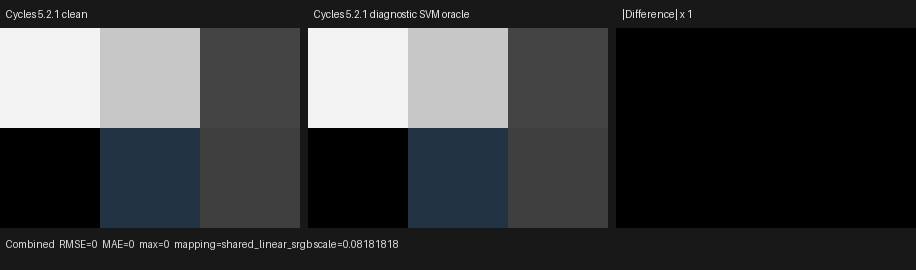

# Cycles 5.2 SVM Info-node validation

Date: 2026-09-01

## Scope

This milestone copies Blender Cycles 5.2.1's Object Info, Particle Info,
Hair Info, and Point Info host compilation and device transitions into the
Luisa SVM path. It covers:

- the raw Blender 5.2 socket contracts;
- one semantic graph node per original Blender node;
- live-output pruning and Cycles' fixed compile order;
- exact direct and attribute SVM payloads;
- the program-counter interpreter, feature gates, and unsupported-service
  behavior;
- HIP, fallback, and strict native XIR-to-SPIR-V Vulkan execution.

The canonical scene keeps every original output connected. Blender exports
the original graph and Cycles compiles the original nodes; no output,
material, or closure is baked.

This remains a node-level SVM milestone. The copied SVM interpreter is not
yet the production path-tracer material evaluator, so this work deliberately
does not add a second implementation to the legacy `surface_program` path.
The external oracle and the backend transition tests are therefore reported
separately from full-render parity. Fallback is a backend conformance target,
not a CPU reference model; the only semantic oracle is Cycles 5.2.1.

Pinned references:

- Cycles 5.2.1 source: `9e2066aef7ef7e20c142ad7bd3303138a4304c93`
- diagnostic Cycles build: `cb168525138fecc792cc393f94afc39582b0103c`
- Psycles parent revision: `3fabb5c3e57c161b28d97992b92221eef2816adb`

## Structural correspondence

The implementation follows the corresponding Cycles definitions in
`scene/shader_nodes.cpp`, transitions in `kernel/svm/geometry.h`, and enums
in `kernel/svm/types.h`.

### Blender and graph contracts

| Family | Outputs in Blender/Cycles order |
| --- | --- |
| Object | Location, Color, Alpha, Object Index, Material Index, Random |
| Particle | Index, Random, Age, Lifetime, Location, Size, Velocity, Angular Velocity |
| Hair | Is Strand, Intercept, Length, Thickness, Tangent Normal, Random |
| Point | Position, Radius, Random |

The raw names and socket types are checked against Blender 5.2 at export
time. The adapter maps names containing spaces to typed internal endpoint
names such as `ObjectIndex`, `AngularVelocity`, `IsStrand`, and
`TangentNormal`, then the SVM compiler projects them back to the exact Cycles
socket names.

All outputs from one raw Blender node are interned under one semantic graph
node. This is important for graph identity as well as code size: requesting
several outputs cannot duplicate the source Info node. The import regression
proves the single-node identity with every output live; an independent host
compiler regression connects outputs in reverse and proves that bytecode
still follows Cycles' original emission order.

### Exact host bytecode

Object and Particle outputs are direct three-word records: the opcode,
`info_type`, and the output stack offset in the low byte. Their all-output
payloads are:

```text
Object:   (0,0) (1,3) (2,6) (3,7) (4,8) (5,9)
Particle: (0,0) (1,1) (2,2) (3,3) (4,4) (5,7) (6,8) (7,11)
```

The offsets reflect Cycles' stack widths: vectors/colors consume three
slots, while scalars consume one.

Hair uses direct `NODE_HAIR_INFO` records only for Is Strand, Thickness, and
Tangent Normal:

```text
(NODE_INFO_CURVE_IS_STRAND, 0)
(NODE_INFO_CURVE_THICKNESS, 3)
(NODE_INFO_CURVE_TANGENT_NORMAL, 4)
```

Intercept, Length, and Random are not alternate Hair-handler cases. Exactly
like Cycles, they compile through `NODE_ATTR` with
`ATTR_STD_CURVE_INTERCEPT`, `ATTR_STD_CURVE_LENGTH`, and
`ATTR_STD_CURVE_RANDOM`. Their packed payload words are respectively
`0x00000101`, `0x00000102`, and `0x00000107`, with a zero filter-width word.

Point Position and Radius compile directly at offsets zero and three. Point
Random compiles through `NODE_ATTR` with `ATTR_STD_POINT_RANDOM` and packed
payload `0x00000104`. Unlinked outputs emit no record in every family.

## Formal device transition

Let `C` be the payload cursor immediately after the opcode, `S` be
`ShaderData`, and `K` be the exact geometry/object-table service projection.
Every direct handler reads exactly the two words `(info_type, out_offset)`, so
the normal transition is

```text
(C, stack, S, K) -> (C + 2, stack[out_offset := value], S, K)
```

Vector writes cover three adjacent stack words and scalar writes cover one.
The value mapping is:

```text
Object.Location       = object_location(K, S)
Object.Color          = object_color(K, S.object)
Object.Alpha          = object_alpha(K, S.object)
Object.Index          = object_pass_id(K, S.object)
Object.MaterialIndex  = shader_pass_id(K, S)
Object.Random         = object_random_number(K, S.object)

p = object_particle_id(K, S.object)
Particle.Index        = particle_index(K, p)
Particle.Random       = hash_uint2_to_float(particle_index(K, p), 0)
Particle.Age          = particle_age(K, p)
Particle.Lifetime     = particle_lifetime(K, p)
Particle.Location     = particle_location(K, p)
Particle.Size         = particle_size(K, p)
Particle.Velocity     = particle_velocity(K, p)
Particle.AngularVel.  = particle_angular_velocity(K, p)

Hair.IsStrand         = bool(S.type & PRIMITIVE_CURVE)
Hair.Thickness        = curve_thickness(K, S)
Hair.TangentNormal    = 0, when S is not a curve
Hair.TangentNormal    = normalize(-(-S.wi - S.dPdu *
                            dot(S.dPdu, -S.wi) / dot(S.dPdu, S.dPdu))),
                        otherwise

Point.Position        = point_position(K, S)
Point.Radius          = point_radius(K, S)
```

The three Hair attribute enum cases and Point Random are intentional no-ops
inside these direct handlers because valid Cycles bytecode routes them
through `NODE_ATTR` instead.

`InfoServices` is host/JIT polymorphism: its virtual calls resolve while
Luisa records the shader AST. No device virtual dispatch or generic weakly
typed parameter table is generated. If the active `KernelGlobals` does not
provide a required service, Object, Particle, and Point consume the exact two
payload words and terminate as `unsupported_node`; they never substitute
legacy surface fields. Hair Is Strand and Tangent Normal need only
`ShaderData`, while Hair Thickness requires the service.

The Hair opcode exists in the interpreter switch only when a Cycles hair
kernel feature is enabled. Point Info is likewise gated by the point-cloud
feature. Encountering a gated-out opcode is `invalid_node`; an enabled opcode
with a missing required service is `unsupported_node`. Regressions distinguish
those states and pin their final cursor offsets.

## External Cycles oracle

The probe was generated, rendered, dumped, and exported with:

```sh
/home/mike/Projects/blender-install-5.2-hiprt/blender \
  --background --factory-startup \
  --python tools/create_cycles_shader_probe.py -- \
  /tmp/info/info_nodes_matrix.blend info_nodes_matrix

PSYCLES_CYCLES_SVM_DUMP=/tmp/info/info_nodes_matrix.svm52 \
/home/mike/Projects/blender-install-psycles-trace-5.2/blender \
  /tmp/info/info_nodes_matrix.blend --background --threads 0 \
  --python tools/render_cycles_golden.py -- \
  /tmp/info/info_nodes_matrix-diagnostic-256.exr \
  300 200 256 1 --cycles-device CPU

/home/mike/Projects/blender-install-5.2-hiprt/blender \
  /tmp/info/info_nodes_matrix.blend --background --threads 0 \
  --python tools/render_cycles_golden.py -- \
  /tmp/info/info_nodes_matrix-clean-256.exr \
  300 200 256 1 --cycles-device CPU

/home/mike/Projects/blender-install-5.2-hiprt/blender \
  /tmp/info/info_nodes_matrix.blend --background \
  --python tools/export_psycles_scene.py -- /tmp/info/export
```

Adaptive sampling and denoising were disabled by the canonical renderer.
The dumped stream contains 449 words and 15 shaders. The all-output surface
programs begin at words 125, 188, 271, and 337 for Object, Particle, Hair,
and Point respectively. The exact records are:

```text
Object direct:
  (125,0,0) (128,1,3) (131,2,6) (134,3,7) (137,4,8) (140,5,9)
Particle direct:
  (188,0,0) (191,1,1) (194,2,2) (197,3,3)
  (200,4,4) (203,5,7) (206,6,8) (209,7,11)
Hair direct:
  (271,0,0) (282,3,3) (285,4,4)
Point direct:
  (337,0,0) (340,1,3)
Attributes:
  (274,17,0x101,0) (278,18,0x102,0) (288,19,0x107,0)
  (343,20,0x104,0)
```

The clean and diagnostic EXRs have the same 48 channel names and every float
word is identical: maximum absolute error, RMSE, and MAE are all zero over
60,000 Combined pixels. I opened the retained 916x270 triptych at original
resolution; the two signal panels are visually identical and the difference
panel is black.



This image proves that the external SVM dump hook is observationally inert.
It is not presented as a Psycles production-render comparison.

| Artifact | SHA-256 |
| --- | --- |
| canonical Blender scene | `bf17db6c75c247d72321d8efbcfbb35cd60e0c40771621926a94c9652b1d3e90` |
| diagnostic SVM stream | `48a9afb6ffb17a7f580e822871f2e3537d9c029b4971b3e0fb3169c92f9d7c22` |
| clean Cycles CPU EXR | `769e86d61a3b78225801e236924769a5ee7b721bf6a4fe2f08a21921e629b634` |
| diagnostic Cycles CPU EXR | `a2ad94b605f08893a77e2010419ead50a9ecbf19e56405c4d7b504a53588551c` |
| exported `scene.json` | `c1e4c77c7795290e68849175c2d014015c96a8584c4275683dc3e26876289745` |
| exported `geometry.bin` | `96d49e4e34533a600c7598c7f1ee45ff17a95be6102e29ba90f13f28aa057e1a` |
| retained triptych | `7e8e2a6ed5a88e85a512a7fbefe19e5978e324e890174a0f7c79a0dab2360e38` |

The 300x200 oracle is a compile/semantic probe, not a renderer benchmark; no
performance conclusion is drawn from its render time.

## Cross-backend transition validation and code shape

The synthetic service fixture exercises all six Object cases, all eight
Particle cases, all six Hair enum cases on curve and non-curve primitives,
and all three Point enum cases on point and non-point primitives. It also
executes Object Info through the real shader jump table and program-counter
loop, both with and without services. Cycles 5.2.1's independently pinned
`hash_uint2_to_float(0, 0)` result is `0.860312759f`.

HIP, fallback, and strict native Vulkan produced byte-identical hexadecimal
captures:

```text
a0bf78f2b2da06954670de7962f25a738bddd4fe9543b29093052030ef70c869
```

The Particle direct-handler AST has 1,263 pre-optimization XIR instructions,
zero loops, and zero callable definitions; a permanent guard fails above
2,400 instructions or if a loop/callable appears. No node graph is expanded
into per-material straight-line shader code.

Focused generated-code sizes are:

- HIP direct Object/Particle/Hair/Point handlers: 4,520--4,720 bytes of
  AMDGPU code and 3,904--4,288-byte code objects;
- HIP full interpreter: 8,284 bytes / 5,952-byte code object with services,
  and 8,040 bytes / 5,568-byte code object without services;
- strict Vulkan direct handlers: 3,828--4,094 optimized SPIR-V words;
- strict Vulkan full interpreter: 5,045 words with services and 4,779 words
  without services;
- strict Vulkan feature-gate kernels: 707--840 words.

The Vulkan log selects the AMD Radeon RX 9070 XT and contains native SPIR-V
optimization/compilation records only. `LUISA_VULKAN_DISABLE_DXC=1` was set;
there was no DXC compilation path.

## Permanent regressions and final validation

Regressions cover:

- Blender 5.2 raw node identities, socket order, names, types, and live links;
- shared semantic-node identity for every output of one source node;
- typed graph schemas and endpoint-name projection;
- individual live-output pruning and all-output fixed compile order;
- complete external Cycles payload words, including stack offsets and the
  Hair/Point attribute split;
- every direct device enum case and exact two-word cursor consumption;
- curve/non-curve and point/non-point behavior;
- required-service failure, Hair/Point feature gates, and full PC-loop state;
- cross-backend bitwise captures and XIR shape limits;
- canonical probe registry synchronization.

Final commands:

```sh
cmake --build build --parallel 32
ctest --test-dir build --output-on-failure -j32 \
  -E '(_fallback|_vk|_hip)$'
ctest --test-dir build --output-on-failure -j1 -R '_hip$'
ctest --test-dir build --output-on-failure -j1 -R '_fallback$'
LUISA_VULKAN_USE_XIR=1 \
LUISA_VULKAN_REQUIRE_NATIVE_XIR_SPIRV=1 \
LUISA_VULKAN_DISABLE_DXC=1 \
  ctest --test-dir build --output-on-failure -j1 -R '_vk$'
```

Results after the whole-project 32-thread build:

- non-backend: 108/108 passed;
- HIP: 103/103 passed;
- fallback: 105/105 passed;
- strict native XIR-to-SPIR-V Vulkan, DXC disabled: 103/103 passed.
