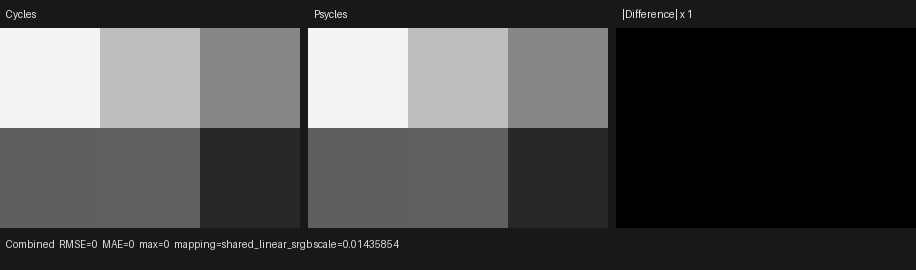
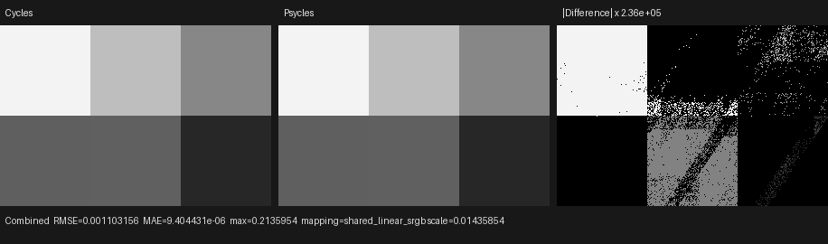

# Cycles 5.2 SVM Light Falloff validation

Date: 2026-09-01

## Scope

This milestone copies Blender Cycles 5.2.1 `LightFalloffNode` and
`svm_node_light_falloff` into the typed Psycles host compiler and Luisa SVM
interpreter. It covers:

- Blender 5.2's raw two-input, three-output socket contract;
- one shared semantic node for Quadratic, Linear, and Constant;
- the exact `SVMNodeLightFalloff` payload and per-live-output emission order;
- immediate and stack-backed Strength/Smooth inputs;
- finite quadratic, linear, and constant falloff;
- positive, zero, and negative Smooth behavior;
- Cycles' `FLT_MAX` distant-light short circuit;
- execution through the direct handler and the complete SVM program-counter
  loop on HIP, fallback, and strict native XIR-to-SPIR-V Vulkan.

The canonical Blender scene retains its original Light Falloff nodes and
links. No value, material, or closure is baked. Fallback is a backend
conformance target, not a CPU reference model; the semantic oracle is Cycles
5.2.1.

This remains a node-level SVM milestone. The copied interpreter is not yet the
production path-tracer material evaluator, so the external oracle and device
transition do not claim full-scene production SVM parity. The unchanged
production evaluator is nevertheless checked end to end against Cycles below.

Pinned references:

- Cycles 5.2.1 source: `9e2066aef7ef7e20c142ad7bd3303138a4304c93`
- diagnostic Cycles build: `cb168525138fecc792cc393f94afc39582b0103c`
- Psycles parent revision: `8a91fb036a107e955dbf8f38d5bc823a9c09a033`

## Structural correction

Cycles exposes only Strength and Smooth inputs. Distance is not an authored
socket: `svm_node_light_falloff` reads `ShaderData::ray_length` directly. The
previous Psycles graph added a third `RayLength` input and the Blender adapter
silently created a Light Path node to drive it. That changed material topology,
duplicated the context operation for multiple live outputs, and could not emit
the original Cycles instruction stream.

The public graph now has exactly the Cycles shape. The adapter interns all
three outputs under one semantic node and injects no Light Path node. The
transitional expanded production evaluator still needs ray length as an SSA
dependency; its lowering therefore creates an internal `path_ray_length`
projection after graph validation. This bridge is not a material socket and
does not enter the copied SVM payload.

The permanent import regression keeps all three outputs live and proves:

- exactly one semantic Light Falloff node exists;
- no artificial Light Path node or algebraic decomposition exists;
- the schema contains exactly Strength and Smooth;
- the resulting host SVM records match the external Cycles stream;
- the legacy production IR still projects the three live outputs and the
  distant-light scene continues to render on every backend.

## Exact host bytecode

After opcode `NODE_LIGHT_FALLOFF` (`73`, `0x49`), each record contains four
32-bit words:

```text
falloff selector
Strength SVMInputFloat
Smooth SVMInputFloat
packed output offset in byte 0, three zero pad bytes
```

Cycles emits one record for each live output, in Quadratic, Linear, Constant
order. The external 283-word stream contains the following complete five-word
records, shown as global word offset followed by opcode and payload:

```text
109: 00000049 00000000 41000000 00000000 00000000
127: 00000049 00000001 40600000 40000000 00000000
145: 00000049 00000002 3e800000 40800000 00000000
163: 00000049 00000000 40c00000 3fc00000 00000000
168: 00000049 00000001 40c00000 3fc00000 00000001
173: 00000049 00000002 40c00000 3fc00000 00000002
217: 00000049 00000000 7fc00000 7fc00001 00000002
222: 00000049 00000001 7fc00000 7fc00001 00000003
227: 00000049 00000002 7fc00000 7fc00001 00000004
265: 00000049 00000002 40000000 bf800000 00000000
```

The three records at 217/222/227 are driven by an authored Light Path node.
Strength reads Ray Length from stack lane 0, Smooth reads Ray Depth from lane
1, and the three results occupy lanes 2, 3, and 4. This retains real linked
inputs while keeping the same canonical scene executable by the current
production evaluator. The host regression rebuilds all six graphs and compares
every word of all ten records.

## Formal device transition

Let `C` be the payload cursor, `S` the SVM stack, `T` the selector, `A` and `B`
the encoded Strength and Smooth inputs, `O` the output lane, and `r` the
current `ShaderData::ray_length`. Let `load(S, x)` be Cycles' immediate-or-stack
input operation. The handler implements this transition:

```text
s = load(S, A)

if r != FLT_MAX:
    if T == QUADRATIC: s = s
    if T == LINEAR:    s = s * r
    if T == CONSTANT:  s = s * r * r

    m = load(S, B)
    if m > 0:
        q = r * r
        s = s * q / (m + q)

S[O] = s
C' = C + 4
```

Two control dependences matter. Smooth is loaded only on the finite-distance
path, after selector scaling. All distance multiply/divide instructions are
dominated by the `r != FLT_MAX` region. A permanent XIR dominance regression
checks that property, so an apparently equivalent eager `select` cannot
reintroduce `FLT_MAX * FLT_MAX` or `inf / inf`.

No slow cross-backend exact arithmetic path is used. Native floating behavior
is retained and tests use a numerical tolerance for finite values.

## External Cycles oracle

The probe, stream, clean/diagnostic render pair, and Blender export were
generated with:

```sh
/home/mike/Projects/blender-install-5.2-hiprt/blender \
  --background --factory-startup \
  --python tools/create_cycles_shader_probe.py -- \
  /tmp/light-falloff/light_falloff_matrix.blend light_falloff_matrix

PSYCLES_CYCLES_SVM_DUMP=/tmp/light-falloff/light_falloff_matrix.svm52 \
/home/mike/Projects/blender-install-psycles-trace-5.2/blender \
  /tmp/light-falloff/light_falloff_matrix.blend --background --threads 0 \
  --python tools/render_cycles_golden.py -- \
  /tmp/light-falloff/light_falloff_matrix-diagnostic-256.exr \
  300 200 256 1 --cycles-device CPU

/home/mike/Projects/blender-install-5.2-hiprt/blender \
  /tmp/light-falloff/light_falloff_matrix.blend --background --threads 0 \
  --python tools/render_cycles_golden.py -- \
  /tmp/light-falloff/light_falloff_matrix-clean-256.exr \
  300 200 256 1 --cycles-device CPU

/home/mike/Projects/blender-install-5.2-hiprt/blender \
  /tmp/light-falloff/light_falloff_matrix.blend --background \
  --python tools/export_psycles_scene.py -- /tmp/light-falloff/export
```

Adaptive sampling and denoising were disabled. The diagnostic stream contains
283 words and 11 shaders. OpenImageIO `idiff -a` reports `PASS` for the clean
and diagnostic multilayer EXRs.

I opened the retained triptych at original resolution. The two signal panels
use one shared linear display scale (`0.0143585`); their six material cells and
boundaries are visually identical, and the exact absolute-difference panel is
black. This proves that the environment-gated stream dump is observationally
inert, not that the production Psycles renderer already uses the new SVM.



| Artifact | SHA-256 |
| --- | --- |
| canonical Blender scene | `a6e516242ac5ca530fc22f354530af6a1f7d7223d3e6b835aac710190b2c8f29` |
| diagnostic SVM stream | `e7dd2af0fcd7c1158775e15082eb639a53ff50c38bb51907ced0c1781538bbdf` |
| clean Cycles CPU EXR | `1a6e3cc88bfca64c809b1354b2095cbd15625872988ec9711bfb100885f5cb2b` |
| diagnostic Cycles CPU EXR | `6f3c218e4e24cd5cd131e76ec3e2aa9909040b64e2d26ecd9de8a8f48c73d194` |
| exported `scene.json` | `29621af18da934bb5dcb985a72e10d512edfd6cdfdadd26e13e77e7ac87efb35` |
| exported `geometry.bin` | `15a20c930488c8cd90806df789deeda48c8f40d8f83c5b58b50b9412376d3d29` |
| retained triptych | `eb48eea54c45c7336012acd641a087a7d22204c912fb245787d18baa81d61071` |

## End-to-end Cycles/Psycles render

The same unchanged Blender graph was also exported and rendered through the
production Psycles HIP path:

```sh
python tools/run_cycles_shader_probes.py \
  --blender /home/mike/Projects/blender-install-5.2-hiprt/blender \
  --psycles-render build/bin/psycles_render_blender_scene \
  --output-dir /tmp/psycles-light-falloff-production-lightpath \
  --backend hip --cycles-device CPU \
  --width 300 --height 200 --samples 256 \
  light_falloff_matrix
```

The run used the RX 9070 XT for Psycles, disabled adaptive sampling and
denoising in the probe, and completed the render-only portion in `0.018718 s`
after JIT. The scene is intentionally tiny, so that timing is recorded only as
provenance and is not a Cycles/Psycles performance claim.

For both Combined and Emit, the Cycles/Psycles luminance-mean ratio was
`0.9999996554`, relative RMSE was `3.60467e-5`, normalized p99 pixel RMSE was
`1.25e-7`, and both images contained zero non-finite pixels. Normal was
byte-exact; all unrelated light passes were identically zero. Permanent gates
bound energy to `[0.99999, 1.00001]`, relative RMSE to `1e-4`, normalized p99
error to `1e-6`, and reject any non-finite Combined/Emit pixel.

At original resolution the Cycles and Psycles signal panels are visually
indistinguishable. The heavily amplified difference panel shows sparse
floating-point and triangle-boundary residuals, not a material-cell or graph
topology difference.



| Production artifact | SHA-256 |
| --- | --- |
| Cycles CPU EXR | `30aaf14442048498ca72a64278dbb0f24fe4cf4307c104d67122a4f240e1174b` |
| Psycles HIP EXR | `f6133ad19590c1cc35d02e513979e976d7283237d8730c65b96bf53df823bc08` |
| comparison report | `a7cdff905fda5d2e758fe53e05021006c45eecdc3904cf14ead8a2547d77c4c6` |
| retained production triptych | `c48dfce2132d18e79b1902b3c2b20da06bb9eb2804f4e4816d424792eff33848` |

## Cross-backend validation and code shape

The device fixture executes all ten external payloads plus three distant-light
cases. It covers all selectors, immediate and stack inputs, positive/zero/
negative Smooth, exact four-word cursor consumption, the `FLT_MAX` sentinel,
and a complete shader-jump/Light-Falloff/emission/end PC-loop program.

HIP and fallback produced byte-identical captures:

```text
a8412c21edacf0d32da53cdf9c45e583e56e9289eb475b41552a6199bcbbee26
```

Strict native Vulkan produced capture
`e98e6217ded8f85e6825dd04f9d97b52b5ee1bdc74135f00631971a4c416b57e`.
Four finite smoothed cases differ from HIP/fallback by one ULP; the exact
unsmoothed and all three distant cases agree. This is intentionally accepted
as backend-native arithmetic rather than replaced by a precision slow path.

The direct-handler AST contains 802 pre-optimization XIR instructions, zero
loops, and zero callable definitions. A permanent guard rejects more than
1,800 instructions or any loop/callable. Focused generated-code sizes are:

- HIP direct handler: 7,532 bytes of AMDGPU code and a 5,056-byte code object;
- HIP full interpreter probe: 8,332 bytes / 6,208-byte code object;
- strict Vulkan direct handler: 4,186 optimized SPIR-V words;
- strict Vulkan full interpreter probe: 5,165 optimized SPIR-V words.

The Vulkan log selected the AMD Radeon RX 9070 XT and reported native SPIR-V
optimization/compilation with `LUISA_VULKAN_DISABLE_DXC=1`.

## Permanent regressions and final validation

Regressions cover:

- Blender 5.2 raw identity, socket order, types, defaults, and linked states;
- shared semantic lowering with no synthetic public Light Path node;
- exact two-input/three-output typed schema;
- all ten complete external Cycles records and stack offsets;
- all selector/smoothing/distant transitions and cursor consumption;
- structural XIR dominance of distance arithmetic;
- complete SVM program-counter dispatch;
- unchanged legacy production distant-light behavior;
- canonical Cycles CPU versus production Psycles HIP EXR comparison;
- HIP, fallback, and strict native-XIR Vulkan execution and XIR shape;
- canonical probe registry, coverage registry, and source-size limits.

Final commands:

```sh
cmake --build build --parallel 32
ctest --test-dir build --output-on-failure -j32 \
  -E '(_fallback|_vk|_hip)$'
ctest --test-dir build --output-on-failure -j1 -R '_hip$'
ctest --test-dir build --output-on-failure -j1 -R '_fallback$'
LUISA_VULKAN_USE_XIR=1 \
LUISA_VULKAN_REQUIRE_NATIVE_XIR_SPIRV=1 \
LUISA_VULKAN_DISABLE_DXC=1 \
  ctest --test-dir build --output-on-failure -j1 -R '_vk$'
```

Final results:

- 32-thread whole-project build: passed;
- non-backend suite: 113/113 passed in 0.90 s;
- HIP suite: 105/105 passed in 28.26 s;
- fallback suite: 107/107 passed in 24.87 s;
- strict native XIR-to-SPIR-V Vulkan suite: 105/105 passed in 21.34 s.
