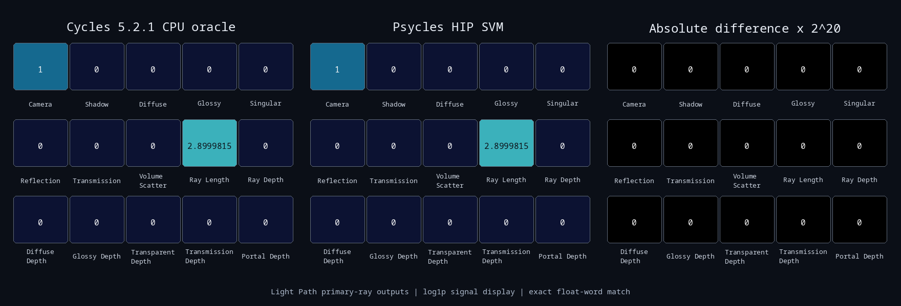
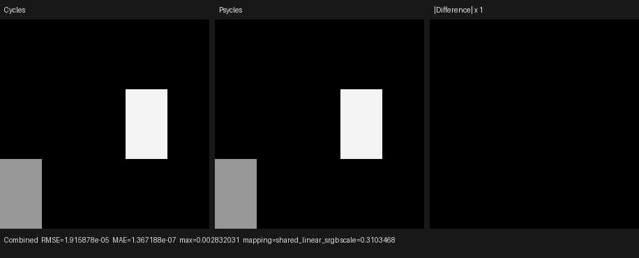

# Cycles 5.2 SVM Light Path validation

Date: 2026-09-01

## Scope

This milestone copies Blender Cycles 5.2.1's `LightPathNode` host compiler
and device transition into the Luisa SVM path. It covers the raw Blender
socket contract, the 15-output graph identity, live-output pruning, exact
SVM payloads and compile order, feature-mask behavior, and dispatch through
the real program-counter interpreter.

The canonical probe connects each original Light Path output directly to an
Emission closure. Blender exports the original graph and Psycles consumes
that graph; no material result, closure, or node output is baked or replaced
by Blender/Cycles.

This remains a node-level SVM milestone. The copied SVM interpreter is not
yet the production path-tracer material evaluator; the remaining Cycles SVM
families must be migrated before that switch. The legacy production
`surface_program` evaluator is deliberately not extended with a second Light
Path implementation.

Pinned references:

- Cycles 5.2.1 source: `9e2066aef7ef7e20c142ad7bd3303138a4304c93`
- diagnostic Cycles build: `cb168525138fecc792cc393f94afc39582b0103c`
- Psycles parent revision: `60fd75d2eb987985234e484913e26a9e7a5d52ce`

## Structural correspondence

### One Blender node remains one semantic node

Blender exposes 15 float sockets from one `ShaderNodeLightPath`. The old
adapter created a separate Psycles semantic node every time a downstream
input requested one of those outputs. A graph using several outputs therefore
duplicated the source node and could emit duplicated code.

The adapter now interns all 15 outputs under one graph-node identity. The
first requested output creates the semantic node and registers every output;
later requests resolve to that same node. A permanent import regression feeds
Portal Depth, Ray Length, and Is Camera Ray into one material in reverse
order, then proves that the imported graph contains one Light Path node and
that its SVM records retain Cycles' compile order.

### Host bytecode

For each live output, Cycles emits the opcode followed by a two-word
`SVMNodeLightPath` payload:

| Word | Field |
| ---: | --- |
| 0 | `NODE_LIGHT_PATH` (`50`) |
| 1 | `path_type` |
| 2 | `out_offset` in the low byte, then three padding bytes |

Unlinked outputs emit no record. Live outputs are emitted in the original
socket order, independent of connection order:

```text
camera, shadow, diffuse, glossy, singular, reflection, transmission,
volume_scatter, ray_length, ray_depth, ray_diffuse, ray_glossy,
ray_transparent, ray_transmission, ray_portal
```

The enum contains `NODE_LP_backfacing = 8`, but Light Path does not expose
that socket. Geometry.Backfacing uses the same device transition. The 15
Light Path outputs therefore encode path types `0..7, 9..15`; inventing a
sixteenth socket or renumbering the later outputs would be incompatible with
Cycles.

The external Cycles stream has 385 words and 20 shaders. Its 15 Light Path
records begin at global word offsets

```text
145 161 177 193 209 225 241 257 273 289 305 321 337 353 369
```

and their exact payloads are:

```text
00000032 00000000 00000000
00000032 00000001 00000000
00000032 00000002 00000000
00000032 00000003 00000000
00000032 00000004 00000000
00000032 00000005 00000000
00000032 00000006 00000000
00000032 00000007 00000000
00000032 00000009 00000000
00000032 0000000a 00000000
00000032 0000000b 00000000
00000032 0000000c 00000000
00000032 0000000d 00000000
00000032 0000000e 00000000
00000032 0000000f 00000000
```

## Formal device transition

Let `V` be path visibility, `F` be path flags, `S` be ShaderData, `P` be the
path counters, and `M` mean that `kernel_feature_node_light_path` is enabled.
For a selected path type `t`, the handler writes exactly one scalar:

```text
camera          = bool(V & CAMERA)
shadow          = bool(V & SHADOW)
diffuse         = bool(V & DIFFUSE)
glossy          = bool(V & GLOSSY)
singular        = bool(F & SINGULAR)
reflection      = bool(F & REFLECT)
transmission    = bool(V & TRANSMIT)
volume_scatter  = bool(V & VOLUME_SCATTER)
backfacing      = bool(S.flag & BACKFACING)
ray_length      = S.ray_length

ray_depth       = (M ? P.bounce : 0)
                  + bool((V & SHADOW) || (F & EMISSION))
transparent     = M ? P.transparent_bounce : 0
diffuse_depth   = M ? P.diffuse_bounce : 0
glossy_depth    = M ? P.glossy_bounce : 0
transmission_depth = M ? P.transmission_bounce : 0
portal_depth    = M ? P.portal_bounce : 0
```

The ray-depth increment is one Boolean disjunction, not the sum of two
indicators: a path that is both shadow and emission advances by one, not two.
The feature mask guards only counter reads; when the counter feature is absent,
shadow/emission can still make Ray Depth equal one. Regressions cover the
four `(shadow, emission)` combinations and a disabled transparent counter.
Every case consumes exactly the two payload words.

The device switch now follows Cycles' source order, including Transparent
Depth immediately after Ray Depth. No callable annotations, software
arithmetic substitutes, or precision-only slow paths were added.

## External Cycles oracle

The probe is reproducible through the project's canonical scene generator:

```sh
/home/mike/Projects/blender-install-5.2-hiprt/blender \
  --background --factory-startup \
  --python tools/create_cycles_shader_probe.py -- \
  /tmp/light-path/light_path_matrix.blend light_path_matrix

/home/mike/Projects/blender-install-5.2-hiprt/blender \
  /tmp/light-path/light_path_matrix.blend --background --threads 0 \
  --python tools/render_cycles_golden.py -- \
  /tmp/light-path/light_path_matrix-cycles-1024.exr \
  300 300 1024 1 --cycles-device CPU

PSYCLES_CYCLES_SVM_DUMP=/tmp/light-path/light_path_matrix.svm52 \
/home/mike/Projects/blender-install-psycles-trace-5.2/blender \
  /tmp/light-path/light_path_matrix.blend --background --threads 0 \
  --python tools/render_cycles_golden.py -- \
  /tmp/light-path/light_path_matrix-diagnostic-1024.exr \
  300 300 1024 1 --cycles-device CPU

/home/mike/Projects/blender-install-5.2-hiprt/blender \
  /tmp/light-path/light_path_matrix.blend --background \
  --python tools/export_psycles_scene.py -- /tmp/light-path/export
```

Adaptive sampling and denoising were disabled. The clean and diagnostic
renders differ as EXR files because volatile Date and RenderTime header fields
differ, but all 17 multilayer subimages are bitwise identical for every float
word. Their sidecars also record the distinct clean and diagnostic build
identities. This proves that the diagnostic SVM copy is observationally inert.

| Artifact | SHA-256 |
| --- | --- |
| canonical Blender scene | `afc5f78c47a181b6429849d304dd280b91d26ec9c1962d1628ad67e31e261052` |
| diagnostic SVM stream | `f067e0965be1ae6a13eb07f9678255ca0dcd84e187fa0e17f8861f190be44489` |
| clean Cycles CPU EXR | `01168ed86e9159ed01c872bbf2cb874651f39d32862b17e07e44bb158f036235` |
| diagnostic Cycles CPU EXR | `c74efb182cb9e6b818e463f0dae611460f593267ea3c0e06d59a9a500d9851de` |
| exported `scene.json` | `201121fd34c56ff32420d1f8206a023c53fa682cf01e6da24f0f3a3768060bc6` |
| exported `geometry.bin` | `264b7e9c6d76b6dbf1ad5b2c211a8bd86d4079d96031ed31521249c8d3f72226` |

On primary camera rays, the external Cycles output vector is:

```text
1 0 0 0 0  0 0 0 2.8999815 0  0 0 0 0 0
```

HIP reproduced every float word exactly. Fallback and strict native Vulkan
produced byte-identical captures. The retained 1,760x600 triptych was opened
at original resolution: both signal panels are visually identical and the
absolute-difference panel, amplified by `2^20`, is black.



This is a node-level visual oracle, not a production full-scene Psycles
render.

### HIP end-to-end compatibility probe

The same canonical scene was also run through the current production renderer
at 300x300 and 1,024 spp on HIP:

```sh
python tools/run_cycles_shader_probes.py \
  --blender /home/mike/Projects/blender-install-5.2-hiprt/blender \
  --psycles-render build/bin/psycles_render_blender_scene \
  --output-dir /tmp/psycles-light-path-e2e-hip \
  --backend hip --cycles-device CPU \
  --width 300 --height 300 --samples 1024 \
  light_path_matrix
```

Combined and Emission have an energy ratio of `0.9999997708`, RMSE
`1.9158775e-5`, and relative RMSE `2.4189177e-5`. Exactly seven of 90,000
pixels differ; p95 and p99 pixel RMSE are both zero. The maximum absolute
error is `0.0028320313`. Normal RMSE is `1.7770672e-8`, and every other
reported pass is exactly zero on both renderers. I opened the retained
916x370 Combined triptych at original resolution; both signal panels are
visually aligned and no structural difference is visible.



The triptych SHA-256 is
`d12d1e382d3de51f748086e568d2ba95ca3712028582781cd101556cc3cb9d4e`.
This compatibility run validates the raw-graph adapter and the current
production evaluator. It is intentionally not used as evidence that the new
Cycles-bytecode interpreter has already replaced that production evaluator.

## Synthetic state coverage and code shape

An independent device state exercises all 16 enum values, including the
shared Backfacing case. It uses camera, transparent-shadow, diffuse, and
volume-scatter visibility; reflection and emission flags; a backfacing
surface; ray length 12.5; and counters `(3, 4, 5, 6, 7, 8)`. The result is:

```text
path type: 0 1 2 3 4 5 6 7 8  9    10 11 12 13 14 15
value:     1 1 1 0 0 1 0 1 1 12.5   4  5  6  4  7  8
```

HIP, fallback, and strict Vulkan captures are byte-identical:

```text
synthetic: 7e50b2bae14f10175731d8dc015f429ce8a5c93b960fc4ec5b4bba150817b5a2
primary:   f0668952844199c3c4ff81cfec894da0edd725b48fece4748e8ffa4ed0c2f4f1
```

Pre-optimization direct-handler XIR contains 893 instructions, zero loops,
and zero callable definitions. Focused generated-code results:

- HIP direct handler: 4,544-byte AMDGPU code and 4,416-byte code object
- HIP feature-mask handler: 4,492-byte AMDGPU code and 3,904-byte code object
- HIP primary oracle: 4,476-byte AMDGPU code and 3,776-byte code object
- HIP full interpreter: 8,224-byte AMDGPU code and 5,952-byte code object
- strict Vulkan direct handler: 4,067 to 3,975 SPIR-V words
- strict Vulkan feature-mask handler: 4,168 to 3,913 SPIR-V words
- strict Vulkan primary oracle: 3,996 to 3,875 SPIR-V words
- strict Vulkan full interpreter: 5,341 to 5,098 SPIR-V words

## Regression and validation commands

Permanent regressions cover:

- all 15 Blender 5.2 raw output identifiers, names, types, and live links;
- one semantic graph node shared by several requested outputs;
- all 15 path-type payloads and fixed live-output emission order;
- every device enum value, cursor advancement, feature-mask truth table, and
  the external primary-ray Cycles oracle;
- Light Path records executed through the complete SVM program-counter loop;
- XIR instruction, loop, and callable-count guards.

The final whole-project commands are:

```sh
cmake --build build --parallel 32
ctest --test-dir build --output-on-failure -j32 \
  -E '(_fallback|_vk|_hip)$'
ctest --test-dir build --output-on-failure -R '_hip$' -j1
ctest --test-dir build --output-on-failure -R '_fallback$' -j1
LUISA_VULKAN_USE_XIR=1 \
LUISA_VULKAN_REQUIRE_NATIVE_XIR_SPIRV=1 \
LUISA_VULKAN_DISABLE_DXC=1 \
  ctest --test-dir build --output-on-failure -R '_vk$' -j1
```

Full-suite results after the 32-thread whole-project build:

- non-backend: 105/105 passed
- HIP: 102/102 passed
- fallback: 104/104 passed
- strict native XIR-to-SPIR-V Vulkan, DXC disabled: 102/102 passed
