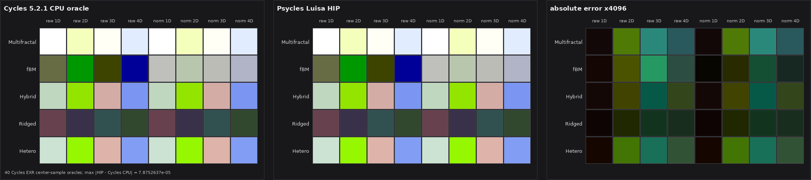

# Cycles 5.2 SVM Noise Texture validation

Date: 2026-09-01

## Scope

This milestone copies Blender Cycles 5.2.1's Noise Texture host encoding and
device evaluation into the Luisa SVM path. It covers the four coordinate
dimensions, all five fractal modes, normalization, distortion, optional Factor
and Color outputs, embedded `TextureMapping`, and execution through the real
SVM program-counter loop.

It does not claim full-scene parity yet. The copied SVM interpreter is not yet
the production path-tracer material evaluator, and the remaining SVM node
families still have to be migrated before a Blender scene can use this path
end-to-end.

Pinned references:

- Cycles source: `9e2066aef7ef7e20c142ad7bd3303138a4304c93`
- diagnostic-only Cycles bytecode dumper:
  `cb168525138fecc792cc393f94afc39582b0103c`
- Psycles parent revision: `2d507b29c91732beee2be8c74ae38a9730bb45d5`

## Structural correspondence

The host compiler emits the exact Cycles `SVMNodeTexNoise` payload after the
`NODE_TEX_NOISE` opcode:

| Word | Cycles field | Psycles source |
| ---: | --- | --- |
| 0 | `dimensions` | static `Dimensions` property |
| 1 | `noise_type` | static `NoiseType` property |
| 2 | `normalize` | static `Normalize` property |
| 3..10 | `w`, `scale`, `detail`, `roughness`, `lacunarity`, `offset`, `gain`, `distortion` | immediate-or-stack `SVMInputFloat` |
| 11 | `vector`, `value_offset`, `color_offset` | four packed stack bytes |

The node uses the inherited Cycles `TextureNode` compilation protocol:
`TextureMapping::compile_begin`, the texture payload, then
`TextureMapping::compile_end`. The default `Normalize` property is `true`, as
in Cycles 5.2.1.

The device transition is defined over the tuple
`(stack, cursor, dimensions, type, normalize)`. It consumes exactly 12 payload
words, then performs the Cycles operations in this order:

1. Load the vector and all immediate-or-stack inputs.
2. Clamp Detail to `[0, 15]`, clamp Roughness below at zero, and multiply both
   vector and W coordinates by Scale.
3. Select the 1D, 2D, 3D, or 4D coordinate domain.
4. If Distortion is nonzero, perturb each coordinate component with the same
   dimension-specific Cycles hash seeds and signed Perlin noise.
5. Select multifractal, fBM, hybrid multifractal, ridged multifractal, or
   hetero terrain. Normalize affects fBM only, matching Cycles.
6. Reuse the Factor as Color R; evaluate Color G/B with the Cycles dimension
   seeds only when the Color stack offset is valid.
7. Store each output only when its Cycles stack offset is valid.

For hybrid multifractal, let the loop state be
`S = (p, power, value, weight, i)`. The Luisa loop guard is exactly
`weight > 0.001 && i <= trunc(detail)`, and its state transition preserves the
Cycles statement order. The fractional remainder is evaluated under the same
`remainder != 0 && weight > 0.001` guard. This replaces the former fixed-count
loop with a guarded body, which produced the same ordinary values but kept
executing empty loop-control iterations after the Cycles termination
condition. The XIR shape regression counts both `LoopInst` and
`SimpleLoopInst`; otherwise changing from `$for` to the source-isomorphic
`$while` would incorrectly appear to remove four loops.

The generated module contains 12 callable definitions: four signed-noise
dimension callables, four fractal-selection callables, and four complete
texture callables. Type and Normalize remain runtime payload values inside
each dimension family, avoiding a 5 x 4 x 2 specialization cross-product.

## External Cycles oracles

The diagnostic Cycles build only copies the already-compiled SVM word stream.
The renderer and kernels remain those of the pinned Cycles source. A typical
matrix render/dump command was:

```sh
PSYCLES_CYCLES_SVM_DUMP=/tmp/psycles-svm-noise.56lElk/noise_fbm_matrix.svm52 \
  /home/mike/Projects/blender-install-psycles-trace-5.2/blender \
  /tmp/psycles-svm-noise.56lElk/noise_fbm_matrix.blend \
  --background --python tools/render_cycles_golden.py -- \
  /tmp/psycles-svm-noise.56lElk/noise_fbm_matrix.exr \
  64 64 1 0 --cycles-device CPU
```

The five 4 x 4 matrix scenes cover all dimensions, raw/normalized evaluation,
and Factor/Color consumption. The permanent device regression stores the
center-pixel values as exact float bit patterns from these Cycles CPU EXRs.

| Fractal mode | Blend SHA-256 | SVM stream SHA-256 | EXR SHA-256 |
| --- | --- | --- | --- |
| fBM | `198fe9a1ee232a5e642a2733537a49deff42e1c7654dc55c39195f3fbab25369` | `3243c0978c20c0a319d7a331fcae39f59b02c64a41a95dd6f76688c8ca572152` | `d2ef053734aa91e95e9a790a0e50d6f556b8b76d0166de3285225d31284cdcf4` |
| multifractal | `2a69c3dadb2ad48e72406c13342b0b1de2c907806c9e6e039fd7b274087dad6e` | `2d73da028eebbb21537916e56c2ab146972f9088a6e341e3c1fcab03b2be4963` | `f521a96b4c8d03ed47d95db9b65b176a940e2b7c685ccff81a5085c9bcf55e49` |
| hybrid multifractal | `1281e472ca1f449e7d565c36a1623ff9abc85e0b86d2e136b05ee968380e1cc5` | `8324bd834b19a2a03f05de9523d361d9eb9071080b1da6c83ec4dd168ff12a37` | `d46d206b47e017fd78893a46d23995c9ee837476ed16d7d632d62d54d436533c` |
| ridged multifractal | `713d969bc848a8e939d801aa4b61cf4df76500f01f58cd6b664402cd9d527079` | `18ecbeecd099da659110bdfd5c8bbb5e138ff3526c91ddac580106b28b8ba188` | `0fe58cee4120dba30ad1cdf557fd4572ab840ebf03b23e0b6ffe0df937eb903b` |
| hetero terrain | `83c3e115885e5c12e41ed59a8991e02b4bd6c26fcd33236e81f7166f2af3293f` | `87b612fef8d2e597a16b9d5ee0e57447ea1ba3a4a4209dcc1f41d6face4978b4` | `cd05ec7a88bbf8b37edcb7920778cb192eda2703648274a085bd73cad24a1d4d` |

Two linked-coordinate probes lock complete shader-local bytecode streams:

| Probe | Blend SHA-256 | SVM stream SHA-256 | EXR SHA-256 |
| --- | --- | --- | --- |
| Factor 2D | `02a454ccc9188a4e58e1a043187ae00e1e41b9a245b58eca9e72de99d2fbf1e3` | `efbc74533ca82fedd4bfd0a42e7901a29f0d015150ee8ca5cfe3879dc5277f8b` | `41075fee266c305a26c0510cfa88e677974189731063f7d974fb89666de50f2f` |
| Color 3D | `41fbae44012af2611a5722070af4fee144a8b24e9a3602a2ebc7d02363876063` | `d4c3b180cefb36a2507968dcf9166b421e41e6bd309a5a2d930c879904cc8412` | `fc6cb131620603e2c61487d1d26c9489c188604f1287b995887f0ade4bc44515` |

## Numerical and visual check

The 40-case device matrix was run with fast math disabled. HIP, fallback, and
strict Vulkan all had the same maximum absolute difference from the Cycles CPU
EXR values: `7.87526369e-05`. The regression tolerance is `1e-4` relative to
`max(1, abs(expected))`. This deliberately accepts insignificant backend
floating-point differences instead of replacing efficient native operations
to chase bit identity.

The first two panels below use the same clamped linear-to-display transform and
are visually indistinguishable. The third panel magnifies absolute linear RGB
error by 4096 so the residual floating-point pattern is visible. Each row is a
fractal mode; columns are raw 1D..4D followed by normalized 1D..4D. The Cycles
panel comes from the exact EXR center-sample bits, while the Psycles panel was
captured from the HIP device regression.



This is a node-level visual oracle, not a production full-scene render.

## Validation

Build and focused tests:

```sh
cmake --build build --parallel 32 \
  --target psycles_cycles_svm_noise_tests \
           psycles_luisa_cycles_svm_noise_tests
ctest --test-dir build --output-on-failure \
  -R '^psycles\.cycles_svm_noise$'

PSYCLES_REPORT_SHADER_SHAPES=1 \
PSYCLES_CAPTURE_CYCLES_SVM_NOISE=/tmp/psycles-cycles-svm-noise-hip.tsv \
  build/bin/psycles_luisa_cycles_svm_noise_tests hip
build/bin/psycles_luisa_cycles_svm_noise_tests fallback
LUISA_VULKAN_USE_XIR=1 \
LUISA_VULKAN_REQUIRE_NATIVE_XIR_SPIRV=1 \
LUISA_VULKAN_DISABLE_DXC=1 \
  build/bin/psycles_luisa_cycles_svm_noise_tests vk
```

Focused results:

- exact host stream and payload tests: passed
- HIP direct handler, clamp/output, and full interpreter tests: passed
- fallback direct handler, clamp/output, and full interpreter tests: passed
- strict native XIR to SPIR-V Vulkan tests with DXC disabled: passed
- pre-optimization XIR: 34,918 instructions, 12 callable definitions, 20 loops
- HIP direct matrix kernel: 101,564-byte AMDGPU code and 145,008-byte code object
- HIP full interpreter probe: 146,276-byte AMDGPU code and 219,928-byte code object
- strict Vulkan direct matrix kernel: 37,932 to 26,599 SPIR-V words
- strict Vulkan full interpreter probe: 39,345 to 27,819 SPIR-V words

Full-suite results after a 32-thread whole-project build:

- non-backend: 86/86 passed
- HIP: 94/94 passed
- fallback: 96/96 passed
- strict native XIR to SPIR-V Vulkan, DXC disabled: 94/94 passed

The host regression compares every word of two complete external shader-local
streams, all 5 x 4 x 2 payload combinations, embedded mapping, and invalid
static properties. Device tests cover all 40 external values, exact 12-word
cursor advancement, input clamps, independently invalid Factor/Color offsets,
and a complete external shader stream through `eval_nodes`.
