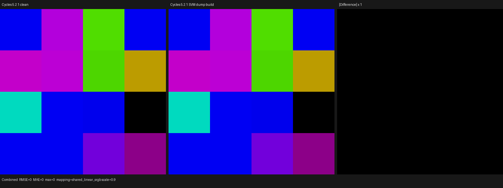

# Cycles 5.2.1 Normal Map and Tangent SVM validation

This increment copies Blender Cycles 5.2.1 Normal Map and Tangent into the
isomorphic Psycles SVM path. It preserves the Cycles node stream, typed
payloads, attribute identifiers, shared stack, and program-counter loop. It
does not route either node through the former `SurfaceProgram`, bake a normal
or tangent, or add a Psycles CPU reference implementation.

The semantic oracle is the pinned Cycles revision
`9e2066aef7ef7e20c142ad7bd3303138a4304c93`.

## Source correspondence

| Cycles 5.2.1 source | Psycles implementation |
| --- | --- |
| `scene/shader_nodes.cpp`, `NormalMapNode::compile` | `cycles_svm_normal_nodes.cpp`, `NormalMapNode::compile` |
| `scene/shader_nodes.cpp`, `TangentNode::compile` | `cycles_svm_normal_nodes.cpp`, `TangentNode::compile` |
| `kernel/svm/tex_coord.h`, `svm_node_normal_map` | `cycles_svm_normal.cpp`, `node_normal_map` |
| `kernel/svm/tex_coord.h`, `svm_node_tangent` | `cycles_svm_normal.cpp`, primal and dual Tangent evaluation |
| `kernel/geom/triangle.h`, smooth object-space normal helper | `cycles_svm_triangle.cpp` |
| `kernel/util/math_dual.h`, dual normalize/cross | `cycles_svm_dual_math.cpp` and `cycles_svm_normal.cpp` |
| object normal transforms | `cycles_svm_vector_transform.cpp` |

The shared triangle-normal helper was moved out of Texture Coordinate rather
than copied a second time. Normal Map and Texture Coordinate therefore use one
implementation of vertex/corner normal selection, motion indexing, transform-
applied handling, barycentric interpolation, safe normalization, and geometric
normal fallback.

## Host encoding and Blender import

Normal Map emits the exact ten-word `SVMNodeNormalMap` payload after its opcode:

```text
space, invert_green, use_original_base, attr, attr_sign,
color.x, color.y, color.z, strength, packed normal output byte
```

Tangent emits the exact four-word `SVMNodeTangent` payload:

```text
direction_type, axis, attr, packed tangent output byte
```

The external diagnostic Cycles capture freezes these complete records:

```text
Normal Map:
0000004e 00000000 00000000 00000000 00000006 00000007
3f266666 3eb33333 3f733333 3f333333 00000000

Radial Tangent:
0000004c 00000000 00000001 0000000b 00000000

UV Tangent:
0000004c 00000001 00000002 00000006 00000000
```

Named UV attributes retain Cycles' spelling and scene-wide interning:

```text
current tangent:       <uv>.tangent, <uv>.tangent_sign
original tangent:      <uv>.undisplaced_tangent,
                       <uv>.undisplaced_tangent_sign
unnamed current frame: ATTR_STD_UV_TANGENT and SIGN
unnamed original:      ATTR_STD_UV_TANGENT_UNDISPLACED and SIGN_UNDISPLACED
```

A focused Blender JSON regression verifies that `uv_map`, `direction_type`,
`axis`, `space`, `base`, and `convention` survive import as typed graph
properties and then produce the expected SVM attribute identifiers. The legacy
`UvMapId` property remains only for the still-existing `SurfaceProgram`
boundary; the exact compiler consumes the original attribute name.

## Formal device transitions

Let `S` be the 255-float Cycles stack and `C` the payload cursor. Normal Map
first performs the common transition

```text
color = 2 * (load3(S, color_input) - 0.5)
if invert_green: color.y = -color.y
N = sd.N
strength = load(S, strength_input)
```

For tangent space, evaluation is defined only when the hit belongs to a
triangle object and both tangent attributes exist. Otherwise the transition
stores `sd.N`. The valid branch selects the same unnormalized object-space
base as Cycles:

```text
smooth + original normal attribute found -> that attribute; linear strength
smooth otherwise                         -> interpolated triangle normals
flat                                     -> backface-corrected sd.Ng,
                                            inverse-normal transformed
```

Tangent-space strength scales `x/y` directly and mixes `z` toward one with a
saturated strength. Object/world modes instead use the Cycles linear
interpolation against `sd.N`. Blender object/world modes invert both `y` and
`z`; DirectX convention independently inverts the source green channel. The
final zero/non-finite guard restores `sd.N`. Every path advances `C` by exactly
ten words.

For Tangent, let `A` be the resolved attribute value or derivative triple:

```text
UV mode, missing A -> zero and return
UV mode, float2 A  -> (A.x, A.y, 0)
UV mode, otherwise -> float3 A
radial, missing A  -> shading_position(sd)
radial, present A  -> float2/float3 A

t = radial_axis_projection(A) when radial, else A
t = object_normal_transform(t)
t = cross(sd.N, normalize(cross(t, sd.N)))
```

The dual opcode applies the same expressions to value, `dx`, and `dy`, then
stores them in the Cycles layout `value[0..2], dx[3..5], dy[6..8]`. It is not a
finite-difference approximation. Every primal or dual path advances `C` by
exactly four words.

## Derivative propagation boundary

Cycles does not mark every Tangent ancestor as derivative-bearing. Its
`ImageTextureNode::update_images` seeds the ancestor traversal only when image
metadata reports both tiles and mipmaps and the scene uses the texture cache.
The current Psycles `ImageDesc` and exact image binding do not claim that
texture-cache mode, so this increment deliberately does not invent a blanket
"all image textures need derivatives" rule. The exact
`NODE_TANGENT_DERIVATIVE` handler, stack layout, cursor transition, and
interpreter dispatch are nevertheless implemented and permanently tested.
The graph-level Tangent capability is consequently `surface | attributes`,
not an unconditional `derivatives` bit.
When tiled texture-cache metadata is added, the remaining host work is to copy
Cycles' queue-based ancestor marking under that same predicate.

## Production integration boundary

A real Blender export and HIP render was attempted at 64x64, 4 spp with the
`svm_tangent_dynamic` scene. Blender creation, Cycles CPU rendering, and scene
export succeeded. The Psycles process then rejected the graph before device
dispatch with:

```text
surface lowering is not implemented for node type 'psycles.tangent'
surface root was not lowered
```

That failure is the known boundary between the former `SurfaceProgram` and the
new exact Cycles SVM interpreter; it is not a defect in the HIP handler. This
increment deliberately does not add a transitional Tangent operation to the
former program. The probe registry now formally partitions production
canonical probes from Cycles-SVM-oracle-only probes, keeps the two sets
disjoint, and leaves `svm_tangent_dynamic` reproducible through the probe
creator without making the canonical end-to-end runner fail by construction.

## Cross-backend validation

The direct device matrix contains:

- 15 Normal Map cases covering all spaces/conventions represented by the
  handler, positive/zero/negative strength, tangent and original bases,
  backfaces, missing attributes, ineligible primitives, triangle-normal
  fallback, and zero/non-finite fallback;
- five primal Tangent cases covering float2/float3 UV attributes, missing UV,
  radial shading-position fallback, and Generated attributes;
- two dual Tangent cases that freeze nonzero triangle-interpolated `dx/dy` and
  missing-attribute zeroing;
- one complete interpreter program containing `NODE_NORMAL_MAP`,
  `NODE_TANGENT`, `NODE_TANGENT_DERIVATIVE`, Emission Weight, Closure Emission,
  and End.

Fallback, HIP, and strict native Vulkan all pass. Vulkan was run with:

```text
LUISA_VULKAN_USE_XIR=1
LUISA_VULKAN_REQUIRE_NATIVE_XIR_SPIRV=1
LUISA_VULKAN_DISABLE_DXC=1
```

The log contains native SPIR-V optimization/compilation only. Focused generated
code sizes were:

| Kernel | HIP LLVM code | HIP code object | optimized SPIR-V words |
| --- | ---: | ---: | ---: |
| Normal Map direct | 12,264 B | 12,992 B | 13,322 |
| Tangent primal | 6,816 B | 8,128 B | 9,834 |
| Tangent dual | 8,196 B | 9,920 B | 11,614 |
| complete interpreter | 17,856 B | 21,312 B | 23,739 |

These are compile/code-shape observations, not end-to-end rendering performance
claims.

```sh
cmake --build build --parallel 32

ctest --test-dir build --output-on-failure -R \
  'psycles\.(cycles_svm_normal|blender_normal_map_tangent_import|luisa_cycles_svm_normal_map_tangent_(fallback|hip|vk))'
```

The encountered source-size regression was also repaired structurally:
`_invert_color_matrix` now lives in `cycles_shader_probe/color_operations.py`
instead of leaving `texture_inputs.py` above the 2,000-line project limit.
The probe runner contract and Python compilation both pass after the move.

The complete 460-test CTest matrix passes. The Blender export contract verifies
that the canonical creator set exactly equals the production runner set, the
Cycles-SVM-oracle set is disjoint, and their union exactly equals the complete
creator registry.

## External visual oracle

The 16-cell Normal Map matrix covers tangent, object, world, Blender-object,
and Blender-world spaces, strengths, mirrored tangent signs, backfaces, and a
nontrivial object transform. It was rendered independently by the clean and
diagnostic Cycles 5.2.1 builds at 512x512, 16 spp, with adaptive sampling and
denoising disabled:

```sh
/home/mike/Projects/blender-install-5.2-hiprt/blender \
  --background --factory-startup \
  --python tools/create_cycles_shader_probe.py -- \
  /tmp/psycles-normal-map-tangent-validation-20260901/normal_map_matrix.blend \
  normal_map_matrix

PSYCLES_CYCLES_SVM_DUMP=/tmp/psycles-normal-map-tangent-validation-20260901/normal_map_matrix.svm52 \
/home/mike/Projects/blender-install-psycles-trace-5.2/blender \
  /tmp/psycles-normal-map-tangent-validation-20260901/normal_map_matrix.blend \
  --background --threads 0 --python tools/render_cycles_golden.py -- \
  /tmp/psycles-normal-map-tangent-validation-20260901/normal-map-diagnostic.exr \
  512 512 16 1 --cycles-device CPU
```

`idiff -a` reports `PASS`. Combined maximum absolute error, RMSE, and mean
absolute error are all zero over 262,144 pixels. I opened the retained
1,552x582 triptych at original resolution: all sixteen colored cells and their
hard boundaries are identical in the two signal panels, and the difference
panel is uniformly black.



| Artifact | SHA-256 |
| --- | --- |
| canonical `.blend` | `8d9d8c185a097e3cae42a7fc6e7c0f94db3027de0756b292b2637b0c63a55269` |
| diagnostic SVM stream | `e6255863bc5d0e3d794f0770b2f31ddbe6d074192e94ad0c0b768a559f5c029a` |
| clean Cycles EXR | `0e4a5d9257486878aef27e569c8123e4e76bf4e35b3be293b28fc725d9240ca7` |
| diagnostic Cycles EXR | `263af388d50bcfa741b33895ef356ff9759f2bda4217543f9e8752a0e4cf7fe7` |
| retained triptych | `50311840343bc8bb4eb390ff11d9f2597ee1b0fde1c7aab3787914a3714a4783` |

This visual proves that the external stream oracle is observationally inert.
The Luisa handler parity is established by the cross-backend numerical and
interpreter regressions above; this is not presented as a production full-
scene exact-SVM render comparison before that path is wired into the renderer.

## Remaining exact runtime boundary

A mechanical comparison now finds 85 of 108 Cycles `SVM_CASE` opcodes in the
Psycles interpreter. Normal Map plus both Tangent opcodes reduce the missing
set from 26 to 23:

```text
NODE_AMBIENT_OCCLUSION
NODE_AOV_COLOR
NODE_AOV_START
NODE_AOV_VALUE
NODE_BEVEL
NODE_CLOSURE_HOLDOUT
NODE_CLOSURE_SET_NORMAL
NODE_CLOSURE_VOLUME
NODE_DISPLACEMENT
NODE_ENTER_BUMP_EVAL
NODE_LEAVE_BUMP_EVAL
NODE_MAP_RANGE
NODE_PRINCIPLED_VOLUME
NODE_RADIAL_TILING
NODE_RAYCAST
NODE_SCENE_TIME
NODE_SET_DISPLACEMENT
NODE_TEX_SKY
NODE_VALUE_F_DERIVATIVE
NODE_VALUE_V_DERIVATIVE
NODE_VECTOR_DISPLACEMENT
NODE_VECTOR_MAP_RANGE
NODE_VOLUME_COEFFICIENTS
```
