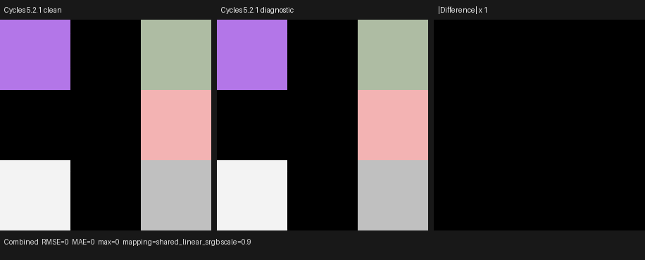

# Cycles 5.2 SVM Normal-node validation

Date: 2026-09-01

## Scope

This milestone replaces Psycles' alternate three-node Vector Math lowering of
Blender's Normal node with an isomorphic implementation of Blender Cycles
5.2.1 `NormalNode` and `svm_node_normal`. It covers:

- Blender 5.2's raw input/output socket contract;
- one typed semantic node shared by the Normal and Dot outputs;
- the exact `SVMNodeNormal` payload and Cycles stack-offset encoding;
- Cycles' linear-operation classification;
- immediate and stack-backed Normal inputs;
- invalid-output pruning, unchecked zero-vector normalization, and exact
  seven-word cursor consumption;
- execution through both the direct handler and the real SVM program-counter
  loop on HIP, fallback, and strict native XIR-to-SPIR-V Vulkan.

The canonical Blender scene retains the original Normal nodes and links. No
value, material, or closure is baked. Fallback is a backend conformance target,
not a CPU reference model; the semantic oracle is Cycles 5.2.1.

This remains a node-level SVM milestone. The copied SVM interpreter is not yet
the production path-tracer material evaluator, so this work deliberately does
not add a second Normal implementation to the legacy `surface_program` path.
The external oracle and device-transition results therefore do not claim
full-scene Psycles render parity yet.

Pinned references:

- Cycles 5.2.1 source: `9e2066aef7ef7e20c142ad7bd3303138a4304c93`
- diagnostic Cycles build: `cb168525138fecc792cc393f94afc39582b0103c`
- Psycles parent revision: `4fae952679bcde776c73d5036e4179fa65123144`

## Structural correspondence

Cycles declares one authored `direction` parameter, one Normal input, and the
Normal and Dot outputs. Blender stores the authored direction on the raw
Normal output socket rather than on the input socket. The adapter therefore
copies that output default into the semantic node's typed `Direction` runtime
property, while the input remains a normal-typed input binding.

Both raw outputs are interned under the same semantic node. This preserves the
original Cycles node identity and guarantees that asking for both outputs does
not build or evaluate duplicate normalization work. The previous lowering into
Normalize Direction, Normalize Input, and Dot Product nodes has been removed.

`Direction` is material data, not shader topology. Changing only that value
keeps the shader structure signature fixed and changes the parameter signature.
The host node also returns true from `is_linear_operation()`, matching Cycles'
classification used by graph analyses such as automatic bump and volume
linearity propagation.

## Exact host bytecode

After the opcode, `SVMNodeNormal` occupies seven 32-bit words:

```text
input Normal x, y, z
packed(normal output byte 0, dot output byte 1, pad bytes 2 and 3)
direction x, y, z
```

An unlinked input is stored as three immediate float words. A linked input
stores `SVM_INPUT_STACK_OFFSET_MASK | offset` in its first word and zero in the
remaining two words. Output offset `0xff` means invalid. Thus the external
single-output and both-output forms pack as:

```text
Dot only:    0x000000ff
Normal only: 0x0000ff00
Both:        0x00000300
```

The external Cycles stream contains the following complete eight-word records,
shown as global word offset followed by opcode and payload:

```text
121: 00000048 00000000 00000000 40800000 000000ff 00000000 00000000 40000000
154: 00000048 c0400000 00000000 00000000 000000ff 40000000 00000000 00000000
187: 00000048 40800000 c0000000 3f800000 000000ff 3f800000 40000000 40400000
220: 00000048 3f800000 40000000 40400000 000000ff 00000000 00000000 00000000
253: 00000048 00000000 00000000 00000000 000000ff 3f800000 40000000 40400000
286: 00000048 00000000 40400000 00000000 0000ff00 40000000 00000000 00000000
330: 00000048 41000000 3f800000 c0000000 0000ff00 00000000 c0400000 40800000
374: 00000048 3f800000 40000000 40400000 0000ff00 00000000 00000000 00000000
418: 00000048 c0800000 40a00000 3f800000 00000300 3f800000 c0000000 40400000
```

The host regression rebuilds all nine semantic graphs and compares all eight
words of every record. The adapter regression also freezes the final BOTH
record end to end from Blender JSON through graph normalization and SVM
compilation.

## Formal device transition

Let `C` be the payload cursor, `S` the SVM stack, `I=(i0,i1,i2)` the encoded
input, `P` the packed output offsets, and `D=(dx,dy,dz)` the authored direction.
Define `load3(S,I)` as Cycles' immediate-or-stack input operation and `N(v)` as
its unchecked normalize operation. Then the transition is:

```text
n = load3(S, I)
d = N(D)

if byte(P, 0) != 0xff:
    S[byte(P, 0) .. byte(P, 0) + 2] = d

if byte(P, 1) != 0xff:
    S[byte(P, 1)] = dot(d, N(n))

C' = C + 7
```

The zero vector is outside the domain of Cycles' unchecked normalize, so its
result remains non-finite. This is a structural boundary, not a request for a
particular NaN payload. Nonzero vectors use each backend's native reciprocal
square-root path; tests use numerical tolerance and do not force cross-backend
1-ULP identity with a slower scalar sequence.

The first HIP execution exposed an ordering defect in the initial Luisa copy:

```cpp
make_float3(cursor.floating(), cursor.floating(), cursor.floating())
```

Each argument mutates the same cursor, while C++ does not specify a
left-to-right function-argument evaluation order. GCC evaluated the reads in
reverse order and transformed xyz into zyx. The implementation now performs
three explicitly sequenced reads before constructing the vector. A source
audit of the SVM handlers found no other expression containing multiple
mutating `cursor.word()` or `cursor.floating()` calls, and the asymmetric
direction cases permanently detect any recurrence.

## External Cycles oracle

The probe, stream, render pair, and Blender export were generated with:

```sh
/home/mike/Projects/blender-install-5.2-hiprt/blender \
  --background --factory-startup \
  --python tools/create_cycles_shader_probe.py -- \
  /tmp/normal/normal_node_matrix.blend normal_node_matrix

PSYCLES_CYCLES_SVM_DUMP=/tmp/normal/normal_node_matrix.svm52 \
/home/mike/Projects/blender-install-psycles-trace-5.2/blender \
  /tmp/normal/normal_node_matrix.blend --background --threads 0 \
  --python tools/render_cycles_golden.py -- \
  /tmp/normal/normal_node_matrix-diagnostic-256.exr \
  300 300 256 1 --cycles-device CPU

/home/mike/Projects/blender-install-5.2-hiprt/blender \
  /tmp/normal/normal_node_matrix.blend --background --threads 0 \
  --python tools/render_cycles_golden.py -- \
  /tmp/normal/normal_node_matrix-clean-256.exr \
  300 300 256 1 --cycles-device CPU

/home/mike/Projects/blender-install-5.2-hiprt/blender \
  /tmp/normal/normal_node_matrix.blend --background \
  --python tools/export_psycles_scene.py -- /tmp/normal/export
```

Adaptive sampling and denoising were disabled. The diagnostic stream contains
468 words and 14 shaders. The clean and diagnostic EXRs have identical channel
sets and every Combined float word is identical over 90,000 pixels: maximum
absolute error, RMSE, and MAE are all zero.

I opened the retained 916x370 triptych at original resolution. The clean and
diagnostic panels are visually identical and the difference panel is black.



This proves that the environment-gated SVM dump hook is observationally inert;
it is not presented as a Psycles production-render comparison.

| Artifact | SHA-256 |
| --- | --- |
| canonical Blender scene | `58c13cbfd877071d223dd3255a77c22cb45e8f187329b9921a985052c33d8bb2` |
| diagnostic SVM stream | `5870d0726111de0ca31eb71c5dadeb27ead2096ea4a8dcde27c6b80cbeb2e248` |
| clean Cycles CPU EXR | `e7c866b21571e49448d17dcc24dcae7173165d6f79ec5695043d5cc6f3cf922d` |
| diagnostic Cycles CPU EXR | `c768b9e79387b77a5a43ac0c3ce4216f21620169b78367054f5c320237667c86` |
| exported `scene.json` | `52402be6073beda49afe206e3d4a148b2adc3264800bbcde04dbbec262e95ddb` |
| exported `geometry.bin` | `9b931ca3e477dfa3d6750bbbe1d568168c207618e9782262674726b38d3bcbdd` |
| retained triptych | `b9350aa35bdbaf8fbcc51f0409234e735bba82623b89b90360f957263561dd58` |

The oracle is a semantic/compile probe, not a performance benchmark.

## Cross-backend validation and code shape

The device fixture executes all nine external payload cases plus a tenth case
whose Normal input comes from the SVM stack. It checks invalid output guards,
finite results, non-finite zero-vector boundaries, seven-word cursor
consumption, and a complete shader-jump/Normal/emission/end PC-loop program.

HIP and fallback produced byte-identical captures:

```text
2e6a89b8d7ad50a73573742761add4e84ed7bbdebef94fe49d7aead92e79ba08
```

Strict native Vulkan produced capture
`87481a8991d4ddcde86687bd1f3db7f102bda71c778b193b529677ffea799b9b`.
Only two native floating results differ: the exact-negative dot case is one
ULP from HIP/fallback (`0xbf800000` versus `0xbf7fffff`), and the BOTH-case
dot is two ULP away (`0xbee84280` versus `0xbee8427e`). Every other float word,
NaN classification, and cursor word agrees. This is intentionally accepted as
backend-native arithmetic rather than replaced with a precision slow path.

The direct-handler AST contains 958 pre-optimization XIR instructions, zero
loops, and zero callable definitions. A permanent guard rejects more than
1,800 instructions or any loop/callable, preventing accidental graph expansion.
Focused generated-code sizes are:

- HIP direct handler: 7,900 bytes of AMDGPU code and a 5,568-byte code object;
- HIP full interpreter probe: 8,608 bytes / 6,720-byte code object;
- strict Vulkan direct handler: 4,323 optimized SPIR-V words;
- strict Vulkan full interpreter probe: 5,316 optimized SPIR-V words.

The Vulkan route selected the AMD Radeon RX 9070 XT with
`LUISA_VULKAN_DISABLE_DXC=1`; the log contains native SPIR-V optimization and
compilation only.

## Permanent regressions and final validation

Regressions cover:

- Blender 5.2 raw node identity, socket order, names, types, defaults, and
  linked states;
- authored direction transport from the raw output socket;
- a single semantic node for both outputs and absence of the alternate Vector
  Math decomposition;
- typed schema, runtime-data identity, and Cycles linear classification;
- all nine complete external Cycles records plus the stack-backed input form;
- invalid-output guards, zero-vector boundary, exact cursor consumption, and
  the complete SVM program-counter loop;
- HIP, fallback, and strict native-XIR Vulkan execution and XIR shape;
- canonical probe registry and project source-size limits.

Final commands:

```sh
cmake --build build --parallel 32
ctest --test-dir build --output-on-failure -j32 \
  -E '(_fallback|_vk|_hip)$'
ctest --test-dir build --output-on-failure -j1 -R '_hip$'
ctest --test-dir build --output-on-failure -j1 -R '_fallback$'
LUISA_VULKAN_USE_XIR=1 \
LUISA_VULKAN_REQUIRE_NATIVE_XIR_SPIRV=1 \
LUISA_VULKAN_DISABLE_DXC=1 \
  ctest --test-dir build --output-on-failure -j1 -R '_vk$'
```

Results after the 32-thread whole-project build and final incremental rebuild:

- non-backend: 111/111 passed;
- HIP: 104/104 passed;
- fallback: 106/106 passed;
- strict native XIR-to-SPIR-V Vulkan, DXC disabled: 104/104 passed.
