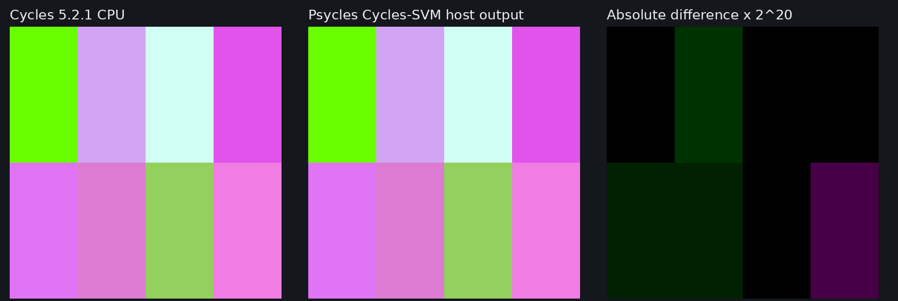

# Cycles 5.2 SVM RGB Curves validation

Date: 2026-09-01

## Scope

This milestone copies Blender Cycles 5.2.1's `RGBCurvesNode` into the Luisa
SVM path: the Blender adapter's 257-entry sampled table, common input domain,
extrapolation flag, constant-fold ordering, exact `SVMNodeCurves` header and
inline table, and the device lookup reached through the real SVM
program-counter loop.

It also copies the prerequisite Cycles `ValueNode` and `ColorNode` host
semantics. A real Blender graph represents authored Value and RGB nodes as
linked `psycles.constant.float` and `psycles.constant.color` nodes. The
external eight-material probe exposed that direct synthetic socket tests had
not covered this boundary. Both nodes now perform Cycles' topological constant
propagation and retain the exact `NODE_VALUE_F`/`NODE_VALUE_V` compile fallback
for a live, non-folded output.

This is not a claim of production full-scene parity yet. The copied SVM
interpreter is not yet the production path-tracer material evaluator; the
remaining SVM families must be migrated before that switch.

Pinned references:

- Cycles source: `9e2066aef7ef7e20c142ad7bd3303138a4304c93`
- diagnostic-only Cycles bytecode dumper:
  `cb168525138fecc792cc393f94afc39582b0103c`
- Psycles parent revision: `c71a9adc3ff54362ad3138539b37fef91388123e`

## Structural correspondence

After `NODE_CURVES`, the host compiler emits the exact eight-word Cycles
`SVMNodeCurves` header, followed immediately by `table_size` float4 entries:

| Payload words | Cycles field | Psycles representation |
| ---: | --- | --- |
| 0..2 | `color` | immediate float3 or typed stack-offset payload |
| 3 | `fac` | immediate float or typed stack-offset payload |
| 4 | `min_x` | common sampled-domain minimum |
| 5 | `max_x` | common sampled-domain maximum |
| 6 | `table_size` | number of sampled RGB rows |
| 7 | `extrapolate`, `out_offset`, pad | four packed bytes |
| 8... | sampled RGB table | four float words per row; `w = 1` |

The external dynamic Cycles stream contains this exact prefix at global word
121:

```text
0000004b 7fc00000 00000000 00000000 3f800000
00000000 3f800000 00000101 00000301
```

The first word is `NODE_CURVES`; the remaining words encode linked Color at
stack offset 0, Factor 1, domain `[0,1]`, 257 rows, extrapolation enabled, and
output stack offset 3. The permanent importer regression checks a linked
Blender Value node, all 257 rows, the fixed header, float4 padding, and exact
cursor extent.

The Blender adapter performs the same normalization as Cycles:

1. find one common minimum and maximum over the four authored curves;
2. sample 257 endpoints over that domain;
3. evaluate the common curve first;
4. feed its result to the R, G, and B curves;
5. retain the CurveMapping extrapolation flag.

This is Cycles' node-data representation, not material or closure baking.
Psycles still transports and evaluates the original closure graph. It does not
ask Blender or Cycles to render a material into a texture.

## Formal transition

For input color `C`, factor `F`, domain `[a,b]`, and a table `T` of size
`N >= 2`, each channel first computes

```text
q = (C[channel] - a) / (b - a)
```

If extrapolation is enabled and `q` lies outside `[0,1]`, the result extends
the first or last table segment exactly as Cycles does. Otherwise:

```text
s = saturate(q) * (N - 1)
i = clamp(float_to_int(s), 0, N - 1)
t = s - float(i)
R = T[i]
if t > 0: R = (1 - t) * R + t * T[i + 1]
output = (1 - F) * C + F * (R.r, G.g, B.b)
```

The signed conversion followed by integer clamp is retained. The `t > 0`
guard proves the `i + 1` read is absent at the upper endpoint. The cursor then
advances by exactly `4N` words.

`N`, table contents, Color, Factor, and the domain remain runtime data. The
generated AST contains a constant number of table reads and branches: there is
no table walk, generated loop, per-material table expansion, or cache identity
specialization.

### Staged control-flow specialization

Extracting the shared lookup initially made RGB Ramp construct an
extrapolation branch whose condition was the AST literal `false`. The complete
HIP suite caught this as a pre-optimization XIR increase from 1,024 to 1,472
instructions. Raising the shape limit would have hidden real code inflation.

The fixed formulation separates the universally valid clamped transition from
the Curves-only extrapolation extension. RGB Ramp calls only the clamped host
builder, so unreachable extrapolation control flow is never placed in its AST.
Its shape returned to exactly 1,024 instructions and its capture remained
byte-identical. RGB Curves uses the extension because its flag is runtime
bytecode data.

## Constant-fold ordering

The two ordered graph stages mirror Blender/Cycles rather than globally
evaluating arbitrary linked graphs:

- Blender's Curve RGB multi-function folds only after primitive inputs are
  available at that stage.
- Cycles `ValueNode` and `ColorNode` subsequently propagate their literals in
  topological order.
- Cycles `CurvesNode::constant_fold` then evaluates a fully constant sampled
  table, or bypasses a linked Color only when the unlinked Factor is exactly
  zero.

The regression that recreates Blender's linked RGB and Value topology proves
that both constant producers disappear before RGB Curves and that neither
`NODE_CURVES` nor `NODE_VALUE_F/V` survives in the constant stream. The dynamic
import keeps a linked Value factor and a varying Generated Color, proving that
the factor becomes the immediate float in an otherwise live `NODE_CURVES`.

Malformed, unsampled, shorter-than-two-row, ill-typed, and overflowing tables
fail closed rather than silently using the old control-point approximation.

## External Cycles oracles

Both probes were rendered by Cycles CPU with adaptive sampling and denoising
disabled. The diagnostic build only copies the compiled SVM stream; it does
not alter shader evaluation.

| Probe | Blend SHA-256 | SVM stream SHA-256 | EXR SHA-256 | Export JSON SHA-256 |
| --- | --- | --- | --- | --- |
| Eight constant Curve RGB materials | `880c7850f8606859027d696801c305f04a53132fafd1e677bb580b17334a29be` | `490107903c5133f1d1e1f168117d5ee2922e14fdfecc2aeeb467830d08322f9e` | `2253ddec0e2b5b797ee87443a657b2f2db92547d63f2d433144aa3879e145b16` | `2e4eb4b2b2d126acdba573898c22c92cd38cc4d372f99313a32d70cc14922577` |
| Dynamic Generated Color | `9395aac08928c2fa7402410590ba36641d32c312bad09bf0fc10fa0e9cfe0430` | `eb973486314564f043ab7e42dfc714c63ebfe0c9e72e0f4db93cc63839d5dc0b` | `ea77074b274d9d043cebb8c2eb2333637372265979af7a579fe55641cbc6ee7b` | `a3deff156d26ebf513b19c2dc206b57dbde3e0f0af0d41e630949543a2453c38` |

Selected dynamic table rows, including endpoints and interior rows, are frozen
word-for-word in the device regression. The interpreter regression also
executes `NODE_CURVES` inside a complete surface stream, consumes its stack
output as an emission weight, and reaches `NODE_END`.

## Numerical and visual check

Importing the exact eight-material Blender export and compiling each material
through Psycles' new Cycles-SVM host path gives a maximum absolute linear-RGB
difference of `5.96046448e-8` from the Cycles CPU EXR. All differences are at
most one binary32 ULP. No fused-operation emulation or slower exactness path was
added to chase them.

HIP and fallback produced byte-identical dynamic capture files:

```text
2ce1be566216c3ca1de543fd00d6644f6e9ff99a0de3eefdc32ca36b617ca97e
```

Strict native XIR to SPIR-V Vulkan differed in one negative extrapolated
component by one ULP (`-0.153333351` versus `-0.153333336`) and passed the
numerical contract. This is deliberately treated as insignificant rather than
forcing a slower backend-independent arithmetic sequence.

I opened the retained 1,850x620 triptych at original resolution. The Cycles CPU
and Psycles host-output panels are visually indistinguishable across all eight
materials, including negative/greater-than-one input and factor cases. The
third panel magnifies absolute linear error by `2^20`; only the documented ULP
differences become visible.



This is a node-level visual oracle, not a production full-scene render.

## Code shape and validation

Build and focused commands:

```sh
cmake --build build --parallel 32
ctest --test-dir build --output-on-failure -j1 \
  -R 'psycles\.(cycles_svm_rgb_(ramp|curve)|blender_rgb_(ramp|curve)_import|luisa_cycles_svm_rgb_(ramp|curve)_(fallback|hip|vk))$'
PSYCLES_REPORT_SHADER_SHAPES=1 \
PSYCLES_CYCLES_SVM_RGB_CURVE_CAPTURE=/tmp/psycles-rgb-curves-hip.tsv \
  build/bin/psycles_luisa_cycles_svm_rgb_curve_tests hip
LUISA_VULKAN_USE_XIR=1 \
LUISA_VULKAN_REQUIRE_NATIVE_XIR_SPIRV=1 \
LUISA_VULKAN_DISABLE_DXC=1 \
  build/bin/psycles_luisa_cycles_svm_rgb_curve_tests vk
```

Focused results:

- exact schema, linked Value/Color propagation, constant fold, zero-Factor
  bypass, header/table payload, Blender import, and invalid representation
  rejection: passed
- HIP direct handler and full PC-loop interpreter: passed
- fallback direct handler and full PC-loop interpreter: passed
- strict native XIR to SPIR-V Vulkan, with DXC disabled: passed
- direct pre-optimization XIR: 3,090 instructions, zero loops, zero callables
- HIP direct handler: 10,972-byte AMDGPU code and 8,896-byte code object
- HIP full interpreter: 11,584-byte AMDGPU code and 9,152-byte code object
- strict Vulkan direct handler: 8,877 to 7,416 SPIR-V words
- strict Vulkan full interpreter: 9,897 to 8,333 SPIR-V words

The shape guard permits at most 3,500 instructions, zero loops, and zero
callable definitions. Variable table sizes and the 257-entry production table
do not enter the shader AST.

Full-suite results after the 32-thread whole-project build:

- non-backend: 93/93 passed
- HIP: 98/98 passed
- fallback: 100/100 passed
- strict native XIR to SPIR-V Vulkan, DXC disabled: 98/98 passed
