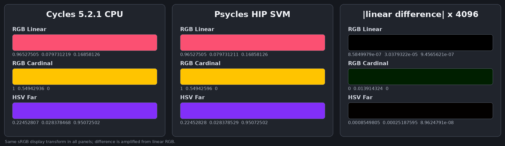

# Cycles 5.2 SVM RGB Ramp validation

Date: 2026-09-01

## Scope

This milestone copies Blender Cycles 5.2.1's `RGBRampNode` schema, sampled
table boundary, constant-fold ordering, exact SVM header and inline table, and
device lookup into the Luisa SVM path. It covers all Blender interpolation and
color modes through the adapter's 257-entry sampled table, independently live
Color and Alpha outputs, immediate and stack Factor inputs, clamp boundaries,
non-finite literal filtering, variable table sizes, exact cursor advancement,
Blender import, and dispatch through the real SVM program-counter loop.

It does not claim production full-scene parity yet. The copied SVM interpreter
is not yet the production path-tracer material evaluator; the remaining SVM
families must be migrated before that end-to-end switch.

Pinned references:

- Cycles source: `9e2066aef7ef7e20c142ad7bd3303138a4304c93`
- diagnostic-only Cycles bytecode dumper:
  `cb168525138fecc792cc393f94afc39582b0103c`
- Psycles parent revision: `a62e61d1f35aa42ae1a88ccf44705750a8ed2eb3`

## Structural correspondence

The host compiler emits the exact three-word Cycles `SVMNodeRGBRamp` payload
after `NODE_RGB_RAMP`, followed immediately by `table_size` float4 entries:

| Payload word | Cycles field | Psycles representation |
| ---: | --- | --- |
| 0 | `table_size` | number of sampled float4 entries |
| 1 | `fac` | immediate float bits or a typed stack-offset NaN payload |
| 2 | `interpolate`, `color_offset`, `alpha_offset`, pad | four packed bytes |
| 3... | sampled RGB and Alpha table | four float words per sample |

The Blender adapter evaluates the authored ColorBand at `i / 256` for
`i = 0...256`. Psycles preserves those 257 samples as typed runtime bytecode;
it does not ask Blender or Cycles to render or bake the material. Hue mode,
hue interpolation, and spline interpolation have therefore already performed
the same adapter conversion as Cycles before `RGBRampNode::compile` sees the
table. The device kernel needs no mode-specific branch.

For a table `T` of size `N`, the non-extrapolating device transition is:

```text
s = saturate(Factor) * (N - 1)
i = clamp(float_to_int(s), 0, N - 1)
t = s - float(i)
R = T[i]
if interpolate and t > 0: R = (1 - t) * R + t * T[i + 1]
```

This preserves Cycles' signed conversion followed by integer clamp. Color and
Alpha writes are independently guarded by their stack offsets, and the cursor
always advances by `4N` words after consuming the fixed header.

The lookup performs one float4 read in constant mode and at most two float4
reads in interpolating mode. `N` and the table contents remain runtime buffer
data: there is no table walk, generated loop, table-sized AST expansion, or
shader-cache specialization. Runtime work and generated code are therefore
`O(1)` in table cardinality.

### Constant-fold boundary

Blender's Color Ramp node is a multi-function and can fold before the Cycles
shader graph is constructed. Cycles then stores a 257-entry sampled table and
may perform a second `RGBRampNode::constant_fold`. Psycles keeps these as two
ordered fold stages, matching the topology established for White Noise and
Gradient.

The serialized boundary intentionally contains Cycles' sampled table rather
than a second implementation of Blender's private ColorBand evaluator. A
constant that Blender folded directly from the authored control points can
therefore differ from a lookup in the sampled table by a few parts per
million. The external constant oracle permits `2e-5` while requiring
the opcode/header/table structure exactly. No fused arithmetic, software
emulation, or slower exactness path was added to chase this insignificant
difference.

## External Cycles oracles

The diagnostic build copies the already-compiled SVM stream without changing
the renderer or kernels. The three probes cover dynamic RGB/Alpha liveness,
all interpolation and color modes, and constant-fold outputs:

| Probe | Blend SHA-256 | SVM stream SHA-256 | EXR SHA-256 | Export JSON SHA-256 |
| --- | --- | --- | --- | --- |
| Dynamic RGB and constant mode | `262e088dc89398c41106ef4ee3896cd836ecd1fdf69b37e93ddfe627fa4cdd8e` | `66bc525e160a4dc1f7348efca96d26868dc48f99a0bdff7232e1e7647f714833` | `14d6d6f9f75db2c4fda0484b1953beed3490bc01d737431d3699812773a85b7c` | `af8787e333c02f1338bdbc2c2709d7b2d89bf97427858a2651a80365e509f0dc` |
| Interpolation/color-mode matrix | `4e0e24f90ec004a5b658daec9bf8ce9ec6f57a14f4e2acd84b7d323ab008f433` | `1aa2c21528df32c3a21e926a6c58e1d7a0441437c1fa0977a2c58dc8d9925ab0` | `ff6461671461dec766b7c92368c7857772bd9dbf6b8a0d59150f8073606f7294` | `96b4af919f6667c51bd12bf866cd06780851da7461b2cf85debdd56030952972` |
| Alpha mode matrix | `7bcf897aba13554e8f4e0ca3b7c1a7266cd6bca93daa2db4e1f8b6dd9c00d5ce` | `57a9970fd7190eb76937a3d4c395c68a92a326ab5c076771b3585cd8ef3ae7e5` | `0feb2b3971766c0379adb10638db2dd4dfbf0f41f247aca2ff255276289ba8d5` | `ec47eed5a9c49af190f208b7645d0022258d2b448a552388b1cc029c614074d1` |

The dynamic external stream contains a 257-entry interpolating table with
Color and Alpha live, and a second 257-entry constant table with only Color
live. The permanent host regression checks those header fields, exact selected
table words, all 257 imported samples, output liveness, and rejection of the
old unsampled control-point representation.

## Numerical and visual check

HIP, fallback, and strict Vulkan produced byte-identical capture files:

```text
bef5c7743fb0db86accd9490b5622c3f29b53af96282ab010376e1605d0218a2
```

The first three rows use adjacent samples captured from Cycles' RGB Linear,
RGB Cardinal, and HSV Far probes. Their maximum absolute linear-RGB difference
from the external Cycles CPU constant outputs is `3.39705185e-6`, caused by
evaluating the official sampled table rather than Blender's pre-adapter
control-point function. This is numerically and visually insignificant and is
well within the deliberate `2e-5` structural-parity tolerance.

The first two panels below use the same linear-to-sRGB transform and are
visually identical. The third panel magnifies absolute linear RGB difference
by 4096; only the expected tiny sampled-table discrepancy becomes faintly
visible.



This is a node-level visual oracle, not a production full-scene render.

## Code shape and validation

Build and focused commands:

```sh
cmake --build build --parallel 32
ctest --test-dir build --output-on-failure \
  -R '^psycles\.(cycles_svm_rgb_ramp|blender_rgb_ramp_import)$' -j32
PSYCLES_REPORT_SHADER_SHAPES=1 \
PSYCLES_CYCLES_SVM_RGB_RAMP_CAPTURE=/tmp/psycles-rgb-ramp-hip.tsv \
  build/bin/psycles_luisa_cycles_svm_rgb_ramp_tests hip
build/bin/psycles_luisa_cycles_svm_rgb_ramp_tests fallback
LUISA_VULKAN_USE_XIR=1 \
LUISA_VULKAN_REQUIRE_NATIVE_XIR_SPIRV=1 \
LUISA_VULKAN_DISABLE_DXC=1 \
  build/bin/psycles_luisa_cycles_svm_rgb_ramp_tests vk
```

Focused results:

- exact host payloads, schema, Blender import, output liveness, and invalid
  representation/enum rejection: passed
- HIP direct handler and full PC-loop interpreter: passed
- fallback direct handler and full PC-loop interpreter: passed
- strict native XIR to SPIR-V Vulkan, with DXC disabled: passed
- direct pre-optimization XIR: 1,024 instructions, zero loops, zero callables
- HIP direct handler: 8,220-byte AMDGPU code and 5,696-byte code object
- HIP full interpreter: 8,844-byte AMDGPU code and 6,464-byte code object
- strict Vulkan direct handler: 4,728 to 4,539 SPIR-V words
- strict Vulkan full interpreter: 5,809 to 5,510 SPIR-V words

The XIR guard permits at most 1,100 instructions, zero loops, and zero callable
definitions. Variable table sizes, the 12 payload cases, and the 257-entry
production table do not enter the shader AST. The device matrix additionally
checks clamp endpoints, filtered non-finite literals, independently invalid
output offsets, exact variable cursor deltas, and a complete RGB Ramp stream
through `eval_nodes`.

Full-suite results after the 32-thread whole-project build:

- non-backend: 91/91 passed
- HIP: 97/97 passed
- fallback: 99/99 passed
- strict native XIR to SPIR-V Vulkan, DXC disabled: 97/97 passed
