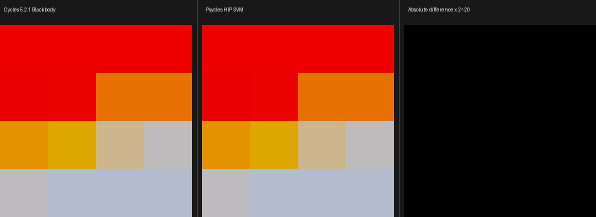
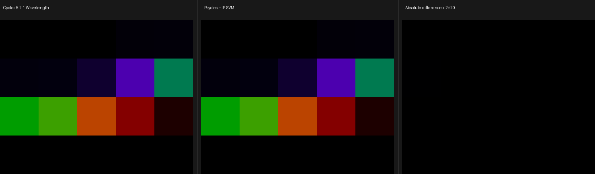

# Cycles 5.2.1 spectral SVM validation

This increment copies the Cycles 5.2.1 `WavelengthNode` and `BlackbodyNode`
host encoders and the corresponding `NODE_WAVELENGTH` and `NODE_BLACKBODY`
device handlers into the isomorphic Psycles SVM path. It does not route either
node through the former `SurfaceProgram`, pre-bake a result, or introduce a CPU
reference renderer.

The sole semantic oracle is the pinned Blender Cycles revision
`9e2066aef7ef7e20c142ad7bd3303138a4304c93`.

## Source mapping and invariants

The copied boundary is:

| Cycles 5.2.1 source | Psycles implementation |
| --- | --- |
| `scene/shader_nodes.cpp`, `WavelengthNode` | `cycles_svm_spectral_nodes.cpp`, `WavelengthNode` |
| `scene/shader_nodes.cpp`, `BlackbodyNode` | `cycles_svm_spectral_nodes.cpp`, `BlackbodyNode` |
| `kernel/svm/wavelength.h` | `cycles_svm_spectral.cpp`, `node_wavelength` |
| `kernel/svm/blackbody.h` | `cycles_svm_spectral.cpp`, `node_blackbody` |
| `kernel/svm/math_util.h` and `kernel/tables.h` | `cycles_color_nodes.h` |
| `kernel/util/colorspace.h`, film matrices | `KernelGlobals::film_xyz_to_*` and `film_rec709_to_*` |

For every dynamic invocation, the following representation is preserved:

```text
input scalar = SVMInputFloat(immediate or stack-tagged)
output color = one SVMStackOffset naming three consecutive float lanes
program state = the same shared SVM stack and program-counter loop
```

The host compiler therefore emits the exact two-word payload after either
opcode. No typed value is converted through a `float4` parameter table.

Blackbody host folding follows Cycles' separate rule:

```text
all inputs constant
  -> svm_math_blackbody_color_rec709(temperature)
  -> active scene Rec.709-to-scene-linear matrix
  -> componentwise max(color, 0)
  -> replace node output with a graph constant
```

Wavelength has no corresponding Cycles host constant fold and remains
`NODE_WAVELENGTH` even for an unlinked immediate input. A permanent regression
guards this asymmetry.

## Device control structure

`NODE_BLACKBODY` preserves the seven Cycles polynomial intervals, the lower
and upper clamps, and the active film color transform. The implementation now
selects one interval first, reads one coefficient triplet from device constant
tables, and evaluates one polynomial. It does not evaluate all seven
polynomials and select their results afterward. This is a structural
performance correction: the generated shader performs the work of the chosen
Cycles branch rather than seven times that work.

`NODE_WAVELENGTH` uses the 81-entry Cycles CIE table and the same expression:

```text
i = trunc((lambda_nm - 380) * 0.2)
valid = 0 <= i < 80
xyz = lerp(table[i], table[i + 1], scaled - float(i))
rgb = max(film_xyz_to_rgb(xyz) / 2.52, 0)
```

The truncation is observable: `379 nm` maps to `i = 0` with a negative lerp
factor, while `375 nm` maps out of range. The tests freeze both boundaries.

The focused XIR kernels contain no callable definitions or loops. Their
current translated shapes are:

| Handler | XIR instructions | loops | callables |
| --- | ---: | ---: | ---: |
| Blackbody | 911 | 0 | 0 |
| Wavelength | 776 | 0 | 0 |

The regression ceilings are 1,050 and 900 instructions respectively. These
counts include the shared 255-lane SVM test stack and cursor machinery; they
are code-shape guards, not end-to-end render performance claims.

## External Cycles bytecode oracle

The reproducible dynamic probe deliberately connects Light Path `Ray Depth`
to both scalar inputs so Cycles cannot constant-fold either node:

```sh
/home/mike/Projects/blender-install-5.2-hiprt/blender \
  --background --factory-startup \
  --python tools/create_cycles_shader_probe.py -- \
  /tmp/psycles-spectral-oracle/svm_spectral_dynamic.blend \
  svm_spectral_dynamic

PSYCLES_CYCLES_SVM_DUMP=\
/tmp/psycles-spectral-oracle/svm_spectral_dynamic.svm52 \
/home/mike/Projects/blender-install-psycles-trace-5.2/blender \
  /tmp/psycles-spectral-oracle/svm_spectral_dynamic.blend \
  --background --threads 0 \
  --python tools/render_cycles_golden.py -- \
  /tmp/psycles-spectral-oracle/svm_spectral_dynamic-diagnostic.exr \
  64 32 1 1 --cycles-device CPU
```

After rebasing only the global shader jump offsets, the two complete surface
routines are:

```text
Blackbody:
00000032 0000000a 00000000
0000005c 7fc00000 00000001
00000007 7fc00001 00000000 00000000 3f800000
00000003 000000ff
00000000

Wavelength:
00000032 0000000a 00000000
0000005b 7fc00000 00000001
00000007 7fc00001 00000000 00000000 3f800000
00000003 000000ff
00000000
```

These are, in order, Light Path Ray Depth, the spectral node, Emission Weight,
Closure Emission, and End. The permanent host regression compares all fourteen
words for both routines against this capture.

The clean and diagnostic Blender builds rendered the same probe independently.
`idiff -a` reports `PASS`, proving the diagnostic stream copy is observationally
inert.

| Artifact | SHA-256 |
| --- | --- |
| canonical dynamic `.blend` | `84738291f4440cf967392bc69833722c5300728a426139e283d8717699ebd25a` |
| diagnostic SVM stream | `d39c3cd13943302e68fb8842c71b0c85ba7b6bad174c03107b87738a95d0de66` |
| clean Cycles CPU EXR | `aa9b95c7b52a7f0e398aa6461d1f68802916e8feb85de30352968508495da0a2` |
| diagnostic Cycles CPU EXR | `8cbf16e38deb73318692f0fc24cbe1cb60f77f6cb129220d99dc5a1f7d431faf` |

## Numerical and backend validation

The numerical oracle directly compiled the pinned Cycles
`kernel/svm/math_util.h`; it did not reimplement those formulas in a Psycles
CPU model. Sixteen Blackbody values cover both clamps and every polynomial
boundary. Twenty Wavelength values cover range rejection, interpolation,
truncation around 380 nm, spectral extrema, and the 780 nm endpoint.

The same payload matrix ran through fallback, HIP, and strict native Vulkan.
The Vulkan CTest environment was:

```text
LUISA_VULKAN_USE_XIR=1
LUISA_VULKAN_REQUIRE_NATIVE_XIR_SPIRV=1
LUISA_VULKAN_DISABLE_DXC=1
```

All three backends also passed:

- non-Rec.709 Blackbody channel projection;
- a non-default XYZ film matrix for Wavelength;
- a complete shared interpreter stream containing both spectral opcodes,
  Emission Weight, Closure Emission, and End;
- exact two-word cursor advancement for every direct payload.

HIP matched all Blackbody oracle floats at the capture precision. The maximum
Wavelength absolute difference was `2.32830644e-10`; this harmless floating
difference is accepted numerically and did not motivate a slower precision
path.

```sh
ctest --test-dir build --output-on-failure -R \
  '^(psycles\.cycles_svm_spectral|psycles\.luisa_cycles_svm_spectral_(fallback|hip|vk))$'

PSYCLES_CYCLES_SVM_SPECTRAL_CAPTURE=\
/tmp/psycles-spectral-oracle/hip.tsv \
  build/bin/psycles_luisa_cycles_svm_spectral_tests hip

python tools/visualize_cycles_spectral_capture.py \
  /tmp/psycles-spectral-oracle/hip.tsv \
  docs/validation/2026-09-01/cycles-5.2-svm-spectral
```

The capture SHA-256 is
`870cc86654fb7c24efc9231eae37f36237c3190088bdbb0e24e50f93ebe7e46e`.

## Visual inspection

I opened both retained images at their original resolution. In the Blackbody
triptych, the red low-temperature cells, orange transition, neutral region,
and blue high-temperature cells align between Cycles and HIP; the amplified
difference panel is black. In the Wavelength triptych, the black out-of-range
cells and the violet-to-green-to-red sequence align; its `2^20`-amplified
difference panel is also visually black.





| Retained image | SHA-256 |
| --- | --- |
| Blackbody triptych | `6d8a1357f8a62f6ae47c3ceb8d461007c665c030431c7f90705e87eb86471521` |
| Wavelength triptych | `5228cb71912210dd0a8620171dd8672f838c22b14cd859cdc177f28e5f1d961e` |

These are node-level SVM oracles, not a claim that the production full-scene
renderer has already switched every material family to the exact SVM path.

## Remaining exact runtime boundary

After adding these two handlers, a mechanical comparison of the 108 Cycles
`SVM_CASE` opcodes against Psycles reports 82 implemented and 26 missing. The
remaining set is:

```text
NODE_AMBIENT_OCCLUSION
NODE_AOV_COLOR
NODE_AOV_START
NODE_AOV_VALUE
NODE_BEVEL
NODE_CLOSURE_HOLDOUT
NODE_CLOSURE_SET_NORMAL
NODE_CLOSURE_VOLUME
NODE_DISPLACEMENT
NODE_ENTER_BUMP_EVAL
NODE_LEAVE_BUMP_EVAL
NODE_MAP_RANGE
NODE_NORMAL_MAP
NODE_PRINCIPLED_VOLUME
NODE_RADIAL_TILING
NODE_RAYCAST
NODE_SCENE_TIME
NODE_SET_DISPLACEMENT
NODE_TANGENT
NODE_TANGENT_DERIVATIVE
NODE_TEX_SKY
NODE_VALUE_F_DERIVATIVE
NODE_VALUE_V_DERIVATIVE
NODE_VECTOR_DISPLACEMENT
NODE_VECTOR_MAP_RANGE
NODE_VOLUME_COEFFICIENTS
```
