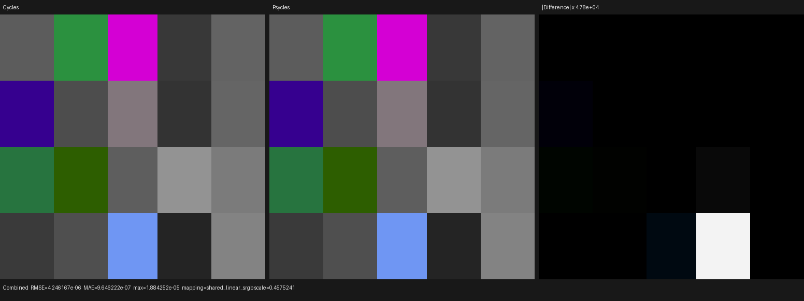
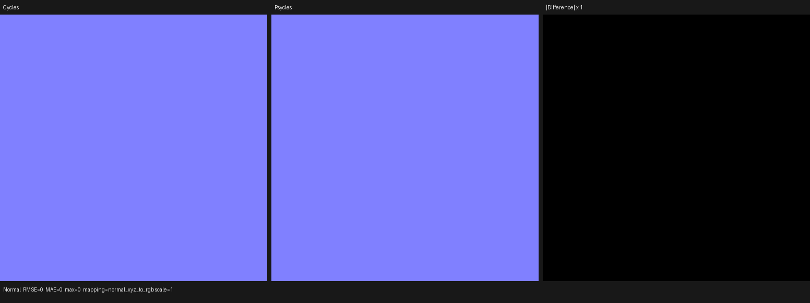

# Cycles 5.2 Voronoi SVM validation

## Scope and source oracle

This validation covers the complete Cycles 5.2.1 `NODE_TEX_VORONOI`
interpreter operation. The source oracle is Blender Cycles commit
`9e2066aef7ef7e20c142ad7bd3303138a4304c93`, specifically:

- `intern/cycles/kernel/svm/node_types.h` for the 13-word
  `SVMNodeTexVoronoi` payload;
- `intern/cycles/kernel/svm/voronoi.h` for evaluation and stack writes;
- `intern/cycles/kernel/svm/svm.h` for program-counter dispatch;
- `intern/cycles/scene/shader_nodes.cpp` for host-side encoding.

The Luisa DSL path decodes that payload directly from the SVM word stream,
loads all nine dynamic inputs, evaluates the four dimension variants, and
writes Distance, Color, Position, W, and Radius independently when their stack
offsets are valid. Runtime dimension, feature, metric, and normalize values
remain SVM data rather than host-specialized material combinations.

The copied Cycles feature-mask rule is also preserved: 1D X-FX and all
Distance-to-Edge/N-Sphere-Radius paths are always present, while
multi-dimensional X-FX code is generated only when
`KERNEL_FEATURE_NODE_VORONOI_EXTRA` is reachable.

## Permanent regressions

`psycles_luisa_cycles_svm_voronoi_tests` embeds exact words from an external
Cycles 5.2.1 oracle for 20 cases covering 1D through 4D, F1, F2, Smooth F1,
Distance to Edge, N-Sphere Radius, Euclidean, Manhattan, Chebyshev and
Minkowski metrics, normalization, and every output kind. It checks:

- direct 13-word handler decoding and the semantic cursor position;
- independent valid-output writes and untouched invalid-output sentinels;
- the complete rebased SVM stream through the real PC/opcode loop;
- full and base feature-mask variants;
- fallback, HIP, and strict native Vulkan XIR to SPIR-V execution.

The related legacy/procedural and import regressions also passed. The final
matrix was:

```text
psycles.luisa_cycles_svm_voronoi_fallback               Passed
psycles.luisa_cycles_svm_voronoi_hip                    Passed
psycles.luisa_cycles_svm_voronoi_vk                     Passed
psycles.luisa_cycles_svm_procedural_texture_fallback    Passed
psycles.luisa_cycles_svm_procedural_texture_hip         Passed
psycles.luisa_cycles_svm_procedural_texture_vk          Passed
psycles.blender_voronoi_import                          Passed
psycles.cycles_svm_procedural_texture                   Passed
```

The strict Vulkan test sets `LUISA_VULKAN_USE_XIR=1`,
`LUISA_VULKAN_REQUIRE_NATIVE_XIR_SPIRV=1`, and
`LUISA_VULKAN_DISABLE_DXC=1`.

## Code-shape and native SPIR-V checks

The full feature mask produces 31,443 XIR instructions, four shared callables,
and 86 loops. The base mask produces 16,314 instructions, the same four
callables, and 47 loops. This guards against recreating one callable for every
feature, metric, and normalize combination.

The first strict Vulkan run exposed two compiler issues rather than a renderer
workaround. SPIRV-Tools LCSSA treated module-scope annotation uses as CFG uses;
the formal fix excludes uses with no owning basic block from the executable-CFG
LCSSA relation. A separate direct optimizer fixture keeps a loop-local
decorated instruction and verifies explicit loop unswitching.

That fixture then exposed the native preset's uncosted loop-unswitch blow-up:
49,125 input words became 816,453 words, about 16.6 times larger. With `k`
independent invariant selectors, repeated whole-loop cloning admits `2^k`
versions. Because the SPIRV-Tools pass has no target or code-size cost model,
it is no longer a native default; explicit
`LUISA_SPIRV_OPT_PASS_FLAGS=--loop-unswitch` remains supported. The same full
shader now optimizes to 42,795 words in 96.8 ms, and the strict Vulkan CTest
completes in 0.69 s without DXC or an optimization-level fallback.

## Production HIP render probe

The 5x4 material matrix keeps coordinates shader-varying through Geometry
Normal, so Blender cannot constant-fold the Voronoi nodes. The exported global
stream contains 20 `NODE_TEX_VORONOI` opcodes, one per material. It was rendered
at 64x64, 1 spp on the same RX 9070 XT with caches disabled:

```sh
PSYCLES_DISABLE_SHADER_CACHE=1 \
python3 tools/run_cycles_shader_probes.py svm_voronoi_matrix \
  --blender /home/mike/Projects/blender-install-5.2-hiprt/blender \
  --psycles-render build/bin/psycles_render_blender_scene \
  --output-dir /tmp/psycles-voronoi-svm-hip-20260901 \
  --backend hip --cycles-device HIP \
  --cycles-device-name 'AMD Radeon RX 9070 XT' \
  --width 64 --height 64 --samples 1
```

| Pass | RMSE | Relative RMSE | MAE | Maximum | Invalid pixels |
|---|---:|---:|---:|---:|---:|
| Combined | 4.246167e-6 | 8.623491e-6 | 9.646222e-7 | 1.884252e-5 | 0 |
| Emit | 4.246167e-6 | 8.623491e-6 | 9.646222e-7 | 1.884252e-5 | 0 |
| Normal | 0 | 0 | 0 | 0 | 0 |

All three Combined channel means are identical at the stored precision; the
luminance mean ratio is 0.999995897. I opened both retained triptychs at their
original resolution. Cycles HIP and Psycles HIP have the same 5x4 cell layout,
cell colors, orientation, and boundaries. The amplified difference view shows
only small uniform arithmetic residuals in a subset of cells, with no
structured material, coordinate, feature, or output mismatch. Normal is
visually and numerically identical.





The complete per-pass machine-readable result is retained as
[`hip-report.json`](hip-report.json).

| Artifact | SHA-256 |
|---|---|
| Combined triptych | `388c738e6c242ae2efca27b12de67dd1a712c603e364bc6edd3894bb86133a3c` |
| Normal triptych | `fe627563ca9ec3ab7dfbec525a07037caedca7b4fdb90287a1164e5b2d43fd8a` |
| HIP report | `fdb80ddd3ae2c789b21e14938c13417de9fc7e73c28aa2504494ac6a424ffa26` |
