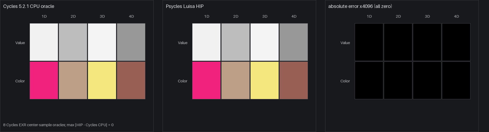

# Cycles 5.2 SVM White Noise Texture validation

Date: 2026-09-01

## Scope

This milestone copies Blender Cycles 5.2.1's White Noise Texture encoding,
Blender-side constant-fold boundary, and device evaluation into the Luisa SVM
path. It covers dimensions 1D through 4D, independently unused Value and Color
outputs, immediate and stack inputs, exact cursor advancement, invalid-payload
release defaults, and dispatch through the real SVM program-counter loop.

It does not claim production full-scene parity yet. The copied SVM interpreter
is not yet the production path-tracer material evaluator, and more SVM node
families must be migrated before switching that evaluator end to end.

Pinned references:

- Cycles source: `9e2066aef7ef7e20c142ad7bd3303138a4304c93`
- diagnostic-only Cycles bytecode dumper:
  `cb168525138fecc792cc393f94afc39582b0103c`
- Psycles parent revision: `3b8c6a44bfb78f36b1b47fa3eb7ef38d9772276a`

## Structural correspondence

The host compiler emits the exact six-word Cycles `SVMNodeTexWhiteNoise`
payload after `NODE_TEX_WHITE_NOISE`:

| Payload word | Cycles field | Psycles representation |
| ---: | --- | --- |
| 0 | `dimensions` | static `Dimensions` property |
| 1..3 | `vector` | immediate float bits or one stack offset plus NaN markers |
| 4 | `w` | immediate float bits or a stack-offset NaN payload |
| 5 | `value_offset`, `color_offset` | packed stack bytes; the upper two bytes are zero |

The device transition is a function of `(cursor, stack)`. It first consumes all
six words and loads Vector and W, exactly as Cycles does. It then executes the
Color-validity branch and its 1D/2D/3D/4D switch, followed by the independent
Value-validity branch and its second switch. Each valid output is stored only
at its encoded stack offset. The cursor delta is therefore six for every
payload, independent of dimensions and output liveness.

For a malformed dimensions word, release Cycles leaves the preinitialized
Color `(1, 0, 1)` and Value `0` after its debug `kernel_assert`. Psycles keeps
those same defaults rather than strengthening the branch to undefined
`unreachable` behavior. The host compiler independently rejects dimensions
outside `[1, 4]`, so this is a corrupted-bytecode diagnostic boundary and adds
no production check.

### Constant-fold boundary

Cycles' scene `WhiteNoiseTextureNode` has no node-specific constant folder.
The observed folding happens earlier in Blender 5.2.1's
`inline_shader_node_tree`: a function node is evaluated exactly when every
*available* input converts to a primitive value.

Let the available input set be

```text
A(1D) = {W}
A(2D) = {Vector}
A(3D) = {Vector}
A(4D) = {Vector, W}
```

An unlinked W literal is primitive. The unlinked Vector socket is declared as
`NODE_DEFAULT_INPUT_POSITION_FIELD`, so it is not primitive even when its
numeric default is edited. A Vector produced by a constant-folded upstream
node is primitive. Psycles implements exactly this predicate:

```text
fold(WhiteNoise(d)) iff every input in A(d) is primitive
```

This explains the external streams without a case-by-case exception: the 1D
probe folds to a constant, unlinked 2D/3D/4D probes retain the opcode, and a 4D
Vector linked from constant Combine XYZ folds. The compile-time result uses a
host spelling of the same Cycles 5.2.1 Jenkins hash. Runtime evaluation remains
Luisa DSL. Blender/Cycles does not render or bake a material for Psycles; the
raw exported graph still contains the original White Noise closure graph.

## External Cycles oracles

The matrix probe creates eight emission materials: Value and Color rows, each
with 1D through 4D columns, all evaluated at the same authored inputs. A
typical external render and bytecode capture was:

```sh
PSYCLES_CYCLES_SVM_DUMP=/tmp/psycles-svm-white-noise.rHTBqL/white_noise_matrix.svm52 \
  /home/mike/Projects/blender-install-psycles-trace-5.2/blender \
  /tmp/psycles-svm-white-noise.rHTBqL/white_noise_matrix.blend \
  --background --python tools/render_cycles_golden.py -- \
  /tmp/psycles-svm-white-noise.rHTBqL/white_noise_matrix.exr \
  64 64 1 0 --cycles-device CPU
```

| Probe | Blend SHA-256 | SVM stream SHA-256 | EXR SHA-256 | Export JSON SHA-256 |
| --- | --- | --- | --- | --- |
| Value/Color matrix | `5ae914ada62ea55eb9eecf46f0f17255ae2cbb8be000104f89ab291b635b4aff` | `e885da8a84078ed1a8f0f4ba18ab14fc87706f1591304e830d09f06785263c8f` | `9e77ba107bb46417ea3a53c08e57e9aa113d8a942e2d04a39f1e41f9305c95f5` | `b9aed43018d3ddeca39b9d96e2e0b0f069361428d38715f8428740068593255d` |
| Dimension probe | `6b719a2d92101666aca07984683db08e24ba598c6fabff5e37b23d8c1a3a79d9` | `37ce6560255fdeeab786d4ae916e4bcb80be75d5be3c69f0ab3a805c23806eb6` | `855af792ba20bd4d834ec3cdb6764d6c4f7814a410618f21cf32d0bca25f2e2d` | `811b6c93c3f33770c1b22a00f3b1961eca95bbbb9fc839d92416c7a37a81c3b9` |
| Linked 4D constant fold | `c38ddd16f9e82a96172541ade0a72c3ab4f7ed9a4f45a4ebe52f1b20a2da9d0d` | `cdbcdc4ec8acd30fcaac73edf3eaa24f549ec0a6010c04990e7b60026224ebe6` | `e025d35e50ce06403572607bcfcf4fd954ceb64252a9bfaa546a799a86df8a16` | `c7f1eac7499956957b106ae1b2f86827546c1c871338d2d95f7211353feabb1b` |

The host regression compares complete shader-local word streams for 1D Value,
1D Color, unlinked 2D Value, unlinked 4D Color, and linked-folded 4D Color. It
also checks every dimensions/output payload combination and both invalid static
dimensions.

## Numerical and visual check

The device regression stores external Cycles CPU EXR center samples as exact
float bit patterns. HIP, fallback, and strict Vulkan produced identical capture
files (`SHA-256 7c942f24b7cc765d9fca7b3372f9f5d8c1915445b9dfe322759e96d36f0afdcf`).
All eight visible Value/Color outputs were bit-identical to the Cycles CPU
oracle; the measured maximum absolute error was zero. The permanent assertion
still uses a small `2e-7` tolerance so a harmless future backend 1 ULP change
does not force a slower arithmetic path.

The first two panels below apply the same clamped linear-to-display transform.
They are visually identical. The third panel magnifies absolute linear RGB
error by 4096 and remains black because the captured float32 values match
exactly.



This is a node-level visual oracle, not a production full-scene render.

## Code shape and validation

Build and focused commands:

```sh
cmake --build build --parallel 32 \
  --target psycles_cycles_svm_white_noise_tests \
           psycles_luisa_cycles_svm_white_noise_tests
ctest --test-dir build --output-on-failure -R 'white_noise'

PSYCLES_REPORT_SHADER_SHAPES=1 \
PSYCLES_CAPTURE_CYCLES_SVM_WHITE_NOISE=/tmp/psycles-white-hip.tsv \
  build/bin/psycles_luisa_cycles_svm_white_noise_tests hip
build/bin/psycles_luisa_cycles_svm_white_noise_tests fallback
LUISA_VULKAN_USE_XIR=1 \
LUISA_VULKAN_REQUIRE_NATIVE_XIR_SPIRV=1 \
LUISA_VULKAN_DISABLE_DXC=1 \
  build/bin/psycles_luisa_cycles_svm_white_noise_tests vk
```

Focused results:

- exact host streams, payloads, fold boundary, and invalid properties: passed
- HIP direct handler and full PC-loop interpreter: passed
- fallback direct handler and full PC-loop interpreter: passed
- strict native XIR to SPIR-V Vulkan, with DXC disabled: passed
- direct pre-optimization XIR: 6,694 instructions and zero callables
- HIP direct handler: 11,092-byte AMDGPU code and 8,896-byte code object
- HIP full interpreter: 11,732-byte AMDGPU code and 9,536-byte code object
- strict Vulkan direct handler: 9,111 to 8,298 SPIR-V words
- strict Vulkan full interpreter: 10,221 to 9,289 SPIR-V words

The XIR guard allows at most 7,000 instructions and no callable definitions.
This closely bounds the current source-isomorphic structure: two independent
output guards, two four-way runtime switches, and sixteen expanded Jenkins-hash
paths. Dispatch width and the eleven oracle payloads do not enter the shader
AST.

Full-suite results after a 32-thread whole-project build:

- non-backend: 87/87 passed
- HIP: 95/95 passed
- fallback: 97/97 passed
- strict native XIR to SPIR-V Vulkan, DXC disabled: 95/95 passed

The device matrix additionally verifies independently invalid output offsets,
stack-backed 4D inputs, malformed dimensions 0 and 5, exact six-word cursor
advancement, and a complete external 4D Color stream through `eval_nodes`.
