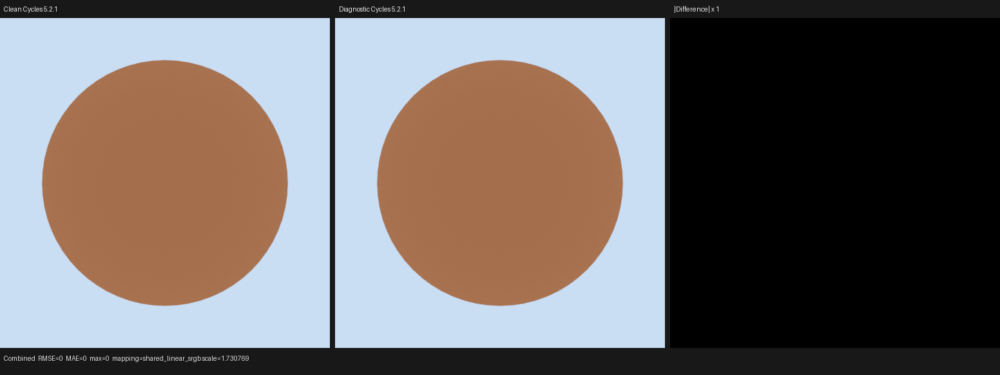

# Cycles 5.2 SVM closure-core validation

This checkpoint copies the first executable `NODE_CLOSURE_BSDF` state
transitions from Blender Cycles 5.2.1 into the single Luisa SVM interpreter.
It does not route production shade-surface through the exact interpreter yet,
and it makes no full-scene parity or performance claim.

## Copied semantic boundary

The implementation follows these pinned Cycles sources at
`9e2066aef7ef7e20c142ad7bd3303138a4304c93`:

- `kernel/svm/closure.h::svm_node_closure_bsdf`
- `kernel/closure/alloc.h::{closure_alloc,closure_sample_weight,bsdf_alloc}`
- `kernel/closure/bsdf_diffuse.h`
- `kernel/closure/bsdf_oren_nayar.h`
- `kernel/closure/bsdf_transparent.h`
- `kernel/closure/bsdf_sheen.h`
- `kernel/closure/bsdf_util.h::maybe_ensure_valid_specular_reflection`
- `kernel/closure/bsdf_microfacet.h::{bsdf_microfacet_*_glass_setup,`
  `bsdf_microfacet_ggx_setup,bsdf_microfacet_beckmann_setup,`
  `bsdf_microfacet_*_refraction_setup,`
  `bsdf_microfacet_setup_fresnel_conductor,`
  `bsdf_microfacet_setup_fresnel_f82_tint,`
  `bsdf_microfacet_setup_fresnel_generalized_schlick,`
  `microfacet_ggx_preserve_energy}`
- `kernel/closure/bsdf_ashikhmin_shirley.h`
- `kernel/closure/bsdf_util.h::{F0_from_ior,fresnel_dielectric_Fss}`
- `kernel/util/lookup_table.h`

The copied executable closure types are smooth Diffuse, improved Oren-Nayar,
Translucent, Transparent, Beckmann/GGX/Multi-GGX Glass,
Beckmann/GGX/Ashikhmin-Shirley/Multi-GGX Glossy, and Beckmann/GGX Refraction.
The copied Metallic family includes F82-tint and physical-conductor Fresnel
models over Beckmann, GGX, and Multi-GGX distributions.
Other closure payloads still take Cycles' exact typed skip transition and
report unsupported only when the unported state transition is live.
Feature-erased BSDF nodes remain valid skips.

`ClosurePool` is the Luisa realization of the state tuple

```text
(closure[0..num_closure), num_closure, num_closure_left)
```

and not a second material representation. Its storage is SoA, while the
observable transition system is Cycles' prefix allocator:

```text
allocate(type, weight):
  if left == 0: invalid
  else:
    closure[count] = {type, weight}
    count' = count + 1
    left' = left - 1

allocate_extra(owner, slots):
  precondition: owner is the immediately preceding ordinary allocation
  if slots <= left:
    count' = count
    left' = left - slots
  else:
    count' = count - 1
    left' = left + 1
    result = invalid
```

Only the initialized prefix `[0, count)` is readable. `bsdf_alloc` first
clamps negative spectral weights, computes `abs(average(weight))`, applies the
`1e-5` cutoff, and then performs this allocation. Transparent setup uses its
distinct unclamped average, accumulates extinction, and either appends the
unique transparent closure or finds and merges the existing one. The
terminate-path `left = 1` exception is preserved.

Let `capacity` be fixed and let
`extra = capacity - count - left`. The combined ordinary/extra transition
system gives these inductive invariants:

```text
0 <= count
0 <= left
0 <= extra
count + left + extra = capacity
closure indices written by ordinary allocation are exactly [0, count)
SD_TRANSPARENT implies at most one transparent record
```

An ordinary allocation preserves `extra`; a successful extra allocation moves
exactly `slots` from `left` to `extra`. When extra allocation fails, Cycles
removes the ordinary closure allocated immediately before it. Therefore the
composite transition is an identity on `(count, left, extra)`. The Glass
regression proves both concrete cases for a one-slot Fresnel payload:

```text
capacity 8: (0, 8, 0) -> ordinary (1, 7, 0) -> extra success (1, 6, 1)
capacity 1: (0, 1, 0) -> ordinary (1, 0, 0) -> extra failure (0, 1, 0)
```

The terminate exception starts from Cycles' required surface-evaluation state
`count = 0, left = 0`; it temporarily makes one physical slot available and
therefore preserves the prefix invariant.

The SoA payload is one tagged union, matching Cycles' `ShaderClosure` storage.
Oren-Nayar, Sheen, and Microfacet reuse the same seven `float4` payload rows;
the Microfacet plus discriminated Fresnel payload is currently the largest
member. Adding Sheen therefore adds no per-closure payload rows. This prevents
storage from growing as the sum of all closure-family structs while retaining
typed accessors at the Luisa DSL boundary.

Glass deliberately allocates with `make_spectrum(mix_weight)`, not
`closure_weight * mix_weight`; this is Cycles' actual SVM semantics. It then
copies the normalized normal, bump-map correction, saturated-squared
roughness, front/back-face IOR transform, generalized-Schlick tints and
thin-film state, albedo-table sample-weight adjustment, optional Multi-GGX
energy preservation, and the exact shader flags. Cycles' BSDF tables have one
shared Luisa reader/interpolator used by both the native SVM and the legacy
surface services; the native SVM does not introduce a second table format.

Standalone Glossy and Refraction deliberately retain their distinct Cycles
allocation rules. Glossy allocates `closure_weight * mix_weight`, squares the
saturated roughness, clamps anisotropy to `[-0.99, 0.99]`, and applies Cycles'
signed anisotropic alpha mapping and tangent rotation only outside the
`1e-4` isotropy threshold. Beckmann, GGX, and Ashikhmin-Shirley preserve their
own closure tags and setup flags. Multi-GGX is normalized to the ordinary GGX
runtime tag only after applying Cycles' constant-Fresnel table compensation;
its color payload is therefore emitted only for that distribution.

The graph stage also copies the prerequisite Cycles topology rule: an
unconnected non-isotropic Glossy Tangent is default-connected from
`Geometry.Tangent` through Cycles' NORMAL-to-VECTOR automatic conversion.
Only a literal, unlinked `abs(Anisotropy) <= 1e-4` permits
`GlossyBsdfNode::simplify_settings` to remove that edge. The old strict-type
default connector silently lost the non-isotropic edge; a dedicated external
word oracle now freezes both `NODE_GEOMETRY` records, tangent stack offset 3,
and peak stack use 6.

Refraction also allocates `closure_weight * mix_weight`, but squares the raw
roughness before the setup function saturates it, exactly preserving Cycles'
ordering for negative and out-of-range inputs. It selects the Beckmann or GGX
transmission tag and replaces eta with its reciprocal on a back face. These
are separate typed payloads in the word image; neither is translated through
the old Psycles surface representation.

Metallic preserves Cycles' distinct 13-word payload and white
`make_spectrum(mix_weight)` allocation. Static graph compilation prunes the
unused parameter family: F82 carries Base Color and Edge Tint, while physical
conductor carries IOR and Extinction. Roughness and anisotropy are saturated,
the standalone Metallic aspect ratio is `sqrt(1 - 0.9 * anisotropy)`, and its
tangent is rotated around the authored normal before bump-normal correction.
F82 and conductor use their own typed Fresnel payloads and sample-albedo
functions. Multi-GGX alone applies the table-derived energy preservation and
then uses the ordinary GGX runtime tag. The extra Fresnel record is represented
as one tagged SoA union: each variant reads and writes only its live fields.
The failure transition intentionally retains the setup flags written before
Cycles rolls the immediately preceding ordinary allocation back; the
one-slot regression freezes this source ordering rather than normalizing it.

The Oren-Nayar parameter copy uses Cycles' `M_2PI_F = 2*pi`. A review caught
and removed an initially mistaken `2/pi` interpretation before commit. The
regression freezes `a`, `b`, and the three multi-scatter components, so this
structural error cannot return while insignificant backend ULP differences
remain tolerated.

## Staged Principled word image

The compiler now has an external full-payload oracle for
`SVMNodePrincipledBsdfData`; this does not yet claim an executable Principled
device transition. The oracle finite product contains the untouched Blender
node plus two all-field nodes. It freezes all 44 payload words, both
distribution enums, Random Walk Skin and Burley subsurface tags, both Thin
Wall values, and Cycles' automatic Normal/Coat Normal/Tangent topology.

This audit found that the Psycles core schema defaulted Principled to GGX,
while the pinned Blender/Cycles 5.2.1 node defaults to Multi-GGX. The schema is
now corrected, and the untouched-node word image permanently locks the
default. Its peak stack use is three values because Normal and Coat Normal
share the default normal; the anisotropic all-field cases use six values after
Cycles inserts the default tangent conversion.

## External Cycles oracle

Focused closure families and their frozen transitions were created with the
repository probe tool, rendered by the diagnostic Blender 5.2.1 build
`cb168525138f`, and dumped
after Cycles linked its final global SVM buffer. The permanent device test
freezes the exact surface tails. Only each four-word shader-jump entry is
relocated from the original global offsets to its compact test buffer.

| Scene | Cycles closure state at event 0 |
| --- | --- |
| Diffuse Probe | type 3; weight `(0.68, 0.24, 0.09)`; sample weight `0.3366666734`; sphere shading normal |
| Translucent Probe | type 9; weight `(0.73, 0.28, 0.11)`; sample weight `0.3733333349`; sphere shading normal |
| Transparent Probe | type 30; weight/extinction `(0.285, 0.342, 0.228)`; sample weight `0.2849999964`; plane normal; emission `(0.6324, 0.05952, 0.02232)` |
| Glass Transport 02 | type 24 (Beckmann Glass); weight/sample weight `1`; normal `(0,0,1)`; sampled roughness `(0.03,0.03)` and eta `1.5` |
| Glossy BSDF Matrix 00 | type 12 (GGX); weight `(0.68,0.24,0.09)`; sample weight `0.3366666734`; alpha `(0.1600000113,0.1600000113)` |
| Glossy BSDF Matrix 08 | type 13 (Beckmann); weight `(0.5669999719,0.2430000156,0.0810000002)` after mix weight; sample weight `0.2970000207`; alpha `(0.0400000028,0.0400000028)` |
| Glossy BSDF Matrix 09 | input type 14 (Multi-GGX), output type 12; compensated weight `(0.5023012757,0.1866041273,0.0582876727)`; sample weight `0.2349678278`; energy scale `1.4335616827` |
| Glossy Ashikhmin-Shirley | type 15; roughness zero clamps to alpha `(0.0001,0.0001)` and still sets `SD_BSDF_HAS_EVAL` |
| Glossy anisotropic default Tangent | type 12 (GGX); unlinked source tangent becomes rotated `(0,1,0)`; alpha `(0.0800000057,0.3200000226)` for anisotropy `0.5`, rotation `0.25` |
| Refraction BSDF Matrix 00 | type 20 (Beckmann Refraction); weight `(0.3822740018,0.6512780190,0.8680070043)`; sample weight `0.6338530779`; alpha `0.0187969934`; eta `1.1599999666` |
| Refraction BSDF Matrix 01 | type 21 (GGX Refraction); otherwise the same source inputs and observed state as case 00 |
| Refraction BSDF Matrix 07 | type 20 on a back face; weight `(0.64,0.09,0.49)`; alpha `0.2024999857`; reciprocal eta `0.6666666865` |
| Metallic F82 GGX | type 12 (GGX); weight `1`; sample weight `0.2983346879`; alpha `(0.0324000008,0.0324000008)` |
| Metallic F82 Beckmann | type 13 (Beckmann); weight `1`; sample weight `0.5333424211`; alpha `(0.1224999949,0.1224999949)` |
| Metallic F82 Multi-GGX anisotropic film | output type 12; weight `(0.9768685699,0.9523739219,0.9431397319)`; sample weight `0.2315439284`; alpha `(0.2977624834,0.1503700614)`; energy scale `1.06322` |
| Metallic conductor GGX | type 12 (GGX); weight `1`; sample weight `0.6869250536`; alpha `(0.0324000008,0.0324000008)` |
| Metallic conductor Beckmann | type 13 (Beckmann); weight `1`; sample weight `0.6516747475`; alpha `(0.1224999949,0.1224999949)` |
| Metallic conductor Multi-GGX anisotropic film | output type 12; weight `(0.9931033254,0.9784969091,0.9566794634)`; sample weight `0.5281172991`; alpha `(0.2977624834,0.1503700614)`; energy scale `1.06322` |
| Principled Sheen | Transparent type 30, Sheen type 7, then Diffuse type 2; Sheen weight `(0.0003624241,0.0010147875,0.0006523633)` and sample weight `0.0006765249`; attenuated emission `(0.2077361,0.1038681,0.6232085)` |
| Principled Coat | Transparent type 30, dielectric GGX type 12, then Diffuse type 2; Coat weight `(0.5166048,0.5166048,0.5166048)` and sample weight `0.01746508`; tinted Diffuse `(0.1952816,0.4025556,0.4595241)`; attenuated emission `(0.1637846,0.09181092,0.4318419)` |

The Glass test additionally freezes the source-derived typed setup state:
alpha, IOR, energy scale, tangent, generalized-Schlick discriminator, film
IOR/thickness, exponent, both tints, F0, F90, flags, cursor position, and
closure-pool accounting. These fields come from the pinned Cycles setup
functions; only the common closure and later sampled roughness/eta are claimed
as externally observed trace fields.

The test also contains a source-derived legal Add Shader stream with two
Transparent nodes. It proves that the second transition merges into the first
record, adds both sample weights and extinction, keeps `count = 1`, and leaves
seven of eight slots. It is labeled separately from the external streams and
is not presented as an independent oracle.

Oracle generation:

```sh
/home/mike/Projects/blender-install-5.2-hiprt/blender \
  --background --factory-startup \
  --python tools/create_cycles_shader_probe.py -- \
  /tmp/closure.blend diffuse_surface

PSYCLES_CYCLES_SVM_DUMP=/tmp/closure.svm52 \
/home/mike/Projects/blender-install-psycles-trace-5.2/blender \
  /tmp/closure.blend --background --threads 0 \
  --python tools/render_cycles_path_trace.py -- \
  /tmp/closure-trace.exr --width 64 --height 64 \
  --pixel-x 32 --pixel-y 32 --seed 20903 \
  --total-samples 64 --sample 0 --cycles-device CPU

python3 tools/decode_cycles_path_trace.py \
  /tmp/closure-trace.exr /tmp/closure-trace.json
```

For Metallic word images, the first command uses
`metallic_svm_oracle`. This oracle-only builder starts from the same finite
product as `metallic_bsdf_matrix`, literalizes its constant Value/Combine XYZ
links, and lets Cycles construct the default Normal/Tangent topology. It is
intentionally excluded from the canonical end-to-end probe runner until the
exact interpreter replaces production shade-surface.

Artifact hashes:

| Artifact | SHA-256 |
| --- | --- |
| Diffuse `.blend` | `3162156fbfaa60190edfaffcb94096707342d567ab91fc8b48472699828a8220` |
| Diffuse final SVM buffer | `c8270f57dc3c1148d54c3787ce7d8f9beb760d35bc26b5ff347dcfdc7c9cfb6b` |
| Diffuse path trace | `7fe55855a6dd5b60d091736dfb6a8b099a5ce33f702bab6e05240cca43f351ae` |
| Translucent `.blend` | `75ecaa2e0784e2f699be3929ea7a402d70b532a113f6e4fa0f06418f7a6fb7d3` |
| Translucent final SVM buffer | `c6e2904ad9e714626976ee59bd06c84cff1db8162f368b9b192c3d3ff3ae9a68` |
| Translucent path trace | `0002199583b45faa06e1f55fb5ce6f3069bb1eb182e0e5dd6cbbcc940e549e91` |
| Transparent `.blend` | `4c9fadfee08796cc5a1abcc66f42c10cbe12bb6bf202092d7dc5c9d87fd6b6a8` |
| Transparent final SVM buffer | `6858564307bd306f97f12078527919da84e03c1e58799a513ae2505b5027e4ec` |
| Transparent path trace | `cc26986ddfb2a40a7a41ac4836a7280df52ba8082967df1471f9493f79f45eec` |
| Glass `.blend` | `05acbf14b94c9a7fd88b05779c0f5567062c5ef20c42c6fa2a2b5b2962af8a0f` |
| Glass final SVM buffer | `d84f339e9d25276cd8086105c47353e85f8187dea0535aac0bb4cbea7da33c5e` |
| Glass path trace | `c7a5f70cb0bf26b48435dda9e2da7a3b989404b778113c5fed260417067ef0fc` |
| Glass decoded trace | `01975118833f375b388160e2d3da6dc86f0b5de43a558eb0e7eee36d6fc0006c` |
| Glass render metadata | `f329bead2d022e493911fe70c95a519a3f2fa5b8f011eaf534522a049de71f0d` |
| Glossy matrix `.blend` | `0cc6653d692a5f2df7c91956e064d245eb46dbc57083aea180fca0b5de628eec` |
| Glossy matrix final SVM buffer | `4c7f07490b6daa2ba9cb46d60b534176aa8f3465e564a6fe00a1a9d808efd6e0` |
| Glossy GGX path trace / decoded trace | `7cd5edbf861488200cacc1db4dcc59024272264bab8cb56bae3533b02872947f` / `c81e19700b547961cfa642bc0acbc076b59006484095acbf352e268f1b024105` |
| Glossy Beckmann path trace / decoded trace | `5c301aab4961aa78118739910057b431df034f29fb1ec3ae10d505cec0c6c93b` / `85f7d9c41b51945d71687d08554cee4a7d2b02cb304a3a6c0e00f2e39143ecc8` |
| Glossy Multi-GGX path trace / decoded trace | `8b09eec96fdb9a0707ea4d77925691f4312e37c1e8b5e104a5703ea329ca8b83` / `4e94e4a8eaca97b6a9e573928fe8e72bf83c11595bdfc0b838699c8a76da9da5` |
| Glossy Ashikhmin `.blend` / final SVM buffer | `5f1baff0351d595f72ef3ff2953fc412130f5930fd8f851261b20e2c9f6e96f2` / `e1a17a3b144229b677cb7fbaa758a8bc894906825157f5e1bd1f2d1012bec284` |
| Glossy Ashikhmin path trace / decoded trace | `2140808e3aff333ab03669e35e8b7aed8a6e929475c62bbc4569a9387638c700` / `b545626a5e535c8c21d1b1ea349a0d01aab91d184323c1ad78db056fa30e8780` |
| Glossy anisotropic `.blend` / final SVM buffer | `f9ea3e1f6699aa674655f85bc8c6f27cc554fd5187afac2b7c5b5f49fc64daa4` / `c9a6464c525e33efafee83ee5ef3cb8cdc3975c38c20219b38feb91c375e48f3` |
| Glossy anisotropic path trace / decoded trace | `a8f768cd84ea5bb910b2302f48aef2c0fe685f7cfc73bba6bf9096e53f4bd4b2` / `e95b16a529517ee99376073bc81e6ac3cf76c7a8f37a01c0be5d1618460631b8` |
| Refraction matrix `.blend` | `06478956fd3fcc24e318ffac76f818e23958bc9694451dc0970590f046c3a558` |
| Refraction matrix final SVM buffer | `57c302933acacc1b878993f2921542b12f31e40e42e413401047168e4509a63f` |
| Refraction Beckmann path trace / decoded trace | `fdaba6513cbc5ef60ee7509acd0a2f0a3d1a2f3346976b865c7d71e35d603a30` / `2dd3382831e4fccfebd81401f9896698fe0dadea7ad5706b1f47ab0911f3fdd4` |
| Refraction GGX path trace / decoded trace | `76a5eff91cda12cbac14aba4b4aa87a7307120e752d6f24a670155b3b85e132a` / `4da0653bcacb9aee9784d0a2102b0832b474fbeb32c5f41f84f6b831c9404f89` |
| Refraction back-face path trace / decoded trace | `dd67ccc2d0b0d34f0955981ac60b946ebc563bb2de936e3b6558b20bc83da8b5` / `c2cd1f894f0e24dc0bbd13abbee4b9cc5ac6c44652b9adb1a89b364272a22038` |
| Metallic linked matrix `.blend` / final SVM buffer | `c88d512e08e49a75d04d1f0732bc42e2e2d18ab826db7a758ff199ac0634c0b8` / `ca569e6e0fdf31b04109689ef8b3fb70a6655d464348f595de334cc66d637cfd` |
| Metallic literal oracle `.blend` / final SVM buffer | `e8895480b3f3aceaa94caacf512a184c1c143b8a948fa63140fdb5842dc6f675` / `b595c9b6b95702cde26185a2ff15c1572fd61923334df9a49d0e6cfe87f3eace` |
| Metallic F82 GGX path trace / decoded trace | `c91f6d42b67c09408426d10b5820a9b9a6b24c8179a4508052ae9b0cd13adb32` / `678a07a245ca29c414e14b6711b13e97ddf93203cdea506ea6c078e024bb6897` |
| Metallic F82 Beckmann decoded trace | `c0db0165550b2b98b1f51d9b8fa0df9ec8296f653cc34332ac3a530743584c78` |
| Metallic F82 Multi-GGX decoded trace | `a30e50987645645bc6b60cf4f67908ef01591e7064d532bbf154891d021d151f` |
| Metallic conductor GGX decoded trace | `89e4d69659388bf7a9bd1a9be5e4b52895236e39aeab211475a8ff0830cd2abd` |
| Metallic conductor Beckmann decoded trace | `27b34532f6e5ef01717579d0bf918a031cdc317fddde654813e4600f92065780` |
| Metallic conductor Multi-GGX decoded trace | `e7acdf099184f9323260819c40b36714293a87de224878d76e2da8b16cb004b5` |
| Principled oracle `.blend` | `9e747eeffac3fad668d67b6b78ed9cfcdd43549b0c174d2eae9c5f4e4a6ad7cd` |
| Principled final SVM buffer | `7a74aff57508b422f0a7c19e6eb9ab20fb9209a8ba217cf29571b91bb65cc4d1` |
| Principled diagnostic path trace | `752a6e150adca4cb128a76d59093d955125decfd5d46c24c0b6caeca7bcb9bd3` |
| Principled decoded diagnostic trace | `ca5ffcbce0488aa37b6ee9a96ea978161a29b921bcabf763f7a01ec8d4ed0bc5` |
| Principled Sheen oracle `.blend` | `05676f9210494dba18680025f26ac2e874bb762e0554f73a1ed7073885aca074` |
| Principled Sheen final SVM buffer | `1fa274d1c7b8a7610d9d8c5e5d5edbe0d1bd89ffcf6c9237534e3abc3297d777` |
| Principled Sheen diagnostic path trace | `7dfbbe58edf8c51f060df3fe6e3d0adeefad88e11b8f00cd23d2e28b42a262b9` |
| Principled Sheen decoded diagnostic trace | `2eaec51b67a38f6a9a09dc368f610b7ea32a7dde655525b0860cea9bdc7b9a33` |
| Principled Coat oracle `.blend` | `97bce9ee4a90886d51a9b0f937a5d5d95cf60f51e68bbef4b71452bac335e414` |
| Principled Coat final SVM buffer | `6865e185e8570a3921a9ebf845b6cfe4dff6e2f322997046ac06e0fbb320cfdd` |
| Principled Coat diagnostic path trace | `ebb438bef6583d5d7e4b45ed8aefac36f40aca831a232cbc38037b51cf5cbd4d` |
| Principled Coat decoded diagnostic trace | `6f64ca4347a22fc9adc24c0fcce52548f9897ce2559eed285b035842e465a319` |

No `.svm52` binary is checked in.

### Principled runtime checkpoint

The production SVM interpreter now consumes the complete typed 176-byte
`SVMNodePrincipledBsdfData` payload through named field offsets and advances
the PC by the exact Cycles struct size. Field reads remain lazy: the payload
view does not turn the typed record into 44 unconditional device loads.

The proved runtime subset preserves Cycles' layer order and implements alpha,
Sheen LTC, Coat dielectric GGX and tint absorption, emission, anisotropic
dielectric specular, Multi-GGX energy preservation, dielectric layer
attenuation, and diffuse/Oren-Nayar. Metallic, transmission, and subsurface
take an explicit unsupported transition when their source-clamped weights are
live; they are not silently approximated by the legacy surface program. Their
nonzero transitions will be enabled only as the corresponding Cycles closure
families are copied.

The Sheen transition copies `bsdf_alloc_maybe_emission` rather than treating
the layer as a color multiplier. On ordinary surface evaluation it appends a
typed `SheenBsdf`, stores Cycles' incoming-aligned LTC basis and table
coefficients, scales both closure and sample weights by LTC albedo, and then
attenuates lower layers. With `PATH_RAY_EMISSION` it computes the same setup in
temporary state and consumes no closure slot. An invalid LTC preserves the
already consumed `CLOSURE_NONE` slot, clears only sample weight, and leaves
lower-layer weight unchanged.

The Coat transition likewise copies `bsdf_alloc_maybe_emission`. It runs
Cycles' dielectric GGX albedo estimate and unconditional multiple-scattering
energy preservation before attenuating lower layers. Its colored medium is a
separate Beer-law transition: disabling reflective caustics skips allocation
and reflective layer attenuation, but deliberately keeps Coat tint absorption.
The regression freezes both branches. With `PATH_RAY_EMISSION`, the typed
Microfacet state is temporary and changes emission/flags without consuming a
closure slot.

For the untouched Blender 5.2.1 Principled default, the external diagnostic
trace records the following closure sequence at normal incidence. The new
device regression checks these values with numerical tolerance rather than
requiring irrelevant one-ULP identity:

| index | Cycles closure | weight | sample weight |
| --- | --- | --- | --- |
| 0 | Microfacet GGX | `(0.9220424294, 0.9220424294, 0.9220424294)` | `0.03738487884` |
| 1 | Diffuse | `(0.7700921297, 0.7700921297, 0.7700921297)` | `0.7700921893` |

The regression also locks the typed specular state (`alpha_x = alpha_y =
0.25`, `eta = 1.5`, generalized-Schlick `f0 = 0.04`, `f90 = 1`, exponent
`-1.5`), closure order/types, pool accounting, runtime flags, and final PC.
It passes on fallback, HIP, and strict native Vulkan XIR-to-SPIR-V.

## Backend validation

The exact frozen streams pass on fallback, HIP, and strict native Vulkan
XIR-to-SPIR-V:

```sh
cmake --build build --parallel 32 \
  --target psycles_luisa_cycles_svm_closure_tests \
           psycles_luisa_cycles_svm_principled_tests \
           psycles_luisa_cycles_svm_principled_sheen_tests \
           psycles_luisa_cycles_svm_principled_coat_tests \
           psycles_cycles_svm_compiler_tests \
           psycles_luisa_thin_film_fresnel_tests \
           psycles_luisa_thin_film_surface_tests

ctest --test-dir build --output-on-failure -R \
  'psycles\.luisa_cycles_svm_closure_(fallback|hip|vk)$'

ctest --test-dir build --output-on-failure -R \
  'psycles\.luisa_cycles_svm_principled_(fallback|hip|vk)$'

ctest --test-dir build --output-on-failure -R \
  'psycles\.luisa_cycles_svm_principled_sheen_(fallback|hip|vk)$'

ctest --test-dir build --output-on-failure -R \
  'psycles\.luisa_cycles_svm_principled_coat_(fallback|hip|vk)$'

ctest --test-dir build --output-on-failure -R \
  'psycles\.luisa_thin_film_(fresnel|surface)_(fallback|hip|vk)$'

ctest --test-dir build --output-on-failure -R \
  '^psycles\.cycles_svm_compiler$'
```

Result: closure 3/3, Principled 3/3, Principled Sheen 3/3, Principled Coat
3/3, thin-film 6/6, and compiler 1/1 passed. The compiler test
locks the standalone graph-to-word-image mapping independently of the device
interpreter tests, including statically pruned Metallic Fresnel payloads and
Multi-GGX-only fields. The complete 32-way build and test run for this
expanded checkpoint passed 473/473 tests in 13.73 seconds. The Vulkan test
environment is
`LUISA_VULKAN_USE_XIR=1`, `LUISA_VULKAN_REQUIRE_NATIVE_XIR_SPIRV=1`, and
`LUISA_VULKAN_DISABLE_DXC=1`.

The first Luisa transcription expressed the three Glass tags as adjacent DSL
`$case` blocks and exposed that DSL cases do not have C++ fallthrough. The
permanent three-backend regression failed at the first cursor divergence.
The final implementation computes one `is_glass` partition and records the
payload/setup body once; it neither depends on fallthrough nor triples the
Glass shader AST.

## Visual oracle check

The clean and diagnostic Cycles builds rendered the Diffuse Probe at 512x512,
16 spp, CPU, fixed seed, adaptive sampling disabled by the golden renderer.
Combined max absolute error, mean absolute error, and RMSE are all zero over
262,144 pixels. I inspected the retained image at original resolution: the
sphere boundary, shading gradient, and background agree visually, while the
difference panel is uniformly black.



The triptych hash is
`27016c6db32044601df0515518495ae4db721f9192497647d5555c960e519e87`.
This proves the diagnostic SVM dump and trace instrumentation are
observationally inert for the probe. It is deliberately not described as a
Psycles production-render comparison before exact SVM is wired into
shade-surface.

## Remaining boundary

This checkpoint establishes ordinary and extra closure allocation plus the
simple, Glass, standalone Glossy, standalone Refraction, and Metallic
F82/conductor setup families inside the exact interpreter. Production still
calls the old custom
`SurfaceProgram` path. The next required structural steps are the remaining
typed closure payloads (especially Principled), exact closure
evaluation/sampling, and only then replacement and deletion of the old
shade-surface route. The Cycles-style global shader linker is already staged,
but this document makes no production-render parity or performance claim.
