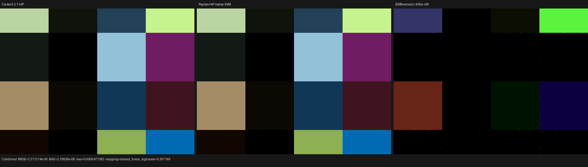
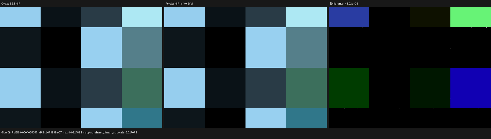
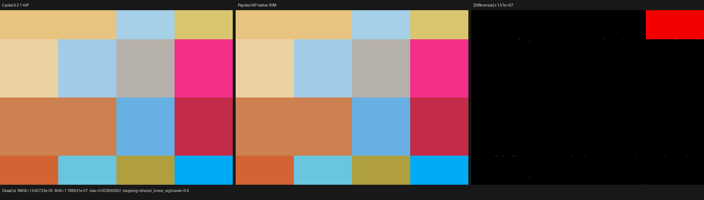
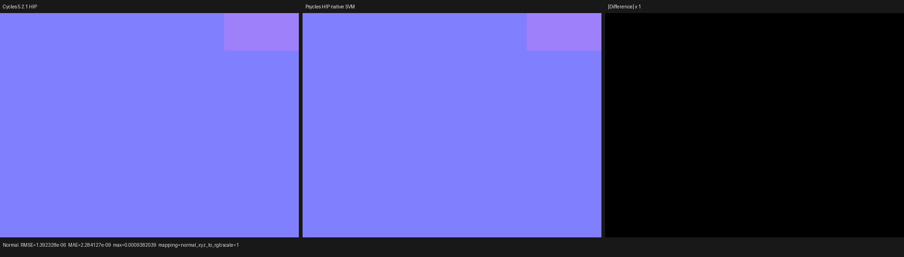

# Native Cycles SVM production-surface validation

## Outcome

Psycles now evaluates the uploaded Blender Cycles 5.2.1 SVM word stream at
real production surface hits. The host/JIT route is enabled explicitly with
`PSYCLES_NATIVE_CYCLES_SVM_SURFACE=1`; it constructs the Cycles SVM evaluator
instead of the legacy topology-expanded material evaluator. There is no
device-side route predicate, and scene word counts, material counts, and
resolution do not enter the shader AST or cache identity.

The first full-scene validation used the Blender 5.2.1 Metallic BSDF matrix:

- 1 geometry, 1 instance, and 19 Blender materials;
- HIP on an AMD Radeon RX 9070 XT (`gfx1201`);
- 640 x 480, 256 samples per pixel, adaptive sampling disabled;
- a Blender/Cycles 5.2.1 HIP multilayer EXR as the sole reference;
- Combined, Normal, Albedo, and all light passes emitted as one multilayer
  OpenEXR file.

The final Psycles render-only time was `0.434231 s`. Because this validation
run followed a source change, its cold shader JIT took `17.818 s`; the emitted
HIP code object was `850056` bytes. These timings establish that the production
route runs, but they are not yet a Cycles end-to-end performance comparison.

## Structural failure found by the real scene

The initial production render had correct geometry, normals, material IDs,
closure type, closure weight, and light samples, but its direct glossy result
was systematically too bright:

| Pass | Before RMSE | Before luminance ratio |
| --- | ---: | ---: |
| Combined | `7.57035e-2` | `1.418319` |
| Glossy Direct | `1.52593e-1` | `1.23560` |

An isolated evaluator fed the same external Cycles word stream and the same
incoming/outgoing directions matched the Cycles NEE oracle. Fallback and HIP
also produced the same wrong production value. This excluded HIP, XIR, the
microfacet equations, geometry, and transport, leaving the compiler-produced
closure payload as the remaining boundary.

The formal invariant is that a socket may receive a default-input edge if and
only if neither a live graph edge nor an authored edge folded by the Blender
inliner defines it. Psycles previously tested only `input.link`. A linked
`Combine XYZ` feeding Metallic Tangent had already become
`constant_folded_in` before `default_inputs()`, so the default
`Geometry.Tangent` edge incorrectly replaced the authored tangent. Cycles uses
the phase order `expand -> default_inputs -> constant_fold`; its authored
primitive value is therefore still represented by a source edge at the same
boundary.

The fix preserves the existing compact representation while treating
`constant_folded_in` as a defining edge during default-input insertion. This
is a graph-provenance rule for every socket, not a Metallic or Tangent special
case.

## Permanent regression

`psycles.cycles_svm_default_input_provenance` builds a graph with explicit
linked Normal and Tangent values and compares its complete shader-local image
against the external Blender/Cycles 5.2.1 oracle. It requires:

- the complete 33-word stream to match word for word;
- two `NODE_VALUE_V` records;
- no injected `NODE_GEOMETRY` record;
- the exact stack offsets and peak stack size of six lanes.

The regression failed on word count before the provenance fix and passes after
it. The full production build and focused backend tests were run with:

```sh
cmake --build build --parallel 32

ctest --test-dir build --output-on-failure \
  -R 'psycles\.(cycles_svm_(compiler|default_input_provenance|gradient)|luisa_cycles_svm_(gradient|closure)_(fallback|hip))$' \
  -j2

LUISA_VULKAN_USE_XIR=1 \
LUISA_VULKAN_REQUIRE_NATIVE_XIR_SPIRV=1 \
LUISA_VULKAN_DISABLE_DXC=1 \
ctest --test-dir build --output-on-failure \
  -R 'psycles\.luisa_cycles_svm_(gradient|closure)_vk$' -j1
```

The focused fallback/HIP set passed `7/7`; the strict native-XIR Vulkan set
passed `2/2`. A separate fallback production smoke rendered the same real
scene at 64 x 64 and 1 spp to a multilayer EXR.

## Final image comparison

The final 640 x 480, 256 spp comparison contains 307200 valid pixels and no
invalid pixels in either renderer:

| Pass | RMSE | Relative RMSE | P99 pixel RMSE | Luminance ratio |
| --- | ---: | ---: | ---: | ---: |
| Combined | `2.21121e-6` | `4.61666e-5` | `1.12768e-7` | `1.000000129` |
| Glossy Direct | `1.03526e-4` | `8.65805e-4` | `1.77359e-7` | `1.000000422` |
| Glossy Color | `1.64273e-5` | `2.94407e-5` | `3.44128e-8` | `1.000000132` |
| Normal | `1.39233e-6` | `2.41158e-6` | `0` | `0.999999900` |

The Glossy Direct maximum error (`0.0921894`) is a single rare edge/firefly;
the 99th-percentile pixel RMSE and luminance ratio show that it is not a
structured rendering difference. No tolerance was weakened to obtain these
results.

Each triptych is ordered Blender/Cycles 5.2.1 HIP, Psycles HIP, amplified
absolute difference. The difference panels use per-pass diagnostic scales;
they must not be read at the same exposure as the two render panels.









The reference and Psycles panels are visually indistinguishable at normal
exposure. The Combined difference becomes visible only after approximately
`4.65e6` amplification, and Glossy Direct after approximately `3.02e6`
amplification. The visual inspection therefore agrees with the pass metrics:
the default-input provenance fix removed the prior systematic brightness
error, with no remaining structured difference in this scene.

The machine-readable before/after reports are stored as
`comparison-before.json` and `comparison-after.json`.
